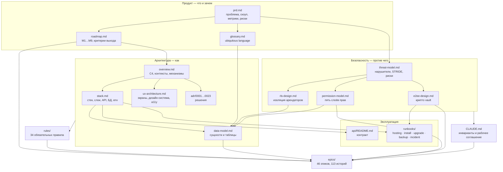

# Map of Docs — Bad CRM

Карта всей документации проекта. Начинайте отсюда: ниже — что где лежит, когда это читать и какой
документ считается источником истины по какому вопросу.

**Состояние проекта:** фаза 0 завершена, идёт M1 (EPIC-001…003 — `review`, EPIC-004 — в работе).
Документы по-прежнему описывают то, что спроектировано; что из этого уже работает — в
[`../CLAUDE.md`](../CLAUDE.md), раздел «Текущее состояние», и в борде
[`../epics/README.md`](../epics/README.md). Рабочее соглашение и инварианты — в
[`../CLAUDE.md`](../CLAUDE.md); декомпозиция работ — в [`../epics/`](../epics/); правила разработки —
в [`../rules/`](../rules/).

---

## Все документы

### Продукт (`product/`)

| Документ | О чём | Когда читать |
|---|---|---|
| [`product/prd.md`](product/prd.md) | Проблема и цель, персоны и JTBD, скоуп по MoSCoW, North Star Metric и контрметрики, риски R-01…R-15, явный out-of-scope | Перед спором «делаем ли мы это»; при обсуждении приоритетов и метрик успеха |
| [`product/roadmap.md`](product/roadmap.md) | Девять майлстоунов M1–M9: цель, состав эпиков, пользовательская ценность, критерий выхода, зависимости | При выборе следующего эпика, при планировании, при попытке перенести недоделку «хвостом» |
| [`product/glossary.md`](product/glossary.md) | Ubiquitous language EN/RU: термин домена = имя Prisma-модели = корень FSD-unit'а = имя в API | **Перед введением любой новой сущности или unit'а**; при сомнении, как называть |

### Архитектура (`architecture/`)

| Документ | О чём | Когда читать |
|---|---|---|
| [`architecture/overview.md`](architecture/overview.md) | C4 уровни 1–3, границы системы, ограниченные контексты, сквозные механизмы (tenancy, авторизация, outbox, файлы, realtime, поиск, AI, observability), границы доверия, развёртывание, что осознанно не делаем | При проектировании нового домена; при изменении границ контекстов; при вопросах о развёртывании |
| [`architecture/stack.md`](architecture/stack.md) | Стек и версии, раскладка монорепо, гексагональные слои сервера, contract-first API и формат ошибок, работа с БД и tenant-контекст, транзакции, миграции, outbox и очереди, безопасность в коде, конфигурация и env, наблюдаемость, тесты, команды, политика зависимостей и лицензий | **При любой серверной работе**; при добавлении зависимости; при вопросе «какая команда» |
| [`architecture/data-model.md`](architecture/data-model.md) | Сущности, таблицы, поля, индексы, RLS-политики | **При любом изменении схемы или Prisma-модели**; при сомнении, как называется таблица или поле |
| [`architecture/backend-context-template.md`](architecture/backend-context-template.md) | Шаблон нового backend-контекста: обязательные каталоги слоёв, порядок работы domain → application → infrastructure → presentation, чем каждое правило проверяется автоматически, чек-лист перед коммитом | **Перед добавлением нового домена на сервере**; при сомнении, куда положить файл |
| [`architecture/ux-architecture.md`](architecture/ux-architecture.md) | Принципы интерфейса, информационная архитектура, карта маршрутов, ключевые экраны, дизайн-система и токены, паттерны взаимодействия, права в UI, доступность WCAG 2.1 AA, локализация EN/RU, адаптивность и производительность | **При любой клиентской работе**; при добавлении экрана или маршрута |
| [`architecture/adr/`](architecture/adr/) | 23 Architecture Decision Record — по одному решению на файл, с контекстом, решением и отвергнутыми альтернативами | **Перед попыткой изменить принятое решение**: сначала читаем ADR, потом спорим |

**Каталог ADR:**

| ADR | Решение |
|---|---|
| [0001](architecture/adr/0001-monorepo-pnpm-turborepo.md) | Монорепо на pnpm workspaces + turborepo |
| [0002](architecture/adr/0002-hexagonal-backend-express-prisma.md) | Гексагональный backend: Express 5 + Prisma |
| [0003](architecture/adr/0003-openapi-as-source-of-truth.md) | OpenAPI как источник истины контракта |
| [0004](architecture/adr/0004-multi-tenancy-postgres-rls.md) | Мультиарендность через PostgreSQL RLS |
| [0005](architecture/adr/0005-fsd-units-frontend-architecture.md) | FSD «units» на фронтенде |
| [0006](architecture/adr/0006-mantine-css-modules-no-tailwind.md) | Mantine + CSS Modules, без Tailwind |
| [0007](architecture/adr/0007-tanstack-router-and-query.md) | TanStack Router и TanStack Query |
| [0008](architecture/adr/0008-permission-model-rbac-plus-acl.md) | Модель прав: RBAC + resource ACL |
| [0009](architecture/adr/0009-e2ee-vault-key-hierarchy.md) | Иерархия ключей E2EE-vault |
| [0010](architecture/adr/0010-realtime-socketio-redis-adapter.md) | Realtime: Socket.IO + Redis streams adapter |
| [0011](architecture/adr/0011-meilisearch-permission-aware-search.md) | Meilisearch и поиск с учётом прав |
| [0012](architecture/adr/0012-docs-editor-blocknote-json-content.md) | Редактор документов BlockNote, JSON-контент |
| [0013](architecture/adr/0013-kb-markdown-source-of-truth.md) | Markdown как источник истины базы знаний |
| [0014](architecture/adr/0014-ai-provider-abstraction.md) | Абстракция AI-провайдера |
| [0015](architecture/adr/0015-s3-file-storage-presigned-urls.md) | S3-хранилище файлов и presigned URL |
| [0016](architecture/adr/0016-time-tracking-single-entry-model.md) | Единая модель записи времени |
| [0017](architecture/adr/0017-charts-mantine-charts.md) | Графики на Mantine Charts |
| [0018](architecture/adr/0018-license-agpl-3.md) | Лицензия AGPL-3.0 |
| [0019](architecture/adr/0019-i18n-en-ru-i18next.md) | Локализация EN/RU на i18next |
| [0020](architecture/adr/0020-self-host-packaging-docker.md) | Упаковка для self-host на Docker |
| [0021](architecture/adr/0021-transactional-outbox.md) | Транзакционный outbox |
| [0022](architecture/adr/0022-typescript-version-policy.md) | Одна версия TypeScript на весь воркспейс (5.9.3) |
| [0023](architecture/adr/0023-csp-for-wasm-crypto.md) | CSP для WASM-криптографии и отказ от COEP |

### Безопасность (`security/`)

| Документ | О чём | Когда читать |
|---|---|---|
| [`security/threat-model.md`](security/threat-model.md) | Область моделирования, активы, нарушители N1–N8, границы доверия, STRIDE по контекстам, топ-15 угроз, prompt injection, утечка через поиск, presigned URL, supply chain, специфика self-host, ПДн, остаточные риски RR-01…RR-07, план проверки | При работе с любым чувствительным потоком данных; при проектировании нового контекста |
| [`security/rls-design.md`](security/rls-design.md) | Три роли БД и bootstrap, канонический шаблон политики, особые случаи, `withTenant` и `guardedClient`, автоматизация, обязательные isolation-тесты, особые пути (логин, анонимная ссылка, воркеры), миграции, производительность, чек-лист «новая таблица», ограничения | **При добавлении таблицы, миграции, репозитория или фонового обработчика** |
| [`security/permission-model.md`](security/permission-model.md) | Пять слоёв модели прав, вычисление эффективного права, матрица роль × endpoint, отвергнутые альтернативы | **При добавлении endpoint'а, права или роли** |
| [`security/e2ee-design.md`](security/e2ee-design.md) | Обещание и его границы, иерархия ключей, примитивы и защита от downgrade, что есть и чего нет на сервере, полный жизненный цикл, blind index, защищённые ссылки, интеграция, правила для разработчиков, модель угроз vault | **При любом касании vault, крипто-кода, secure links, мастер-пароля** |

### API (`api/`)

| Документ | О чём | Когда читать |
|---|---|---|
| [`api/README.md`](api/README.md) | Contract-first флоу, генерация типов (`pnpm api:gen`), правила изменения контракта, где живёт контрактный тест | **При добавлении или изменении любого endpoint'а** |

[`api/openapi.yaml`](api/openapi.yaml) — источник истины контракта. Заведён в EPIC-003; на сегодня
описывает `/meta` и растёт вместе с эндпоинтами.

### Runbooks (`runbooks/`)

| Документ | О чём | Когда читать |
|---|---|---|
| [`runbooks/hosting.md`](runbooks/hosting.md) | Что потребляет каждый сервис, три размера хоста с расчётом объёма данных, рекомендуемая конфигурация, где хостить и почём, настройка PostgreSQL под эту нагрузку, reverse-proxy и TLS, порядок разнесения по хостам, место под бэкапы, минимальный мониторинг, чек-лист перед вводом в эксплуатацию | **До установки** — чтобы выбрать сервер; при нехватке ресурсов; при настройке PostgreSQL или прокси |
| [`runbooks/install.md`](runbooks/install.md) | Требования, `docker compose up`, профили `full`/`minimal`, обязательные переменные окружения и генерация ключей, первый вход и создание владельца, чек-лист безопасности после установки, проверка работоспособности | При установке; при изменении compose-файла, профилей или набора env |
| [`runbooks/local-environment.md`](runbooks/local-environment.md) | Dev-стек: какой контейнер за что отвечает и на каком порту, логи, сброс тома, ручное подключение к каждому сервису, `pnpm check:services` и preflight, типовые проблемы и их диагностика, протокол замера холодного старта | При настройке рабочего окружения; когда `pnpm dev` или `pnpm docker:up` ведут себя не так |
| [`runbooks/upgrade.md`](runbooks/upgrade.md) | Backup-first, порядок обновления, expand→migrate→contract, откат, что делать при неудачной миграции, список новых переменных окружения по версиям | **При выпуске релиза и при любой миграции**; читает агент `selfhost-upgrade-checker` |
| [`runbooks/backup-restore.md`](runbooks/backup-restore.md) | Что бэкапим и что нет, `FORCE ROW LEVEL SECURITY` против `pg_dump`, шифрование бэкапов, RPO/RTO, процедура восстановления и проверки, почему бэкап бесполезен для vault без ключей пользователей | При настройке бэкапов; при восстановлении; при изменении схемы хранения |
| [`runbooks/tracing-a-request.md`](runbooks/tracing-a-request.md) | Как по `requestId` из ответа или скриншота найти все строки лога запроса, что означает каждое поле итоговой строки, что делать, если строк нет, и чего в логах нет намеренно | Когда пользователь прислал ошибку с `requestId`; при разборе жалобы на конкретный запрос |
| [`runbooks/incident.md`](runbooks/incident.md) | Подозрение на утечку, компрометация `APP_ENCRYPTION_KEY`, компрометация учётной записи, утечка presigned URL, недоступность сервиса — шаги, что ротировать, кого уведомить, как собрать доказательства из `AuditLog` | **До того, как понадобится**; во время любого инцидента безопасности |

### Журнал знаний (`brain/`)

`docs/brain/YYYY-MM-DD--<слаг>.md` — записи по каждой содержательной задаче: что и зачем сделано,
простым языком и технически, со ссылками на общий vault. Создаются по ходу работы (пункт 6
commit-гейта).

---

## Схема связей документов

Читается так: продукт задаёт, **что** делаем; архитектура — **как**; безопасность — **против чего**;
`rules/` превращает всё это в проверяемые требования к коду; `epics/` — в конкретные задачи;
`CLAUDE.md` — в три инварианта, которые не размениваются.

---

## Источники истины: кто главный по какому вопросу

При расхождении между документами правится **не тот, который удобнее**, а тот, который не является
источником истины по этому вопросу. Если источник истины сам неверен — правится он, и следом всё, что
на него ссылалось.

| Вопрос | Источник истины | Что это значит |
|---|---|---|
| **Имена сущностей, таблиц, полей, моделей** | [`architecture/data-model.md`](architecture/data-model.md) | Глоссарий, код, API и истории обязаны совпадать с моделью данных. Расходится глоссарий — правится глоссарий, а не модель |
| **Права: каталог, роли, вычисление, матрица** | [`security/permission-model.md`](security/permission-model.md) | Никакое право не появляется в коде раньше, чем в каталоге. UI-подсказки о правах вторичны |
| **Криптография, ключи, vault, защищённые ссылки** | [`security/e2ee-design.md`](security/e2ee-design.md) | Раздел «Правила для разработчиков» — чек-лист ревью, а не рекомендация. Здесь сомнение равно FAIL |
| **Изоляция арендаторов, политики RLS, роли БД** | [`security/rls-design.md`](security/rls-design.md) | Канонический шаблон политики и чек-лист «новая таблица» — обязательны дословно |
| **Контракт API: пути, схемы, коды ошибок** | `api/openapi.yaml` (с EPIC-003) | Спека правится руками в PR и является договором; код подстраивается под неё, а не наоборот. См. [`api/README.md`](api/README.md) |
| **Термины домена, русско-английские соответствия** | [`product/glossary.md`](product/glossary.md) | Новый термин заводится здесь первым; синонимы запрещены. По именам Prisma-моделей глоссарий подчиняется модели данных |
| **Стек, версии, слои, команды, env** | [`architecture/stack.md`](architecture/stack.md) | Прочерк в колонке ADR означает, что решение зафиксировано этим документом |
| **Скоуп и приоритеты** | [`product/prd.md`](product/prd.md) | «Мы это не делаем» — проверяется здесь, а не в обсуждении |
| **Порядок работ и критерии выхода майлстоуна** | [`product/roadmap.md`](product/roadmap.md) | Эпик берётся отсюда; майлстоун закрывается целиком |
| **Принятое архитектурное решение** | Соответствующий [`architecture/adr/`](architecture/adr/) | Изменение решения — новый ADR со ссылкой на предыдущий, а не правка старого задним числом |
| **Что нельзя логировать, шифровать, индексировать** | [`../CLAUDE.md`](../CLAUDE.md), раздел «Чувствительность данных» | Сводка обязательных ограничений; детали — в документах безопасности |

**Общее правило приоритета:** `docs/` → `epics/` → код. При конфликте между слоями — эскалация
пользователю, а не молчаливый выбор.

---

## Соседние каталоги

| Где | Что |
|---|---|
| [`../rules/`](../rules/) | 34 обязательных правила разработки (`.mdc`); часть применяется всегда, часть — по области изменений |
| [`../epics/`](../epics/) | 46 эпиков и 113 историй (M1–M2); истории M3–M9 создаются на kickoff майлстоуна |
| [`../.claude/agents/`](../.claude/agents/) | 9 проектных агентов-ревьюеров: RLS, права, крипто, контракт, FSD, realtime, поиск, i18n, обновляемость |
| [`../CLAUDE.md`](../CLAUDE.md) | Три неприкосновенных инварианта, порядок источников истины, commit-гейт, карта «какой файл читать когда» |
| [`../CONTRIBUTING.md`](../CONTRIBUTING.md) | Как участвовать: окружение, TDD, гейт, Conventional Commits, DCO, Definition of Done |
| [`../SECURITY.md`](../SECURITY.md) | Как сообщить об уязвимости; гарантии и не-гарантии E2EE-vault |
