# Bad CRM — доменная модель данных

Карта сущностей, связей и ограничений для PostgreSQL + Prisma. Документ — источник правды, из
которого затем генерируется `schema.prisma`. Полный DDL здесь намеренно не приводится: фиксируем
поля, связи, индексы и правила, а не синтаксис.

Легенда:

- **[T]** — tenant-scoped: обязательная колонка `organizationId` + включённый Row Level Security.
- **[G]** — глобальная таблица: живёт вне тенантов, RLS не применяется (либо применяется по `id`).

---

## Сведённые расхождения (канон)

Расхождения между этим документом, эпиками и соседними спецификациями, обнаруженные при
декомпозиции на эпики и **закрытые решением**. Таблица существует для того, чтобы вопрос не
всплыл во второй раз: каждая строка — принятое решение, а не открытый вопрос (открытые живут в
последнем разделе).

| Что расходилось | Канон | Приведено в соответствие |
|---|---|---|
| `VaultItem.itemType`: `LOGIN\|NOTE\|CARD\|SSH_KEY\|API_KEY\|CERTIFICATE` (здесь) против `PASSWORD\|NOTE\|SSH_KEY\|API_KEY\|CARD\|FILE` (EPIC-034, `e2ee-design.md`) | **`PASSWORD\|NOTE\|SSH_KEY\|API_KEY\|CARD\|FILE`** — набор из `e2ee-design.md`/эпиков. Тип входит в AAD блоба `item-data`, поэтому переименование значения после релиза ломает расшифровку существующих элементов; решение принимается **до первой миграции** | 2026-07-26 |
| `Call.kind`: `DAILY\|PLANNING\|REVIEW\|RETRO\|CLIENT\|ONE_ON_ONE` (здесь) против `DISCOVERY\|DEMO\|STANDUP\|RETRO\|SALES` (EPIC-044) | **`STANDUP\|PLANNING\|REVIEW\|RETRO\|DISCOVERY\|DEMO\|CLIENT\|ONE_ON_ONE`** — объединение без `SALES` (sales-CRM вне продукта, PRD Won't) | 2026-07-26 |
| Владелец `Milestone`: контекст `project` (`overview.md`) против `delivery` (здесь, группа 13) | **`delivery`** — у вехи есть `contractId`, `acceptedByContactId`, `amountMicros` и `invoiceId`, то есть её жизненный цикл определяется приёмкой заказчиком, а не структурой проекта. `overview.md` поправлен | 2026-07-26 |
| Пересечение интервалов времени: жёсткий `EXCLUDE USING gist` (здесь) против `TimePolicy.warnOnOverlap` (мягкий режим) | **По умолчанию — предупреждение**; жёсткий запрет включается политикой и только тогда действует constraint (механика — в разделе «Где `EXCLUDE USING gist`») | 2026-07-26 |
| Имя поля прав в поисковом документе: `visibleTo` против `aclUserIds`/`aclRoleIds` | **`visibleTo`** — одно `filterable`-поле, один фильтр вместо трёх ([ADR-0011](adr/0011-meilisearch-permission-aware-search.md)) | 2026-07-26 |
| Сущности дашбордов: `Dashboard`/`Widget` (`overview.md`, `glossary.md`) против `Dashboard`/`DashboardCard` (здесь, группа 15) | **`Dashboard`/`DashboardCard`** — «виджет» в этом коде занят слоем FSD `widgets`, а карточка дашборда — доменная строка. `overview.md` и `glossary.md` поправлены | 2026-07-26 |
| `SecureLink.payloadNonce` (здесь и в SQL атомарного burn в `e2ee-design.md`) против правила «nonce внутри самодостаточного блоба» | **Nonce внутри блоба**, отдельной колонки нет — правило едино для `VaultItem.dataEnc`, `VaultItemVersion.dataEnc` и `SecureLink.payloadEnc`. SQL в `e2ee-design.md` поправлен | 2026-07-26 |
| Источник правды о состоянии задачи: `Task.status` против `Task.boardColumnId` | **`boardColumnId`** — `status` производный и синхронизируется use-case'ом (см. группу 4) | 2026-07-26 |

---

## Принципы моделирования

### Именование

| Уровень | Соглашение | Пример |
|---|---|---|
| Prisma-модель | `PascalCase`, единственное число | `TimeEntry` |
| Таблица | `snake_case`, множественное число, через `@@map` | `time_entries` |
| Поле модели | `camelCase` | `startedAt` |
| Колонка | `snake_case`, через `@map` | `started_at` |
| Enum (Prisma) | `PascalCase`, значения `SCREAMING_SNAKE` | `InvoiceStatus.PARTIAL` |
| Индекс | `idx_<table>_<cols>` | `idx_tasks_org_board_order` |
| Уникальный | `uq_<table>_<cols>` | `uq_users_org_email` |
| CHECK | `ck_<table>_<rule>` | `ck_time_entries_task_requires_project` |
| Внешний ключ | `fk_<table>_<col>` | `fk_tasks_project_id` |

Английские имена — везде, включая enum-значения и ключи прав. Русский — только в комментариях и
пользовательском контенте.

### Первичные и внешние ключи

- **PK — `uuid`** во всех таблицах. Предпочтительно **UUIDv7** (временная сортируемость → вставки
  идут в «хвост» B-tree, нет фрагментации, как у v4). Пока расширение недоступно в конкретной
  self-host инсталляции — `gen_random_uuid()` с планом перехода.
- Почему не `bigserial`: self-hosted мульти-тенант с импортом/экспортом данных, идентификаторы
  светятся в URL (задачи, документы, ссылки), последовательный ID даёт перечисление чужих объектов и
  утечку объёмов бизнеса. Цена — 16 байт вместо 8 и более тяжёлые индексы; принимаем осознанно.
- Человекочитаемые идентификаторы **не** являются PK: `Task.number` (порядковый номер внутри
  проекта) и `Project.key` — отдельные поля с уникальностью в рамках тенанта.
- Все FK **явно индексируются** (PostgreSQL не создаёт индекс на FK автоматически).
- `onDelete` задаётся явно всегда. По умолчанию `Restrict`. `Cascade` — только для строк-владений,
  не имеющих смысла без родителя (`TaskLabel`, `ChannelMember`, `VaultItemVersion`). Для ссылок на
  людей — `SetNull` (`Task.assigneeId` при удалении сотрудника) либо запрет удаления.

### Мульти-тенантность в модели

`organizationId` присутствует на **каждой** доменной таблице, даже когда его можно вывести через
родителя (`TaskLabel` → `Task` → `Project`). Это осознанная денормализация ради двух вещей:

1. Политика RLS должна быть **локальной** — сравнение колонки с настройкой сессии, без подзапросов и
   JOIN. Иначе каждая проверка превращается в рекурсивный обход и убивает планы.
2. Составные индексы `(organization_id, …)` дают естественную «партиционированность» по тенанту:
   планировщик сразу отсекает чужие данные.

Плата — риск рассинхронизации `organizationId` ребёнка и родителя. Закрывается составными FK
(`FOREIGN KEY (organization_id, task_id) REFERENCES tasks (organization_id, id)`) там, где связь
критична, и integrity-джобом для остальных.

### Timestamps и аудит строки

- `createdAt DateTime @default(now()) @db.Timestamptz`, `updatedAt DateTime @updatedAt`.
- `createdById` / `updatedById` — там, где важно «кто», то есть на пользовательском контенте
  (задачи, документы, заметки, файлы, инвойсы), но не на join-таблицах и логах.
- Все временные метки — **timestamptz в UTC**. Отображение в таймзоне — забота клиента;
  исключение — `TimeEntry`/`Timesheet`, где дополнительно хранится `timezone` факта, иначе «рабочий
  день» невозможно посчитать корректно.

### Мягкое удаление

`deletedAt DateTime?` — только там, где нужен аудит или восстановление: `User`, `Project`, `Board`,
`Task`, `DocPage`, `KbNote`, `File`, `Channel`, `Message`, `VaultItem`, `Client`, `Invoice`.

Не применяем к: join-таблицам (`TaskLabel`, `UserRole`), логам (`AuditLog`, `VaultAccessLog`),
событиям (`OutboxEvent`, `ActivityEvent`) — там удаление либо запрещено, либо физическое по TTL.

Две обязательные оговорки:

- Уникальные индексы на «мягко удаляемых» таблицах — **частичные**:
  `CREATE UNIQUE INDEX … WHERE deleted_at IS NULL`. Prisma этого не умеет декларативно → пишется
  ручной SQL в миграции, а в схеме остаётся комментарий.
- Фильтр `deletedAt IS NULL` навешивается **глобально** через Prisma `$extends` (клиентский
  middleware), а не расставляется руками по запросам. Иначе первая же забытая выборка покажет
  удалённое.

### Деньги

- Хранение — **целые micro-единицы** в `BigInt`: `1 USD = 1_000_000`. Никаких `Float`/`Double`
  ни при каких условиях.
- Рядом с каждой суммой — `currency Char(3)` (ISO-4217). Пара `(amountMicros, currency)`
  неразделима; сумма без валюты — ошибка модели.
- Ставки (`CostRate`, `BillRate`, `ContractRate`) — тоже micro за час.
- Проценты и доли (`allocationPct`, `alertThresholdPct`) — целые в базисных пунктах либо `Decimal(5,2)`
  с явным диапазоном через CHECK. `Float` не используем нигде.
- Мультивалютность: `Invoice` фиксирует `fxRateMicros` на дату выставления — курс никогда не берётся
  «на лету» при отчёте, иначе история переписывается задним числом.

### Длительности

- Тайм-трекинг — **целые минуты** (`durationMinutes Int`). Часы дробью не хранятся никогда.
- Технические замеры (`WorkflowRun.durationMs`, `AIMessage.latencyMs`) — целые миллисекунды.

### Enum в Prisma vs строка/справочник

Правило выбора:

- **Prisma enum** — когда множество закрыто, задаётся кодом и меняется только релизом:
  `TaskLinkType`, `InvoiceStatus`, `VaultKind`, `ChannelKind`, `ApprovalStatus`.
- **Справочная таблица** — когда список расширяется тенантом или сидируется данными: `Permission`
  (каталог прав), `Activity` (виды трудозатрат), `Label`, `KbTag`.
- **Строка с whitelist в приложении** — только для полиморфных дискриминаторов, где список типов
  растёт вместе с продуктом и попадает в индексы (`Comment.entityType` — здесь всё же берём Prisma
  enum, чтобы БД не приняла мусор).

Причина: добавить значение в PostgreSQL enum можно (`ADD VALUE`), но **удалить или переименовать —
нет** без пересоздания типа, а `ADD VALUE` до PG12 не работал в транзакции и до сих пор конфликтует
с некоторыми паттернами миграций. Если список меняется по продуктовым причинам — это таблица.

### JSONB

Используем для контента с меняющейся структурой: `DocPage.content`, `Message.body`,
`ActivityEvent.payload`, `AIMessage.toolCalls`, `KbNote.frontmatter`, `WorkflowRun.rawPayload`.

Правила:

- Внутри каждого JSONB — поле версии схемы (`{"v": 1, …}`). Иначе миграция контента невозможна.
- Валидация на границе — Zod-схема в application-слое; БД принимает `jsonb`, а не «что попало».
- **В JSONB не кладём то, по чему постоянно фильтруем или сортируем.** Такие поля выносим в колонки
  (`Message.plainText` рядом с `body`, `Task.dueAt` рядом с описанием).
- GIN-индекс (`jsonb_path_ops`) — только на реально запрашиваемые документы, не «на всякий случай»:
  GIN дорог на запись.

### Порядок элементов

Сортируемые пользователем списки (`Task` в колонке, `DocPage` в дереве, `BoardColumn`) используют
**fractional index** — `orderKey String` с лексикографической сортировкой (алфавит base62), а не
`position Int`. Причина: вставка между двумя элементами меняет **одну** строку вместо перенумерации
всего списка, что критично при одновременном drag-n-drop у нескольких людей. Периодическая
ребалансировка ключей — фоновая задача, когда длина ключа превышает порог.

---

## Карта сущностей

### 1. Tenancy и идентичность

Все таблицы группы — **[T]**, кроме `Organization`, которая является корнем тенанта и получает
особую RLS-политику по собственному `id`.

| Сущность | Метка | Ключевые поля | Связи |
|---|---|---|---|
| `Organization` | [T]* | `id`, `slug` (уникален глобально), `name`, `ownerId` → `User`, `settings Json`, `timezone`, `defaultCurrency`, `createdAt`, `deletedAt?` | корень всего графа |
| `User` | [T] | `organizationId`, `email`, `emailVerifiedAt?`, `passwordHash`, `totpSecretEnc?`, `totpEnabledAt?`, `permissionsVersion Int`, `status ACTIVE\|SUSPENDED\|INVITED`, `lastSeenAt?`, `locale`, `timezone`, `authVerifierSalt?`, `authVerifierHash?`, `deletedAt?` | → `Organization`; 1:1 `EmployeeProfile`; 1:N `Session`, `UserRole` |
| `EmployeeProfile` | [T] | `userId @unique`, `jobTitle`, `department`, `managerId?` → `User`, `weeklyCapacityHours Int`, `employmentType`, `hiredAt`, `terminatedAt?`, `timezone`, `emergencyContactEnc?` | 1:1 `User`, self-ref через `managerId` |
| `Session` | [T] | `userId`, `familyId`, `rotatedFromId?` → `Session`, `refreshTokenHash`, `userAgent`, `ipHash`, `ipMasked`, `expiresAt`, `revokedAt?`, `revokedReason?` | → `User` |
| `PasswordResetToken` | [T] | `userId`, `tokenHash`, `expiresAt`, `usedAt?`, `requestedIpHash?` | → `User` |
| `Invitation` | [T] | `email`, `roleId?`, `teamIds String[]`, `tokenHash`, `invitedById`, `expiresAt`, `acceptedAt?`, `acceptedUserId?` | → `Organization`, `Role`, `User` |
| `Team` | [T] | `name`, `slug`, `description`, `leadId?` → `User`, `deletedAt?` | 1:N `TeamMember` |
| `TeamMember` | [T] | `teamId`, `userId`, `teamRole MEMBER\|LEAD`, `joinedAt` | join `Team` × `User` |

**Индексы:**

- `uq_organizations_slug (slug)`; `idx_organizations_deleted_at` частичный `WHERE deleted_at IS NULL`.

  Отдельного индекса по `owner_id` **нет, и это решение, а не пропуск.** Ссылку обслуживает
  составной внешний ключ `fk_organizations_owner_id (id, owner_id) → users (organization_id, id)`,
  ведущая колонка которого — первичный ключ `organizations`, то есть `pk_organizations` уже покрывает
  и поиск ссылающейся стороны при `ON DELETE SET NULL`, и любой запрос вида «кто владелец этой
  организации». Индекс по одной колонке `owner_id` не был бы использован ни одним запросом модели.
  Предыдущая редакция этого документа предписывала `idx_organizations_owner (owner_id)`; реализация
  сознательно его не создала, и расхождение исправлено здесь 2026-07-29 в пользу реализации.
- `uq_users_org_email (organization_id, email) WHERE deleted_at IS NULL` — **обязательное**
  требование задачи: e-mail уникален внутри организации, а не глобально. Один человек может иметь
  аккаунты в двух self-host организациях, и это не конфликт.
- `idx_users_org_status (organization_id, status)` — списки сотрудников.
- `uq_employee_profiles_user (user_id)`; `idx_employee_profiles_org_manager (organization_id, manager_id)`
  — построение оргструктуры; `idx_employee_profiles_org_active (organization_id) WHERE terminated_at IS NULL`.
- `idx_sessions_org_user_family (organization_id, user_id, family_id)` — список активных сессий
  пользователя и внешний ключ на `users`; `idx_sessions_org_family (organization_id, family_id)` —
  отзыв **всего семейства** одним индексным апдейтом; `uq_sessions_refresh_hash
  (refresh_token_hash)` — единственный уникальный ключ модели, объявленный **глобально** (см. врезку
  «Про глобальность `uq_sessions_refresh_hash`» ниже); `idx_sessions_org_expires (organization_id,
  expires_at) WHERE revoked_at IS NULL` — для джоба зачистки; `idx_sessions_org_rotated_from
  (organization_id, rotated_from_id) WHERE rotated_from_id IS NOT NULL` — индекс под
  самоссылающийся FK цепочки ротации (PostgreSQL не создаёт его сам, а `ON DELETE SET NULL` обязан
  находить ссылающуюся сторону).

  **Почему отзыв семейства получил собственный индекс.** Отзыв семейства — реакция на кражу токена:
  повторное использование обнаружено по дайджесту, пользователь в этот момент не известен, и
  запрос выглядит как `UPDATE sessions … WHERE family_id = $1` плюс `organization_id` от политики
  RLS. Трёхколоночный индекс это обслужить не может — `user_id` стоит между двумя колонками, которые
  запрос задаёт. Механизм при этом не тот, который подсказывает интуиция: PostgreSQL **всё равно**
  кладёт `family_id` в `Index Cond` — как non-boundary условие, — и `Filter: family_id` в плане не
  появляется никогда. Не может индекс другого: **спозиционироваться**. Скан начинается с первой
  записи организации и проходит все её записи, проверяя `family_id` на каждой; планировщик считает
  это честно и предпочитает читать кучу. Наблюдаемый симптом — `Seq Scan`, а не фильтр.
  Замер на PostgreSQL 16, 20 100 сессий в одной организации: `Seq Scan`, 20 099 строк отброшено
  фильтром, 447 буферов, 1.567 мс — против `Index Scan`, 3 буфера, 0.013 мс после добавления
  `idx_sessions_org_family` (миграция `20260729130000_index_sessions_org_family`,
  `CREATE INDEX CONCURRENTLY` отдельным файлом). Если принудительно загнать в план трёхколоночный
  индекс (`enable_seqscan = off`), его стоимость — 1092.43 против 8.32 у двухколоночного.

  Практическое следствие для тестов: утверждение «`family_id` в `Index Cond` и не в `Filter`»
  выполняется и **без** `idx_sessions_org_family`, то есть ничего не доказывает. Проверять нужно
  выбор планировщика на его собственных настройках —
  `packages/server/test/integration/db/refresh-rotation.test.ts`.

  Обе составные записи начинаются с `organization_id` — этого требует инвариант №1
  (`CLAUDE.md`) и раздел «`organization_id` — первая колонка составных индексов»
  [`../security/rls-design.md`](../security/rls-design.md). Предыдущая редакция этого документа
  называла их `idx_sessions_user_family (user_id, family_id)` и `idx_sessions_expires (expires_at)`,
  то есть без tenant-колонки; исправлено 2026-07-28 при реализации EPIC-006. Зачистка истёкших
  сессий — не исключение уровня `idx_outbox_pending`: кросс-организационные джобы по
  `rules/tenancy-rls.mdc` (12) обходят организации и открывают `withTenant` на каждую, поэтому
  выборка всегда org-скоупная.
- `uq_password_reset_tokens_hash (token_hash)` — глобально уникален по той же причине, что и
  `uq_invitations_token`/`uq_secure_links_token_hash`: значение генерирует сервер (32 байта CSPRNG),
  а ссылку из письма открывают до того, как организация известна;
  `idx_password_reset_tokens_org_user (organization_id, user_id)` — «есть ли у пользователя
  действующий запрос» и погашение прочих токенов при успешном сбросе; **не** частичный, потому что
  этот же индекс обслуживает `ON DELETE CASCADE` составного FK на `users`, а частичный индекс
  каскаду не помогает;
  `idx_password_reset_tokens_org_expires (organization_id, expires_at) WHERE used_at IS NULL` —
  зачистка просроченных.
- `uq_invitations_token (token_hash)`, `idx_invitations_org_email (organization_id, email) WHERE accepted_at IS NULL`.
- `uq_teams_org_slug (organization_id, slug)`, `idx_teams_org_name (organization_id, name)` —
  список команд организации в алфавитном порядке.
- `uq_team_members (team_id, user_id)`, `idx_team_members_org_user (organization_id, user_id)`.

**Почему `User` и `EmployeeProfile` разделены**

Это не «нормализация ради нормализации», а разделение двух разных сущностей с разным жизненным
циклом и разной чувствительностью:

1. **Разные сущности домена.** `User` — субъект аутентификации и авторизации: он логинится, имеет
   пароль, сессии, права. `EmployeeProfile` — кадровая запись о человеке: должность, отдел,
   руководитель, недельная ёмкость, даты найма и увольнения. Не каждый `User` — сотрудник:
   аккаунт может принадлежать внешнему подрядчику, представителю клиента с доступом к одному
   проекту или сервисному боту интеграции. У них нет `hiredAt` и `managerId`, и наличие
   нуллабельных HR-полей в `User` означало бы, что схема не выражает это правило.
2. **Разный жизненный цикл.** Увольнение — это `terminatedAt` в профиле плюс `status = SUSPENDED`
   в аккаунте, но не удаление: тайм-трекинг, задачи, инвойсы и аудит-лог ссылаются на человека
   годами. Обратное тоже верно — аккаунт можно отключить (утечка пароля), не трогая кадровую
   запись.
3. **Разная чувствительность и разный доступ.** HR-поля (руководитель, ёмкость, а рядом с ними
   `CostRate` — себестоимость часа) видит узкий круг, а базовый `User` (имя, аватар, e-mail)
   читает вся организация. Отдельная таблица позволяет разграничить это на уровне БД
   (`GRANT SELECT` по таблицам, отдельная RLS-политика), а не только в приложении.
4. **Практическая причина.** `User` — горячая таблица: читается на каждом запросе при
   аутентификации. Раздувать её редко используемыми HR-колонками — лишний I/O на самом частом пути.

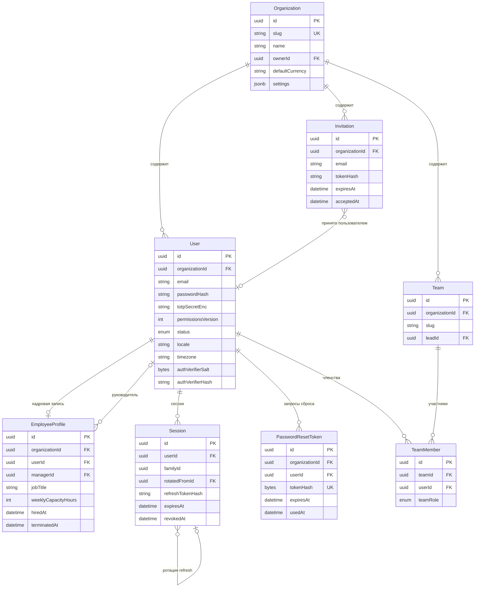

**Про refresh-семейства.** `Session` реализует rotation с reuse detection: каждый refresh выдаёт
новую строку с тем же `familyId` и `rotatedFromId` на предыдущую. Предъявление уже
использованного (`revokedAt IS NOT NULL`) токена означает кражу → отзываем **всё семейство** одним
`UPDATE … WHERE family_id = $1` и пишем в `AuditLog`. Именно поэтому семейство — колонка, а не
вычисляемая цепочка: отзыв должен быть одним индексным апдейтом, а не рекурсивным обходом.

`rotatedFromId` — самоссылка внутри той же таблицы, и она **составная**:
`FOREIGN KEY (organization_id, rotated_from_id) REFERENCES sessions (organization_id, id)`. Проверки
внешних ключей выполняются системными триггерами от имени владельца и обходят RLS, поэтому одиночный
`REFERENCES sessions (id)` подтвердил бы существование сессии чужой организации и позволил бы
пристроить свою сессию к чужой цепочке ротации. `ON DELETE SET NULL`: удаление предка не должно
уносить потомков — цепочка ротации нужна именно для разбора инцидента.

**Следствие для экрана активных сессий.** Строка `Session` — это **один refresh-токен**, а не одно
устройство: ротация создаёт новую строку. Поэтому `GET /api/v1/auth/sessions` показывает по одной
записи на **семейство** — живую строку (`revoked_at IS NULL`), — и два её времени берутся так:

- `lastUsedAt` = `created_at` **живой строки**. Живая строка появилась в момент последней ротации,
  то есть её `created_at` и есть «когда сессией пользовались в последний раз» с точностью до
  пятнадцатиминутного access-токена. Брать сюда `updated_at` неверно дважды: во-первых, `@updatedAt`
  — свойство Prisma-клиента, а не БД, и сырой `UPDATE … WHERE family_id = …` (отзыв семейства выше)
  его не трогает; во-вторых, у живой строки `updated_at` меняется только в момент её отзыва, то есть
  ровно тогда, когда она перестаёт быть живой.
- `createdAt` = `min(created_at)` по семейству (`min(created_at) OVER (PARTITION BY organization_id,
  user_id, family_id)`), то есть момент входа. Обслуживается `idx_sessions_org_user_family`.

Отдельной колонки «когда сессия началась» нет сознательно: это агрегат по уже существующему индексу,
а денормализация потребовала бы поддерживать её на каждой ротации.

**Про `updated_at` и триггер.** Prisma-атрибут `@updatedAt` вычисляется **клиентом**: любой запрос,
идущий мимо Prisma, оставляет колонку со старым значением. В этой модели такие запросы не гипотеза,
а норматив — отзыв семейства и офбординг описаны здесь именно как `UPDATE … WHERE …`. Поэтому
`updated_at` держится триггером `set_updated_at()` (`BEFORE UPDATE`, `NEW.updated_at = now()`),
который вешается на **каждую** таблицу с этой колонкой. Правило проверяется механически: в
`packages/server/test/integration/db/migrations.test.ts` есть тест, который делает сырой `UPDATE` по
каждой таблице реестра и требует, чтобы `updated_at` сдвинулся.

**Про адрес сессии: `ipHash` и `ipMasked`.** Полный IP не хранится **нигде** — это персональные
данные (`CLAUDE.md`, «Персональные данные»), и решение принимается на входе, до записи строки:

- `ipHash` — SHA-256 адреса. Отвечает только на вопрос «тот же это адрес, что и у той сессии»;
  расхешировать его нельзя, поэтому показать пользователю из него нечего.
- `ipMasked` — маскированная форма, **NOT NULL**, единственное, что уходит в API
  (`SessionSummary.ipMasked`). IPv4 усекается до /24, IPv6 — до /48; функция —
  `packages/server/src/domain/identity/mask-ip-address.util.ts`, для нечитаемого входа она отдаёт
  `unknown` (заголовок `X-Forwarded-For` пишет прокси, а у запроса через unix-сокет адреса нет
  вовсе).

Почему адрес вообще показывается: экран активных сессий существует ради узнавания «это не я», а
устройство и время такого сигнала не дают — сменившийся город виден только по адресу. Почему колонка
`NOT NULL`, а поле контракта обязательное: сделано до релиза и до первой строки; после релиза это
навсегда nullable-колонка и навсегда опциональное поле, а каждый читатель — с веткой на «адреса
нет».

**Про глобальность `uq_sessions_refresh_hash`.** Ключ намеренно не включает `organization_id`, и это
не упущение. Три причины, по порядку значимости:

1. **Иначе ключ перестаёт быть ключом на том пути, где он используется.** Refresh приходит cookie'й,
   без организации; резолв идёт `auth_lookup_session(p_refresh_hash bytea)` под ролью `app_auth` с
   `BYPASSRLS` (см. [`../security/rls-design.md`](../security/rls-design.md), путь 1). Уникальность
   в паре `(organization_id, refresh_token_hash)` допускает две строки с одинаковым хешем в разных
   организациях — и функция вернула бы две сессии там, где обязана вернуть одну. Это не
   «менее строго», а **неоднозначность на пути аутентификации**.
2. **Значение генерирует сервер.** 32 байта CSPRNG, хранится SHA-256; правило остаточного риска 7
   [`../security/rls-design.md`](../security/rls-design.md) разрешает глобальную уникальность ровно
   для серверно-сгенерированных случайных значений и запрещает для пользовательского ввода
   (поэтому `uq_users_org_email` — тенантный, а этот — нет).
3. **Что происходит при коллизии между арендаторами.** Уникальность проверяется **ниже** RLS,
   поэтому вставка, столкнувшаяся со строкой чужого тенанта, падает с `23505`, а не создаёт дубль.
   Это правильный (fail-closed) исход, но он же — оракул: по коду ошибки можно узнать, что где-то в
   инсталляции такое значение уже есть. Цена оракула равна вероятности коллизии SHA-256 от 32
   случайных байт, то есть пренебрежима; цена альтернативы — пункт 1. **Требование к приложению:**
   `23505` на этой вставке никогда не выходит наружу как отдельный код ошибки — логин повторяет
   генерацию токена, наружу идёт обычный ответ; иначе оракул из теоретического становится
   наблюдаемым.

**Про `User.status = INVITED` и `password_hash NOT NULL`.** Эти два утверждения нельзя выполнить
одновременно: строка в статусе `INVITED` обязана нести хеш-заглушку в колонке паролей, а заглушка в
колонке учётных данных — ровно та вещь, которую однажды кто-нибудь сверит с вводом. Источники
расходятся между собой:

- [STORY-012-01](../../epics/epic-012-employee-management/stories/story-012-01-invite-employee.md)
  создаёт только `Invitation`, а
  [STORY-012-02](../../epics/epic-012-employee-management/stories/story-012-02-accept-invitation.md)
  создаёт `User(status = ACTIVE)` **в момент принятия** — то есть строки `User` в статусе `INVITED`
  не появляется ни на одном шаге;
- [STORY-012-04](../../epics/epic-012-employee-management/stories/story-012-04-employee-directory.md)
  показывает в справочнике `ACTIVE` и `INVITED`, а
  [STORY-012-06](../../epics/epic-012-employee-management/stories/story-012-06-transfer-ownership.md)
  отказывает в передаче владения пользователю со `status = INVITED` — обе предполагают, что такие
  строки есть.

**Решение EPIC-006:** инвариант — «строка `User` создаётся тогда, когда есть пароль»; человек,
которого пригласили и который ещё не принял приглашение, живёт в `Invitation`, а не в `users`.
Поэтому `password_hash` — `NOT NULL`, а значение `INVITED` остаётся в enum'е недостижимым до
EPIC-012. Выбор направления (справочник джойнит `Invitation` — или `User` создаётся сразу в статусе
`INVITED`) принимает EPIC-012 вместе с этими четырьмя историями.

Почему `NOT NULL` при этом ничего не цементирует — асимметрия ALTER'ов: снять ограничение
(`ALTER COLUMN password_hash DROP NOT NULL`) — операция над каталогом, мгновенная и совместимая с
rolling deploy (старый код всегда писал значение); повесить его обратно — скан таблицы под
`ACCESS EXCLUSIVE` через `CHECK … NOT VALID` → `VALIDATE` → `SET NOT NULL`
([`../../rules/db-migrations.mdc`](../../rules/db-migrations.mdc), 4). Дешёвое направление —
именно то, которое понадобится, если EPIC-012 решит иначе.

**Про каскады `User` → `Session` и мягкое удаление.** Это две разные операции, и они не
взаимозаменяемы:

- **Физическое удаление `users`** (операция обслуживания, не запроса) уносит сессии:
  `FOREIGN KEY (organization_id, user_id) REFERENCES users (organization_id, id) ON DELETE CASCADE`.
  Сессия без владельца не имеет смысла и не должна пережить строку, на которую ссылается.
- **Мягкое удаление** (`users.deleted_at`) физически ничего не удаляет, и БД сама по себе сессии не
  тронет. Поэтому инвариант формулируется на уровне сценария: **проставление `deleted_at`
  выполняется в одной транзакции с отзывом всех сессий пользователя** —
  `UPDATE sessions SET revoked_at = now(), revoked_reason = 'OFFBOARDING' WHERE organization_id = $1
  AND user_id = $2 AND revoked_at IS NULL`, — и в той же транзакции `permissions_version`
  инкрементируется, чтобы выданный access-токен перестал приниматься до истечения своих 15 минут.
  Без этого «удалённый» пользователь продолжает работать до конца жизни refresh-токена. То же самое
  верно для `status = 'SUSPENDED'`. Индекс `idx_sessions_org_user_family` обслуживает этот `UPDATE`.

  Причина называется `OFFBOARDING`, а не `USER_DELETED`: **той же** причиной закрываются сессии при
  приостановке аккаунта, при которой ничего не удалено, — и
  [STORY-012-05](../../epics/epic-012-employee-management/stories/story-012-05-offboarding.md)
  требует буквально этого значения (`revokedReason = 'offboarding'`), потому что одна операция
  деактивации закрывает и приостановку, и уход. Значение PG-enum нельзя переименовать без
  пересоздания типа, поэтому имя выбрано сейчас, пока таблица пуста.

**Про `PasswordResetToken`.** Отдельная сущность, а не колонки на `User`: у пользователя может быть
несколько запросов подряд, каждый со своим сроком, и историю попыток нельзя восстановить из одной
пары колонок. Правила, вытекающие из [STORY-006-08](../../epics/epic-006-auth-core/stories/story-006-08-password-reset-by-email.md):

- **Хранится хеш, а не токен.** `tokenHash` — SHA-256 (32 байта, `bytea`) от 32 байт CSPRNG; сам
  токен существует только в письме и в URL. Дополнительная соль не нужна: у входа 256 бит энтропии,
  медленный хеш здесь избыточен (тот же приём, что у `SecureLink.tokenHash`).
- **TTL — 30 минут** (`docs/security/threat-model.md`, T-IAM-07), `expiresAt` проставляется при выдаче; просроченный и погашенный токены дают
  **неразличимый** ответ, чтобы не сообщать, какой именно случай произошёл.
- **Повторное использование отвергается на уровне БД, а не проверкой перед записью.** Погашение —
  `UPDATE password_reset_tokens SET used_at = now() WHERE id = $1 AND used_at IS NULL RETURNING id`:
  строк вернулось ноль — токен уже использован, гонка двух параллельных переходов по ссылке
  разрешается атомарно. Проверка «сначала прочитать, потом обновить» здесь неверна.
- **Зачистка.** Строки удаляются физически (мягкого удаления у таблицы нет) джобом по
  `idx_password_reset_tokens_org_expires`; лог факта запроса и факта сброса живёт в `AuditLog`, а не
  в этой таблице.
- **Резолв до организации.** Ссылку открывают неаутентифицированной, поэтому поиск по `tokenHash`
  идёт тем же путём, что и `auth_lookup_session`: `SECURITY DEFINER`-функция с фиксированным
  `search_path`, **во владении `app_auth_definer`** и с `EXECUTE` для `app_auth`. Владелец и
  вызывающий — разные роли, и перепутать их нельзя: функция исполняется с правами **владельца**, а
  `app_auth` табличных привилегий не имеет вообще — функция во владении `app_auth` упала бы
  `permission denied for table password_reset_tokens` изнутри самой себя (проверено на PostgreSQL
  16.14, см. поправку в [`../security/rls-design.md`](../security/rls-design.md), «Роли и права
  БД»). Предыдущая редакция этого документа предписывала владение `app_auth`; исправлено 2026-07-29.
  Функция несёт `COMMENT ON FUNCTION … IS 'bad-crm:auth-resolver …'` — по этому маркеру
  `prisma/sql/01-grants.sql` восстанавливает владение и права после `pg_restore`, а таблица —
  `GRANT SELECT … TO app_auth_definer` в списке `definer_reads` того же файла. Сам сброс выполняется
  уже под `app_user` в `withTenant`.

  **Имя функции — `auth_lookup_password_reset(bytea)`**, заведена миграцией
  `20260729140000_password_reset_resolver`. Названа здесь потому, что этот документ — источник истины
  по именам объектов БД: предыдущая редакция описывала функцию, не называя её, и читалась как
  обещание на будущее («заводится в STORY-006-08»), хотя объект уже существовал. Полный список
  резолверов — четыре: `auth_lookup_user`, `auth_lookup_users_by_email`, `auth_lookup_session`,
  `auth_lookup_password_reset`.
- `requestedIpHash` — тот же хеш IP, что и у `Session.ipHash` (полный адрес не хранится); нуллабелен,
  потому что запрос может прийти из окружения, где адрес недоступен.

**Про `Organization.ownerId`.** Владелец — последний субъект, у которого нельзя отнять
административные права. Колонка нужна, чтобы «минимум один владелец» не вычислялось агрегатом по
ролям при каждой проверке: любая ошибка в матрице прав тогда могла бы оставить организацию без
администратора вообще.

`ownerId` — FK на `User` **этой же** организации, составной:
`fk_organizations_owner_id (id, owner_id) → users (organization_id, id)`. Пара обязательна, потому
что проверки внешних ключей выполняются от имени владельца таблицы и обходят RLS: без неё
ограничение спокойно подтвердило бы пользователя из тенанта, которого эта организация не видит
(`rules/tenancy-rls.mdc`, 7).

**Колонка обязательна с contract-шага** (`20260730120000_organization_owner_not_null`). Ниже —
история того, как она такой стала, потому что порядок шагов здесь и есть содержание решения.

**Колонка была nullable, и это был expand-шаг, а не ослабление инварианта.** Организация вставляется раньше,
чем существует строка, на которую `ownerId` должен указывать, поэтому первая миграция добавляет
именно nullable-колонку (`rules/db-migrations.mdc`, 2): старая версия кода продолжает работать со
схемой, а `SET NOT NULL` на непустой таблице берёт `ACCESS EXCLUSIVE` и сканирует её целиком.
Отложенный FK (`DEFERRABLE INITIALLY DEFERRED`), который предписывала предыдущая редакция этого
документа, тот же порядок вставки решает дороже: он снимает проверку до конца транзакции, то есть
ослабляет ограничение постоянно ради одного момента в жизни строки. Реализация выбрала nullable +
`UPDATE` в той же транзакции; расхождение исправлено здесь 2026-07-29 в пользу реализации.

> **Закрыто 2026-07-30** (`20260730120000_organization_owner_not_null`): оба действия ключа переведены
> в `NO ACTION`. Ниже — исходная формулировка, оставленная как обоснование.
>
> **`ON UPDATE CASCADE` на этом ключе — не то действие** (замечено 2026-07-29).
> Ссылающаяся сторона включает `organizations.id`, то есть первичный ключ и колонку тенанта, поэтому
> каскад при изменении `users.organization_id` пишет **обе** колонки:
> `UPDATE ONLY "public"."organizations" SET "id" = $1, "owner_id" = $2 …`. Тихого перенумерования
> организации это не даёт — целевая организация обязана существовать, и каскад всегда упирается в
> `pk_organizations`, — но любой будущий перенос пользователя между организациями (бэкфилл,
> поддержка, офбординг) получит ошибку, называющую **чужую** таблицу, и отладка уйдёт не туда.
> Для неизменяемого uuid-первичного ключа семантически верное действие — `ON UPDATE NO ACTION`.
> Правится новой миграцией: файл уже история (`rules/db-migrations.mdc`, 12). Решение зафиксировано
> здесь, чтобы к нему не возвращались заново.

> **Закрыто 2026-07-30, STORY-006-09.** `CHECK (owner_id IS NOT NULL) NOT VALID` → `VALIDATE
> CONSTRAINT` → `SET NOT NULL`, порядок из `rules/db-migrations.mdc`, 4. `CHECK` намеренно **оставлен**
> после `SET NOT NULL`: его сообщение — то, что нужно оператору при обновлении, и он не даёт
> `DROP NOT NULL` в будущей миграции молча вернуть дыру.
>
> **Почему в том же пред-релизном цикле, что expand.** Правило про паузу в релизах защищает
> развёрнутые инсталляции, у которых во время обновления работают старая и новая версии кода. Их нет:
> ни тега, ни образа. Оговорка внесена в `rules/db-migrations.mdc` и истекает с первым релизом.
>
> **Циклический ключ разорван одним оператором, а не отложенной проверкой.** `organizations.owner_id`
> ссылается на `users`, `users.organization_id` — обратно, поэтому при двух отдельных вставках первая
> всегда нарушает ограничение; именно за это колонка и была nullable. `OrganizationRepositoryPort.
> createWithOwner` пишет обе строки одним `WITH … INSERT`: внешние ключи — это `AFTER ROW`-триггеры,
> исполняемые по завершении оператора, и к этому моменту обе строки существуют.
> `DEFERRABLE INITIALLY DEFERRED`, который предписывала более ранняя редакция, купил бы тот же порядок
> вставки ценой права **любой** транзакции временно ссылаться на несуществующую строку; отвергнут
> повторно и по той же причине.
>
> **Мягкое удаление владельца схема по-прежнему не видит** — строка остаётся, ключ не срабатывает, а
> `CHECK` не умеет читать другую таблицу. Это инвариант приложения, и он живёт в
> `domain/identity/access/owner-offboarding.policy.ts`: офбординг владельца отвергается кодом
> `last_owner_required` (409), пока владение не передано. Сама передача — часть
> офбординга, [STORY-012-05](../../epics/epic-012-employee-management/stories/story-012-05-offboarding.md).

**Чей инвариант «владельца нельзя потерять» и где он закрывается.** Здесь есть два разных риска, и
БД закрывает только один из них.

1. **Владельца удалили физически.** `ON DELETE SET NULL ("owner_id")` — колоночная форма PostgreSQL
   15: обычный `SET NULL` обнулил бы обе колонки пары, включая первичный ключ, и упал бы на его
   `NOT NULL`. Организация остаётся, ссылка обнуляется. Это защита от висячей ссылки, не от потери
   владельца.
2. **Владельца «уволили» мягким удалением.** `users.deleted_at` — мягкое удаление, строка остаётся,
   и `organizations.owner_id` продолжает указывать на пользователя, которого приложение уже нигде не
   показывает. Внешний ключ этого не видит: для него строка есть. Организация формально имеет
   владельца, фактически — нет, и «последний субъект, у которого нельзя отнять права» перестаёт
   существовать молча.

   **Это инвариант приложения, а не схемы**, и он принадлежит офбордингу: удаление или
   приостановка пользователя, который является владельцем своей организации, обязаны требовать
   передачи владения (одна транзакция: `UPDATE organizations SET owner_id = …` + запись в
   `AuditLog`) и отвергаться, пока она не сделана. FK этого выразить не может, а `CHECK` — тем более
   (он не видит другую таблицу). Реализация — та же
   [STORY-006-09](../../epics/epic-006-auth-core/stories/story-006-09-owner-integrity-contract-step.md);
   до неё офбординг владельца не реализован вовсе, поэтому дыры в проде нет, но и полагаться на
   «FK всё удержит» нельзя.

**Биллинг самого продукта в 1.0 не моделируется.** Колонки `Organization.plan` в схеме нет
сознательно: тарифы, лицензирование и подписка на сам Bad CRM находятся в Won't-списке PRD
([`../product/prd.md`](../product/prd.md)) — продукт self-hosted под AGPL-3.0. Там же лежат
исходящие вебхуки и рассылка отчётов по расписанию, поэтому соответствующих сущностей и прав
(`report:schedule`, `webhook_outbound:manage`, `*:manage_license`) в модели и каталоге прав тоже нет.

**Про `User.timezone` — почему он на аккаунте, а не только в `EmployeeProfile`.** Таймзона нужна
для вещей, которые не имеют отношения к кадровой записи: тихие часы уведомлений
(`NotificationPreference.quietHoursStart/End` — см. группу 14), отображение дат в письмах, границы
«сегодня» в дашбордах. Не каждый `User` — сотрудник (подрядчик, контакт клиента, бот), поэтому
держать таймзону только в `EmployeeProfile` означало бы, что уведомления для не-сотрудников
считаются по UTC. Правило разрешения: `EmployeeProfile.timezone` — **рабочая** таймзона для
тайм-трекинга и табелей, `User.timezone` — **личная**, для доставки и представления; при отсутствии
первой берётся вторая, при отсутствии обеих — `Organization.timezone`.

**Про `authVerifierSalt` / `authVerifierHash`.** Поля E2EE-подсистемы, а не обычной аутентификации:
`authVerifier` — доказательство знания мастер-пароля vault, выводимое на клиенте из независимого
salt (`saltB`), а сервер хранит `argon2id(authVerifier, serverSalt)` и сравнивает в постоянное
время. С `passwordHash` (вход в приложение) они не пересекаются и никогда не выводятся друг из
друга; нуллабельны, потому что vault включается пользователем отдельно. Источник правды по схеме —
[`../security/e2ee-design.md`](../security/e2ee-design.md).

**Про `permissionsVersion`.** Счётчик на `User`, инкрементируемый при любом изменении ролей,
оверрайдов или ACL, затрагивающем пользователя. Кладётся в access-token; при несовпадении с БД токен
считается устаревшим и права перечитываются. Это даёт мгновенный отзыв прав без хранения состояния
всех выданных токенов.

---

### 2. Права и доступ

Единственная **[G]**-таблица модели — `Permission`. Остальные — **[T]**.

| Сущность | Метка | Ключевые поля | Связи |
|---|---|---|---|
| `Permission` | **[G]** | `key @unique` (`task:delete`, формат `<resource>:<action>`), `resource` (`task`), `action` (`delete`), `description`, `isDangerous Bool`, `category`, `deprecatedAt?` | справочник, сидируется |
| `Role` | [T] | `organizationId`, `key`, `name`, `description`, `isSystem Bool`, `isDefault Bool`, `priority Int` | 1:N `RolePermission`, `UserRole` |
| `RolePermission` | [T] | `roleId`, `permissionKey` → `Permission.key` | только **ALLOW**, DENY не существует |
| `UserRole` | [T] | `userId`, `roleId`, `grantedById`, `grantedAt`, `expiresAt?` | join |
| `UserPermissionOverride` | [T] | `userId`, `permissionKey`, `effect ALLOW\|DENY`, `reason` (обязателен), `grantedById`, `expiresAt?` | точечное исключение |
| `ResourceAcl` | [T] | `resourceType ORGANIZATION\|PROJECT\|BOARD\|TASK\|DOC_PAGE\|KB_SPACE\|KB_NOTE\|FILE\|FILE_FOLDER\|CHANNEL\|VAULT\|DASHBOARD`, `resourceId`, `subjectType USER\|ROLE\|TEAM`, `subjectId`, `accessLevel`, `grantedById`, `expiresAt?` | полиморфная |

**Почему `Permission` — [G] и без tenancy.** Каталог прав определяется **кодом**, а не данными:
право `vault_item:decrypt` существует потому, что в приложении есть соответствующий use-case. Тенант
не может изобрести новое право — ему не на что его повесить. Следствия: таблица сидируется
миграцией, доступна на чтение всем, и `RolePermission` ссылается на неё по `key` (стабильный
человекочитаемый идентификатор), а не по uuid — так право переживает пересоздание справочника, а
дампы читаемы глазами. Формат ключа — строго `resource:action` (двоеточие), единый каталог —
[`../security/permission-model.md`](../security/permission-model.md); написание через точку
(`task.write`) в документации и в коде считается ошибкой.

**Про `deprecatedAt`.** Право, удалённое из кода, **не удаляется** из справочника, а помечается
`deprecatedAt` — иначе сид-миграция уронила бы FK из `RolePermission`/`UserPermissionOverride` во
всех уже существующих self-host инсталляциях, где админ успел выдать это право. Устаревшее право
перестаёт предлагаться в UI матрицы ролей и всегда вычисляется как «нет права» в policy-слое, но
строки-ссылки на него живут до отдельной contract-миграции, которая чистит их осознанно и
отдельным релизом (см. expand → migrate → contract). Индекс — частичный,
`WHERE deprecated_at IS NULL`, потому что горячий путь читает только актуальный каталог.

**Модель разрешения доступа** — три слоя, вычисляются в policy-слое domain, не в БД:

1. **Роли (RolePermission)** — база. Только ALLOW: роль либо даёт право, либо молчит. DENY на
   уровне роли создаёт неразрешимые конфликты при нескольких ролях («какая роль главнее?») —
   классическая ловушка RBAC, которую мы обходим по построению.
2. **Оверрайды (UserPermissionOverride)** — точечные исключения на человека, с обязательным
   `reason` и рекомендованным `expiresAt`. Здесь DENY уже допустим и всегда **перебивает** ALLOW
   любого уровня. Обязательность `reason` — не бюрократия: без неё через полгода никто не помнит,
   почему у одного сотрудника отобрано право, и оверрайды становятся вечными.
3. **ACL на конкретный объект (ResourceAcl)** — «кто видит этот проект/документ/vault».
   `accessLevel` — упорядоченная шкала `NONE < VIEWER < COMMENTER < EDITOR < MANAGER`; при
   нескольких совпадающих грантах (по пользователю, по роли, по команде) побеждает **максимальный**
   уровень, а `NONE` — явный запрет, перебивающий остальное.

Итоговое решение: `DENY(override) > NONE(acl) > max(acl) ∩ permissions(roles ∪ ALLOW-overrides)`.

**Индексы:**

- `idx_permissions_resource (resource, action)`,
  `idx_permissions_active (category) WHERE deprecated_at IS NULL` — каталог для UI матрицы ролей.
  *Уточнено 2026-08-05 при реализации:* отдельного уникального индекса по колонке ключа нет и не
  должно быть — `key` **и есть** первичный ключ таблицы (`pk_permissions`), ссылки отовсюду идут по
  нему, а уникальный индекс поверх первичного был бы вторым индексом того же столбца.
- `uq_roles_org_key (organization_id, key)`, `idx_roles_org_default (organization_id) WHERE is_default`.
- `uq_role_permissions (role_id, permission_key)`, `idx_role_permissions_org_role (organization_id, role_id)`
  — покрывающий для сборки эффективных прав одним чтением.
- `uq_user_roles (user_id, role_id)`, `idx_user_roles_org_user (organization_id, user_id)`.
- `uq_user_permission_overrides (user_id, permission_key)`,
  `idx_upo_expires (expires_at) WHERE expires_at IS NOT NULL` — джоб-чистильщик.
- `uq_resource_acl (resource_type, resource_id, subject_type, subject_id)` — **уникальность по
  четвёрке** (требование модели: один субъект не может иметь два разных уровня на один объект).
- `idx_resource_acl_resource (organization_id, resource_type, resource_id)` — **прямой** запрос
  «кто имеет доступ к этому объекту»: его выполняет `resolveAcl` на каждом узле цепочки наследования
  (`Task → Board → Project → Organization` и аналоги, см.
  [`../security/permission-model.md`](../security/permission-model.md) → «Наследование ACL»), то есть
  это самый горячий путь всей модели прав. Уникальный индекс по четвёрке его не покрывает: он
  начинается с `resource_type`+`resource_id` без `organization_id` и не годится для tenant-scoped
  выборки всех грантов объекта.
- `idx_resource_acl_subject (organization_id, subject_type, subject_id, resource_type)` — обратный
  запрос «какие проекты видит этот пользователь» без full scan.
- `idx_resource_acl_expires (expires_at) WHERE expires_at IS NOT NULL` — джоб-чистильщик истёкших
  грантов.

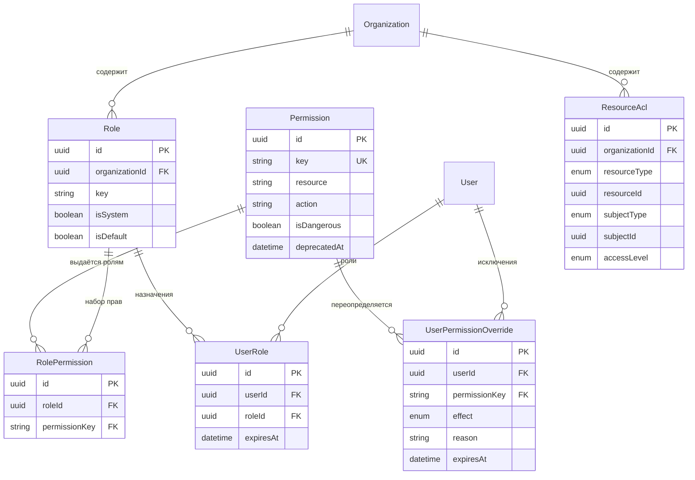

---

### 3. Проекты

Обе таблицы — **[T]**.

| Сущность | Метка | Ключевые поля | Связи |
|---|---|---|---|
| `Project` | [T] | `key` (например `BAD`), `name`, `description`, `status ACTIVE\|ON_HOLD\|ARCHIVED\|CLOSED`, `visibility PUBLIC_ORG\|PRIVATE`, `leadId` → `User`, `clientId?` → `Client`, `startedAt?`, `dueAt?`, `color`, `taskCounter Int`, `deletedAt?` | 1:N `ProjectMember`, `Board`, `Sprint`, `Budget`, `TimeEntry` |
| `ProjectMember` | [T] | `projectId`, `userId`, `projectRole LEAD\|MEMBER\|REVIEWER\|OBSERVER`, `allocationPct`, `joinedAt`, `leftAt?` | join |

**Про `visibility`.** `PUBLIC_ORG` — проект виден всем сотрудникам организации (типичный
внутренний проект); `PRIVATE` — доступ только через `ProjectMember` и `ResourceAcl`
(`resourceType = PROJECT`). Это **не** RLS: RLS отсекает чужие организации, а видимость проекта —
доменное правило, реализуемое в policy-слое.

**Про `taskCounter`.** Счётчик номеров задач внутри проекта, инкрементируемый
`UPDATE … SET task_counter = task_counter + 1 RETURNING task_counter` в той же транзакции, что и
вставка задачи. Последовательность (`SEQUENCE`) не подходит: она глобальна и оставляет дыры при
откате, а `BAD-14` не должен пропадать из-за неудачной транзакции у соседнего проекта. Цена —
сериализация вставок в рамках одного проекта; при реальных объёмах (единицы задач в секунду)
это не является узким местом.

**Индексы:** `uq_projects_org_key (organization_id, key) WHERE deleted_at IS NULL`;
`idx_projects_org_status (organization_id, status) WHERE deleted_at IS NULL`;
`idx_projects_org_client (organization_id, client_id)`;
`uq_project_members (project_id, user_id) WHERE left_at IS NULL`;
`idx_project_members_org_user (organization_id, user_id)` — «мои проекты».

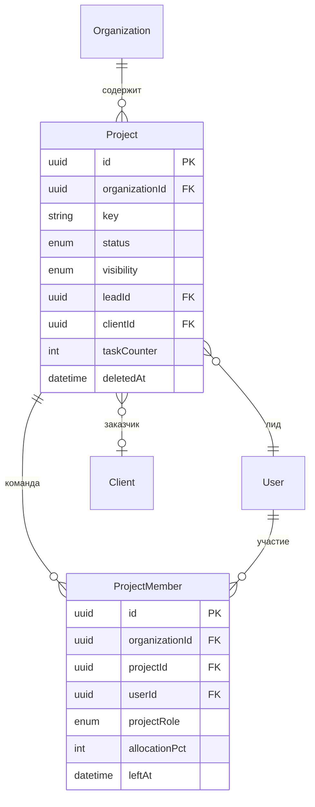

---

### 4. Задачи (канбан)

Все двенадцать таблиц — **[T]**.

> Не путать `Activity` (глобальный справочник видов трудозатрат, группа 9) и `ActivityEvent`
> (лента изменений по сущности, эта группа). Имена похожи, сущности разные.

| Сущность | Метка | Ключевые поля | Связи |
|---|---|---|---|
| `Board` | [T] | `projectId?` (**nullable** — свободная доска), `name`, `kind KANBAN\|SPRINT\|BACKLOG`, `isDefault`, `settings Json`, `deletedAt?` | 1:N `BoardColumn` |
| `BoardColumn` | [T] | `boardId`, `name`, `orderKey`, `wipLimit Int?`, `isDone Bool`, `color` | 1:N `Task` |
| `Task` | [T] | `projectId`, `boardId` (**денормализован**), `boardColumnId`, `number Int`, `title`, `description Json`, `type TASK\|BUG\|STORY\|CHORE`, `orderKey`, `priority`, `status` (**производный**), `parentTaskId?`, `sprintId?`, `estimateMinutes Int?`, `dueAt?`, `startedAt?`, `completedAt?`, `createdById`, `deletedAt?` | self-ref, N:M исполнители/метки |
| `TaskAssignee` | [T] | `taskId`, `userId`, `isPrimary Bool`, `assignedAt`, `assignedById` | join |
| `TaskLink` | [T] | `sourceTaskId`, `targetTaskId`, `linkType BLOCKS\|RELATES\|DUPLICATES\|CAUSES`, `createdById` | граф задач |
| `Label` | [T] | `name`, `color`, `projectId?` (null = общая на организацию) | 1:N `TaskLabel` |
| `TaskLabel` | [T] | `taskId`, `labelId` | join |
| `Comment` | [T] | **полиморфная**: `entityType TASK\|DOC_PAGE\|KB_NOTE\|CALL`, `entityId`, `authorId`, `body Json`, `plainText`, `parentCommentId?`, `resolvedAt?`, `editedAt?`, `deletedAt?` | ветка обсуждения |
| `Attachment` | [T] | **полиморфная**: `entityType TASK\|DOC_PAGE\|KB_NOTE\|COMMENT\|MESSAGE\|MILESTONE\|PROJECT_RISK\|CALL`, `entityId`, `fileId` → `File`, `uploadedById`, `caption` | связка контента с файлом |
| `Mention` | [T] | **полиморфная**: `sourceType COMMENT\|MESSAGE\|DOC_PAGE\|KB_NOTE\|TASK`, `sourceId`, `mentionedUserId?`, `mentionedTeamId?`, `mentionedChannel Bool`, `readAt?` | адресация |
| `Watcher` | [T] | `entityType`, `entityId`, `userId`, `reason EXPLICIT\|ASSIGNED\|AUTHORED\|MENTIONED` | подписка на события |
| `ActivityEvent` | [T] | `entityType`, `entityId`, `actorId`, `verb` (`task.moved`), `payload Json` (before/after), `occurredAt` | лента, append-only |

**Про `description Json`.** Тело задачи — тот же rich-text формат, что и `DocPage.content` и
`Message.body` (ProseMirror-подобный документ). Один формат на весь продукт означает один редактор,
один сериализатор в plain-text для поиска и один рендерер. Для полнотекста рядом с задачей живёт
`searchVector tsvector`, обновляемый триггером из `title + plainText(description)`.

**Про `Task.type`.** Закрытый Prisma enum `TASK | BUG | STORY | CHORE`. Значения `EPIC` в нём
намеренно нет: в этом продукте «эпик» — единица планирования работ над самим Bad CRM (каталог
`epics/`), и одноимённый тип задачи гарантированно породил бы путаницу в разговоре и в поиске;
иерархия «крупное → мелкое» уже выражена `parentTaskId`, а не типом.
*Канон — `TASK|BUG|STORY|CHORE`, приведено в соответствие 2026-07-26* (EPIC-019 предлагал
`TASK|BUG|STORY|EPIC`).

**Про денормализованный `Task.boardId`.** Доска задачи выводима цепочкой
`Task → BoardColumn → Board`, но выводить её на каждом запросе — два лишних join на **самом частом
экране продукта** (канбан) и на каждом обращении к ACL: цепочка наследования прав задачи (`Task →
Board → Project → Organization`) начинается именно с доски, то есть policy-слой спрашивает «какая
доска у этой задачи» на каждый чих. Поэтому `boardId` лежит колонкой рядом с `boardColumnId`.

Плата — риск рассинхронизации при перемещении задачи между досками. Закрывается **составным FK**
`FOREIGN KEY (organization_id, board_id, board_column_id) REFERENCES board_columns (organization_id,
board_id, id)`: база физически не примет строку, где колонка принадлежит другой доске, поэтому
«забыть обновить `boardId`» невозможно — это ошибка вставки, а не тихое расхождение.

**Инвариант состояния задачи: источник правды — `boardColumnId`, `status` производный.** Задача
находится там, куда её перетащили; колонка (`BoardColumn.isDone`, порядок колонок) — единственное
авторитетное утверждение о её состоянии. `status` остаётся отдельной колонкой ради двух вещей:
кросс-проектных выборок и отчётов («все открытые задачи организации» не должны джойнить колонки
всех досок) и стабильного контракта API, не зависящего от того, как конкретная команда назвала
колонки. Из этого следуют жёсткие правила:

- `status` **пишет только use-case перемещения/создания задачи**, выводя его из целевой колонки
  (маппинг «колонка → статус» задаётся в `Board.settings`, дефолт — `isDone ? DONE : IN_PROGRESS`,
  первая колонка — `TODO`). Прямая запись `status` из других мест — дефект.
- Изменить `status` в обход колонки нельзя из API вообще: поле `status` в payload обновления задачи
  отсутствует, есть только `boardColumnId`.
- Расхождение ловится ночным integrity-джобом (тем же, что проверяет полиморфные связи) и
  контрактным тестом «после `task:move` `status` соответствует колонке».

Альтернатива — убрать `status` совсем — отвергнута: она делает любой кросс-проектный отчёт
джойном по `board_columns` с разными наборами колонок в каждом проекте.

**Про `orderKey` и WIP-лимит.** `wipLimit` — **не** проверяется CHECK-ограничением: это правило
процесса, а не инвариант данных, оно должно уметь нарушаться с предупреждением (и меняться задним
числом). Проверка живёт в use-case перемещения задачи.

**Про `Board.projectId?` и `Board.deletedAt`.** Обе колонки — следствие продуктового требования
свободных досок (EPIC-018): доска команды или личная доска существует без проекта, поэтому
`projectId` нуллабелен. Цена — **цепочка ACL раздваивается**: у проектной доски она
`Board → Project → Organization`, у свободной — `Board → Organization` напрямую, и `resolveAcl`
обязан выбирать ветку по `projectId IS NULL`, а не предполагать проект (это же требование
продублировано в [`../security/permission-model.md`](../security/permission-model.md)). `deletedAt`
выравнивает доску с `Project` и `Task`: удаление доски с сотней задач должно быть обратимым, иначе
единственный способ ошибиться стоит всей истории работ. Мягко удалённая доска скрывает свои задачи
из списков, но **не** помечает их удалёнными — восстановление доски возвращает содержимое как было.

**Про `Mention` — одна связь вместо двух.** Пара (`sourceType`, `sourceId`) — **единственный**
способ сослаться на источник упоминания; колонок `commentId`/`messageId` нет. Держать оба механизма
одновременно означало бы два источника правды об одном факте: две колонки могут разъехаться друг с
другом и с `sourceType`, и любая выборка «упоминания пользователя» обязана была бы уметь читать оба
варианта (`COALESCE` или `UNION`). Упоминание, кроме того, живёт не только в комментариях и
сообщениях — оно бывает в теле документа и заметки, где отдельной FK-колонки не существует в
принципе. `mentionedUserId` нуллабелен, потому что упоминание бывает адресовано команде
(`mentionedTeamId`) или всему каналу (`mentionedChannel`, право `message:mention_channel`);
CHECK `num_nonnulls(mentioned_user_id, mentioned_team_id) + mentioned_channel::int = 1` не даёт
строке остаться без адресата или получить сразу два.

**Про `TaskLink`.** Направленная связь; для симметричных типов (`RELATES`, `DUPLICATES`) приложение
нормализует порядок (`sourceTaskId < targetTaskId` лексикографически), чтобы уникальность работала и
не появлялись зеркальные дубли. `CHECK (source_task_id <> target_task_id)` — самоссылка запрещена.
Циклы `BLOCKS` не запрещаются БД (это потребовало бы рекурсивного триггера) — их ловит валидатор в
use-case и подсвечивает UI.

**Индексы:**

- `uq_tasks_project_number (project_id, number)` — человекочитаемый `BAD-42`.
- `idx_tasks_board_order (organization_id, board_column_id, order_key) WHERE deleted_at IS NULL` —
  **главный индекс продукта**: отрисовка колонки канбана целиком идёт по нему.
- `idx_tasks_org_board (organization_id, board_id) WHERE deleted_at IS NULL` — «все задачи доски»
  одним сканом (счётчики, экспорт, каскад при удалении доски) без обхода `board_columns`.
- `idx_tasks_org_type_status (organization_id, type, status) WHERE deleted_at IS NULL` — кросс-
  проектные списки «все открытые баги»; частичный, потому что удалённые в них не нужны.
- `idx_boards_org_project (organization_id, project_id) WHERE deleted_at IS NULL` и
  `idx_boards_org_free (organization_id) WHERE project_id IS NULL AND deleted_at IS NULL` —
  проектные и свободные доски; второй частичный индекс маленький и покрывает весь список
  «доски вне проектов».
- `idx_tasks_org_sprint (organization_id, sprint_id) WHERE deleted_at IS NULL`,
  `idx_tasks_org_parent (organization_id, parent_task_id)`,
  `idx_tasks_org_due (organization_id, due_at) WHERE completed_at IS NULL` — «просрочено».
- `idx_tasks_search GIN (search_vector)`.
- `uq_task_assignees (task_id, user_id)`, `idx_task_assignees_org_user (organization_id, user_id)` —
  «мои задачи» без обхода задач.
- `uq_task_links (source_task_id, target_task_id, link_type)`,
  `idx_task_links_target (organization_id, target_task_id)`.
- `uq_labels_org_project_name (organization_id, project_id, name)`; `uq_task_labels (task_id, label_id)`.
- `idx_comments_entity (organization_id, entity_type, entity_id, created_at) WHERE deleted_at IS NULL`
  — лента комментариев одной сущности.
- `idx_attachments_entity (organization_id, entity_type, entity_id)`, `idx_attachments_file (file_id)`
  — второй нужен, чтобы понять, можно ли физически удалять файл.
- `idx_mentions_user_unread (organization_id, mentioned_user_id) WHERE read_at IS NULL`.
- `uq_watchers (entity_type, entity_id, user_id)`.
- `idx_activity_events_entity (organization_id, entity_type, entity_id, occurred_at DESC)`,
  `idx_activity_events_actor (organization_id, actor_id, occurred_at DESC)`.

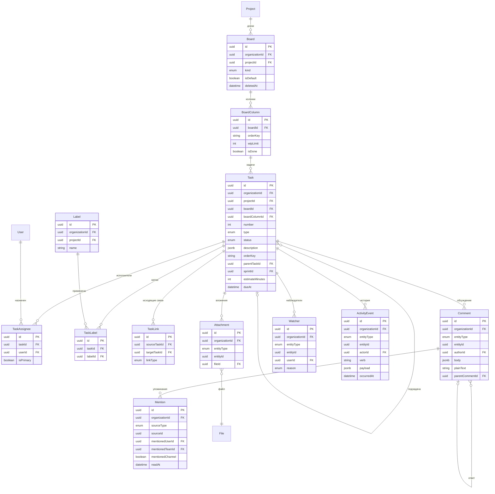

### 5. Документы (Notion-like) и база знаний (Obsidian-like)

Все девять таблиц — **[T]**.

Два разных продукта в одной группе, и они намеренно **не** объединены в одну таблицу: `DocPage` —
структурированный блочный документ, редактируемый в WYSIWYG; `KbNote` — markdown-файл с
frontmatter, который может приезжать из git-репозитория или Obsidian-вольта и должен уезжать
обратно байт-в-байт. Общая таблица заставила бы одну из сторон жить в чужом формате.

| Сущность | Метка | Ключевые поля | Связи |
|---|---|---|---|
| `DocPage` | [T] | `title`, `icon`, `coverFileId?` → `File`, `content Json` (**весь документ одним JSONB**), `version Int`, `parentPageId?`, `path String` (materialized path), `depth Int`, `orderKey`, `projectId?`, `createdById`, `lastEditedById`, `publishedAt?`, `deletedAt?` | дерево, 1:N версии |
| `DocPageVersion` | [T] | `docPageId`, `version Int`, `content Json`, `authorId`, `changeSummary`, `createdAt` | снапшот |
| `KbSpace` | [T] | `kind PERSONAL\|TEAM`, `ownerUserId?`, `projectId?`, `name`, `slug`, `description`, `sourceKind NATIVE\|GIT\|OBSIDIAN_IMPORT`, `gitRepoUrl?`, `defaultBranch?`, `lastSyncedAt?` | 1:N `KbNote` |
| `KbNote` | [T] | `spaceId`, `path` (`arch/rls.md`), `title`, `contentMd Text`, `frontmatter Json`, `checksum` (sha256 сырого файла), `sourceCommitSha?`, `wordCount`, `deletedAt?` | 1:N `KbLink`, N:M теги |
| `KbLink` | [T] | `sourceNoteId`, `linkType WIKI\|EMBED\|TAG`, `targetNoteId?`, `targetTitleRaw`, `anchor?`, `isBroken Bool` | граф заметок |
| `KbTag` | [T] | `name`, `color`, `spaceId?` | справочник |
| `KbNoteTag` | [T] | `noteId`, `tagId`, `source FRONTMATTER\|INLINE\|MANUAL` | join |
| `KbImportJob` | [T] | `spaceId`, `kind`, `status QUEUED\|RUNNING\|SUCCEEDED\|FAILED\|PARTIAL`, `sourceRef`, `stats Json`, `errorLog Text?`, `startedAt`, `finishedAt?`, `startedById` | процесс импорта |
| `KbExportJob` | [T] | `spaceId`, `format MARKDOWN_ZIP\|GIT_PUSH`, `scope SPACE\|SUBTREE\|SELECTION`, `noteIds Uuid[]?`, `status QUEUED\|RUNNING\|SUCCEEDED\|FAILED\|PARTIAL`, `targetRef?`, `resultFileId?` → `File`, `stats Json`, `errorLog Text?`, `expiresAt?`, `startedAt`, `finishedAt?`, `startedById` | процесс экспорта |

**Почему контент `DocPage` — один JSONB, а не таблица блоков.** Notion-подобный редактор
соблазняет смоделировать каждый блок строкой (`Block` с `parentBlockId` и `orderKey`). Мы этого не
делаем на MVP:

- Документ **всегда читается и сохраняется целиком** — это единица консистентности редактора.
  Таблица блоков означает 200 строк на чтение одной страницы и рекурсивный CTE вместо одного
  `SELECT`.
- Undo/redo и версионирование естественно ложатся на снапшот документа (`DocPageVersion`), а не на
  дифф по сотням строк.
- Цена — невозможность сослаться на конкретный блок из другой таблицы и отсутствие построчных
  прав. Первое решаем стабильными `id` внутри JSON (якоря для комментариев и ссылок), второе не
  входит в скоуп.

Пересмотр этого решения понадобится при переходе на настоящее совместное редактирование (CRDT) —
см. «Открытые вопросы».

**Про `DocPage.version` — оптимистичная блокировка.** Целое, инкрементируемое при каждом сохранении.
Клиент присылает версию, от которой он редактировал, и сохранение выполняется как
`UPDATE doc_pages SET content = $1, version = version + 1 WHERE id = $2 AND version = $3`: ноль
затронутых строк означает, что документ успели изменить, и вместо тихой перезаписи пользователь
получает диалог конфликта. Без этой колонки «последний победил» работает буквально — второй
сохраняющий бесследно затирает чужую правку целого документа (а документ здесь — один JSONB,
то есть теряется **всё**, а не абзац). Это и есть закрытие `T-KNOW-06`. Та же версия становится
`DocPageVersion.version`, поэтому счётчик снапшотов и счётчик блокировки — одно число, а не два
расходящихся. Порядок операций в транзакции сохранения: снять снапшот старого содержимого в
`DocPageVersion`, затем условный `UPDATE`.

**Про `DocPage.coverFileId`.** Обложка страницы — обычный `File`, а не URL и не blob в JSONB:
она проходит тот же путь загрузки, антивирусной проверки, квоты и прав, что и любое вложение, и
удаление файла видно через `idx_attachments_file`-подобный обратный индекс. Отдельная колонка (а не
запись в `Attachment`) — потому что обложка ровно одна и участвует в рендере списка страниц, где
join по полиморфной таблице ради одной картинки избыточен.

**Про `KbSpace.kind` и `KbSpace.projectId`.** `kind PERSONAL | TEAM` разделяет два разных режима
доступа: личное пространство (`ownerUserId` обязателен, неявный уровень доступа для всех
остальных — `NONE`, как у личного vault) и командное (`ownerUserId` пуст, доступ по ACL).
`projectId` нуллабелен и нужен для **цепочки наследования прав**
`KbNote → KbSpace → Project → Organization`, описанной в
[`../security/permission-model.md`](../security/permission-model.md): без него пространство,
заведённое «для проекта», не наследует его ACL и требует ручного дублирования грантов на каждое
изменение состава команды. CHECK-ограничения запирают комбинации:

```
ck_kb_spaces_personal_owner CHECK ((kind = 'PERSONAL') = (owner_user_id IS NOT NULL))
ck_kb_spaces_personal_scope CHECK (kind <> 'PERSONAL' OR project_id IS NULL)
```

Личное пространство не бывает проектным — иначе «личное» перестаёт быть личным через наследование
от проекта.

**Про `KbExportJob` рядом с `KbImportJob`.** Экспорт — не «импорт наоборот в одной таблице»:
у него другой набор полей (`format`, `scope`, `resultFileId`, `expiresAt`), другие права
(`kb_space:export` против `kb_space:import`, первое не опасное, второе — да) и другой жизненный
цикл результата (готовый архив живёт ограниченное время и подлежит зачистке). Общая таблица с
дискриминатором заставила бы половину колонок пустовать в каждой строке. Обе таблицы при этом —
одна и та же механика: строка-состояние процесса, обновляемая воркером, с `stats` и `errorLog`
для отчёта пользователю.

**Про materialized path.** `DocPage.path` хранит цепочку предков (`.uuid1.uuid2.uuid3.`), `depth` —
её длину. Это даёт поддерево одним `WHERE path LIKE '.uuid1.%'` без рекурсии. Альтернативы:
`ltree` (быстрее, требует расширения и labels вместо uuid), closure table (точнее при частых
перемещениях, но +N строк на узел). Выбран materialized path: дерево документов мелкое
(единицы тысяч узлов), перемещения редки, а обновление поддерева при переносе — один
`UPDATE … SET path = replace(path, old, new)`.

**Про `KbNote.checksum` и уникальность.** `@@unique([spaceId, path])` — путь идентифицирует
заметку внутри пространства ровно как файл в вольте. `checksum` от **сырого файла** позволяет
синхронизации понять, изменился ли файл, без сравнения текста, и обнаружить конфликт
(«поменяли и здесь, и в git»). `sourceCommitSha` фиксирует, из какого коммита приехала версия.

**Про `KbLink` и `[[wiki-links]]`.** Ключевая особенность: ссылка `[[RLS в Postgres]]` может
указывать на **несуществующую** заметку — это нормальное состояние Obsidian (незаполненная
заметка). Поэтому `targetNoteId` нуллабелен, а `targetTitleRaw` хранит исходный текст ссылки
всегда. `isBroken` — денормализованный флаг, пересчитываемый при создании/переименовании/удалении
заметок; он нужен, чтобы отчёт «битые ссылки» был индексным запросом, а не полным обходом графа.
Переименование заметки чинит ссылки массово: `UPDATE kb_links SET target_note_id = …, is_broken = false
WHERE target_title_raw = …`.

**Индексы:**

- `idx_doc_pages_org_parent_order (organization_id, parent_page_id, order_key) WHERE deleted_at IS NULL`
  — отрисовка уровня дерева.
- `idx_doc_pages_path (organization_id, path text_pattern_ops)` — выборка поддерева по префиксу.
- `idx_doc_pages_search GIN (search_vector)`; `idx_doc_pages_content GIN (content jsonb_path_ops)`
  — второй только если понадобится поиск по типам блоков.
- `uq_doc_page_versions (doc_page_id, version)`.
- `uq_kb_spaces_org_slug (organization_id, slug)`;
  `idx_kb_spaces_org_project (organization_id, project_id) WHERE project_id IS NOT NULL` — цепочка
  ACL «пространства этого проекта»;
  `idx_kb_spaces_owner (organization_id, owner_user_id) WHERE kind = 'PERSONAL'` — «моё личное
  пространство».
- `uq_kb_notes_space_path (space_id, path) WHERE deleted_at IS NULL` — требование модели.
- `idx_kb_notes_search GIN (to_tsvector('simple', content_md))`, `idx_kb_notes_frontmatter GIN (frontmatter jsonb_path_ops)`.
- `idx_kb_links_source (organization_id, source_note_id)`,
  `idx_kb_links_target (organization_id, target_note_id) WHERE target_note_id IS NOT NULL`
  — обратные ссылки (backlinks) одним индексным чтением,
  `idx_kb_links_broken (organization_id, target_title_raw) WHERE is_broken`.
- `uq_kb_note_tags (note_id, tag_id)`; `uq_kb_tags_org_space_name (organization_id, space_id, name)`.
- `idx_kb_import_jobs_org_status (organization_id, status, created_at DESC)`;
  `idx_kb_export_jobs_org_status (organization_id, status, created_at DESC)`;
  `idx_kb_export_jobs_expiry (expires_at) WHERE result_file_id IS NOT NULL` — джоб зачистки готовых
  архивов.

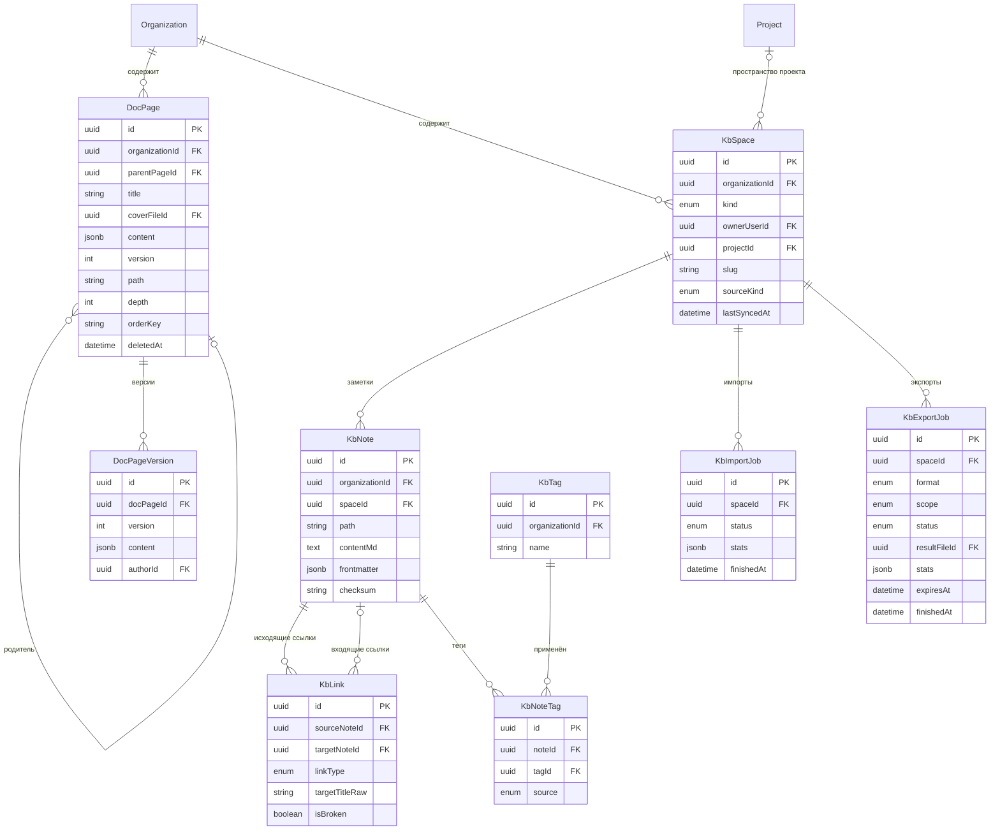

---

### 6. Файлы

Все три таблицы — **[T]**.

| Сущность | Метка | Ключевые поля | Связи |
|---|---|---|---|
| `File` | [T] | `storageKey` (путь в S3/локальном хранилище), `originalName`, `mimeType`, `sizeBytes BigInt`, `checksumSha256`, `scope ORG\|PROJECT\|PERSONAL\|TASK\|CHAT\|VAULT`, `scopeId?`, `folderId?`, `ownerId`, `scanStatus PENDING\|CLEAN\|INFECTED\|SKIPPED`, `scannedAt?`, `isEncrypted Bool`, `currentVersionId?`, `deletedAt?` | 1:N версии |
| `FileFolder` | [T] | `name`, `parentFolderId?`, `path`, `scope`, `scopeId?`, `ownerId?` | дерево |
| `FileVersion` | [T] | `fileId`, `version Int`, `storageKey`, `sizeBytes`, `checksumSha256`, `uploadedById`, `comment?` | история |

**Про `scope` + `scopeId`.** Один файл-реестр на весь продукт вместо отдельных таблиц под аватары,
вложения задач и файлы чата. Причина — сквозные операции: подсчёт квоты организации, антивирусное
сканирование, зачистка осиротевших объектов, дедупликация. `scope` определяет, кто владеет файлом
и по какому правилу считается доступ; `scopeId` — идентификатор владельца (проект, задача, канал).
Связь с конкретной сущностью-потребителем идёт через `Attachment`/`MessageAttachment`, то есть один
файл может быть приложен в нескольких местах.

**Про `checksumSha256` и дедупликацию.** Индекс `(organization_id, checksum_sha256)` позволяет не
хранить одинаковый файл дважды внутри организации. **Между организациями дедупликация запрещена** —
это скрытый канал утечки (по факту «файл уже есть» можно проверять наличие документа у соседа) и
нарушение изоляции, ради экономии диска на это не идём.

**Про `scanStatus`.** Файл со `scanStatus = PENDING` не отдаётся на скачивание — это состояние
жизненного цикла, а не флаг «на будущее». `INFECTED` — файл карантинится, `storageKey`
перемещается, а строка остаётся ради аудита. `SKIPPED` — для `scope = VAULT`: зашифрованный
клиентом блоб сканировать бессмысленно.

**Про `isEncrypted`.** Отмечает файлы, тело которых зашифровано на клиенте (vault, вложения
защищённых ссылок). Для них сервер не умеет ни превью, ни полнотекст — и не должен пытаться.

**Индексы:** `uq_files_storage_key (storage_key)`;
`idx_files_org_scope (organization_id, scope, scope_id) WHERE deleted_at IS NULL`;
`idx_files_org_checksum (organization_id, checksum_sha256)`;
`idx_files_scan_pending (scan_status) WHERE scan_status = 'PENDING'` — очередь сканера;
`idx_files_deleted (deleted_at) WHERE deleted_at IS NOT NULL` — джоб физического удаления по TTL;
`uq_file_versions (file_id, version)`;
`idx_file_folders_org_parent (organization_id, parent_folder_id)`.

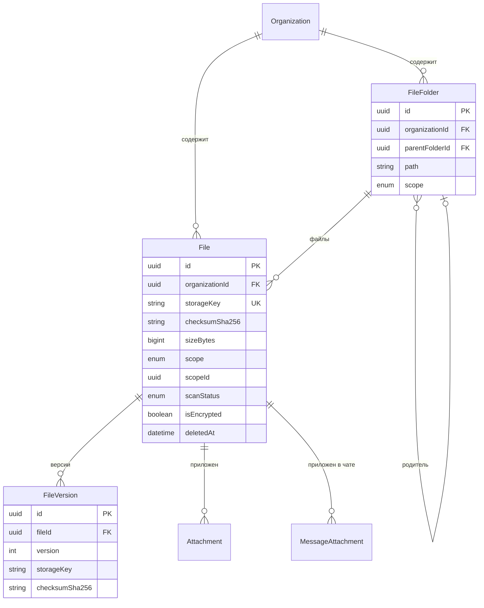

---

### 7. Vault — E2EE-хранилище секретов

Все девять таблиц — **[T]**.

**Главный инвариант группы: сервер хранит только шифротекст.** В таблицах этой группы нет ни одного
поля с открытым пользовательским значением — ни имени элемента, ни URL, ни заметки. Суффикс `Enc`
означает «зашифровано на клиенте, сервер видит байты». Нарушение этого инварианта — не «недочёт», а
компрометация всей подсистемы; проверка на plaintext-поля входит в чек-лист новой таблицы.

| Сущность | Метка | Ключевые поля | Назначение |
|---|---|---|---|
| `UserKeyPair` | [T] | `userId`, `publicKeyX25519`, `publicKeyEd25519`, `encryptedPrivateKeys` (обе приватные, зашифрованы ключом из пароля), `kdfSalt`, `kdfParams Json` (Argon2id: m, t, p), `algoVersion Int`, `recoveryBlobEnc?`, `recoveryAckAt?`, `rotatedAt?` | личные ключи (поля депонирования нет — см. ниже) |
| `Vault` | [T] | `kind PERSONAL\|SHARED\|PROJECT`, `name`, `ownerId?`, `projectId?`, `keyVersion Int`, `vaultKeyId Bytes`, `rotationRequired Bool`, `retainedUntil?`, `deletedAt?` | контейнер |
| `VaultMembership` | [T] | `vaultId`, `subjectKind USER\|ESCROW`, `userId?`, `wrappedVaultKey` (ключ хранилища, обёрнутый публичным ключом участника или `OrgRecoveryKey`), `keyVersion`, `accessLevel`, `grantedById`, `grantedByKeyId`, `grantSignature` (Ed25519 выдающего), `grantedAt` | выдача доступа |
| `VaultFolder` | [T] | `vaultId`, `parentFolderId?`, `nameEnc`, `orderKey` | структура (имя тоже шифротекст) |
| `VaultItem` | [T] | `vaultId`, `folderId?`, `itemType PASSWORD\|NOTE\|SSH_KEY\|API_KEY\|CARD\|FILE`, `nameEnc`, `dataEnc`, `itemKeyWrapped`, `keyVersion`, `blindIndexName`, `blindIndexUrl?`, `favorite`, `deletedAt?` | секрет |
| `VaultItemVersion` | [T] | `itemId`, `version Int`, `dataEnc`, `itemKeyWrapped`, `createdById` | история изменений |
| `VaultItemTag` | [T] | `itemId`, `tagNameEnc`, `blindIndexTag` | теги без раскрытия |
| `VaultAccessLog` | [T] | `vaultId`, `itemId?`, `userId`, `action VIEW\|DECRYPT\|COPY\|EXPORT\|SHARE\|REVOKE`, `ipHash`, `userAgent`, `occurredAt` | append-only |
| `OrgRecoveryKey` | [T] | `publicKey`, `encryptedPrivateKeyShares Json` (шарды Шамира), `threshold Int`, `custodianUserIds`, `activatedAt?`, `rotatedAt?` | организационное восстановление |

**Схема ключей (envelope encryption, три уровня):**

1. Пароль пользователя → Argon2id (`kdfSalt`, `kdfParams`) → **master key**, никогда не покидает
   клиент и не отправляется на сервер.
2. Master key шифрует `encryptedPrivateKeys` (X25519 для обмена, Ed25519 для подписи). Сервер
   хранит только публичные части в открытом виде.
3. У каждого хранилища есть симметричный **vault key**; для каждого участника он обёрнут его
   публичным X25519 (`VaultMembership.wrappedVaultKey`). У каждого элемента — свой **item key**
   (`itemKeyWrapped`, обёрнут vault key), тело — AEAD-блоб `dataEnc`.

Что это даёт: выдача доступа новому участнику — одна вставка `VaultMembership` (перешифровывать
элементы не нужно); отзыв — удаление membership плюс инкремент `keyVersion` и ротация vault key,
после чего старый обёрнутый ключ бесполезен. `keyVersion` присутствует и на хранилище, и на
элементе, и на членстве именно для того, чтобы ротация была отслеживаемой и частичной.

**Канон перечня `itemType` — `PASSWORD | NOTE | SSH_KEY | API_KEY | CARD | FILE`, приведено в
соответствие 2026-07-26.** Ранее здесь стоял набор `LOGIN | NOTE | CARD | SSH_KEY | API_KEY |
CERTIFICATE`, расходившийся с [`../security/e2ee-design.md`](../security/e2ee-design.md) и EPIC-034.
Решение зафиксировано **до первой миграции** осознанно: `itemType` входит в
**AAD блоба `item-data`**, то есть значение участвует в проверке подлинности шифротекста, и
переименование после релиза не «переименование колонки», а невозможность расшифровать все
существующие элементы этого типа. `PASSWORD` вместо `LOGIN` — потому что элемент хранит секрет, а не
учётную запись; `FILE` вместо `CERTIFICATE` — потому что сертификат это частный случай файла, а
файлов в vault хочется больше одного вида.

**Про `Vault.vaultKeyId`.** Публичный, необорачиваемый идентификатор текущего ключа хранилища:
`vaultKeyId = HKDF-SHA256(VaultKey, salt = vaultId, info = "badcrm/v1/vault-key-id")[0..16]`. Он не
даёт ничего атакующему (из него не восстановить ключ), но позволяет **всем участникам сверить, что
они держат один и тот же `VaultKey`**. Без него скомпрометированный сервер может выдать разным
участникам разные обёртки — расщепить хранилище на два и читать «мостом» то, что пишет каждая
половина, а снаружи это выглядит как исправная работа. Клиент сравнивает `vaultKeyId` из своей
расшифрованной обёртки с тем, что лежит на `Vault`, и отказывается работать при расхождении.

**Про `Vault.rotationRequired` и `Vault.retainedUntil`.** Первый — флаг «ключ скомпрометирован
или участник отозван, ротация обязательна»: ставится сервером при офбординге и снимается только
успешным завершением ротации, а пока он поднят, UI показывает предупреждение и запрещает выдачу
новых доступов. Ротация — процедура клиентская и небыстрая (перешифровать обёртки всех участников),
поэтому её нельзя выполнить транзакцией отзыва; флаг — это то, что не даёт «отозвали и забыли»
превратиться в тихое состояние, где отозванный участник всё ещё держит валидный ключ. Второй —
дата, до которой хранилище удерживается от физического удаления после увольнения владельца
(`PERSONAL`-хранилище уволенного помечается `retainedUntil = now() + 90 дней`): не «мягкое
удаление», а окно, в течение которого решение можно отменить, при том что читать содержимое
по-прежнему невозможно без мастер-пароля владельца.

**Про `VaultMembership.subjectKind`.** Строка членства описывает не только человека: организационное
депонирование — это тоже обёртка vault key, но на публичный ключ `OrgRecoveryKey`, а не на ключ
пользователя. `subjectKind USER | ESCROW` разделяет эти два случая явно, и именно на нём держится
главный инвариант подсистемы: **`kind = 'PERSONAL'` ⇒ отсутствие membership с
`subjectKind = 'ESCROW'`**. Без дискриминатора escrow-строка отличалась бы от обычной только пустым
`userId`, то есть инвариант «администратор не читает личное» проверялся бы по косвенному признаку.
CHECK-ограничения:

```
ck_vault_memberships_subject  CHECK ((subject_kind = 'USER') = (user_id IS NOT NULL))
ck_vault_memberships_escrow   CHECK (subject_kind <> 'ESCROW' OR NOT EXISTS (…kind = 'PERSONAL'))
```

Второе выразимо в PostgreSQL только через триггер или составной FK с денормализованным
`Vault.kind` на строке членства; берём **денормализацию `vaultKind` + CHECK**, а не триггер —
инвариант такого веса должен быть виден в схеме, а не спрятан в процедуре.

**Про `UserKeyPair.recoveryAckAt`.** Отметка, что пользователь **подтвердил получение и сохранение**
Recovery Kit (распечатал/записал фразу и ввёл проверочное слово), а не просто увидел экран. Разница
принципиальна: `recoveryBlobEnc IS NOT NULL` означает лишь, что блоб создан, — при потере пароля
пользователь с несохранённой фразой потеряет данные ровно так же, как без recovery вообще. Пока
`recoveryAckAt IS NULL`, продукт периодически напоминает и помечает vault как «восстановление не
подтверждено»; это единственный способ отличить «человек отказался от recovery осознанно» от
«человек думает, что у него есть recovery».

**Почему отдельной колонки `nonce` нет.** `dataEnc` — **самодостаточный шифроблоб**: nonce
(24 байта XChaCha20-Poly1305-IETF), версия алгоритма и тег лежат внутри него, а не рядом в схеме.
Отдельная колонка `nonce` — источник рассинхронизации: её можно обновить без `dataEnc` (или
наоборот), можно случайно переиспользовать при копировании строки, и она провоцирует «сборку»
шифротекста на сервере, которой в E2EE быть не должно. Формат блоба фиксирован в
[`../security/e2ee-design.md`](../security/e2ee-design.md); сервер обращается с ним как с
непрозрачным `bytes`. То же самое относится к `VaultItemVersion.dataEnc`.

*Канон — колонок `nonce` нет ни у `VaultItem`, ни у `VaultItemVersion`, ни у `SecureLink`
(`payloadNonce` удалён, см. группу 8); nonce живёт внутри блоба. Приведено в соответствие с
`e2ee-design.md` 2026-07-26.*

**Про `grantSignature` и `grantedByKeyId`.** Одного `wrappedVaultKey` мало: сервер, который хранит
публичные ключи участников, технически способен **подменить** публичный ключ и выдать доступ к
хранилищу подконтрольному ему аккаунту — снаружи это выглядит как обычная строка `VaultMembership`.
Поэтому каждая выдача подписывается **Ed25519-ключом выдающего** над кортежем
(`vaultId`, `userId`, `wrappedVaultKey`, `keyVersion`, `accessLevel`, `grantedAt`), а
`grantedByKeyId` фиксирует, какой именно ключевой парой подписано (ключи ротируются, `UserKeyPair`
может быть перевыпущен). Клиент **проверяет подпись перед тем, как доверять членству**, и
сверяет публичный ключ выдающего с тем, что он видел раньше. Без этой пары полей E2EE защищает
только от чтения дампа, но не от активного вредоносного сервера.

**Про blind index.** Поиск по зашифрованным данным невозможен, а искать надо. `blindIndexName` /
`blindIndexUrl` — HMAC от нормализованного значения с ключом, известным **только клиенту**
(производным от vault key). Клиент вычисляет HMAC искомой строки и отправляет его как параметр
поиска; сервер сравнивает байты и не может ни восстановить значение, ни построить словарь без
ключа. Цена — только точное совпадение (подстрока/префикс невозможны) и утечка равенства
(одинаковые URL дают одинаковый индекс). Это принятый компромисс: альтернатива — выкачивать весь
vault на клиент при каждом поиске.

**Про `recoveryBlobEnc`.** Забытый пароль в E2EE = потеря данных, поэтому есть один опциональный,
**явно включаемый пользователем** путь восстановления личного доступа: личный recovery-код (тот же
master key, завёрнутый в ключ из распечатанной фразы). Поле нуллабельно — пользователь вправе
работать без recovery-кита, и тогда потеря пароля необратима. Это цена, а не дефект.

**Депонирования MUK нет и не будет — поле `orgEscrowBlobEnc` из `UserKeyPair` удалено.**
Депонирование master key дало бы хранителям путь ко **всем** хранилищам пользователя, включая
`kind = PERSONAL`, что прямо ломает обещание продукта «администратор не может прочитать личный
vault». Поэтому escrow работает **на уровне ключа хранилища (`VaultKey`), а не master key**, и
**только для `SHARED` и `PROJECT`**: депонируется обёртка vault key рабочего хранилища на публичный
ключ `OrgRecoveryKey` (строка `VaultMembership` с `subjectKind = 'ESCROW'`), а личный vault в схему
восстановления не входит вообще. Его единственный путь восстановления — личный `recoveryBlobEnc`;
если пользователь его не включил, данные утрачены безвозвратно. Источник правды по крипто-схеме —
[`../security/e2ee-design.md`](../security/e2ee-design.md). Инвариант «`PERSONAL`-хранилище не имеет
escrow-membership» выражается схемой через `VaultMembership.subjectKind` (см. выше) и дополнительно
проверяется автотестом: попытка положить ключ личного хранилища в организационное депонирование —
та же категория дефекта, что plaintext-поле в этой группе таблиц.

*Канон — escrow действует только для `SHARED`/`PROJECT` и работает на уровне vault key, а не master
key. Колонка `UserKeyPair.orgEscrowBlobEnc` **удалена 2026-07-26** — депонирование работает на уровне
`Vault`, депонирование MUK запрещено инвариантом «админ не читает личные хранилища». Пустой слот в
схеме — приглашение его заполнить, поэтому слота нет. Приведено в соответствие с `e2ee-design.md`
2026-07-26.*

**Индексы:** `uq_user_key_pairs_user (user_id)`;
`idx_vaults_org_kind (organization_id, kind)`, `idx_vaults_org_project (organization_id, project_id)`,
`idx_vaults_rotation_required (organization_id) WHERE rotation_required` — список «хранилища,
ждущие ротации», для баннера администратору и для мониторинга,
`idx_vaults_retained (retained_until) WHERE retained_until IS NOT NULL` — джоб зачистки после
истечения окна удержания;
`uq_vault_memberships_user (vault_id, user_id) WHERE subject_kind = 'USER'` — один пользователь,
одно членство; escrow-строка под это ограничение не попадает (у неё `user_id IS NULL`),
`uq_vault_memberships_escrow (vault_id) WHERE subject_kind = 'ESCROW'` — не более одного
депонирования на хранилище,
`idx_vault_memberships_org_user (organization_id, user_id) WHERE subject_kind = 'USER'`
— «мои хранилища»;
`idx_vault_items_vault_folder (organization_id, vault_id, folder_id) WHERE deleted_at IS NULL`;
`idx_vault_items_blind_name (organization_id, vault_id, blind_index_name)`,
`idx_vault_items_blind_url (organization_id, blind_index_url) WHERE blind_index_url IS NOT NULL`;
`uq_vault_item_versions (item_id, version)`;
`idx_vault_access_log_item (organization_id, item_id, occurred_at DESC)`,
`idx_vault_access_log_user (organization_id, user_id, occurred_at DESC)`.

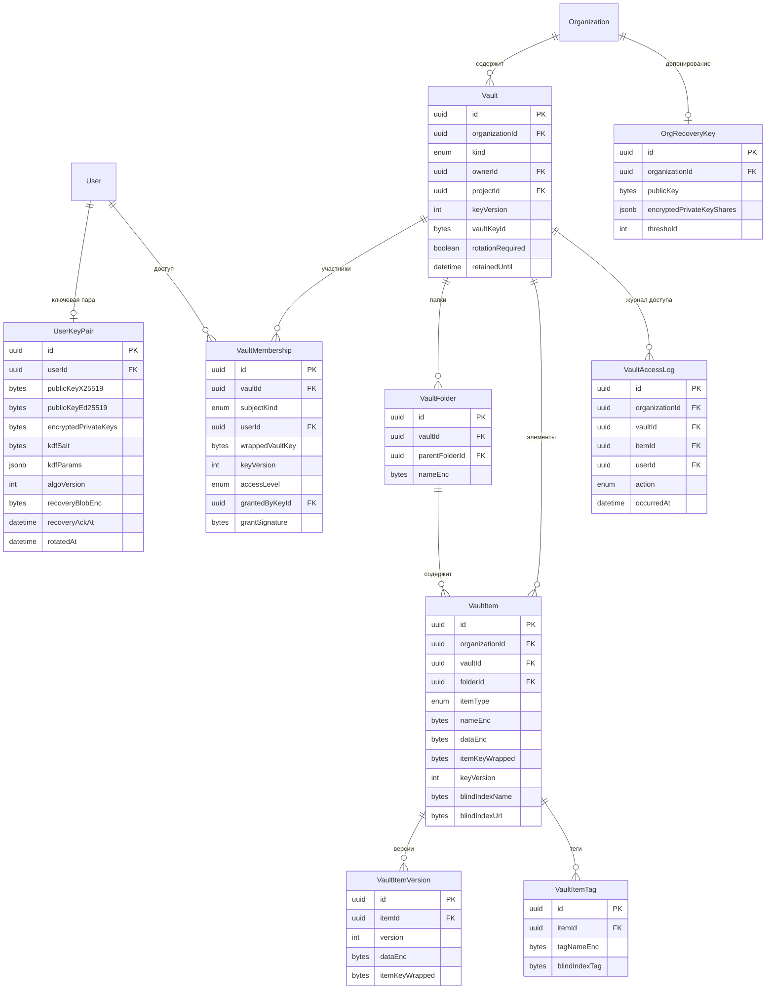

---

### 8. Защищённые ссылки

Все три таблицы — **[T]**. Группа маленькая, но это **самый нестандартный случай RLS во всей
модели** — см. подробный разбор в разделе «Мульти-тенантность и RLS», путь №2.

| Сущность | Метка | Ключевые поля | Назначение |
|---|---|---|---|
| `SecureLink` | [T] | `kind ONE_TIME\|RESTRICTED`, `tokenHash` (**только хэш**), `payloadEnc?`, `resourceType?`, `resourceId?`, `createdById`, `maxViews Int?`, `viewCount Int`, `expiresAt?`, `burnedAt?`, `requiresAuth Bool`, `passwordHash?`, `allowedEmails String[]`, `allowedIpCidrs String[]` | сама ссылка |
| `SecureLinkGrant` | [T] | `linkId`, `granteeUserId?`, `granteeEmail?`, `sealedKey` (ключ расшифровки, запечатанный для конкретного получателя), `usedAt?` | адресная выдача |
| `SecureLinkView` | [T] | `linkId`, `viewerUserId?`, `ipHash`, `userAgent`, `succeeded Bool`, `failureReason?`, `viewedAt` | журнал просмотров |

**Две модели ссылок:**

- `ONE_TIME` — «сгорающая»: содержимое лежит прямо в `payloadEnc`, ключ расшифровки находится в
  **URL-фрагменте** (`#key=…`), который браузер не отправляет на сервер. Сервер физически не может
  прочитать содержимое. Первый успешный просмотр ставит `burnedAt` и обнуляет `payloadEnc`.
- `RESTRICTED` — ссылка на существующий ресурс (`resourceType` + `resourceId`) с ограничениями:
  срок, лимит просмотров, пароль, whitelist e-mail или IP, требование авторизации.

**Колонки `payloadNonce` нет.** `payloadEnc` — такой же самодостаточный шифроблоб, как
`VaultItem.dataEnc`: nonce, версия алгоритма и тег лежат внутри него. Отдельная колонка была бы
третьим местом, где nonce можно рассинхронизировать с телом, и противоречила бы правилу группы 7.
Практическое следствие для атомарного сжигания: обнуляется **одно** поле (`payload_enc = NULL`), а
не пара, поэтому не существует состояния «тело стёрли, nonce остался» (или наоборот), в котором
строка выглядит частично живой. *Канон — nonce внутри блоба; SQL атомарного burn в
[`../security/e2ee-design.md`](../security/e2ee-design.md) приведён в соответствие 2026-07-26.*

**Про `tokenHash`.** В БД хранится только `sha256(token)`. Сам токен существует лишь в ссылке.
Следствия: дамп базы не даёт возможности открыть ссылки; токен нельзя восстановить и «переслать
ещё раз» — только выпустить новый. Токен обязан вырезаться из логов доступа (middleware
маскирования) — иначе весь смысл теряется на уровне nginx.

**Про `viewCount` и гонки.** Инкремент делается атомарно с проверкой в одном запросе:
`UPDATE secure_links SET view_count = view_count + 1 WHERE id = $1 AND (max_views IS NULL OR
view_count < max_views) RETURNING …`. Если строка не вернулась — лимит исчерпан. Проверять
`SELECT` + потом `UPDATE` нельзя: два параллельных клика по одноразовой ссылке пройдут оба.
`CHECK (max_views IS NULL OR view_count <= max_views)` — страховка второго уровня.

**Индексы:** `uq_secure_links_token_hash (token_hash)` — единственная точка входа для анонима;
`idx_secure_links_org_creator (organization_id, created_by_id, created_at DESC)`;
`idx_secure_links_expiry (expires_at) WHERE burned_at IS NULL` — джоб зачистки;
`idx_secure_links_resource (organization_id, resource_type, resource_id)`;
`uq_secure_link_grants (link_id, grantee_email)`;
`idx_secure_link_views_link (organization_id, link_id, viewed_at DESC)`.

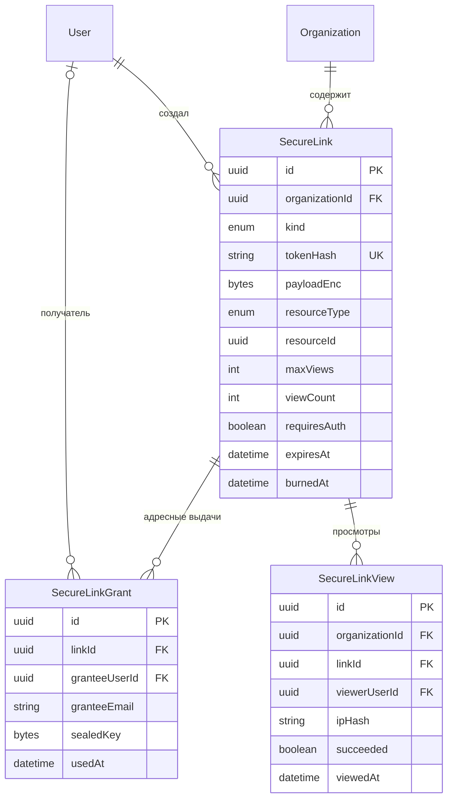

### 9. Тайм-трекинг

Одна **[G]**-таблица — `Activity` (глобальный справочник видов трудозатрат). Остальные восемь — **[T]**.

| Сущность | Метка | Ключевые поля | Назначение |
|---|---|---|---|
| `Activity` | **[G]** | `key @unique`, `name`, `category`, `isBillableByDefault Bool`, `isProductive Bool`, `sortOrder` | справочник: `development`, `code-review`, `research`, `meeting`, `support`, `onboarding`, `overhead`, `pto` |
| `ActivityOverride` | [T] | `organizationId`, `activityKey`, `displayName?`, `isEnabled Bool`, `isBillableByDefault?`, `colorHex?` | тенант переопределяет глобальный справочник |
| `TimeEntry` | [T] | `userId`, `projectId?`, `taskId?`, `activityId`, `description`, `startedAt`, `endedAt?`, `durationMinutes Int`, `timezone`, `source TIMER\|MANUAL\|IMPORT\|AUTO_CLOSED`, `needsReview Bool`, `billable Bool`, `costRateSnapshotMicros BigInt?`, `billRateSnapshotMicros BigInt?`, `currency`, `timesheetId?`, `approvalStatus`, `invoiceLineId?`, `reversesId?` (self-FK), `reversalReason String?`, `deletedAt?` | **факт-таблица** |
| `RunningTimer` | [T] | `userId @unique`, `projectId?`, `taskId?`, `activityId`, `description`, `startedAt`, `lastHeartbeatAt` | активный таймер |
| `Timesheet` | [T] | `userId`, `periodStart`, `periodEnd`, `status DRAFT\|SUBMITTED\|APPROVED\|REJECTED`, `submittedAt?`, `reviewedById?`, `reviewedAt?`, `rejectionReason?`, `lockedAt?`, `totalMinutes Int` | недельный табель |
| `TimePolicy` | [T] | `scope ORG\|PROJECT`, `scopeId?`, `requireApproval Bool`, `lockAfterDays Int?`, `minEntryMinutes`, `maxDailyMinutes`, `allowFutureEntries Bool`, `roundingMinutes Int`, `warnOnOverlap Bool`, `forbidOverlap Bool`, `autoCloseAfterMinutes Int?` | правила ввода |
| `CostRate` | [T] | `userId`, `amountMicros BigInt`, `currency`, `effectiveFrom`, `effectiveTo?` | себестоимость часа |
| `BillRate` | [T] | `scope ORG\|PROJECT\|CONTRACT\|USER`, `scopeId?`, `userId?`, `activityId?`, `amountMicros`, `currency`, `effectiveFrom`, `effectiveTo?` | ставка выставления |
| `TimeRollupDaily` | [T] | `date`, `userId`, `projectId?`, `activityId?`, `billableMinutes`, `nonBillableMinutes`, `costMicros`, `billMicros` | преагрегат для дашбордов |

**CHECK-ограничения `TimeEntry` (обязательные):**

```
ck_time_entries_task_requires_project  CHECK (task_id IS NULL OR project_id IS NOT NULL)
ck_time_entries_duration_nonzero       CHECK (duration_minutes <> 0)
ck_time_entries_interval               CHECK (ended_at IS NULL OR ended_at > started_at)
ck_time_entries_reversal_negative      CHECK (reverses_id IS NULL OR duration_minutes < 0)
ck_time_entries_reversal_reason        CHECK (reverses_id IS NULL OR reversal_reason IS NOT NULL)
```

Первое — ключевое правило иерархии измерений: задача всегда принадлежит проекту, поэтому запись
времени на задачу без проекта — рассогласованные данные, при которых отчёт «часы по проекту»
молча теряет часть фактов. Второе отсекает нулевые записи, которые ломают любые агрегаты;
отрицательные при этом **разрешены осознанно** — это сторно (см. ниже), и именно поэтому
ограничение сформулировано как `<> 0`, а не `> 0`. Третье и четвёртое запирают сторно: запись со
ссылкой `reverses_id` обязана быть отрицательной и обязана нести причину. Все ограничения —
**в БД**, а не только в валидаторе: записи приезжают ещё и через импорт и интеграции, и валидатор
приложения их не увидит.

**Подтверждённая запись неизменяема — исправление только сторно.** Как только `approvalStatus`
переходит в `APPROVED`, строка `TimeEntry` становится **immutable**: её нельзя ни отредактировать,
ни мягко удалить. Единственный способ исправить ошибку — **сторно-запись в той же таблице**: новая
строка с `reversesId` на исходную, отрицательным `durationMinutes`, равным по модулю исходному, и
обязательным `reversalReason`. Если нужна корректная замена — следом заводится обычная новая запись
с правильными данными. Сторно **наследует у исходной записи** `projectId`, `taskId`, `activityId`,
`billable`, `currency` и снапшоты ставок (`costRateSnapshotMicros`, `billRateSnapshotMicros`) —
иначе сумма отката не сойдётся с суммой, которая была посчитана и, возможно, уже выставлена.
Такой ledger даёт неизменяемый аудит-след: любую цифру в отчёте и в счёте можно проследить до
породивших её строк, а «исчезнувших» часов не бывает. Отдельная таблица корректировок отвергнута:
она снова превратила бы каждый отчёт в `UNION ALL` и продублировала бы всю сквозную логику
(табель, аппрувал, инвойс, снапшоты ставок) — ровно те же аргументы, что и ниже, в разделе про
плоский факт-стол.

Инвариант «одна сторно-запись на исходную» держит БД: `@@unique([reversesId])` (частичный
уникальный индекс `WHERE reverses_id IS NOT NULL`) не даёт откатить одну и ту же запись дважды.

**Влияние на агрегаты и счета.** `TimeRollupDaily` суммирует `durationMinutes` **со знаком** —
отрицательные минуты сторно уменьшают `billableMinutes`/`nonBillableMinutes` и соответствующие
`costMicros`/`billMicros` того дня, к которому относится **исходная** запись, поэтому вставка
сторно — событие пересчёта, и триггерится оно **через outbox** (см. раздел 14), а не прямой записью
в преагрегат. `InvoiceLine.sourceTimeEntryIds` при сторно уже выставленного времени пополняется id
сторно-записи: строка счёта продолжает ссылаться на полный набор фактов, а её сумма пересчитывается
как сумма со знаком — так корректировка видна в счёте, а не прячется удалением ссылки.

**Почему один плоский факт-стол вместо трёх таблиц**

Соблазнительная альтернатива — три таблицы: `TaskTimeEntry`, `ProjectTimeEntry`, `InternalTimeEntry`
(отпуск, обучение, накладные). Отвергнута:

1. **Каждый отчёт становится `UNION ALL`.** Продуктовые вопросы звучат как «сколько часов человек
   отработал за неделю», «какова доля billable», «где ушло время команды». Все они пересекают
   границы этих трёх таблиц, то есть каждый отчёт — тройной UNION с ручным приведением колонок.
   Один индекс `(organization_id, user_id, started_at)` покрывает то же самое одним сканом.
2. **Дублируется вся сквозная логика.** Утверждение табеля, статус аппрувала, привязка к инвойсу,
   снапшоты ставок, округление, блокировка периода — всё это одинаково для трёх типов записей.
   Три таблицы = три копии логики и три места, где её забудут обновить.
3. **Инварианты перестают быть выразимыми.** «Один человек не может иметь два пересекающихся
   интервала» — на трёх таблицах это ограничение невыразимо в БД вообще (см. `EXCLUDE USING gist`
   в разделе про индексы). На одном факте — одно объявление.
4. **Это классическая звёздная схема.** Факт (`TimeEntry`) + измерения (`User`, `Project`, `Task`,
   `Activity`, дата). Нуллабельные FK здесь — не «слабая типизация», а корректное выражение того,
   что измерение может отсутствовать: отпуск не относится к проекту, а внутренний митинг относится
   к проекту, но не к задаче. Иерархия при этом гарантирована CHECK-ом.

Цена решения, которую принимаем осознанно: нуллабельные FK требуют **частичных** индексов
(`WHERE project_id IS NOT NULL`), а запросы «только проектное время» обязаны фильтровать явно.

**Почему `RunningTimer` — отдельная таблица с `userId @unique`.** «Один активный таймер на человека»
— инвариант, который должна гарантировать **БД**, а не UI. Уникальный индекс по `userId` делает
двойной старт таймера (два вкладки, мобильное приложение параллельно) ошибкой вставки, а не
двумя параллельными записями времени, которые потом невозможно разобрать. Держать активный
таймер как `TimeEntry` с `endedAt IS NULL` хуже: незавершённая запись не проходит
`ck_time_entries_duration_nonzero`, попадает в отчёты как аномалия и требует частичного
уникального индекса поверх горячей таблицы. Остановка таймера — транзакция: удалить `RunningTimer`,
вставить `TimeEntry`. `lastHeartbeatAt` позволяет джобу автоматически закрывать «забытые»
таймеры по политике.

**Про `TimeEntry.needsReview` и автозакрытые таймеры.** Джоб, добивающий забытый таймер по
`lastHeartbeatAt` и `TimePolicy.autoCloseAfterMinutes`, создаёт запись со `source = AUTO_CLOSED` и
`needsReview = true`. Разделение принципиальное: **система не знает, сколько человек работал на
самом деле** — она знает только, когда перестала получать heartbeat. Записывать такое время
молча наравне с честно остановленным таймером означает подмешивать выдумку в данные, из которых
считаются деньги клиента. Поэтому:

- запись существует (иначе работа пропадёт, и человек не вспомнит, что она была), но помечена;
- `needsReview = true` **блокирует включение записи в табель**: `timesheet:submit` отклоняется, пока
  есть непроверенные записи периода, — это единственный момент, когда человек гарантированно
  посмотрит на них;
- флаг снимает только сам автор (или обладатель `time:update_any`), подтвердив или исправив
  длительность; сброс флага — обычное обновление, не требующее сторно, потому что запись ещё не
  подтверждена;
- в отчётах и на дашбордах непроверенные записи видны отдельным маркером, а не растворяются в сумме.

Флаг не переиспользуется для импортированных записей: у `source = IMPORT` своя семантика («данные
пришли извне и достоверны настолько, насколько достоверен источник»), и смешивать их с «мы
догадались» нельзя.

**Про `Timesheet.lockedAt`.** Момент, когда период закрыт для любых изменений — включая правки
владельцем и включая добавление новых записей задним числом. Это **не** то же самое, что
`status = APPROVED`: утверждение относится к содержимому табеля («руководитель согласен с этими
часами»), а блокировка — к периоду («месяц закрыт, бухгалтерия свела»). Их разделение нужно потому,
что периоды закрываются пачкой по организации (после выставления счетов), а утверждаются
поштучно, и обратные операции у них тоже разные: `timesheet:reopen` возвращает табель на доработку,
`timesheet:unlock_period` (опасное право) снимает блокировку периода. `lockedAt IS NOT NULL`
проверяется в use-case создания/правки `TimeEntry` вместе с `TimePolicy.lockAfterDays`: политика
даёт автоматическое закрытие по возрасту, `lockedAt` — явное, сделанное человеком.

**Про снапшоты ставок.** `costRateSnapshotMicros` и `billRateSnapshotMicros` фиксируются в момент
подтверждения записи. Джойнить `CostRate` по дате при каждом отчёте нельзя: изменение ставки
задним числом переписало бы уже выставленные инвойсы и историческую маржинальность. Снапшот
делает финансовую историю неизменяемой. Сторно-запись копирует снапшоты исходной, а не берёт
текущие ставки: откат должен вычесть ровно ту сумму, которую когда-то прибавила исходная запись.

**Индексы:**

- `uq_activities_key (key)`; `uq_activity_overrides (organization_id, activity_key)`.
- `idx_time_entries_user_started (organization_id, user_id, started_at DESC)` — основной путь.
- `idx_time_entries_project_started (organization_id, project_id, started_at DESC) WHERE project_id IS NOT NULL`.
- `idx_time_entries_task (organization_id, task_id) WHERE task_id IS NOT NULL`.
- `idx_time_entries_timesheet (timesheet_id) WHERE timesheet_id IS NOT NULL`.
- `idx_time_entries_billable (organization_id, billable, started_at) WHERE billable AND invoice_line_id IS NULL`
  — «что можно выставить в счёт»: узкий частичный индекс вместо скана всей таблицы.
- `uq_time_entries_reverses (reverses_id) WHERE reverses_id IS NOT NULL` — «одна сторно-запись на
  исходную»; в Prisma объявляется как `@@unique([reversesId])`.
- `EXCLUDE USING gist (user_id WITH =, tstzrange(started_at, ended_at) WITH &&)
  WHERE (ended_at IS NOT NULL AND deleted_at IS NULL AND reverses_id IS NULL)` — запрет пересечений
  (требует `btree_gist`). **Создаётся условно**, только при жёстком режиме политики — см. раздел
  «Где `EXCLUDE USING gist`». Сторно исключено из ограничения намеренно: оно повторяет интервал
  исходной записи и иначе всегда конфликтовало бы с ней.
- `idx_time_entries_needs_review (organization_id, user_id) WHERE needs_review` — «что нужно
  проверить перед отправкой табеля»; частичный, потому что в норме таких записей единицы.
- `uq_running_timers_user (user_id)`.
- `uq_timesheets (user_id, period_start)`; `idx_timesheets_org_status (organization_id, status)`;
  `idx_timesheets_locked (organization_id, period_start) WHERE locked_at IS NOT NULL`.
- `uq_cost_rates_user_from (user_id, effective_from)`;
  `idx_bill_rates_scope (organization_id, scope, scope_id, effective_from DESC)`.
- **Непересечение периодов действия ставок** — `EXCLUDE USING gist` на обеих таблицах ставок:

  ```sql
  ALTER TABLE cost_rates ADD CONSTRAINT ck_cost_rates_no_overlap
    EXCLUDE USING gist (
      user_id WITH =,
      daterange(effective_from, effective_to, '[)') WITH &&
    );

  ALTER TABLE bill_rates ADD CONSTRAINT ck_bill_rates_no_overlap
    EXCLUDE USING gist (
      organization_id WITH =, scope WITH =,
      COALESCE(scope_id, '00000000-0000-0000-0000-000000000000'::uuid) WITH =,
      COALESCE(user_id,  '00000000-0000-0000-0000-000000000000'::uuid) WITH =,
      COALESCE(activity_id, '00000000-0000-0000-0000-000000000000'::uuid) WITH =,
      daterange(effective_from, effective_to, '[)') WITH &&
    );
  ```

  В отличие от пересечения интервалов работы, здесь **режим только жёсткий и опции нет**: две
  действующие одновременно ставки на одного человека — это не спорная ситуация, а неопределённость
  в вычислении денег. Запрос «ставка на дату» обязан возвращать ровно одну строку; если их две,
  результат зависит от порядка сортировки, то есть сумма в счёте становится недетерминированной.
  `daterange` с полуинтервалом `'[)'` даёт правильную стыковку: запись, действующая по 31 марта, и
  запись, действующая с 1 апреля, не считаются пересекающимися. `COALESCE` с нулевым uuid нужен,
  потому что `NULL` в `EXCLUDE` не равен `NULL` и без него две «общие» ставки (`scopeId IS NULL`)
  не конфликтовали бы друг с другом. `uq_cost_rates_user_from` остаётся: он ловит дубль по дате
  начала дешевле и с более понятной ошибкой.
- `uq_time_rollup_daily (organization_id, date, user_id, project_id, activity_id)`.

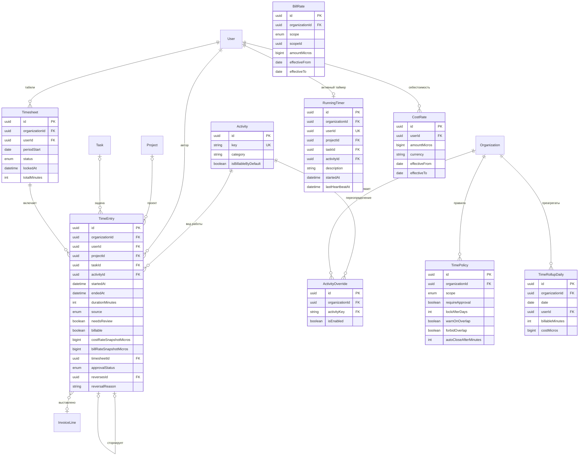

---

### 10. Чат

Все шесть таблиц — **[T]**.

| Сущность | Метка | Ключевые поля | Назначение |
|---|---|---|---|
| `Channel` | [T] | `kind PUBLIC\|PRIVATE\|PROJECT\|DM\|GROUP_DM`, `name?`, `topic?`, `projectId?`, `createdById`, `isArchived`, `memberCount Int`, `readReceiptsEnabled Bool`, `lastMessageAt?`, `dmKey?`, `deletedAt?` | комната |
| `ChannelMember` | [T] | `channelId`, `userId`, `role MEMBER\|ADMIN`, `lastReadMessageId?`, `lastReadAt?`, `unreadCount Int`, `notificationLevel ALL\|MENTIONS\|NONE`, `mutedUntil?`, `joinedAt`, `leftAt?` | членство + **курсор чтения** |
| `Message` | [T] | `channelId`, `authorId`, `body Json`, `plainText`, `parentMessageId?`, `threadReplyCount Int`, `clientNonce`, `editedAt?`, `editHistory Json?`, `pinnedAt?`, `pinnedById?`, `deletedAt?`, `systemKind?` | сообщение |
| `MessageAttachment` | [T] | `messageId`, `fileId`, `orderIndex` | вложения |
| `MessageReaction` | [T] | `messageId`, `userId`, `emoji` | реакции |
| `MessageRead` | [T] | `messageId`, `userId`, `readAt` | построчные «прочитано» — **только там, где включено** |

**Про `clientNonce` и идемпотентность.** Клиент генерирует nonce до отправки; уникальный индекс
`(channel_id, author_id, client_nonce)` превращает повторную отправку (ретрай после таймаута,
переподключение сокета) в конфликт вставки вместо дубликата в ленте. Это единственный надёжный
способ обеспечить exactly-once при ненадёжной сети — на уровне транспорта эта задача не решается.

**Про `Channel.deletedAt`.** Архивация (`isArchived`) и удаление — разные операции с разными
правами (`channel:archive` против опасного `channel:delete`) и разным смыслом: архивный канал
читается и находится поиском, удалённый исчезает из всех выдач. Физическое удаление канала не
подходит: на сообщения ссылаются упоминания, уведомления, поисковый индекс и вложения, а сам факт
«здесь была переписка по проекту» нужен аудиту. Мягкое удаление канала **не** помечает удалёнными
его сообщения — они скрываются вместе с родителем и возвращаются при восстановлении; зачистка
происходит по ретеншну, а не по клику. Все индексы канала получают `WHERE deleted_at IS NULL`,
включая частичный уникальный на `dmKey` — иначе после удаления диалога тех же двух людей нельзя
было бы создать заново.

**Про закрепление: `pinnedAt` + `pinnedById` на сообщении, а не отдельная таблица.** Право
`message:pin` в каталоге есть, а хранить его результат было негде. Закрепление — это состояние
сообщения, а не связь: у одного сообщения ровно одно состояние «закреплено/нет» в пределах своего
канала, поэтому пара колонок выражает его точно, а список закреплённых достаётся частичным
индексом без join. `pinnedById` обязателен рядом с `pinnedAt` — «кто закрепил» это то, что
спрашивают первым, когда в канале появляется чужой пин. Отдельная таблица `MessagePin` понадобилась
бы, если бы пины были персональными («закладки») — это другая фича с другим правом, и её
отсутствие здесь осознанно.

**Про историю редактирования: `editHistory Json`, а не таблица `MessageVersion`.** Выбран JSONB-
массив предыдущих версий (`[{v, body, plainText, editedAt}]`) прямо на сообщении. Обоснование одной
строкой: правки сообщений в чате редки, читаются почти никогда и только целиком вместе с самим
сообщением, поэтому отдельная таблица дала бы лишнюю сущность, лишний индекс и join на **самой
горячей таблице продукта** ради данных, которые всегда запрашиваются вместе с родителем. Развёрнуто:
`Message` — крупнейшая и самая интенсивно пишущаяся таблица, а `MessageVersion` пришлось бы
партиционировать вместе с ней; при этом у версии сообщения нет собственного жизненного цикла
(её нельзя восстановить, прокомментировать или расшарить), в отличие от `DocPageVersion`, где
версия документа — самостоятельный объект с восстановлением и сравнением. Ограничения принимаем
явно: глубина истории ограничена (последние N правок, N в конфиге, старшие вытесняются), поиск
по прежним редакциям не поддерживается, и при необходимости полноценного версионирования это
превращается в таблицу — миграция «JSON → строки» разворачиванием массива тривиальна, обратная
сложнее, поэтому начинаем с более простого варианта.

**Про `dmKey`.** Для `DM` — детерминированный ключ из отсортированной пары `userId`
(`min(a,b) || ':' || max(a,b)`) с уникальным индексом. Гарантирует, что два человека не создадут
два параллельных диалога, кликнув друг на друга одновременно.

**Почему read receipts хранятся построчно только для DM и малых каналов**

Построчный `MessageRead` — это декартово произведение «участники × сообщения». Канал на 200 человек
при 1 000 сообщений в день даёт **200 000 строк в день** только на отметки прочтения — больше, чем
всё остальное содержимое продукта вместе взятое, при том что читает их почти никто.

Поэтому канонический механизм непрочитанного — **курсор** в `ChannelMember`:

- `lastReadMessageId` — сдвигается вперёд при просмотре (одна строка, один `UPDATE` на человека,
  независимо от числа сообщений);
- `unreadCount` — денормализованный счётчик для бейджа в списке каналов, инкрементируемый при
  отправке и обнуляемый при чтении. Он допускает расхождение (гонки, пропущенный сокет) и потому
  периодически пересчитывается фоном из `lastReadMessageId`. Считать его на лету
  (`COUNT(*) WHERE created_at > lastReadAt`) для 50 каналов при каждом открытии приложения — 50
  агрегатов на каждый вход, что дороже редкой сверки.

Построчный `MessageRead` включается точечно — флагом `Channel.readReceiptsEnabled`, который по
умолчанию `true` для `DM`/`GROUP_DM` и для каналов ниже порога участников (порог в конфиге,
ориентир ~20). Причина: «Иван прочитал в 14:32» — это продуктовая ценность именно в личной
переписке; в канале на 200 человек список прочитавших не читает никто, а стоимость линейна.

**Presence — не в PostgreSQL.** Онлайн-статус меняется десятки раз в минуту на человека и живёт
секунды. Его место — Redis с TTL-ключами (`presence:<userId>` + pub/sub на изменения). В Postgres
остаётся единственное поле — `User.lastSeenAt`, записываемое с троттлингом (не чаще раза в
несколько минут). Писать presence в основную БД означало бы постоянный поток `UPDATE` по горячей
таблице `User`, раздувание WAL и бесконечный autovacuum ради данных, которые не переживают
перезапуск.

**Индексы:**

- `idx_messages_channel_created (organization_id, channel_id, created_at DESC)` — **лента канала**,
  главный индекс подсистемы; пагинация — keyset (`WHERE created_at < $cursor`), не `OFFSET`.
- `uq_messages_client_nonce (channel_id, author_id, client_nonce)`.
- `idx_messages_thread (organization_id, parent_message_id, created_at) WHERE parent_message_id IS NOT NULL`.
- `idx_messages_search GIN (to_tsvector('simple', plain_text))`.
- `idx_messages_pinned (organization_id, channel_id, pinned_at DESC) WHERE pinned_at IS NOT NULL`
  — панель закреплённых сообщений канала; частичный и потому крошечный.
- `uq_channels_dm_key (organization_id, dm_key) WHERE dm_key IS NOT NULL AND deleted_at IS NULL`.
- `idx_channels_org_project (organization_id, project_id) WHERE deleted_at IS NULL`,
  `idx_channels_org_activity (organization_id, last_message_at DESC) WHERE NOT is_archived AND deleted_at IS NULL`.
- `uq_channel_members (channel_id, user_id)`,
  `idx_channel_members_user_unread (organization_id, user_id) WHERE unread_count > 0 AND left_at IS NULL`.
- `uq_message_reactions (message_id, user_id, emoji)` — требование модели: один человек не ставит
  одну и ту же эмодзи дважды.
- `uq_message_reads (message_id, user_id)`; `idx_message_reads_user (organization_id, user_id, read_at DESC)`.

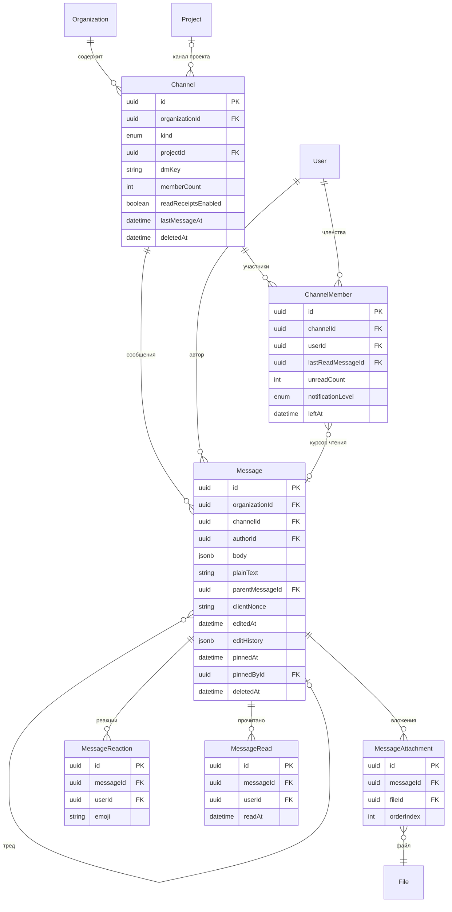

---

### 11. GitHub Actions и интеграция с репозиториями

Все шесть таблиц — **[T]**.

| Сущность | Метка | Ключевые поля | Назначение |
|---|---|---|---|
| `GithubInstallation` | [T] | `providerInstallationId BigInt`, `accountLogin`, `accountType`, `tokenEnc`, `webhookSecretEnc`, `permissions Json`, `suspendedAt?`, `installedById` | установка GitHub App |
| `RepoLink` | [T] | `installationId`, `projectId`, `providerRepoId BigInt`, `owner`, `repoName`, `defaultBranch`, `isActive`, `syncEnabled Bool` | репозиторий ↔ проект |
| `WorkflowRun` | [T] | `repoLinkId`, `providerRunId BigInt`, `runNumber`, `workflowName`, `headBranch`, `headSha`, `event`, `status QUEUED\|IN_PROGRESS\|COMPLETED`, `conclusion SUCCESS\|FAILURE\|CANCELLED\|SKIPPED\|TIMED_OUT?`, `actorLogin`, `startedAt`, `completedAt?`, `durationMs Int?`, `rawPayload Json` | прогон |
| `WorkflowJob` | [T] | `runId`, `providerJobId BigInt`, `name`, `status`, `conclusion?`, `startedAt`, `completedAt?`, `durationMs?`, `runnerLabel`, `stepsSummary Json` | джоб внутри прогона |
| `Deployment` | [T] | `repoLinkId`, `environment`, `ref`, `sha`, `state PENDING\|IN_PROGRESS\|SUCCESS\|FAILURE\|INACTIVE`, `deployedById?`, `runId?`, `url?`, `startedAt`, `finishedAt?` | выкатка |
| `CommitRef` | [T] | `repoLinkId`, `sha`, `taskId?`, `authorLogin`, `authorUserId?`, `message`, `committedAt`, `linkSource MESSAGE\|BRANCH\|PR_TITLE\|MANUAL` | связь коммита с задачей |

**Про хранение секретов интеграции.** `tokenEnc` и `webhookSecretEnc` — шифротекст (симметричное
шифрование ключом приложения из окружения, не E2EE: серверу нужен доступ, чтобы ходить в API).
Открытых токенов в модели нет. Ключ приложения хранится вне БД; ротация ключа — перешифровка
колонок фоновым джобом с `algoVersion`.

**Про `providerRunId` и идемпотентность вебхуков.** GitHub доставляет вебхуки **как минимум один
раз**, то есть дубликаты — норма, а не сбой. Уникальный индекс `(repo_link_id, provider_run_id)`
превращает повторную доставку в `ON CONFLICT DO UPDATE` (обновляем статус) вместо второй строки в
истории. То же для `WorkflowJob` и `Deployment`. `rawPayload` хранится ради возможности пересобрать
данные при изменении парсера — но с TTL, иначе таблица растёт быстрее всей остальной БД.

**Про `CommitRef` и `taskId`.** Связь выводится из текста (`BAD-42` в сообщении коммита, имени ветки
или заголовке PR), поэтому `taskId` нуллабелен, а `linkSource` фиксирует происхождение связи —
чтобы автоматическую догадку можно было отличить от ручной привязки и исправить, не потеряв
остальное. `authorUserId` тоже нуллабелен: коммиттер может не иметь аккаунта в CRM.

**Индексы:** `uq_github_installations_provider (provider_installation_id)`;
`uq_repo_links_org_provider_repo (organization_id, provider_repo_id)`,
`idx_repo_links_project (organization_id, project_id)`;
`uq_workflow_runs_provider (repo_link_id, provider_run_id)`,
`idx_workflow_runs_repo_started (organization_id, repo_link_id, started_at DESC)`,
`idx_workflow_runs_branch (organization_id, repo_link_id, head_branch, started_at DESC)`,
`idx_workflow_runs_failed (organization_id, started_at DESC) WHERE conclusion = 'FAILURE'` —
дашборд «красные сборки»;
`uq_workflow_jobs_provider (run_id, provider_job_id)`;
`idx_deployments_env (organization_id, repo_link_id, environment, started_at DESC)`;
`uq_commit_refs (repo_link_id, sha)`, `idx_commit_refs_task (organization_id, task_id) WHERE task_id IS NOT NULL`.

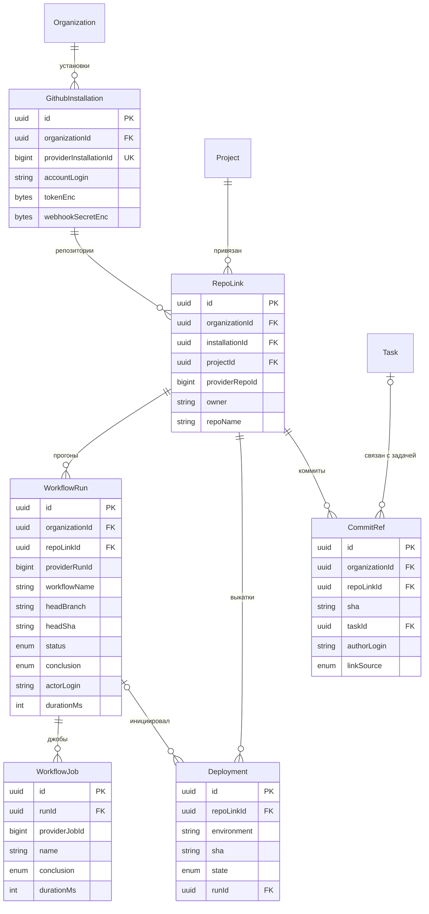

### 12. AI

Все семь таблиц — **[T]**. Каждая организация приносит свои ключи (BYOK) — это self-hosted продукт,
централизованного биллинга за токены нет.

| Сущность | Метка | Ключевые поля | Назначение |
|---|---|---|---|
| `AIProvider` | [T] | `kind ANTHROPIC\|OPENAI\|OPENAI_COMPAT\|OPENROUTER`, `name`, `baseUrl?`, `apiKeyEnc`, `apiKeyTail` (последние 4 символа), `modelChat`, `modelEmbed?`, `maxTokens`, `isActive`, `isDefault`, `isEmbeddingsDefault`, `monthlyBudgetMicros?` | подключение к LLM |
| `AIThread` | [T] | `scopeType PROJECT\|TASK\|DOC\|KB\|GLOBAL`, `scopeId?`, `title`, `createdById`, `providerId`, `systemPromptOverride?`, `lastMessageAt`, `deletedAt?` | диалог |
| `AIMessage` | [T] | `threadId`, `role USER\|ASSISTANT\|SYSTEM\|TOOL`, `content Text`, `promptTokens Int`, `completionTokens Int`, `costMicroUsd BigInt`, `latencyMs Int`, `model`, `toolCalls Json?`, `finishReason`, `errorCode?` | реплика |
| `AIUsageDaily` | [T] | `date`, `providerId`, `userId?`, `model`, `requestCount`, `promptTokens BigInt`, `completionTokens BigInt`, `costMicroUsd BigInt`, `errorCount` | преагрегат расхода |
| `Embedding` | [T] | **полиморфная**: `entityType`, `entityId`, `chunkIndex`, `chunkText`, `vector vector(1536)`, `model`, `contentHash`, `tokenCount` | семантический поиск |
| `AIToolPolicy` | [T] | `toolKey`, `isEnabled`, `requiresConfirmation Bool`, `allowedRoleIds`, `maxCallsPerDay?`, `scope ORG\|PROJECT`, `scopeId?` | что AI может делать |
| `AIRateLimit` | [T] | `scope USER_DAY\|ORG_MONTH`, `userId?`, `periodStart Date`, `requestCount Int`, `promptTokens BigInt`, `completionTokens BigInt`, `costMicroUsd BigInt`, `limitRequests Int?`, `limitCostMicroUsd BigInt?`, `blockedAt?`, `updatedAt` | счётчики и жёсткий стоп |

**Про `apiKeyEnc` + `apiKeyTail`.** Ключ хранится только зашифрованным; `apiKeyTail` — последние 4
символа открытым текстом, чтобы в UI можно было отличить «тот самый ключ» (`sk-…f3a9`) без
расшифровки. Показывать ключ целиком после сохранения интерфейс не умеет — только заменить.
При появлении ключа в логах/сообщении срабатывает правило учёта утечек.

**Про `isDefault` и `isEmbeddingsDefault` раздельно.** Модель для чата и модель для эмбеддингов —
разные решения: чат может идти в Anthropic, а эмбеддинги в локальный OpenAI-совместимый сервер.
Уникальность обеспечивается частичными индексами: `WHERE is_default` и `WHERE is_embeddings_default`
— по одному дефолту каждого вида на организацию, гарантировано БД.

**Про `costMicroUsd`.** Стоимость считается на нашей стороне из токенов и прайса модели и
фиксируется **в момент запроса**. Пересчитывать задним числом по текущему прайсу нельзя — история
расходов перестала бы сходиться. Валюта прибита к USD (все провайдеры считают в ней), поэтому
отдельная колонка `currency` здесь избыточна — это единственное осознанное исключение из правила
«сумма всегда с валютой», и оно зафиксировано именно здесь, чтобы не выглядеть недосмотром.

**Про `AIRateLimit` — почему счётчики в PostgreSQL, а не только в Redis.** Риск `R-07`
(«неконтролируемая стоимость AI», см. [`../product/prd.md`](../product/prd.md)) требует **жёсткого
стопа** при исчерпании лимита, а не отчёта постфактум. Жёсткий стоп — это утверждение о деньгах,
и оно не может опираться на хранилище, которое честно объявляет себя эфемерным: перезапуск Redis
на self-host инсталляции (обновление, `docker compose down`, вытеснение по `maxmemory`) обнуляет
счётчик, и месячный лимит организации начинает считаться заново — ровно тот сценарий выжигания
бюджета, ради которого лимит вводился. Поэтому:

- **PostgreSQL — источник правды.** `AIRateLimit` — строка на (`scope`, `userId`, `periodStart`),
  инкрементируемая `INSERT … ON CONFLICT DO UPDATE SET request_count = ai_rate_limits.request_count
  + 1, …` **в той же транзакции**, что и запись `AIMessage`. Атомарность даёт та же гарантия, что и
  у outbox: расход и его учёт не разъезжаются при падении между вызовом провайдера и записью.
- **Redis — кеш и быстрый отказ.** Проверка «лимит уже исчерпан?» на горячем пути идёт в Redis
  (ключ с TTL до конца периода), чтобы не ходить в базу на каждый токен стриминга. Кеш заполняется
  из БД и инвалидируется при обновлении строки; при недоступности Redis проверка деградирует на
  прямой запрос к PostgreSQL, а не пропускает запрос — **fail-closed**.
- `blockedAt` фиксирует момент срабатывания стопа, чтобы UI показывал «лимит исчерпан с 14:20», а
  аудит и уведомление администратору происходили один раз, а не на каждую отклонённую попытку.
- Отличие от `AIUsageDaily`: тот — **преагрегат для отчётов** (по провайдеру, модели, дню, допускает
  расхождение и пересчёт), этот — **счётчик для принятия решения** (по субъекту и периоду лимита,
  расхождений не допускает). Совмещать их нельзя: у отчёта и у контроля разные ключи агрегации и
  разные требования к точности.
- `limitRequests` / `limitCostMicroUsd` лежат на строке снапшотом действующего лимита, а не читаются
  из настроек при каждой проверке: изменение лимита администратором не должно задним числом
  «разблокировать» уже заблокированный период или наоборот.

**Про `Embedding` и pgvector.** Вектор `vector(1536)` живёт **рядом с реляционными данными**, а не в
отдельной векторной БД: объёмы self-host инсталляции (десятки-сотни тысяч чанков) полностью
покрываются pgvector, а вынос означал бы второй сторедж, вторую консистентность и вторую систему
резервного копирования ради нулевой выгоды. Индекс — HNSW
(`USING hnsw (vector vector_cosine_ops)`): дороже при построении, но качественно лучше IVFFlat на
неравномерных данных и не требует переобучения при росте.

`contentHash` от исходного чанка позволяет не перегенерировать эмбеддинг при сохранении документа
без изменения текста — прямая экономия денег и времени. Размерность `1536` жёстко зашита в тип
колонки; смена модели эмбеддингов на другую размерность — это миграция с пересчётом всей таблицы
(см. «Открытые вопросы»).

**Индексы:** `uq_ai_providers_default (organization_id) WHERE is_default`,
`uq_ai_providers_embed_default (organization_id) WHERE is_embeddings_default`;
`idx_ai_threads_scope (organization_id, scope_type, scope_id, last_message_at DESC)`;
`idx_ai_messages_thread (thread_id, created_at)`;
`uq_ai_usage_daily (organization_id, date, provider_id, user_id, model)`;
`uq_ai_rate_limits (organization_id, scope, user_id, period_start)` — ключ upsert-инкремента,
`idx_ai_rate_limits_blocked (organization_id) WHERE blocked_at IS NOT NULL` — «кто сейчас
заблокирован»;
`uq_embeddings_chunk (organization_id, entity_type, entity_id, chunk_index)`,
`idx_embeddings_vector USING hnsw (vector vector_cosine_ops)`,
`idx_embeddings_entity (organization_id, entity_type, entity_id)` — для инвалидации при изменении
исходной сущности.

> **Важно про векторный поиск и RLS:** HNSW-индекс не «знает» о тенантах, поэтому запрос
> `ORDER BY vector <=> $1 LIMIT 10` под RLS сначала достаёт ближайших соседей по **всему** индексу,
> а потом отфильтровывает чужие строки — можно получить меньше результатов, чем просили. Решение:
> всегда выбирать с запасом (`LIMIT k * 4`) и дофильтровывать, либо (при росте) партиционировать
> `embeddings` по `organization_id`. Зафиксировано как известное ограничение MVP.

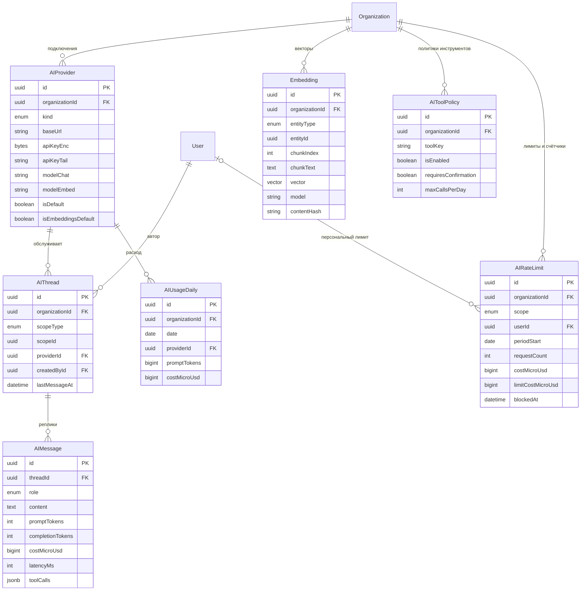

---

### 13. Проектное лидерство — клиенты, контракты, деньги, ритм

Все восемнадцать таблиц — **[T]**. Это слой, ради которого CRM отличается от таск-трекера: он
связывает потраченное время с деньгами и обязательствами перед заказчиком.

`Milestone` принадлежит контексту **`delivery`**, а не `project`: её жизненный цикл определяется
приёмкой со стороны заказчика (`contractId`, `acceptedByContactId`, `amountMicros`, `invoiceId`), а
не структурой работ. *Канон — владелец `Milestone` это `delivery`; [`overview.md`](overview.md)
приведён в соответствие 2026-07-26.*

**Клиенты и контракты**

| Сущность | Метка | Ключевые поля |
|---|---|---|
| `Client` | [T] | `name`, `legalName`, `taxId`, `country`, `defaultCurrency`, `status LEAD\|ACTIVE\|PAUSED\|CHURNED`, `ownerId` (аккаунт-менеджер), `website`, `notes`, `deletedAt?` |
| `ClientContact` | [T] | `clientId`, `fullName`, `email`, `phone`, `role`, `isPrimary Bool`, `userId?` (если у контакта есть аккаунт) |
| `Contract` | [T] | `clientId`, `projectId?`, `number`, `kind T_AND_M\|FIXED_PRICE\|RETAINER`, `status DRAFT\|ACTIVE\|SUSPENDED\|COMPLETED\|TERMINATED`, `startsAt`, `endsAt?`, `capAmountMicros BigInt?`, `currency`, `paymentTermsDays Int`, `ndaSigned Bool`, `ndaSignedAt?`, `ndaExpiresAt?`, `ndaFileId?`, `signedFileId?` |
| `ContractRate` | [T] | `contractId`, `userId?`, `roleKey?`, `activityId?`, `amountMicros`, `currency`, `effectiveFrom`, `effectiveTo?` |

`capAmountMicros` — потолок по контракту (актуально для T&M): превышение блокирует выставление и
поднимает алерт. NDA живёт полями прямо на контракте, а не отдельной сущностью: у NDA нет
самостоятельного жизненного цикла в продукте, только факт подписания, срок и файл.

**Деньги**

| Сущность | Метка | Ключевые поля |
|---|---|---|
| `Invoice` | [T] | `clientId`, `contractId?`, `number` (уникален в организации), `status DRAFT\|SENT\|PARTIAL\|PAID\|OVERDUE\|VOID`, `issuedAt`, `dueAt`, `periodStart/periodEnd`, `subtotalMicros`, `taxMicros`, `totalMicros`, `paidMicros`, `currency`, `fxRateMicros`, `notes`, `pdfFileId?`, `sentAt?`, `voidedAt?`, `voidReason?` |
| `InvoiceLine` | [T] | `invoiceId`, `description`, `quantityMilli Int` (тысячные единицы), `unitPriceMicros`, `amountMicros`, `taxRateBp Int`, `projectId?`, `activityId?`, `sourceTimeEntryIds Uuid[]`, `orderIndex` |
| `Payment` | [T] | `invoiceId`, `amountMicros`, `currency`, `paidAt`, `method BANK\|CARD\|CRYPTO\|CASH\|OTHER`, `reference`, `notes`, `recordedById` |
| `Budget` | [T] | `projectId`, `contractId?`, `kind HOURS\|MONEY`, `amountMicros?`, `hoursLimit Int?`, `periodStart/periodEnd?`, `alertThresholdPct Int`, `consumedMicros`, `consumedMinutes`, `lastAlertAt?` |
| `BudgetPlanPoint` | [T] | `budgetId`, `periodStart Date`, `periodEnd Date`, `plannedMicros BigInt?`, `plannedMinutes Int?`, `cumulativeMicros BigInt?`, `cumulativeMinutes Int?`, `note?`, `createdById` |
| `InvoiceNumberSequence` | [T] | `scopeKey` (`default` либо `clientId`/`contractId`), `template` (`INV-{YYYY}-{NNNN}`), `nextValue Int`, `resetPeriod NEVER\|YEAR\|MONTH`, `lastResetAt?`, `padding Int` |

**Про `sourceTimeEntryIds Uuid[]`.** Массив вместо join-таблицы `InvoiceLineTimeEntry` — осознанный
компромисс. Обоснование: связь используется ровно в двух сценариях (показать «из чего собралась
строка» и не выставить те же часы дважды), обратный запрос «в каком инвойсе моя запись времени»
решается полем `TimeEntry.invoiceLineId` (оно и есть авторитетная сторона связи), а массив служит
денормализованным снимком состава строки на момент выставления. GIN-индекс по массиву закрывает
поиск. Плата — отсутствие FK внутри массива; целостность проверяется тем же nightly-джобом, что и
полиморфные связи. Если состав строк начнёт требовать атрибутов (например, скидка на конкретную
запись), это станет полноценной join-таблицей.

**Про статусы инвойса.** `OVERDUE` — **вычисляемый** статус (`dueAt < now() AND status IN (SENT,
PARTIAL)`), но он материализуется джобом, чтобы список «просроченные» был индексным запросом и
чтобы момент перехода можно было зафиксировать в аудите и уведомлениях. `VOID` вместо удаления:
выставленный документ не удаляется никогда.

**Про `BudgetPlanPoint` — план рядом с фактом.** `Budget` хранит только факт (`consumedMicros`,
`consumedMinutes`) и общий потолок. Этого достаточно для алерта «израсходовано 80 %», но
недостаточно для главного вопроса руководителя проекта: **«мы идём по плану или горим?»**. Ответ
требует ожидаемого расхода **по периодам** — burn-down/burn-up строится сравнением накопленного
факта с накопленным планом на ту же дату, а без плановой кривой «потрачено 60 % бюджета» не значит
ничего, пока не известно, 30 % или 90 % срока прошло.

Поэтому план — отдельные строки, а не колонки на `Budget`:

- периодов произвольное число (неделя, месяц, спринт — как решил проект), и вкладывать их в JSONB
  нельзя, потому что по ним строятся агрегаты и сравнения;
- план **пересматривается** (перепланирование в середине проекта), и строка с датой правки — это
  история решений, тогда как перезапись колонки её теряет;
- `cumulativeMicros`/`cumulativeMinutes` хранятся денормализованно рядом с периодным значением,
  чтобы график рисовался одним запросом без оконных функций по всей истории.

`plannedMicros` и `plannedMinutes` нуллабельны симметрично `Budget.kind`: денежный бюджет заполняет
первое, часовой — второе. CHECK: `ck_budget_plan_points_value CHECK (num_nonnulls(planned_micros,
planned_minutes) = 1)` и `ck_budget_plan_points_period CHECK (period_end > period_start)`;
непересечение периодов внутри одного бюджета — `EXCLUDE USING gist (budget_id WITH =,
daterange(period_start, period_end, '[)') WITH &&)`, по той же причине, что и у ставок: два
плановых значения на одну дату делают график неопределённым.

**Про `InvoiceNumberSequence` — нумерация счетов.** `uq_invoices_org_number` гарантирует
уникальность номера, но не отвечает на вопрос, **какой номер выдать следующему счёту**. Брать
`max(number) + 1` нельзя: номер не число, а форматированная строка (`INV-2026-0042`), сравнение
строк даст неверный порядок при смене года, а параллельное выставление двух счетов вернёт один и тот
же максимум обоим. PostgreSQL `SEQUENCE` тоже не подходит — она глобальна, не сбрасывается по годам
и оставляет дыры при откате транзакции, а пропущенный номер в бухгалтерском документе объясняется
налоговой, а не в git blame.

Поэтому — строка-счётчик на организацию (и, при необходимости, на клиента или контракт), из которой
номер берётся тем же приёмом, что и `Project.taskCounter`: `UPDATE invoice_number_sequences SET
next_value = next_value + 1 WHERE … RETURNING next_value` в **той же транзакции**, что и вставка
инвойса. `template` описывает формат (`{YYYY}`, `{MM}`, `{NNNN}` с `padding`), `resetPeriod`
— когда счётчик начинается заново; смена шаблона не переписывает уже выставленные документы, потому
что номер физически хранится на `Invoice`. Строка `scopeKey = 'default'` создаётся при bootstrap
организации, чтобы первый же счёт не требовал настройки.

**Ритм проекта**

| Сущность | Метка | Ключевые поля |
|---|---|---|
| `Sprint` | [T] | `projectId`, `name`, `goal`, `startsAt`, `endsAt`, `status PLANNED\|ACTIVE\|COMPLETED\|CANCELLED`, `capacityHours Int`, `committedPoints?`, `completedPoints?`, `retroNotes?` |
| `Milestone` | [T] | `projectId`, `contractId?`, `name`, `description`, `dueAt`, `status PENDING\|IN_REVIEW\|ACCEPTED\|REJECTED`, `acceptedAt?`, `acceptedByContactId?`, `acceptanceNote?`, `amountMicros?`, `invoiceId?`, `acceptanceFileId?` |
| `Call` | [T] | `projectId?`, `clientId?`, `title`, `kind STANDUP\|PLANNING\|REVIEW\|RETRO\|DISCOVERY\|DEMO\|CLIENT\|ONE_ON_ONE`, `agenda?`, `startedAt`, `endedAt?`, `timezone`, `location`, `recordingFileId?`, `transcriptFileId?`, `organizerId` |
| `CallParticipant` | [T] | `callId`, `userId?`, `clientContactId?`, `attended Bool`, `role ORGANIZER\|REQUIRED\|OPTIONAL` |
| `CallSummary` | [T] | `callId`, `summaryMd Text`, `keyPoints Json`, `generatedBy AI\|HUMAN`, `aiThreadId?`, `approvedById?`, `approvedAt?` |
| `ActionItem` | [T] | `sourceType CALL\|MILESTONE\|RISK\|MANUAL`, `sourceId?`, `title`, `assigneeId?`, `dueAt?`, `status OPEN\|DONE\|CANCELLED`, `taskId?` (если превратилось в задачу), `createdById` |
| `ProjectRisk` | [T] | `projectId`, `title`, `description`, `probability LOW\|MEDIUM\|HIGH`, `impact LOW\|MEDIUM\|HIGH`, `severityScore Int` (генерируемая колонка), `status OPEN\|MITIGATED\|ACCEPTED\|CLOSED`, `ownerId`, `mitigationPlan`, `reviewedAt?` |
| `Stakeholder` | [T] | `projectId`, `userId?`, `clientContactId?`, `influence LOW\|MEDIUM\|HIGH`, `interest LOW\|MEDIUM\|HIGH`, `communicationPreference`, `notes` |

`Milestone` — точка приёмки заказчиком, а не внутренняя веха: у неё есть `acceptedByContactId`
(кто со стороны клиента принял), файл акта и опциональная привязка к инвойсу — для fixed-price
контрактов приёмка вехи и есть событие выставления счёта. `acceptanceNote` — текст решения о
приёмке: он обязателен при `status = REJECTED` (`ck_milestones_rejection_note CHECK (status <>
'REJECTED' OR acceptance_note IS NOT NULL)`) по той же логике, что и `reason` у оверрайда прав —
отказ без причины через месяц невозможно ни оспорить, ни исправить; при `ACCEPTED` он
опционален и хранит оговорки заказчика («принято с замечаниями по пункту 3»), которые иначе
теряются, потому что файл акта — скан, а не текст.

**Про `Call.kind` — канон перечня.** `STANDUP | PLANNING | REVIEW | RETRO | DISCOVERY | DEMO |
CLIENT | ONE_ON_ONE`. Сведено из двух расходившихся списков: `DAILY|PLANNING|REVIEW|RETRO|CLIENT|
ONE_ON_ONE` (этот документ) и `DISCOVERY|DEMO|STANDUP|RETRO|SALES` (EPIC-044).
*Приведено в соответствие 2026-07-26.* Решения внутри: `DAILY` → `STANDUP` (ежедневная встреча
бывает не ежедневной, а формат называется именно так), `DISCOVERY` и `DEMO` добавлены — это разные
события с разным составом участников и разной ценностью для истории проекта, `SALES` **исключён**,
потому что продажи как воронка лежат в Won't-списке 1.0 ([`../product/prd.md`](../product/prd.md)):
встреча с потенциальным заказчиком описывается парой `CLIENT` + `Client.status = LEAD`, и заводить
под неё тип enum значило бы начать строить sales-CRM с краю.

**Про `Call.timezone` и `Call.agenda`.** `startedAt` — `timestamptz` в UTC, как всё в модели, но
для созвона этого мало: встреча назначается **в конкретной таймзоне** («каждый вторник в 10:00 по
Берлину»), и при переходе на летнее время UTC-момент сдвигается, а договорённость — нет. Хранение
таймзоны рядом с моментом — единственный способ корректно показать серию встреч и не устроить
клиенту звонок на час раньше дважды в год; это ровно та же причина, по которой `timezone` есть у
`TimeEntry`. `agenda` — повестка, заполняемая **до** встречи, в отличие от `CallSummary`, который
пишется после: без неё повестка живёт в теле приглашения, то есть вне продукта, и не попадает ни в
поиск, ни в контекст AI-резюме.

`ProjectRisk.severityScore` — генерируемая колонка (`GENERATED ALWAYS AS`) из вероятности и
влияния: сортировка рисков не должна зависеть от того, посчитал ли её клиент.

**Индексы:** `idx_clients_org_status (organization_id, status) WHERE deleted_at IS NULL`;
`uq_client_contacts_primary (client_id) WHERE is_primary`;
`uq_contracts_org_number (organization_id, number)`,
`idx_contracts_org_client_status (organization_id, client_id, status)`,
`idx_contracts_nda_expiry (organization_id, nda_expires_at) WHERE nda_signed`;
`uq_invoices_org_number (organization_id, number)`,
`idx_invoices_org_status_due (organization_id, status, due_at)`,
`idx_invoices_overdue (organization_id, due_at) WHERE status IN ('SENT','PARTIAL')`;
`idx_invoice_lines_invoice (invoice_id, order_index)`,
`idx_invoice_lines_time_entries GIN (source_time_entry_ids)`;
`uq_invoice_number_sequences (organization_id, scope_key)`;
`idx_payments_invoice (invoice_id, paid_at)`;
`idx_budgets_project (organization_id, project_id)`;
`uq_budget_plan_points (budget_id, period_start)`,
`idx_budget_plan_points_budget (organization_id, budget_id, period_start)` — построение кривой плана
одной сортировкой;
`idx_sprints_project_dates (organization_id, project_id, starts_at DESC)`,
`uq_sprints_active (project_id) WHERE status = 'ACTIVE'` — один активный спринт на проект;
`idx_milestones_project_due (organization_id, project_id, due_at)`;
`idx_calls_project_started (organization_id, project_id, started_at DESC)`;
`uq_call_participants (call_id, user_id)`;
`idx_action_items_assignee_open (organization_id, assignee_id) WHERE status = 'OPEN'`;
`idx_project_risks_open (organization_id, project_id, severity_score DESC) WHERE status = 'OPEN'`.

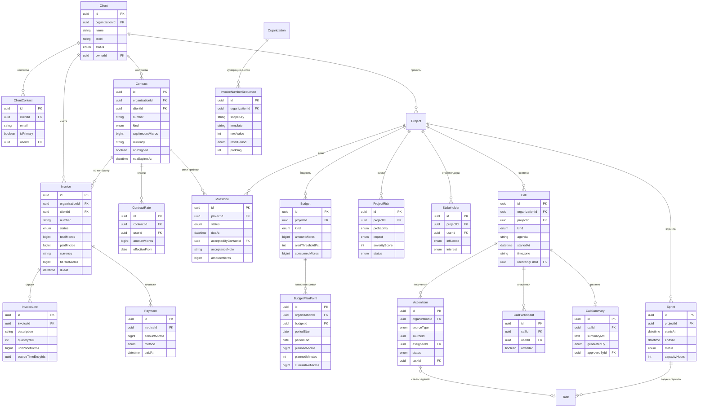

---

### 14. Кроссрезка — аудит, уведомления, outbox, состояние индекса

Все пять таблиц — **[T]**.

| Сущность | Метка | Ключевые поля | Особенности |
|---|---|---|---|
| `AuditLog` | [T] | `actorId?`, `actorType USER\|SYSTEM\|API_KEY\|INTEGRATION`, `action`, `resourceType`, `resourceId?`, `before Json?`, `after Json?`, `ipHash`, `userAgent`, `requestId`, `severity`, `occurredAt` | **append-only**, партиционирована по месяцам |
| `Notification` | [T] | `userId`, `kind NotificationKind` (**enum**), `title`, `body`, `entityType?`, `entityId?`, `actorId?`, `dedupeKey?`, `groupKey?`, `count Int`, `readAt?`, `deliverAfter?`, `deliveredAt?`, `deliveredChannels String[]`, `createdAt`, `updatedAt` | лента уведомлений |
| `NotificationPreference` | [T] | `userId`, `kind NotificationKind`, `inApp Bool`, `email Bool`, `push Bool`, `digestFrequency INSTANT\|HOURLY\|DAILY\|NEVER`, `quietHoursStart/End?`, `quietHoursTimezone?` | настройки |
| `OutboxEvent` | [T] | `aggregateType`, `aggregateId`, `eventType`, `payload Json`, `status PENDING\|PROCESSING\|SENT\|FAILED\|DEAD`, `attempts Int`, `availableAt`, `lockedBy?`, `lockedAt?`, `lastError?`, `createdAt`, `processedAt?` | transactional outbox |
| `SearchIndexState` | [T] | `entityType`, `lastIndexedAt?`, `lastIndexedEventId?`, `lagSeconds Int`, `docCount Int`, `pendingCount Int`, `lastFullReindexAt?`, `lastFullReindexById?`, `status HEALTHY\|CATCHING_UP\|DEGRADED\|REBUILDING`, `lastError?`, `updatedAt` | состояние и отставание индексации |

**Про `AuditLog` как append-only.** На таблице выполняется
`REVOKE UPDATE, DELETE ON audit_logs FROM app_user` — приложение физически не может ни изменить, ни
удалить запись аудита, даже при полной компрометации кода приложения. Это принципиальный момент:
аудит, который приложение может переписать, аудитом не является. Права на `INSERT` и `SELECT`
остаются. Удаление старых партиций по политике хранения — прерогатива `app_migrator`
(`DETACH PARTITION` + архивация), то есть отдельной операции с отдельными правами.

Партиционирование — `RANGE` по `occurred_at` с месячными партициями. Причины: аудит растёт быстрее
всех остальных таблиц, ретеншн реализуется через `DROP`/`DETACH PARTITION` (мгновенно) вместо
`DELETE` на миллионах строк (часы блокировок и раздувание таблицы), а запросы по аудиту почти
всегда ограничены периодом, так что pruning отсекает всё лишнее.

**Про `OutboxEvent` — transactional outbox.** Событие записывается **в той же транзакции**, что и
доменное изменение. Это единственный способ гарантировать, что «задача перемещена» и «уведомление
об этом отправлено» не разъедутся при падении между коммитом и публикацией в очередь. Воркер
забирает пачку:

```
UPDATE outbox_events SET status='PROCESSING', locked_by=$worker, locked_at=now()
WHERE id IN (
  SELECT id FROM outbox_events
  WHERE status='PENDING' AND available_at <= now()
  ORDER BY available_at
  FOR UPDATE SKIP LOCKED LIMIT 100
) RETURNING *;
```

`FOR UPDATE SKIP LOCKED` — ключевая деталь: несколько воркеров разбирают очередь параллельно, не
блокируя друг друга и не обрабатывая одно событие дважды. `availableAt` реализует экспоненциальный
backoff при ретраях, `attempts` — переход в `DEAD` после порога (dead letter, разбирается вручную).
Доставка — **at-least-once**, поэтому потребители обязаны быть идемпотентными.

**Важно:** воркер, читающий outbox, обязан выставлять tenant-контекст на **каждое** событие
отдельно — см. путь №3 в разделе про RLS.

**Про `Notification.kind` — закрытый enum, а не свободная строка.** Раньше поле было строкой, и это
противоречит правилу выбора из раздела «Enum в Prisma vs строка/справочник»: список видов
уведомлений задаётся **кодом** (уведомление существует, потому что есть породивший его use-case),
тенант не может изобрести новый вид, и на это же значение ссылается `NotificationPreference.kind` —
то есть опечатка в строке молча создаёт уведомление, которое ни одна настройка не выключает и ни
один пользователь не отфильтрует. `NotificationKind` — Prisma enum (`TASK_ASSIGNED`,
`TASK_MENTIONED`, `COMMENT_REPLY`, `MESSAGE_MENTION`, `TIMESHEET_SUBMITTED`, `TIMESHEET_REJECTED`,
`INVOICE_OVERDUE`, `BUDGET_THRESHOLD`, `MILESTONE_DUE`, `VAULT_SHARED`, `CI_FAILED`, … — полный
список в коде, БД принимает только его). Симметрия с `NotificationPreference` даёт бесплатный
инвариант: настройка существует ровно для тех видов, которые продукт умеет отправлять.

**Про `dedupeKey`, `groupKey` и `count`.** Три разных механизма против трёх разных видов шума:

- **`dedupeKey` — идемпотентность доставки.** Уникален частичным индексом среди непрочитанных;
  повторная попытка создать уведомление с тем же ключом (ретрай воркера outbox — доставка
  **at-least-once**, помните) не создаёт вторую строку, а обновляет `updatedAt`. Без него первый же
  перезапуск воркера показывает пользователю два одинаковых уведомления, и он перестаёт им верить.
  Формируется детерминированно из (`userId`, `kind`, `entityType`, `entityId`, версия события).
- **`groupKey` + `count` — схлопывание однотипных.** Пять человек отреагировали на сообщение — это
  одна строка «5 реакций на ваше сообщение» (`count = 5`), а не пять строк. Инкремент —
  `INSERT … ON CONFLICT (group_key) WHERE read_at IS NULL DO UPDATE SET count = count + 1,
  updated_at = now()`. Ключ группировки шире дедупликационного: он не включает актора, поэтому
  разные люди попадают в одну группу. Прочтение закрывает группу — следующее событие начинает новую
  строку с `count = 1`, иначе счётчик рос бы вечно.
- Оба поля нуллабельны: уведомление, которое не дедуплицируется и не группируется (личное сообщение
  от руководителя), остаётся обычной строкой.

**Про отложенную доставку и тихие часы.** `deliverAfter` — момент, **раньше которого уведомление не
уходит по внешним каналам** (email, push). Уведомление создаётся сразу — оно должно быть в ленте
в приложении немедленно, лента это не доставка, — но воркер доставки выбирает только строки с
`deliver_after IS NULL OR deliver_after <= now()`. Момент вычисляется при создании из
`NotificationPreference.quietHoursStart/End` и таймзоны получателя; `deliveredAt` фиксирует
фактическую отправку и отличает «ещё не время» от «отправлено».

Ключевая деталь — **чья таймзона**. Тихие часы «22:00–08:00» бессмысленны без ответа на вопрос
«по какому времени», и брать серверное время нельзя: у self-host инсталляции сервер стоит там, где
стоит, а команда бывает распределённой. Порядок разрешения: `NotificationPreference.
quietHoursTimezone` (явно выбранная для уведомлений) → `EmployeeProfile.timezone` (рабочая) →
`User.timezone` (личная, см. группу 1) → `Organization.timezone`. Именно ради последних двух звеньев
`timezone` добавлен на `User`: получатель уведомления не обязан быть сотрудником.

Тихие часы **не** откладывают всё подряд: у `NotificationKind` есть признак «срочное»
(инцидент CI, исчерпание лимита AI, попытка входа), которое уходит немедленно. Список срочных видов
живёт в коде рядом с enum, а не настраивается тенантом, — иначе первое же «отключу всё» превратит
security-уведомления в тишину.

**Про `SearchIndexState`.** Состояние индекса живёт в Meilisearch, но **знание о состоянии** должно
жить в PostgreSQL: строка на (`organizationId`, `entityType`) с отметкой последнего
проиндексированного события, отставанием, числом документов и статусом. Без неё держать эти данные
негде, кроме памяти воркера, а значит: индикатор «поиск догоняет, результаты могут быть неполными»
нечем питать (а показывать его обязательно — иначе пользователь считает пустую выдачу правдой,
см. `T-PLAT-04` в [`../security/threat-model.md`](../security/threat-model.md)); отчёт
reconciliation не с чем сравнивать; после перезапуска воркер не знает, с какого места продолжать, и
единственный доступный ответ — полная переиндексация.

Почему таблица, а не Redis: это состояние переживает перезапуск по определению своей задачи, и оно
tenant-scoped — на общей инсталляции одна организация может догонять индекс, пока у остальных всё
в порядке, и смешивать эти состояния в одном глобальном ключе нельзя. Обновляется воркером
индексации после каждой пачки (один `UPDATE` на пачку, не на документ), `lagSeconds` считается как
разница между `now()` и временем последнего обработанного события. `status` — производный от
`lagSeconds` и `lastError`, материализуется тем же апдейтом, чтобы фронт не считал пороги сам.
Строка `pendingCount` берётся из счётчика необработанных событий индексации в outbox.

**Индексы:**

- `idx_audit_logs_org_occurred (organization_id, occurred_at DESC)` — на каждой партиции.
- `idx_audit_logs_resource (organization_id, resource_type, resource_id, occurred_at DESC)`.
- `idx_audit_logs_actor (organization_id, actor_id, occurred_at DESC)`.
- `idx_notifications_user_unread (organization_id, user_id, created_at DESC) WHERE read_at IS NULL`
  — счётчик и лента непрочитанного; частичный, потому что прочитанные никого не интересуют.
- `uq_notifications_dedupe (user_id, dedupe_key) WHERE dedupe_key IS NOT NULL AND read_at IS NULL`
  — идемпотентность создания; ограничен непрочитанными, иначе повтор того же события через месяц
  не создал бы уведомления вообще.
- `uq_notifications_group (user_id, group_key) WHERE group_key IS NOT NULL AND read_at IS NULL`
  — цель `ON CONFLICT` при схлопывании однотипных.
- `idx_notifications_deliver (deliver_after) WHERE delivered_at IS NULL` — очередь отложенной
  доставки (тихие часы); воркер читает только её.
- `uq_notification_preferences (user_id, kind)`.
- `idx_outbox_pending (status, available_at) WHERE status IN ('PENDING','FAILED')` — **узкий
  частичный индекс**: обработанные события (99 % таблицы) в него не входят, поэтому опрос очереди
  остаётся дешёвым независимо от размера истории.
- `idx_outbox_aggregate (organization_id, aggregate_type, aggregate_id, created_at)`.
- `idx_outbox_stuck (locked_at) WHERE status = 'PROCESSING'` — поиск зависших после падения воркера.
- `uq_search_index_state (organization_id, entity_type)` — одна строка состояния на тип сущности;
  `idx_search_index_state_lag (status, lag_seconds DESC) WHERE status <> 'HEALTHY'` — дашборд
  «где поиск отстаёт» без скана по всем арендаторам.

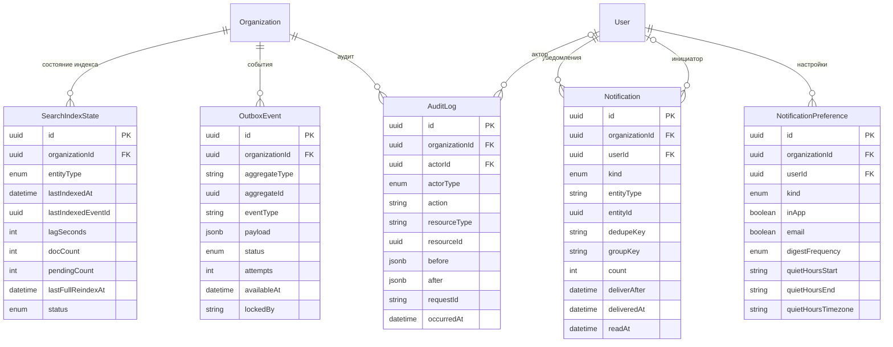

---

### 15. Дашборды, представления и онбординг

Все восемь таблиц — **[T]**, tenant-scoped, под общей RLS-политикой по `organizationId`.

Группа закрывает домены ТЗ 12 (дашборды и drill-down), 13 (сохранённые представления списков) и
17 (онбординг и материалы). Отдельная группа, а не «по кусочку в каждую», потому что все три
подсистемы описывают **не доменные факты, а способ их показать**: раскладку, сохранённый фильтр,
маршрут ознакомления. Смешивать их с фактами (`Task`, `TimeEntry`) нельзя — иначе изменение UI
начинает требовать миграции доменных таблиц.

| Сущность | Метка | Ключевые поля | Назначение |
|---|---|---|---|
| `Dashboard` | [T] | `ownerUserId?`, `scope PERSONAL\|TEAM\|ORGANIZATION`, `teamId?`, `name`, `isDefault Bool`, `layout Json`, `createdById`, `deletedAt?` | набор карточек |
| `DashboardCard` | [T] | `dashboardId`, `cardKey` (ключ из реестра карточек в коде), `orderKey`, `size SMALL\|MEDIUM\|LARGE\|FULL`, `settings Json` | карточка на дашборде |
| `DashboardCardState` | [T] | `dashboardCardId`, `userId`, `state Json` (свёрнута, выбранный период, локальный фильтр) | персональное состояние карточки |
| `SavedView` | [T] | `userId?`, `scope PERSONAL\|PROJECT\|ORGANIZATION`, `entityType TASK\|TIME\|FILE\|DOC\|KB_NOTE\|MESSAGE\|INVOICE`, `projectId?`, `name`, `queryParams Json`, `isShared Bool`, `isDefault Bool` | сохранённый фильтр списка |
| `OnboardingTrack` | [T] | `name`, `description`, `targetRoleId?` → `Role`, `isActive Bool`, `sortOrder Int` | маршрут онбординга |
| `OnboardingStep` | [T] | `trackId`, `title`, `type ARTICLE\|CHECKLIST\|TASK\|LINK\|QUIZ`, `contentMd?`, `docPageId?`, `kbNoteId?`, `externalUrl?`, `sortOrder Int`, `isRequired Bool`, `estimatedMinutes Int?` | шаг маршрута |
| `OnboardingProgress` | [T] | `userId`, `stepId`, `status NOT_STARTED\|IN_PROGRESS\|DONE\|SKIPPED`, `completedAt?`, `note?` | прогресс человека |
| `MaterialArticle` | [T] | `title`, `slug`, `category`, `contentMd?`, `docPageId?`, `isPublished Bool`, `sortOrder Int`, `updatedById` | вкладка материалов |

`MaterialArticle` — это именно вкладка «Материалы»: git style guide, guidelines по код-ревью,
инструкция по настройке агентов. Она отделена от `OnboardingStep` тем, что материал — **справочник,
к которому возвращаются**, а шаг — **однократный маршрут с прогрессом**. Один и тот же текст может
быть и тем, и другим: шаг ссылается на `DocPage`/`KbNote`, статья — тоже, и дублирования контента
не возникает.

**Про `order`: колонки с таким именем нет.** `order` — зарезервированное слово SQL, и по правилам
раздела «Порядок элементов» сортировка разделена на два случая. Там, где порядок меняется
drag-n-drop'ом (`DashboardCard`), используется **fractional index** `orderKey String`: перетаскивание
карточки меняет одну строку, а не перенумеровывает весь дашборд. Там, где порядок задаёт
администратор редко и списком (`OnboardingTrack`, `OnboardingStep`, `MaterialArticle`), достаточно
`sortOrder Int` — как в `Activity`.

**Реестр карточек живёт в коде, БД хранит только раскладку.** `DashboardCard.cardKey` — строковый
ключ из декларативного реестра на клиенте (`my-hours`, `project-burn`, `team-load`,
`ai-spend`, `invoice-aging`), где для каждой карточки описаны заголовок, источник данных, права на
просмотр и Zod-схема её `settings`. В БД **нет** ни SQL-запроса карточки, ни описания визуализации,
ни списка допустимых типов: карточка появляется и исчезает вместе с релизом кода, а не с записью в
таблице. Причины: карточка, собираемая из данных, — это конструктор произвольных запросов, то есть
дыра в правах и в производительности; ключ в строке позволяет удалённой из реестра карточке просто
не отрисоваться, а не уронить дашборд; и наконец `settings` валидируется той же схемой, что и в UI.
Неизвестный `cardKey` при рендере молча пропускается, а фоновая задача помечает такие строки для
чистки.

**Дашборд для всех ролей — один кодовый путь.** Не существует отдельного «дашборда руководителя» и
«дашборда исполнителя» как отдельных экранов, компонентов или таблиц. Экран один, реестр карточек
один, набор карточек — данные (`DashboardCard`). Отличается **только скоуп данных**, и он
вычисляется в policy-слое из уже существующих прав, а не из роли напрямую:

| Что видит | Чем определяется |
|---|---|
| свои данные | право `*:read_own` — базовый уровень, есть у всех |
| данные своих проектов | членство в проекте / `ResourceAcl` + право `*:read_project` |
| данные всей организации | право `*:read_all` |

Одна и та же карточка «часы за неделю» при разном скоупе отдаёт свои часы, часы проекта или часы
организации — это один запрос с разным предикатом, а не три реализации. Из этого следует
практическое правило: **карточка не проверяет роль**, она запрашивает данные и получает ровно то,
на что у пользователя есть права; `scope` на `Dashboard` управляет только тем, кому виден сам
дашборд, а не тем, какие цифры в нём.

**Про `SavedView` и `queryParams`.** Сохранённое представление — это сериализованные query-params
списка (фильтры, сортировка, размер страницы) ровно в том виде, в каком они живут в URL: источник
правды фильтров — URL, а `SavedView` лишь запоминает его состояние под именем. Поэтому `queryParams`
— `Json` с полем версии и валидацией той же Zod-схемой, что разбирает search-параметры маршрута;
открытие представления = навигация с этими параметрами. `isShared` превращает личное представление
в общее внутри `scope` (проектное — видно участникам проекта, организационное — всем); `isDefault`
задаёт представление, открываемое по умолчанию, и уникально в пределах (`userId`, `entityType`).

**Про `DashboardCardState` — отдельная таблица, а не колонка в `DashboardCard`.** У общего
(`TEAM`/`ORGANIZATION`) дашборда одна раскладка, но у каждого зрителя своё состояние: кто-то свернул
карточку, кто-то смотрит на квартал вместо недели. Держать это в `DashboardCard.settings` нельзя —
один пользователь переписывал бы вид другим. Строка создаётся лениво, при первом изменении;
отсутствие строки — «состояние по умолчанию из реестра».

**Про онбординг.** `OnboardingTrack.targetRoleId` — **подсказка, а не ограничение доступа**: маршрут
«для бэкендера» назначается автоматически при выдаче соответствующей роли, но человек может пройти
и любой другой активный маршрут. Прогресс хранится **по шагу**, а не по маршруту (`OnboardingProgress`
уникален по (`userId`, `stepId`)): маршрут можно дополнять шагами задним числом, не ломая уже
посчитанный прогресс, а процент готовности считается как доля `DONE`/`SKIPPED` среди `isRequired`
шагов активного трека. `SKIPPED` отделён от `DONE` намеренно — «пропустил как неприменимое» и
«прошёл» дают разную картину для HR.

**CHECK-ограничения:**

```
ck_dashboards_scope_owner    CHECK ((scope = 'PERSONAL') = (owner_user_id IS NOT NULL))
ck_dashboards_scope_team     CHECK ((scope = 'TEAM') = (team_id IS NOT NULL))
ck_saved_views_scope_project CHECK (scope <> 'PROJECT' OR project_id IS NOT NULL)
ck_onboarding_steps_content  CHECK (num_nonnulls(content_md, doc_page_id, kb_note_id, external_url) = 1)
ck_material_articles_content CHECK (num_nonnulls(content_md, doc_page_id) = 1)
```

Первые два запирают полиморфизм скоупа: личный дашборд обязан иметь владельца, командный — команду,
организационный — ни того, ни другого. Последние два не дают шагу и статье остаться одновременно
и с собственным текстом, и со ссылкой на документ — иначе непонятно, что из двух источников
показывать.

**Индексы:**

- `idx_dashboards_org_scope (organization_id, scope)`;
  `idx_dashboards_owner (organization_id, owner_user_id) WHERE owner_user_id IS NOT NULL`;
  `uq_dashboards_default_personal (organization_id, owner_user_id) WHERE is_default AND scope = 'PERSONAL'`
  — «один дашборд по умолчанию на человека» держит БД, а не UI.
- `uq_dashboard_cards (dashboard_id, card_key)`;
  `idx_dashboard_cards_dashboard_order (dashboard_id, order_key)` — рендер одной сортировкой.
- `uq_dashboard_card_states (dashboard_card_id, user_id)`;
  `idx_dashboard_card_states_user (organization_id, user_id)`.
- `uq_saved_views_default (organization_id, user_id, entity_type) WHERE is_default`;
  `idx_saved_views_user_entity (organization_id, user_id, entity_type)`;
  `idx_saved_views_shared (organization_id, entity_type, project_id) WHERE is_shared` — «общие
  представления, доступные мне», без скана личных.
- `uq_onboarding_tracks_org_name (organization_id, name)`;
  `idx_onboarding_tracks_active (organization_id, sort_order) WHERE is_active`.
- `uq_onboarding_steps_order (track_id, sort_order)`;
  `idx_onboarding_steps_track (track_id)`.
- `uq_onboarding_progress (user_id, step_id)` — **требование модели**: один человек, один шаг, одна
  запись прогресса; повторное прохождение обновляет строку, а не плодит вторую.
  `idx_onboarding_progress_org_user (organization_id, user_id, status)` — «мой прогресс».
- `uq_material_articles_slug (organization_id, slug)`;
  `idx_material_articles_category (organization_id, category, sort_order) WHERE is_published`.

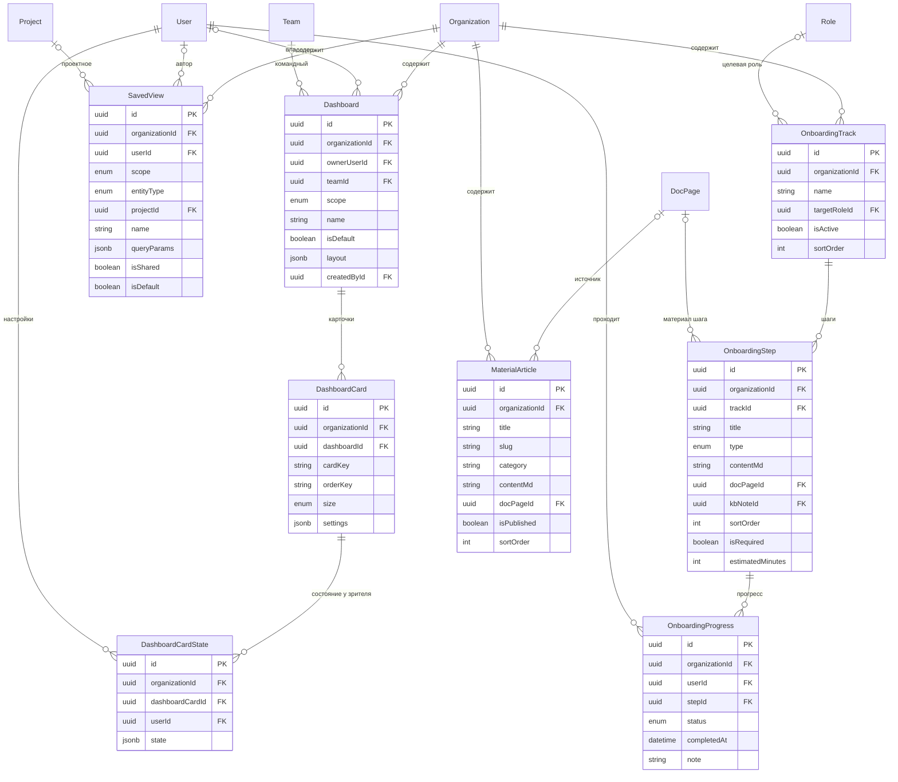

### 16. MCP — доступ внешних агентов

*Добавлена 2026-08-05 вместе с [ADR-0024](adr/0024-mcp-server.md) и
[EPIC-048](../../epics/epic-048-mcp-server/epic.md).* Все шесть таблиц — **[T]**.

| Сущность | Метка | Ключевые поля | Особенности |
|---|---|---|---|
| `ApiToken` | [T] | `userId`, `name`, `tokenHash` (SHA-256), `tokenTail` (последние 4 символа для узнавания в списке), `toolScopes String[]`, `expiresAt`, `lastUsedAt?`, `revokedAt?`, `createdAt` | персональный токен; используется stdio-мостом. **Пробел модели, обнаруженный при этом проектировании:** права `api_token:*` существуют в каталоге с 2026-07-26, а таблицы под ними не было |
| `McpClient` | [T] | `name`, `clientIdPublic`, `clientSecretHash?`, `redirectUris String[]`, `registrationMode MANUAL\|DYNAMIC`, `isEnabled`, `createdById`, `createdAt` | зарегистрированный OAuth-клиент; `DYNAMIC` доступен только при включённой DCR (`mcp:manage_clients`) |
| `McpConsent` | [T] | `userId`, `clientId`, `toolScopes String[]`, `grantedAt`, `revokedAt?`, `lastUsedAt?` | согласие конкретного человека конкретному клиенту; область — закрытый список инструментов, не «весь API» |
| `McpSession` | [T] | `userId`, `clientId`, `consentId`, `refreshTokenHash` (SHA-256), `familyId`, `resource`, `expiresAt`, `revokedAt?`, `lastSeenAt`, `ipHash`, `userAgent` | ротация refresh и обнаружение повторного использования — тот же механизм, что у `Session` (EPIC-006), а не второй самописный |
| `McpToolPolicy` | [T] | `toolName`, `isEnabled`, `allowedRoleIds String[]`, `maxCallsPerDay?`, `requiresConfirmation Bool`, `scope ORG\|PROJECT` | политика организации поверх прав: сузить можно, расширить — нет |
| `McpConfirmation` | [T] | `userId`, `sessionId`, `toolName`, `argumentsHash`, `createdAt`, `expiresAt`, `confirmedAt?`, `usedAt?` | одноразовое подтверждение разрушающей операции, выдаваемое **в интерфейсе продукта**; `argumentsHash` привязывает подтверждение к конкретным аргументам, иначе подтверждают одно, а исполняют другое |

**Почему `McpToolPolicy` — отдельная таблица, а не `AIToolPolicy`.** Пространства имён разные
(инструменты ассистента и инструменты MCP описываются разными манифестами и живут в разных
адаптерах), а общая таблица означала бы, что запрет инструмента в одном канале молча меняет
поведение другого. Форма таблиц намеренно одинаковая — это позволяет переиспользовать UI и
проверки, не смешивая данные.

**Чего в этой группе нет намеренно.** Таблицы «журнал вызовов инструментов» нет: вызов пишется в
`AuditLog` действием `mcp.tool_called`. Второй журнал означал бы второе место, где нужно помнить про
append-only, ретеншн и партиционирование, — и первый же вопрос «а где посмотреть, что сделал агент»
получил бы два ответа.

---

### 17. Почта — корпоративные ящики сотрудников

*Добавлена 2026-08-05 вместе с [ADR-0025](adr/0025-corporate-mail-stalwart.md) и
[EPIC-049](../../epics/epic-049-corporate-mail/epic.md).* Все три таблицы — **[T]**.

| Сущность | Метка | Ключевые поля | Особенности |
|---|---|---|---|
| `MailDomain` | [T] | `name` (уникально **на инсталляцию**), `verifiedAt?`, `verificationToken`, `dkimSelector`, `isEnabled`, `createdById` | домен принимает почту только после DNS-подтверждения; уникальность глобальная — почтовое адресное пространство не знает про арендаторов |
| `MailAccount` | [T] | `userId` (1:1), `domainId`, `address` (уникально **на инсталляцию**), `quotaBytes`, `status ACTIVE\|SUSPENDED`, `forwardToAddress?`, `createdAt` | ящик без человека не заводится; хеша пароля здесь **нет** — он один, в `users` |
| `MailAlias` | [T] | `accountId`, `address` (уникально на инсталляцию), `createdAt` | адрес доставки, а не учётная запись: войти по алиасу нельзя |

**Почему уникальность на инсталляцию, а не на организацию.** `ada@acme.com` не может существовать
дважды — так устроена почта, и никакая политика RLS этого не меняет. Граница арендатора проходит по
**домену**: организация владеет `acme.com` после подтверждения, и все адреса в нём — её. Это тот же
случай, что `organizations.slug` (см. «Мульти-тенантность и RLS» ниже и остаточный риск 7 в
[`rls-design.md`](../security/rls-design.md)), и он требует отдельной проверки: попытка второй
организации объявить чужой подтверждённый домен отвергается use-case'ом, а не только индексом.

**Чего в этой группе нет намеренно.** Ни одного поля с содержимым письма: письма живут в томе
Stalwart и в нашу базу не попадают. Отсюда следует и то, что процедура `pg_dump` их не покрывает —
у бэкапа появляется отдельный раздел ([`backup-restore.md`](../runbooks/backup-restore.md)).

---

---

## Мульти-тенантность и RLS

### Модель изоляции

Одна база, одна схема, `organizationId` на каждой доменной таблице, Row Level Security как
**последний рубеж**. Порядок обороны:

1. Приложение фильтрует по тенанту (Prisma-расширение подмешивает `organizationId` в каждый запрос).
2. RLS отсекает то, что приложение пропустило по ошибке.

Второй уровень существует именно потому, что первый рано или поздно даёт сбой: забытый `where` в
новом эндпоинте, сырой SQL для отчёта, ошибка в динамическом фильтре. Без RLS такая ошибка — утечка
данных между организациями; с RLS — пустой результат и запись в логе.

Почему не схема-на-тенанта и не база-на-тенанта: self-hosted инсталляция чаще всего обслуживает
одну-две организации, а миграции по N схемам превращаются в отдельную инженерную проблему
(Prisma умеет одну схему). Путь к изоляции на уровне БД оставлен открытым для крупных инсталляций
— см. «Открытые вопросы».

### Шаблон политики

Для каждой **[T]**-таблицы:

```sql
ALTER TABLE tasks ENABLE ROW LEVEL SECURITY;
ALTER TABLE tasks FORCE  ROW LEVEL SECURITY;   -- иначе владелец таблицы обходит политику

CREATE POLICY tenant_isolation ON tasks
  USING      (organization_id = current_setting('app.organization_id')::uuid)
  WITH CHECK (organization_id = current_setting('app.organization_id')::uuid);
```

**Обе части обязательны, и это не формальность.** `USING` фильтрует читаемые строки (`SELECT`,
`UPDATE`, `DELETE`), `WITH CHECK` проверяет записываемые (`INSERT`, `UPDATE`). Политика только с
`USING` даёт классическую дыру: чужие строки не видны, но **вставить** строку с чужим
`organization_id` можно совершенно свободно — достаточно, чтобы значение пришло из тела запроса.
Точно так же `UPDATE` мог бы «переложить» свою строку в соседнюю организацию. Правило: каждая
политика содержит оба условия, и они совпадают.

`FORCE ROW LEVEL SECURITY` — вторая обязательная строчка: без неё владелец таблицы (та роль, под
которой прогонялись миграции) политику **игнорирует**. Если приложение по недосмотру подключится
владельцем, RLS просто не будет существовать, и об этом ничто не сообщит.

Особый случай — `Organization`: политика по собственному первичному ключу.

```sql
CREATE POLICY tenant_self ON organizations
  USING      (id = current_setting('app.organization_id')::uuid)
  WITH CHECK (id = current_setting('app.organization_id')::uuid);
```

Настройка читается как `current_setting('app.organization_id', true)` в местах, где допустимо её
отсутствие (иначе PostgreSQL бросает ошибку). Мы **не** используем этот «мягкий» вариант в
политиках намеренно: отсутствие контекста должно быть громкой ошибкой, а не тихим
`NULL → строк нет`, которое разработчик будет часами искать.

### Выставление контекста: `SET LOCAL` внутри транзакции

```ts
// prisma расширение, упрощённо
prisma.$extends({
  client: {
    async withTenant<T>(organizationId: string, fn: (tx: TxClient) => Promise<T>) {
      return prisma.$transaction(async (tx) => {
        await tx.$executeRaw`SELECT set_config('app.organization_id', ${organizationId}, true)`;
        return fn(tx);
      });
    },
  },
});
```

**Главная ловушка всей подсистемы:** `SET LOCAL` (и `set_config(..., true)`) действует **до конца
текущей транзакции**. Вне транзакции запрос уходит на произвольное соединение из пула, где
контекста нет — политика получает `NULL`, и либо запрос падает, либо (в «мягком» варианте) молча
возвращает пустоту. Отсюда жёсткие правила:

- **Любой запрос к [T]-таблицам идёт внутри `withTenant`.** Одиночный `prisma.task.findMany()` вне
  транзакции — ошибка, а не «сокращение».
- **Никогда не `SET` без `LOCAL`.** Обычный `SET` живёт до конца **соединения**, а соединение
  возвращается в пул и достаётся следующему запросу — уже другого тенанта. Это худший из возможных
  багов: утечка данных, которая проявляется под нагрузкой и не воспроизводится в тестах.
- **PgBouncer только в режиме `transaction`** (или `session`), никогда `statement`: в statement-режиме
  границы транзакции не сохраняются и `SET LOCAL` теряет смысл.
- Тест на каждый релиз: открыть транзакцию тенанта A, попытаться прочитать и вставить строку
  тенанта B, убедиться, что оба действия провалились.

### RLS — это изоляция арендаторов, и только

RLS отвечает ровно на один вопрос: **«принадлежит ли строка моей организации?»**. Она **не**
отвечает на вопросы «имеет ли этот сотрудник право видеть эту задачу», «состоит ли он в приватном
проекте», «дали ли ему доступ к этому vault». Вся тонкая авторизация — в policy-слое domain, на
основе `Role`, `UserPermissionOverride`, `ResourceAcl`, `ProjectMember`, `VaultMembership`.

Почему не «докрутить» RLS до полной авторизации:

- Политика с подзапросами по ACL выполняется **для каждой строки** и не даёт планировщику
  использовать индексы — списки задач деградируют на порядки.
- Правила доступа меняются продуктом; менять их в SQL-политиках означает миграцию БД на каждую
  продуктовую итерацию.
- Отладка отказа в доступе на уровне политики почти невозможна: пользователь видит «пусто» вместо
  «нет прав, потому что …». Policy-слой умеет объяснить причину.
- Правила невозможно покрыть юнит-тестами так же дёшево, как чистые функции в приложении.

Разделение простое: **RLS = стена между организациями, policy-слой = двери внутри организации.**

### Роли базы данных

| Роль | Назначение | RLS | Ключевые права |
|---|---|---|---|
| `app_user` | обычные запросы приложения | **подчиняется** | `SELECT/INSERT/UPDATE/DELETE` на доменных таблицах; на `audit_logs` только `INSERT/SELECT`; не владелец объектов |
| `app_migrator` | миграции, DDL, обслуживание партиций | владелец (RLS обходит, поэтому все таблицы с `FORCE`) | `CREATE`, `ALTER`, `DROP`; используется только миграциями и операционными скриптами, не приложением |
| `app_auth` | логин до определения организации | ограниченный `BYPASSRLS` | `EXECUTE` на нескольких `SECURITY DEFINER`-функциях; прямого `SELECT` на таблицы **нет** |

Разделение ролей — не украшение: единственная роль с `BYPASSRLS` в системе (`app_auth`) не имеет
доступа ни к одной доменной таблице, а роль, ходящая в доменные таблицы (`app_user`), не может
обойти RLS ни при каких условиях. Компрометация приложения не даёт доступа к чужим данным.

Подключение приложения — строго `app_user`. Проверка «под какой ролью мы работаем» — в health-check
при старте: если `current_user = app_migrator`, приложение отказывается стартовать.

### Таблицы без RLS и почему

| Таблица | Почему без RLS |
|---|---|
| `Permission` | **[G]** каталог прав, задаётся кодом, одинаков для всех, содержит только имена прав — секрета нет. `GRANT SELECT` всем, `INSERT/UPDATE` только `app_migrator`. |
| `Activity` | **[G]** справочник видов трудозатрат, сидируется. Кастомизация тенанта живёт в `ActivityOverride` **[T]** — именно чтобы справочник остался глобальным и неизменяемым приложением. |
| `_prisma_migrations` | служебная таблица инструмента миграций, доступна только `app_migrator`. |

Всё остальное — **[T]** без исключений. «Эта таблица маленькая / служебная / всё равно не содержит
персональных данных» — не аргумент: отсутствие RLS на одной таблице означает, что из неё можно
вывести существование и объёмы чужих данных.

### Три особых пути

**Путь 1 — логин: организация ещё не известна.**

Пользователь вводит e-mail и пароль. Организации в контексте нет, а `users` под RLS без контекста
не читается — курица и яйцо.

Решение: доступ к таблицам аутентификации только через `SECURITY DEFINER`-функции, принадлежащие
`app_auth`:

```sql
CREATE FUNCTION auth_lookup_user(p_email citext, p_org_slug text)
RETURNS TABLE (user_id uuid, organization_id uuid, password_hash text, status text)
LANGUAGE sql SECURITY DEFINER SET search_path = public AS $$
  SELECT u.id, u.organization_id, u.password_hash, u.status::text
  FROM users u JOIN organizations o ON o.id = u.organization_id
  WHERE u.email = p_email AND o.slug = p_org_slug AND u.deleted_at IS NULL
$$;
REVOKE ALL ON FUNCTION auth_lookup_user FROM PUBLIC;
GRANT EXECUTE ON FUNCTION auth_lookup_user TO app_auth;
```

Ключевые детали: функция возвращает **только** поля, нужные для проверки пароля (не всю строку);
`search_path` зафиксирован (иначе `SECURITY DEFINER` — известный вектор атаки через подмену схемы);
организация определяется по slug из поддомена или из формы входа — то есть e-mail сам по себе не
раскрывает, в каких организациях он существует. Ответ на неверные данные — одинаковый по времени и
тексту (защита от перечисления). Сразу после успешной аутентификации приложение переключается на
`app_user` и открывает транзакции с `SET LOCAL`.

**Путь 2 — анонимный `SecureLink`.**

Получатель ссылки не аутентифицирован и не принадлежит организации. Он не может иметь
`app.organization_id`, но обязан прочитать ровно одну строку `secure_links` и связанные с ней.

Решение — `SECURITY DEFINER`-функция-резолвер, единственная точка входа:

```sql
CREATE FUNCTION secure_link_resolve(p_token_hash text)
RETURNS TABLE (link_id uuid, organization_id uuid, kind text, payload_enc bytea, requires_auth bool)
LANGUAGE plpgsql SECURITY DEFINER SET search_path = public AS $$
DECLARE r record;
BEGIN
  SELECT * INTO r FROM secure_links
   WHERE token_hash = p_token_hash
     AND burned_at IS NULL
     AND (expires_at IS NULL OR expires_at > now())
     AND (max_views IS NULL OR view_count < max_views);
  IF NOT FOUND THEN RETURN; END IF;

  -- выставляем tenant-контекст ПО НАЙДЕННОЙ ссылке
  PERFORM set_config('app.organization_id', r.organization_id::text, true);
  INSERT INTO secure_link_views (organization_id, link_id, succeeded, viewed_at)
       VALUES (r.organization_id, r.id, true, now());

  RETURN QUERY SELECT r.id, r.organization_id, r.kind::text, r.payload_enc, r.requires_auth;
END $$;
```

Почему именно так:

- Функция — **единственная** привилегированная поверхность: она принимает хэш токена и не умеет
  делать ничего другого. Альтернатива (роль `app_link` с политикой по
  `current_setting('app.link_token_hash')`) требует, чтобы вызывающий код сам корректно выставлял
  настройку, — то есть переносит ответственность туда, где её легче забыть.
- Все проверки (сгорела, истекла, исчерпан лимит) и запись в журнал происходят **внутри** одной
  транзакции с выдачей данных: невозможно получить содержимое, не оставив следа.
- Функция сама выставляет `app.organization_id` по найденной ссылке — дальнейшие запросы того же
  запроса (получение ресурса по `resourceId`) уже идут под нормальным RLS.
- Токен в БД — только хэш; сам токен и, для `ONE_TIME`, ключ расшифровки живут в URL-фрагменте и
  до сервера не доходят.

Отдельно: этот эндпоинт обязан иметь rate limit по IP и по `tokenHash` — иначе он превращается в
оракул для перебора токенов.

**Путь 3 — фоновые воркеры и очереди.**

Воркер обрабатывает сообщения разных тенантов на одном соединении, поэтому:

- **Каждое сообщение очереди несёт `organizationId`** — это обязательное поле конверта, а не
  полезной нагрузки. Сообщение без него отбраковывается в dead letter, а не обрабатывается «как-то».
- Обработка **каждого** сообщения открывает свою транзакцию с `SET LOCAL`. Нельзя выставить
  контекст один раз на пачку: пачка почти всегда смешанная, и первый же тенант «протечёт» в
  остальные.
- Крон-задачи, которым по смыслу нужно пройти по всем организациям (пересчёт rollup, зачистка
  просроченного), устроены как цикл: `SELECT id FROM organizations` под `app_migrator` → для каждой
  организации отдельная транзакция под `app_user` с её контекстом. Запрос «по всем тенантам сразу»
  запрещён вне явного административного режима с записью в `AuditLog`.
- После обработки контекст исчезает вместе с транзакцией — сбрасывать вручную ничего не нужно, и
  именно поэтому `SET LOCAL`, а не `SET`.

### Чек-лист: добавляется новая таблица

Обязателен к прохождению в каждом PR, добавляющем модель. Проверяется `db-reviewer` в commit-гейте.

1. **Tenancy.** Таблица помечена **[T]** или **[G]**. Если [G] — в PR есть письменное обоснование,
   почему данные общие для всех организаций.
2. **Колонка.** Для [T] есть `organizationId uuid NOT NULL` с FK на `organizations` и индексом.
3. **RLS включён:** `ENABLE ROW LEVEL SECURITY` **и** `FORCE ROW LEVEL SECURITY`.
4. **Политика содержит `USING` и `WITH CHECK`**, оба условия идентичны шаблону.
5. **Права выданы явно:** `GRANT` для `app_user` (для журнальных таблиц — без `UPDATE/DELETE`).
6. **Индексы:** каждый FK проиндексирован; основной сценарий чтения покрыт составным индексом,
   начинающимся с `organization_id`.
7. **Timestamps:** `createdAt`/`updatedAt` присутствуют; решён вопрос мягкого удаления (есть
   `deletedAt` + частичные уникальные индексы, либо явно указано, что не нужно).
8. **Деньги и время** — по правилам раздела «Принципы» (micro + currency, целые минуты, timestamptz).
9. **Секреты:** ни одного plaintext-поля с секретом; всё чувствительное — `*Enc` (для vault —
   зашифровано клиентом, сервер не имеет ключа).
10. **Тест изоляции:** в набор добавлен кейс «тенант A не читает и не пишет строку тенанта B» —
    именно для этой таблицы, а не «вообще».
11. **Каскады:** для полиморфных ссылок на новую сущность обновлён whitelist `entityType` и
    use-case удаления родителя.

---

## Полиморфные связи

Шесть мест модели используют пару `(entityType, entityId)` (либо `sourceType`/`sourceId`) без
внешнего ключа.

| Таблица | Дискриминатор | Почему полиморфия |
|---|---|---|
| `Comment` | `TASK`, `DOC_PAGE`, `KB_NOTE`, `CALL` | обсуждать можно почти всё; список типов растёт с продуктом |
| `Attachment` | `TASK`, `DOC_PAGE`, `KB_NOTE`, `COMMENT`, `MESSAGE`, `MILESTONE`, `PROJECT_RISK`, `CALL` | то же + один файл может висеть в разных местах |
| `Mention` | `COMMENT`, `MESSAGE`, `DOC_PAGE`, `KB_NOTE`, `TASK` | упомянуть человека можно в любом тексте, а не только в комментарии и сообщении |
| `Watcher` | `TASK`, `DOC_PAGE`, `KB_NOTE`, `PROJECT`, `MILESTONE`, `CHANNEL` | подписка на события — механизм того же класса, что ACL |
| `ResourceAcl` | `ORGANIZATION`, `PROJECT`, `BOARD`, `TASK`, `DOC_PAGE`, `KB_SPACE`, `KB_NOTE`, `FILE`, `FILE_FOLDER`, `CHANNEL`, `VAULT`, `DASHBOARD` | полиморфна **по определению**: это универсальный механизм ACL |
| `Embedding` | `TASK`, `DOC_PAGE`, `KB_NOTE`, `MESSAGE`, `CALL_SUMMARY` | индексируется всё содержательное; типы добавляются часто |

Перечень `ResourceAcl.resourceType` — **закрытый и полный**, он совпадает со списком в группе 2 и с
цепочками наследования в [`../security/permission-model.md`](../security/permission-model.md).
Значения, добавленные к раннему наброску, каждое закрывает конкретное требование:
`TASK` — приватная задача (EPIC-021), `CHANNEL` — точечная выдача доступа к каналу (EPIC-026),
`ORGANIZATION` — оргширокий грант (корень всех цепочек), `KB_NOTE` и `FILE` — доступ к отдельной
заметке и отдельному файлу мимо пространства/папки, `DASHBOARD` — расшаренный дашборд.

### Рассмотренные альтернативы

**1. Отдельная таблица на каждый тип** (`TaskComment`, `DocPageComment`, …). Даёт настоящие FK и
каскады. Отвергнуто: «моя лента комментариев» и «непрочитанные упоминания» превращаются в
`UNION ALL` по N таблицам, логика упоминаний/реакций/резолва дублируется N раз, а каждый новый тип
комментируемой сущности — это новая таблица, новая миграция и правки во всех запросах.

**2. Exclusive arc** — нуллабельные FK на каждый тип плюс `CHECK`, что заполнен ровно один. Целостность
сохраняется полностью. Отвергнуто для `Comment`/`Attachment`/`Embedding`: при 6+ типах таблица
обрастает шестью почти всегда пустыми колонками и шестью индексами, а добавление типа требует
`ALTER TABLE` на самой крупной таблице продукта. **Если бы типов было два-три — это был бы
правильный выбор**, и мы бы его сделали; решение зависит от кардинальности, а не от вкуса.

**3. Супертип-таблица** (`Commentable` с наследниками). Честная целостность через FK на супертип.
Отвергнуто: вставка любой задачи требует двух вставок в двух таблицах, каждое чтение — лишний
джойн, а модель усложняется ради инварианта, который дешевле удержать в use-case.

### Чем платим

- **Нет FK ⇒ нет ссылочной целостности.** БД примет комментарий к несуществующей задаче.
- **Нет каскадного удаления.** Удаление задачи не удаляет её комментарии автоматически.
- **Планировщик хуже оценивает селективность** составного `(entity_type, entity_id)` — лечится
  корректными составными индексами и, при необходимости, расширенной статистикой
  (`CREATE STATISTICS`).

### Как удерживаем целостность

1. **Whitelist дискриминатора в БД.** `entityType` — Prisma enum (то есть PostgreSQL enum), а не
   свободная строка. Значение вне списка отклоняется базой, а не «валидируется где-то». Zod-схема
   на границе API повторяет тот же список — единый источник в коде, из которого генерируются оба.
2. **Каскад — в use-case, а не в БД.** Удаление родителя выполняется единственным доменным
   сервисом, который в **той же транзакции** удаляет/помечает удалёнными комментарии, вложения,
   ACL, эмбеддинги, наблюдателей. Точка входа одна, поэтому забыть можно только в одном месте, и
   это место покрыто тестом.
3. **Ночной integrity-джоб.** Для каждой пары (полиморфная таблица × тип) выполняется
   анти-джойн вида
   `SELECT count(*) FROM comments c WHERE c.entity_type='TASK'
    AND NOT EXISTS (SELECT 1 FROM tasks t WHERE t.id = c.entity_id)`.
   Результат — **метрика и отчёт**, а не автоматическое удаление: сироты означают баг в use-case,
   и тихая уборка мусора скрыла бы его. Ненулевое значение поднимает алерт.
4. **Обратные индексы.** `idx_attachments_file (file_id)` и аналоги позволяют ответить на вопрос
   «на что ещё ссылается этот объект» до удаления — иначе физическая зачистка файлов удалила бы
   то, что ещё используется.

`ResourceAcl` стоит особняком: для неё полиморфия не компромисс, а суть — механизм должен работать
для типов, которые ещё не существуют. Целостность здесь дешевле: «висящий» ACL на удалённый объект
безвреден (он никому не даёт доступа к несуществующему), и джоб чистит его по расписанию.

---

## Индексы и производительность

### Что заводим сразу (не «когда станет медленно»)

Индексы, вытекающие из известных паттернов доступа, создаются вместе с таблицами — это не
преждевременная оптимизация, а следствие того, что запросы известны на этапе проектирования.

**Списки задач (самый частый экран):**

- `idx_tasks_board_order (organization_id, board_column_id, order_key) WHERE deleted_at IS NULL` —
  отрисовка колонки канбана: индекс покрывает и фильтр, и сортировку, `ORDER BY` идёт без сортировки.
- `idx_task_assignees_org_user (organization_id, user_id)` — «мои задачи» без обхода задач.
- `idx_tasks_org_due (organization_id, due_at) WHERE completed_at IS NULL` — частичный: просрочка
  интересна только у незакрытых, и такой индекс на порядок меньше полного.

**Лента сообщений:**

- `idx_messages_channel_created (organization_id, channel_id, created_at DESC)` — точное совпадение
  с формой запроса. Пагинация — **keyset** (`WHERE created_at < $cursor ORDER BY created_at DESC
  LIMIT 50`), не `OFFSET`: смещение на 10 000 сообщений заставляет PostgreSQL прочитать и отбросить
  10 000 строк на каждой странице.

**Тайм-трекинг:**

- `idx_time_entries_user_started (organization_id, user_id, started_at DESC)` — табель за период.
- `idx_time_entries_billable … WHERE billable AND invoice_line_id IS NULL` — «что можно выставить»:
  частичный индекс размером в проценты от таблицы вместо скана всего факта.

**Аудит:**

- `idx_audit_logs_resource (organization_id, resource_type, resource_id, occurred_at DESC)` —
  «история этого объекта»; на каждой партиции.

### Где нужны частичные индексы

Правило: если запрос **всегда** содержит константный предикат, он должен быть в `WHERE` индекса.
Так индекс не содержит строк, которые никогда не ищут, и остаётся в памяти.

Кандидаты, зафиксированные выше: `deleted_at IS NULL` (все мягко удаляемые), `status = 'PENDING'`
(очередь сканера файлов), `status IN ('PENDING','FAILED')` (outbox), `read_at IS NULL`
(уведомления, упоминания), `unread_count > 0` (каналы), `is_default` (роли, AI-провайдеры),
`conclusion = 'FAILURE'` (красные сборки), `status = 'OPEN'` (риски, поручения).

Частичные уникальные индексы — единственный способ совместить мягкое удаление с уникальностью:
`CREATE UNIQUE INDEX uq_projects_org_key ON projects (organization_id, key) WHERE deleted_at IS NULL`
позволяет создать новый проект с ключом удалённого.

### Где нужны покрывающие индексы

`INCLUDE` добавляет неключевые колонки для index-only scan. Применяем точечно, там, где горячий
запрос читает 2–3 дополнительных поля:

- сборка эффективных прав: `(organization_id, role_id) INCLUDE (permission_key)` на
  `role_permissions` — вся выборка прав роли без обращения к таблице;
- список каналов с бейджами: `(organization_id, user_id) INCLUDE (channel_id, unread_count)`.

Не злоупотребляем: `INCLUDE` увеличивает индекс и замедляет запись, а index-only scan работает
только при свежей visibility map (то есть при аккуратном autovacuum).

### Где GIN

- **JSONB:** `content jsonb_path_ops` на `doc_pages`, `frontmatter jsonb_path_ops` на `kb_notes`,
  `payload` на `activity_events` — только по мере появления реальных запросов к структуре.
  `jsonb_path_ops` компактнее и быстрее дефолтного при поиске по вхождению (`@>`).
- **Полнотекст:** `to_tsvector` по `tasks.title + description`, `kb_notes.content_md`,
  `messages.plain_text`, `doc_pages`. Для задач и документов держим материализованную колонку
  `searchVector tsvector`, обновляемую триггером, — вычислять `to_tsvector` на лету при каждом
  запросе дороже, чем хранить.
- **Массивы:** `source_time_entry_ids` на `invoice_lines`, `allowed_emails` на `secure_links`.
- **Триграммы:** `pg_trgm` для поиска по подстроке в именах (клиенты, проекты, люди) — обычный
  полнотекст не помогает при поиске «по кусочку слова», а `LIKE '%…%'` без триграмм читает всё.

GIN дорог на запись: он не обновляется точечно, а накапливает изменения в pending list. Поэтому GIN
не вешаем на таблицы с интенсивной записью «на всякий случай» и следим за `gin_pending_list_limit`.

### Где партиционирование

| Таблица | Схема | Обоснование |
|---|---|---|
| `audit_logs` | `RANGE (occurred_at)`, месяц | быстрейший рост в БД; ретеншн через `DETACH`/`DROP PARTITION` вместо многочасового `DELETE`; запросы почти всегда ограничены периодом → partition pruning |
| `messages` | `RANGE (created_at)`, квартал — **при достижении порога** | лента читается по свежим данным, архив холодный; вводим не сразу, а когда таблица приблизится к десяткам миллионов строк |
| `embeddings` | `LIST (organization_id)` — кандидат | лечит проблему «HNSW не знает про RLS» на крупных инсталляциях |

Три подводных камня партиционирования, которые фиксируем сразу:

1. **PK обязан включать ключ партиционирования** → `PRIMARY KEY (id, occurred_at)`. Это меняет форму
   внешних ссылок, поэтому на партиционированные таблицы никто не ссылается по FK (для `audit_logs`
   и `messages` это и не нужно).
2. **Prisma не умеет партиции декларативно.** Таблица создаётся ручным SQL в миграции, модель в
   `schema.prisma` описывает её как обычную; создание партиций на будущие периоды — задача
   `pg_partman` или собственного крон-джоба. Забыть создать партицию = отказ вставок, поэтому джоб
   создаёт партиции на несколько периодов вперёд и мониторится.
3. **RLS-политики наследуются партициями**, но `ENABLE`/`FORCE` нужно применить к родительской
   таблице до создания партиций — иначе часть партиций окажется без защиты.

### Где `EXCLUDE USING gist`

Два места: непересечение периодов действия ставок (`cost_rates`, `bill_rates` — жёстко всегда,
см. группу 9) и **опциональный** запрет пересекающихся интервалов работы в тайм-трекинге.

```sql
CREATE EXTENSION IF NOT EXISTS btree_gist;

ALTER TABLE time_entries ADD CONSTRAINT ck_time_entries_no_overlap
  EXCLUDE USING gist (
    user_id WITH =,
    tstzrange(started_at, ended_at) WITH &&
  ) WHERE (ended_at IS NOT NULL AND deleted_at IS NULL AND reverses_id IS NULL);
```

Это ограничение — единственный способ **гарантировать**, что человек не отчитался дважды за одно и
то же время. Проверка в приложении здесь принципиально ненадёжна: две параллельные вставки
(веб + мобильный клиент + импорт) проходят проверку каждая до коммита другой. `btree_gist` нужен,
чтобы соединить равенство по `user_id` с пересечением диапазона в одном индексе. Частичное условие
исключает незавершённые, удалённые и сторно-записи.

#### Два режима: предупреждение по умолчанию, запрет по политике

Ранее документ объявлял constraint безусловным, а `TimePolicy` — мягкий флаг `warnOnOverlap`. Это
взаимоисключающие вещи: при наличии constraint флаг «предупредить» недостижим, база просто откажет
во вставке. *Канон — по умолчанию предупреждение, жёсткий запрет включается политикой; приведено в
соответствие 2026-07-26.* Механика:

| Режим | `TimePolicy` | Что делает БД | Что делает приложение |
|---|---|---|---|
| **Предупреждение** (по умолчанию) | `warnOnOverlap = true`, `forbidOverlap = false` | constraint **отсутствует** | use-case ищет пересечения запросом и возвращает предупреждение в ответе; пользователь подтверждает и запись сохраняется |
| **Запрет** | `forbidOverlap = true` | constraint **существует** | use-case проверяет заранее, чтобы отдать понятную ошибку вместо `23P01`; нарушение конкурентной вставки ловится базой |
| Выключено | оба `false` | constraint отсутствует | не проверяется |

**Условное создание constraint, а не «всегда есть, но игнорируем».** Constraint либо есть в
конкретной инсталляции, либо нет; переключатель режима — это операция над схемой:

- Оба флага живут в `TimePolicy` со `scope = ORG` — **и только там**. Проектный `TimePolicy` может
  ужесточать всё остальное, но не режим пересечений: constraint покрывает таблицу целиком и не
  умеет действовать «только для записей проекта X». Попытка задать `forbidOverlap` на проектной
  политике отклоняется валидацией — иначе настройка молча не работала бы.
- Включение режима — не апдейт строки, а **use-case с миграцией**: в одной транзакции выполняется
  `ALTER TABLE … ADD CONSTRAINT … NOT VALID`, затем отдельно `VALIDATE CONSTRAINT` (без долгой
  блокировки записи), и только при успешной валидации `forbidOverlap` переводится в `true`.
  Порядок именно такой: если в данных уже есть пересечения, включение обязано провалиться с отчётом
  «вот эти N записей мешают», а не оставить организацию в состоянии «политика говорит запрещено,
  база не проверяет».
- Выключение — `DROP CONSTRAINT` плюс сброс флага, тоже одной операцией.
- DDL выполняется под `app_migrator`, не под `app_user` (см. «Роли базы данных»), и пишется в
  `AuditLog` с повышенной `severity`: смена режима — организационное решение, влияющее на данные о
  деньгах.
- Состояние сверяется: стартовый health-check сравнивает наличие constraint в `pg_constraint` с
  флагом в `TimePolicy` и поднимает алерт при расхождении. Это защита от ручного вмешательства в
  базу на self-host инсталляции.

Почему предупреждение — дефолт: легальный сценарий пересечения существует (звонок во время работы
над задачей, параллельные короткие переключения), и продукт, который в первый же день отказывается
сохранять час работы без объяснимой причины, заставляет людей округлять и подгонять данные — то
есть портит ровно ту точность, ради которой ограничение вводилось. Организациям, где время
биллится клиенту поминутно, жёсткий режим доступен одним переключателем.

### Прочие правила

- **Считаем через преагрегаты, а не `COUNT(*)` по факту.** `TimeRollupDaily`, `AIUsageDaily`,
  `Budget.consumedMicros`, `Channel.memberCount`, `ChannelMember.unreadCount` — денормализация,
  сознательно допускающая расхождение и периодически сверяемая фоновым джобом.
- **`EXPLAIN (ANALYZE, BUFFERS)` обязателен** для каждого нового запроса к таблице, которая по
  прогнозу перевалит 100k строк; результат прикладывается к PR.
- **`pg_stat_statements` включён** в дефолтной поставке self-host — иначе диагностика «стало
  медленно» на чужой инсталляции невозможна.
- **Connection pooling** (PgBouncer, transaction mode) — обязателен: RLS-контекст живёт в
  транзакции, а Prisma держит соединения жадно.

---

## Стратегия миграций

### Expand → migrate → contract

Любое несовместимое изменение схемы разбивается на три релиза. Это не перестраховка: self-hosted
продукт означает, что во время обновления одновременно работают старая и новая версии приложения
(rolling deploy, а на практике — ещё и админ, который обновил бэкенд и забыл фронтенд).

1. **Expand.** Добавляем новое, не ломая старое: новая колонка **nullable** или с `DEFAULT`, новая
   таблица, новый индекс. Старый код продолжает работать, не зная о новом.
2. **Migrate.** Код пишет в оба места (dual-write), фоновый бэкфилл переносит исторические данные
   пачками, чтение постепенно переключается на новое. Этап живёт минимум один релизный цикл.
3. **Contract.** Только когда ни одна работающая версия не обращается к старому: удаляем колонку,
   снимаем dual-write, добавляем `NOT NULL`.

### Жёсткие запреты

- **`DROP COLUMN` в том же релизе, где колонка перестала использоваться** — запрещено. Минимум
  два релиза паузы. Откат приложения на предыдущую версию не должен упираться в отсутствующую
  колонку.
- **`ALTER COLUMN … SET NOT NULL` напрямую** — запрещено: PostgreSQL берёт `ACCESS EXCLUSIVE` и
  сканирует всю таблицу. Правильный путь:
  ```sql
  ALTER TABLE t ADD CONSTRAINT ck_t_col_not_null CHECK (col IS NOT NULL) NOT VALID;  -- мгновенно
  ALTER TABLE t VALIDATE CONSTRAINT ck_t_col_not_null;  -- слабая блокировка, можно долго
  ALTER TABLE t ALTER COLUMN col SET NOT NULL;          -- PG12+ использует проверенный CHECK
  ```
- **Переименование колонки/таблицы** — запрещено как единичная операция. Только: добавить новую →
  писать в обе → бэкфилл → переключить чтение → удалить старую (через два релиза).
- **Смена типа колонки** — через новую колонку, не `ALTER TYPE` (перезапись таблицы под
  `ACCESS EXCLUSIVE`).
- **`CREATE INDEX` без `CONCURRENTLY`** на таблице с данными — запрещено: блокирует запись на всё
  время построения.

### `CREATE INDEX CONCURRENTLY` и Prisma

`CONCURRENTLY` **не работает внутри транзакции**, а Prisma по умолчанию оборачивает каждый файл
миграции в транзакцию. Правило: индексы на непустых таблицах создаются в **отдельном** файле
миграции, содержащем только эту команду, и выполняются вне транзакционной обёртки (Prisma
распознаёт такие миграции; в спорных случаях — отдельный операционный скрипт, задокументированный
в runbook).

Дополнительно: `CONCURRENTLY` может завершиться неудачей и оставить **невалидный** индекс. Миграция
обязана быть идемпотентной:

```sql
DROP INDEX CONCURRENTLY IF EXISTS idx_tasks_board_order;
CREATE INDEX CONCURRENTLY IF NOT EXISTS idx_tasks_board_order ON tasks (...);
```

Проверка после выката: `SELECT indexrelid::regclass FROM pg_index WHERE NOT indisvalid`.

### Защита от блокировок

Каждая миграция начинается с:

```sql
SET lock_timeout = '3s';
SET statement_timeout = '5min';
```

`lock_timeout` критичен: `ALTER TABLE`, ждущий `ACCESS EXCLUSIVE`, встаёт в очередь и **блокирует
все запросы позади себя**, даже читающие. Лучше упасть через 3 секунды и повторить, чем положить
инсталляцию на минуту. Для длинных операций (`VALIDATE CONSTRAINT`, бэкфилл) `statement_timeout`
поднимается адресно.

Бэкфиллы — **пачками с паузой** (`UPDATE … WHERE id IN (SELECT id … LIMIT 5000)` в цикле), никогда
одним `UPDATE` на всю таблицу: длинная транзакция держит снапшот, блокирует autovacuum и раздувает
таблицу.

### Backup-first для self-host

Инсталляции обновляют администраторы, у которых нет DBA и часто нет реплики. Поэтому процедура
обновления жёсткая:

1. Команда `bad-crm db backup` **перед** миграцией — обязательный шаг, встроенный в апгрейд-скрипт,
   а не «рекомендация в README». Дамп (`pg_dump -Fc`) складывается локально с версией схемы и
   версией приложения в имени.
2. Апгрейдер **отказывается** запускать миграцию, если бэкап не создан и не проверен на
   восстановимость (`pg_restore --list`), кроме явного `--skip-backup` с предупреждением.
3. Версия схемы фиксируется до и после (`_prisma_migrations`); при неуспехе выводится точная
   команда отката: восстановление дампа + запуск предыдущего образа приложения.
4. Миграции, которые **невозможно откатить** (удаление данных, необратимая трансформация),
   помечаются в заголовке файла и требуют интерактивного подтверждения. Их стараемся не иметь —
   стратегия expand→contract именно для этого.
5. Даунтайм-миграции (если избежать нельзя) выполняются в maintenance-режиме с явным баннером и
   оценкой времени, посчитанной заранее.

### Как проверять миграцию на объёме

Миграция не считается готовой, пока не проверена на данных, а не на пустой dev-базе:

1. **Генератор нагрузочного датасета** (`bad-crm seed --scale large`): 3–5 организаций, ~100 тыс.
   задач, ~5 млн сообщений, ~2 млн записей времени, ~20 млн строк аудита. Профиль приближен к
   реальному распределению (перекос по одной крупной организации).
2. Прогон миграции на копии с замером: время выполнения, тип и длительность взятых блокировок
   (`pg_locks` + `pg_stat_activity` во время прогона), рост размера таблиц и WAL.
3. **Тест на конкурентность:** во время миграции идёт фоновая нагрузка (чтение и запись). Если
   миграция блокирует запись дольше `lock_timeout` — она переписывается, а не «принимается как есть».
4. Проверка отката: восстановление дампа + предыдущая версия приложения поднимаются и проходят
   smoke-тест.
5. Проверка RLS **после** миграции: автотест «тенант A не видит и не пишет данные тенанта B»
   прогоняется на новой схеме — новая таблица без политики обязана уронить сборку.
6. Результаты (время, блокировки) прикладываются к PR; `db-reviewer` в commit-гейте сверяется с ними.

---

## Открытые вопросы

Осознанно отложенные решения. Каждое отложено с причиной, а не забыто.

Нумерация майлстоунов — общая с [`../product/roadmap.md`](../product/roadmap.md) (M1–M9);
«Backlog» означает «вне релиза 1.0» согласно разделу Won't в [`../product/prd.md`](../product/prd.md)
и возвращается в скоуп только через ADR.

| # | Вопрос | Текущее положение | Майлстоун |
|---|---|---|---|
| 1 | **Совместное редактирование `DocPage`** (несколько курсоров в реальном времени) | контент — один JSONB, снапшот-версионирование; параллельная правка разрешается «последний победил» | **Backlog** (CRDT/Yjs — явный Won't в PRD); при возврате потребует отдельной таблицы апдейтов рядом с текущим JSONB |
| 2 | ~~Полнотекстовый поиск: PostgreSQL или внешний движок~~ **Решено:** Meilisearch | основной поиск — Meilisearch с permission-aware документами и tenant token ([ADR-0011](adr/0011-meilisearch-permission-aware-search.md), EPIC-024, M4); синхронизация только через outbox. `tsvector` + GIN + `pg_trgm` остаются как адаптер `postgres-fts` для профиля self-host `minimal` — тот же контракт `SearchPort` | M4 (закрыто решением, оставлено для истории) |
| 3 | **Изоляция крупных инсталляций** (schema-per-tenant / database-per-tenant) | одна схема + RLS | **Backlog** — только если появится клиент с регуляторным требованием физического разделения; модель к этому готова (`organizationId` везде) |
| 4 | **Ротация ключей vault и политика escrow** | `keyVersion` и `algoVersion` заложены, `OrgRecoveryKey` спроектирован | **M7** (EPIC-033/EPIC-035) — не описан регламент: кто инициирует ротацию, что происходит с историческими версиями элементов, как проходит смена пароля пользователя |
| 5 | **Размерность и модель эмбеддингов** | жёстко `vector(1536)` | **M8** (EPIC-038/EPIC-039) — смена модели = миграция типа колонки + полный пересчёт; нужен план (двойная колонка на период перехода) |
| 6 | **Векторный поиск под RLS** | известное ограничение: HNSW отдаёт соседей до фильтрации, компенсируем `LIMIT k*4` | **M8** — партиционирование `embeddings` по `organization_id` при росте |
| 7 | **Права на уровне колонок** (кто видит `CostRate`, NDA-поля контракта) | разделение таблиц (`User`/`EmployeeProfile`) + policy-слой | **M9** (EPIC-045) — возможна колоночная RLS или отдельные view с `GRANT` по колонкам |
| 8 | **`TimeRollupDaily`: таблица или materialized view** | таблица, обновляемая джобом | **M6** (EPIC-031) — сравнить с `MATERIALIZED VIEW` + `REFRESH CONCURRENTLY`; решает читаемость против гибкости инкрементального обновления |
| 9 | **Интеграции помимо GitHub** (GitLab, Gitea, Jira-импорт) | модель `GithubInstallation`/`RepoLink` завязана на GitHub App | **Backlog** — потребует обобщения до `VcsProvider` с `kind`; сейчас не абстрагируем заранее |
| 10 | **Мультивалютность и курсы** | `fxRateMicros` фиксируется на инвойсе | **M9** (EPIC-042) — нет источника курсов и таблицы их истории; для отчётов в валюте организации понадобится `FxRate` |
| 11 | **Ретеншн и GDPR-удаление** | мягкое удаление + append-only аудит | **M9** (EPIC-046, NFR-12) — не описано, что происходит при запросе на удаление персональных данных: аудит удалять нельзя, значит нужна псевдонимизация `User` с сохранением ссылок |
| 12 | **Presence и типизация «печатает…»** | Redis, в Postgres только `User.lastSeenAt` | **M5** (EPIC-025) — зафиксировать формат ключей и TTL в отдельном документе; в модели данных места не займёт |
| 13 | ~~**Модель данных дашбордов, drill-down и онбординг-материалов** (домены ТЗ 12, 13, 17)~~ **Решено:** описано в группе 15 | сущности заведены: `Dashboard`/`DashboardCard`/`DashboardCardState`, `SavedView`, `OnboardingTrack`/`OnboardingStep`/`OnboardingProgress`, `MaterialArticle` (см. [группу 15](#15-дашборды-представления-и-онбординг)). Зафиксировано: реестр карточек живёт **в коде**, в БД — только раскладка (`cardKey` + `orderKey` + `settings`) и персональное состояние; прогресс онбординга хранится **в БД** по шагу, уникально по (`userId`, `stepId`); дашборд для всех ролей — **один кодовый путь**, отличается только скоуп данных, вычисляемый из прав | M6 (EPIC-031/EPIC-032), M8 (EPIC-040) — закрыто решением, оставлено для истории |


