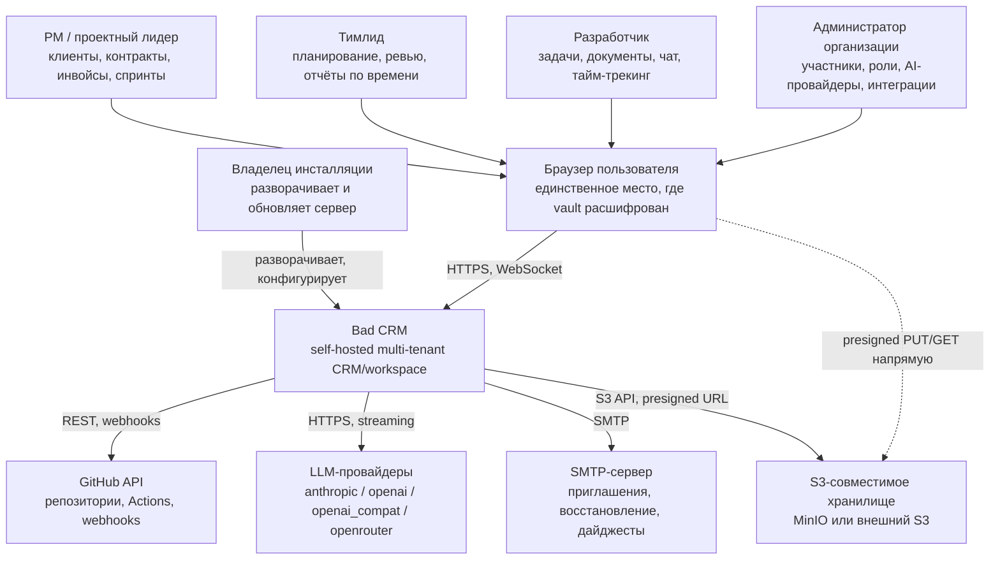
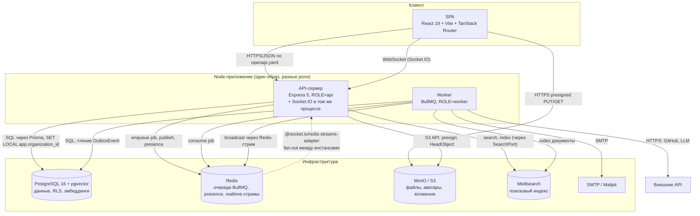
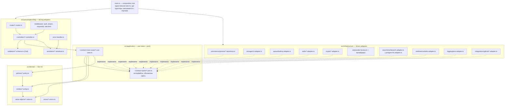
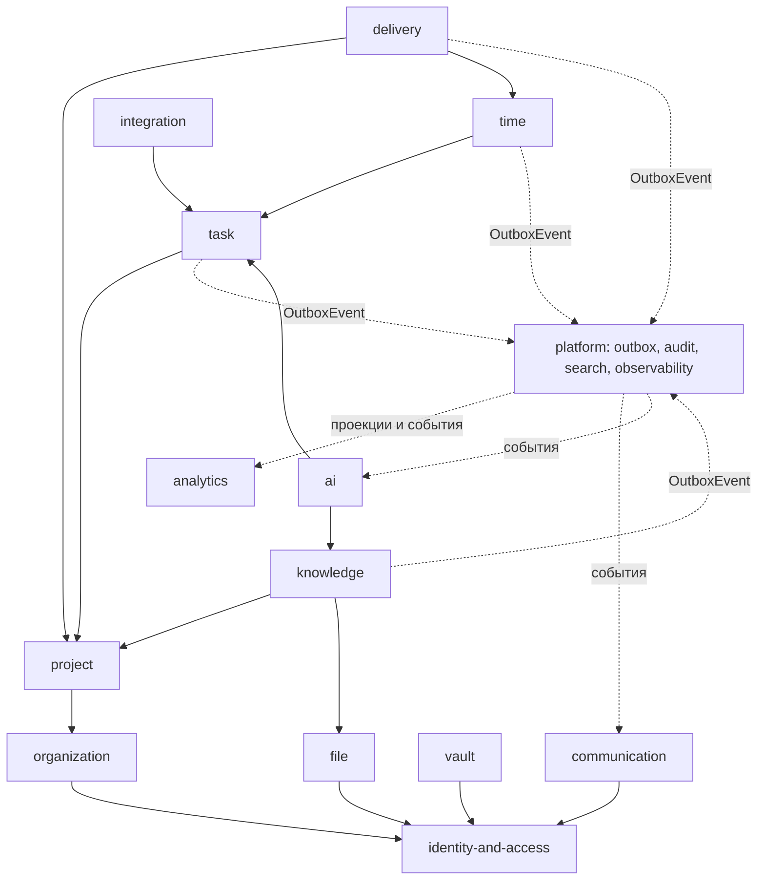
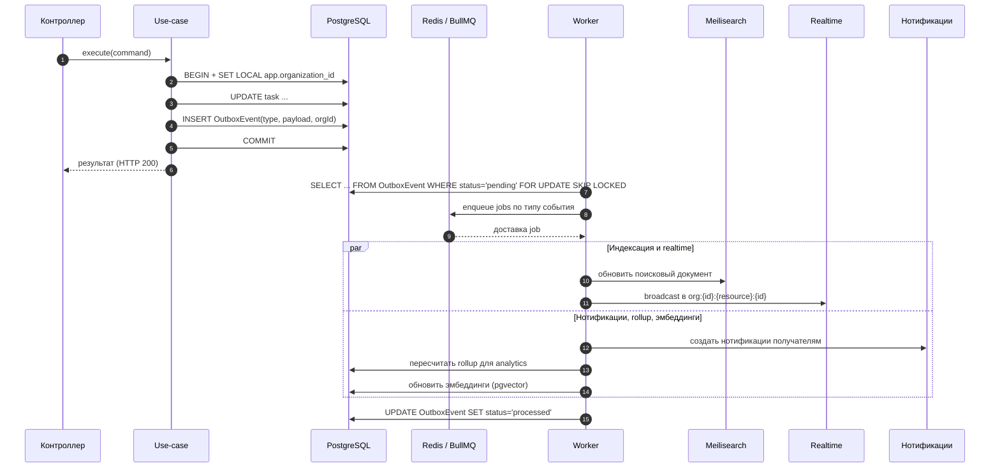
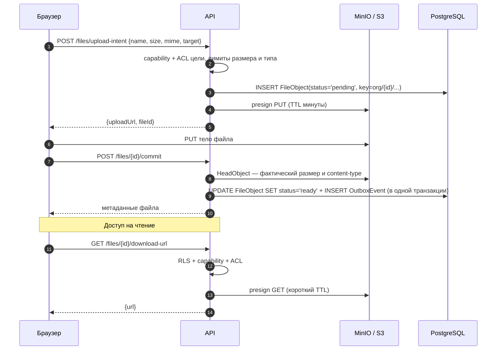
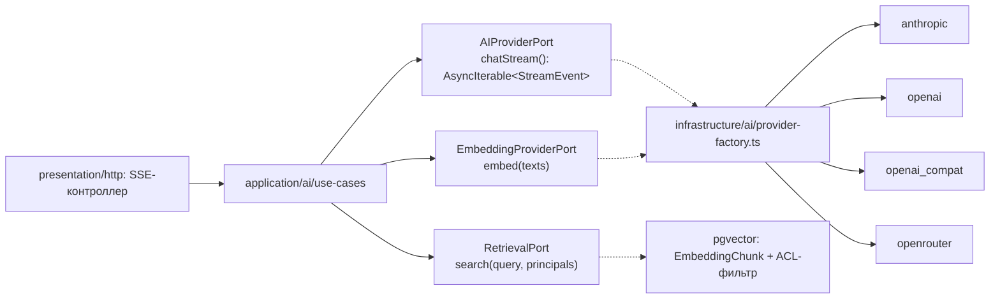
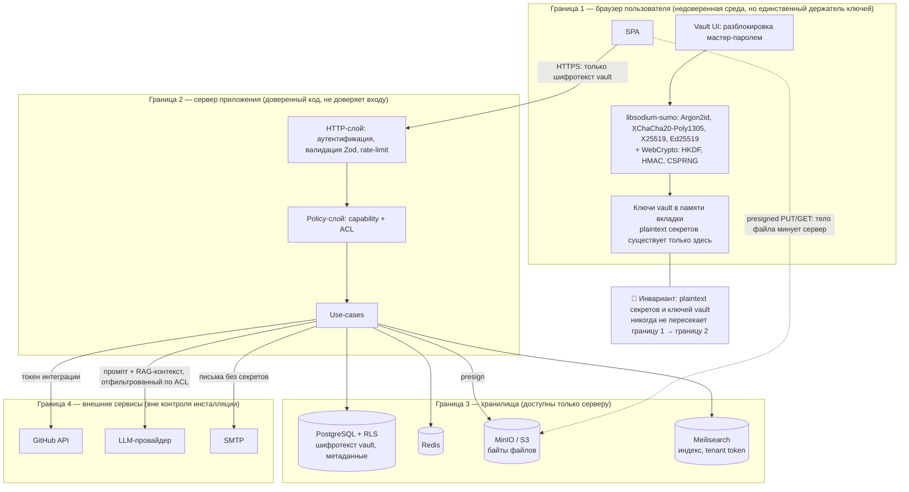
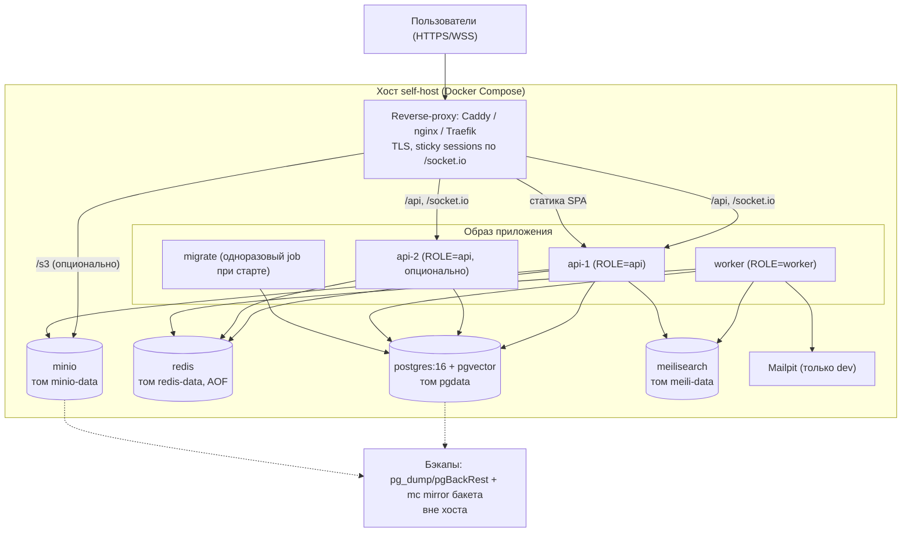

# Bad CRM — архитектурный обзор

Документ описывает систему на уровнях C4 1–3, границы контекстов, сквозные механизмы и ключевые решения.
Он не дублирует соседние документы:

- стек и версии — [`stack.md`](stack.md);
- доменная модель и Prisma-схема — [`data-model.md`](data-model.md);
- UX-архитектура, навигация, состояния экранов — [`ux-architecture.md`](ux-architecture.md);
- модель угроз, крипто-детали vault, политика секретов — [`../security/`](../security/);
- контракт API — [`../api/openapi.yaml`](../api/openapi.yaml);
- решения по отдельным вопросам — [`adr/`](adr/).

---

## Назначение и границы системы

Bad CRM — **self-hosted** CRM/workspace для команд разработки. Один инсталляционный экземпляр обслуживает
несколько организаций (multi-tenant), лицензия AGPL-3.0, интерфейс EN/RU.

**Система делает:**

- ведёт проекты, канбан-задачи, спринты и вехи;
- хранит знания: markdown-базу знаний (Obsidian-like) и блочные документы (Notion-like);
- хранит секреты в E2EE-vault и выдаёт защищённые (одноразовые/ограниченные) ссылки на них;
- хранит файлы в S3-совместимом хранилище с доступом по ACL;
- учитывает время и строит дашборды по проектам, людям и деньгам;
- даёт командный чат и нотификации в реальном времени;
- подтягивает статусы GitHub Actions и связывает их с задачами;
- даёт AI-ассистента (чат + поиск по своим данным) на провайдере, который выбирает администратор;
- ведёт проектное лидерство: клиенты, контракты, инвойсы, звонки;
- ведёт онбординг новых участников организации.

**Система принципиально не делает:**

| Не делает | Почему |
|---|---|
| Не хостится нами как SaaS | Продукт распространяется как образ/compose для self-host; у проекта нет операционной ответственности за чужие инсталляции. |
| Не расшифровывает содержимое vault | Сервер хранит только шифротекст; ключи не покидают браузер (см. [`../security/`](../security/) и [ADR-0009](adr/0009-e2ee-vault-key-hierarchy.md)). |
| Не является платёжным процессором | Инвойс — документ и статус, а не транзакция; интеграции с эквайрингом вне скоупа. |
| Не заменяет git-хостинг и CI | GitHub — внешняя система; мы читаем её состояние, но не исполняем пайплайны. |
| Не даёт офлайн-режим и одновременное посимвольное соредактирование | См. раздел «Что осознанно НЕ делаем сейчас». |
| Не выступает identity-провайдером для сторонних приложений | Аутентификация — только внутренняя, OIDC-провайдером наружу не работаем. |

---

## C4 уровень 1 — контекст



Пунктирная стрелка браузер → S3 существенна: тело файла не проходит через API-сервер
(см. «Сквозные механизмы → файловый путь»).

---

## C4 уровень 2 — контейнеры



**Почему Socket.IO живёт внутри API-процесса, а не отдельным контейнером.**
Handshake переиспользует ту же проверку токена и тот же policy-слой, что HTTP-запросы, — иначе логика
авторизации существует в двух местах и расходится. Для self-host важна цена запуска: один образ, один
процесс на роль `api`. Горизонтальное масштабирование уже обеспечено
`@socket.io/redis-streams-adapter` — fan-out идёт через Redis, а не через общую память процесса.
Цена решения: долгоживущие WS-соединения делят event loop с HTTP-обработкой. Отделение остаётся
дешёвым: broadcast скрыт за `RealtimeBroadcastPort`, а reverse-proxy маршрутизирует `/socket.io` на
отдельный набор инстансов того же образа — клиент при этом не меняется. Делаем это, когда измерения
покажут конкуренцию за event loop, а не заранее.

**Worker — отдельный процесс с первого дня.** Он потребляет outbox и внешние API (LLM-стриминг,
GitHub), где одна медленная операция иначе занимала бы поток обработки HTTP.

---

## C4 уровень 3 — компоненты backend

Гексагональная архитектура: зависимости направлены **внутрь**. `domain` не знает ни о Prisma, ни об
Express; `application` знает только собственные порты; конкретные адаптеры подставляет composition root.



Проверяемые следствия правил (кандидаты в lint-правила и архитектурные тесты):

1. В `src/domain/**` нет импортов из `@prisma/client`, `express`, `ioredis`, `node:fs`.
2. В `src/application/**` нет импортов из `src/infrastructure/**` — только собственные `ports`.
3. Интерфейс порта объявлен в `application/<context>/ports`, реализация — в `infrastructure`; обратного
   направления нет.
4. Контроллер не обращается к репозиторию напрямую — только к use-case.
5. Каждый route из `routes/**` присутствует в `docs/api/openapi.yaml`, и наоборот
   ([ADR-0003](adr/0003-openapi-as-source-of-truth.md)) — это контрактный тест, а не соглашение.

---

## Ограниченные контексты (bounded contexts)

Контекст — единица владения данными. **Чужие таблицы контекст не читает**: обращение идёт через порт,
объявленный в `application/<context>/ports`, чью реализацию предоставляет владелец данных, либо через
событие в outbox. Технически это подкрепляется правилом: репозиторий контекста работает только с
Prisma-моделями своего контекста; кросс-контекстные запросы делаются use-case-ом владельца.

Идентификаторы эпиков соответствуют каталогам `epics/epic-NNN-<slug>/`; актуальный борд —
[`../../epics/README.md`](../../epics/README.md). Полный список сущностей — в
[`data-model.md`](data-model.md).

| Контекст | Ответственность | Ключевые сущности | Зависит от | Эпики |
|---|---|---|---|---|
| identity-and-access | Аутентификация, сессии и refresh, роли и разрешения, приглашения, ACL ресурсов | `User`, `EmployeeProfile`, `Session`, `Role`, `Permission`, `UserRole`, `UserPermissionOverride`, `Invitation`, `ResourceAcl` | platform | EPIC-006, EPIC-011, EPIC-012, EPIC-013 |
| organization | Арендатор, настройки, команды, онбординг-треки и материалы | `Organization`, `Team`, `TeamMember`, `OnboardingTrack`, `OnboardingStep`, `OnboardingProgress`, `MaterialArticle` | identity-and-access | EPIC-005, EPIC-012, EPIC-040 |
| project | Проекты, участники проекта, метки | `Project`, `ProjectMember`, `Label` | organization, identity-and-access | EPIC-014 |
| task | Доски, колонки, задачи, связи, комментарии, вложения | `Board`, `BoardColumn`, `Task`, `TaskAssignee`, `TaskLink`, `Comment`, `Attachment`, `Watcher`, `ActivityEvent` | project | EPIC-018, EPIC-019, EPIC-020, EPIC-021 |
| knowledge | Блочные документы (JSON) и markdown-база знаний, связи и теги | `DocPage`, `DocPageVersion`, `KbSpace`, `KbNote`, `KbLink`, `KbTag` | project, file | EPIC-022, EPIC-023 |
| file | Загрузка, версии, папки, вложения | `File`, `FileVersion`, `FileFolder` | identity-and-access | EPIC-015 |
| vault | E2EE-секреты, иерархия ключей, защищённые ссылки | `UserKeyPair`, `Vault`, `VaultMembership`, `VaultItem`, `SecureLink`, `SecureLinkGrant` | identity-and-access | EPIC-033, EPIC-034, EPIC-035, EPIC-036 |
| time | Тайм-трекинг, единая факт-таблица записей, табели и утверждение | `TimeEntry`, `RunningTimer`, `Timesheet`, `Activity`, `CostRate`, `BillRate` | task, project | EPIC-029, EPIC-030 |
| communication | Каналы, сообщения, треды, реакции, нотификации и их настройки | `Channel`, `ChannelMember`, `Message`, `MessageReaction`, `Notification`, `NotificationPreference` | identity-and-access, platform | EPIC-025, EPIC-026, EPIC-027, EPIC-028 |
| analytics | Дашборды, карточки дашбордов, сохранённые представления, rollup-агрегаты | `TimeRollupDaily`, `AIUsageDaily`, `Dashboard`, `DashboardCard`, `DashboardCardState`, `SavedView` | platform (outbox), читает проекции | EPIC-031, EPIC-032 |
| integration | GitHub: связь репозиториев, статусы Actions, деплои, webhooks | `GithubInstallation`, `RepoLink`, `WorkflowRun`, `WorkflowJob`, `Deployment`, `CommitRef` | project, task, platform | EPIC-037 |
| ai | Конфигурация провайдеров, треды ассистента, эмбеддинги и RAG | `AIProvider`, `AIThread`, `AIMessage`, `Embedding`, `AIToolPolicy` | knowledge, task, platform | EPIC-038, EPIC-039 |
| delivery | Клиенты, контракты, инвойсы, спринты, вехи приёмки, звонки, риски | `Client`, `ClientContact`, `Contract`, `ContractRate`, `Invoice`, `InvoiceLine`, `InvoiceNumberSequence`, `Payment`, `Budget`, `BudgetPlanPoint`, `Sprint`, `Milestone`, `Call`, `CallParticipant`, `CallSummary`, `ActionItem`, `ProjectRisk`, `Stakeholder` | project, time | EPIC-041, EPIC-042, EPIC-043, EPIC-044 |
| platform | Outbox, аудит, поисковый индекс и его состояние, observability, планировщик | `OutboxEvent`, `AuditLog`, `SearchIndexState` | — | EPIC-003, EPIC-009, EPIC-016, EPIC-024 |

Имена сущностей совпадают с [`data-model.md`](data-model.md) — он источник правды. Прежний пробел
модели по доменам ТЗ 12/13 (дашборды, drill-down) и 17 (материалы и онбординг) **закрыт**: группа 15
`data-model.md` описывает `Dashboard`, `DashboardCard`, `DashboardCardState`, `SavedView`,
`OnboardingTrack`, `OnboardingStep`, `OnboardingProgress`, `MaterialArticle`, поэтому пометок
«не описано» здесь больше нет.

Два уточнения, ранее расходившиеся с моделью данных, — *приведено в соответствие 2026-07-26*:

- **`Milestone` принадлежит `delivery`, а не `project`.** Её жизненный цикл определяется приёмкой
  заказчиком (`contractId`, `acceptedByContactId`, `amountMicros`, `invoiceId`), а не структурой
  работ; для fixed-price контрактов приёмка вехи и есть событие выставления счёта.
- **Карточка дашборда называется `DashboardCard`, а не `Widget`.** Слово «виджет» в этом коде занято
  слоем FSD `widgets` (составные блоки UI, суффикс `.widget.tsx`), и одноимённая доменная сущность
  сделала бы неоднозначным каждое упоминание. Канон — `Dashboard` / `DashboardCard`.

Направление связей и запрещённые обращения:



Сплошная стрелка — синхронный вызов через порт; пунктирная — асинхронная связь через outbox.
`analytics` не ходит в таблицы `task`/`time` напрямую: он строится на событиях и своих
rollup-таблицах, поэтому изменение схемы задач не ломает дашборды.

---

## Сквозные механизмы

### (а) Tenancy и RLS

`organizationId` присутствует на каждой таблице с данными арендатора. Изоляция обеспечивается на уровне
Postgres Row-Level Security, а не только кодом приложения ([ADR-0004](adr/0004-multi-tenancy-postgres-rls.md)).

**Как определяется арендатор.** Авторитетный источник — **сессия** (claim `org` в access-токене),
и только он используется для RLS. Поддомен (`acme.example.com`, см.
[`ux-architecture.md`](ux-architecture.md)) — исключительно клиентская навигационная подсказка: он
выбирает, какую сессию открыть, но сервер никогда не берёт `organizationId` из `Host`. Несовпадение
поддомена и сессии приводит к редиректу на логин, а не к смене контекста. Путь URL арендатора не
содержит — маршруты одинаковы для всех инсталляций.

Механика: HTTP-middleware извлекает `organizationId` из сессии, кладёт его в `AsyncLocalStorage`;
Prisma-расширение (`$extends`) открывает транзакцию и первым запросом выполняет
`SET LOCAL app.organization_id = $1`. RLS-политика каждой таблицы сравнивает колонку с
`current_setting('app.organization_id')`. `SET LOCAL` действует до конца транзакции, поэтому значение
не «залипает» на соединении из пула.

Правила, делающие механизм проверяемым:

1. Приложение подключается к БД под ролью **без** `BYPASSRLS`; миграции — под отдельной ролью-владельцем.
2. Любой запрос к данным арендатора выполняется внутри транзакции расширения; запрос вне неё падает,
   а не возвращает чужие строки (политика без установленного GUC не пропускает ни одной строки).
3. RLS — **только изоляция арендаторов**. Она отвечает на вопрос «чья это организация», но не на вопрос
   «имеет ли этот пользователь право на этот ресурс». Второе — policy-слой в `domain`.
4. Тест на изоляцию: для каждой таблицы автотест пытается прочитать строку чужой организации при
   корректно установленном GUC и ожидает пустой результат.

### (б) Авторизация: permission (capability) + resource ACL (конъюнкция)

Термин ubiquitous language — **permission** (`Permission`, `RolePermission`,
`UserPermissionOverride`); слово «capability» используется ниже как его синоним в описании модели и
в коде не заводится (см. [`../product/glossary.md`](../product/glossary.md)).

Разрешение вычисляется как **конъюнкция двух независимых проверок** ([ADR-0008](adr/0008-permission-model-rbac-plus-acl.md)):

```
allow = tenantMatches(RLS)
      AND hasCapability(user, "task:update")
      AND resourceAclAllows(user, task, "update")
```

- **Capability** — что роль в принципе может делать в организации/проекте (`task:update`,
  `invoice:issue`, `vault:share`). Роль → набор capability, набор фиксирован в коде, не в БД-строках
  свободной формы.
- **Resource ACL** — доступ к конкретному ресурсу и его поддереву (приватный проект, документ с
  ограниченным доступом, элемент vault). Принципалы: `user:*`, `team:*`, `project:*`.
- Отсутствие ACL у ресурса означает «наследовать от родителя», а не «разрешено всем»; явный `deny`
  побеждает любой `allow`.

Проверка живёт в `domain/policies/*.policy.ts` — чистые функции без I/O, поэтому покрываются юнит-тестами
без базы. Use-case загружает нужный контекст (membership, ACL) через порт и передаёт в policy.

### (в) Транзакционный outbox

Единственный способ породить побочный эффект от изменения данных ([ADR-0021](adr/0021-transactional-outbox.md)).
Доменная запись и `OutboxEvent` пишутся **в одной транзакции** — событие не может потеряться при
успешной записи и не может появиться при откате.



Свойства и их следствия:

- **Доставка at-least-once** → каждый обработчик обязан быть идемпотентным; ключ идемпотентности —
  `outboxEventId` + имя обработчика.
- **Ретраи с экспоненциальной задержкой**, после исчерпания — DLQ-очередь; событие остаётся в БД со
  статусом `failed`, а не исчезает.
- **Reconciliation-джоб** периодически ищет события в статусе `pending` старше порога (упал воркер между
  выборкой и enqueue) и события `processing`, зависшие дольше таймаута, и возвращает их в работу.
- Поисковый индекс и rollup-таблицы — **производное состояние**: их можно удалить и восстановить
  переигрыванием из БД. Это же делает Meilisearch не-бэкапируемым (см. «Развёртывание»).

### (г) Файловый путь

Тело файла не проходит через API-процесс ([ADR-0015](adr/0015-s3-file-storage-presigned-urls.md)).



- Ключ объекта всегда начинается с `org/{organizationId}/` — префикс проверяется при commit, поэтому
  подменённый ключ не привяжет чужой объект.
- Заявленные клиентом `size`/`mime` не доверяются: истина — ответ `HeadObject`.
- Незакоммиченные `FileObject` старше порога и осиротевшие объекты в бакете чистит фоновая джоба.
- Публичного бакета нет: любое чтение — presigned GET после проверки ACL.

### (д) Realtime

- **Handshake-авторизация**: токен передаётся в `handshake.auth`, проверяется тем же кодом, что и
  HTTP-middleware. Неавторизованное соединение закрывается до `connect`.
- **Комнаты строго `org:{orgId}:{resource}:{resourceId}`**. Имя комнаты формирует сервер из проверенных
  данных; клиентский запрос на подписку проходит ту же policy-проверку, что и HTTP-чтение ресурса.
  Клиент не может «сам зайти» в комнату.
- **Fan-out между инстансами** — `@socket.io/redis-streams-adapter`; воркер публикует события в тот же
  Redis-стрим, поэтому не обязан держать сокеты.
- **Presence** — ключи в Redis с TTL и heartbeat от клиента; при обрыве соединения запись истекает сама,
  без «зависших онлайн» после падения инстанса.
- Realtime — транспорт уведомлений о фактах, а не источник истины. Клиент на событие инвалидирует
  соответствующий query-key TanStack Query; расхождение лечится обычным рефетчем.

### (е) Поиск

Индексируемый документ содержит поля доступа, а не только контент ([ADR-0011](adr/0011-meilisearch-permission-aware-search.md)):

```
{ id, organizationId, entityType, title, body, projectId, updatedAt,
  visibleTo: ["user:u1", "team:t3", "project:p7"] }
```

Запрос фильтруется по `visibleTo IN [принципалы текущего пользователя]`. Дополнительный барьер —
Meilisearch **tenant token**, выпускаемый API с жёстко зашитым фильтром `organizationId = ...`: даже
ошибка в сборке пользовательского фильтра не выдаст документ чужого арендатора.

Индексация идёт только через outbox — прямых вызовов индексатора из use-case нет, поэтому «запись
прошла, индекс не обновился» невозможно при успешной транзакции. Изменение ACL ресурса тоже порождает
событие переиндексации.

Порт `SearchPort` имеет два адаптера: `meilisearch` (полный профиль) и `postgres-fts` (профиль
`minimal`, полнотекстовый поиск Postgres). Профиль выбирается конфигурацией в composition root;
контракт порта и permission-фильтрация одинаковы для обоих.

### (ж) AI



- Провайдер выбирает и настраивает администратор организации; ключи хранятся зашифрованными и никогда
  не отдаются клиенту. Смена провайдера не затрагивает `application` — только фабрику.
- Стриминг: порт возвращает `AsyncIterable<StreamEvent>`, контроллер транслирует его в SSE. Абстракция
  скрывает различия форматов провайдеров, а не «сглаживает» их постфактум на клиенте.
- **RAG permission-aware**: retrieval по pgvector фильтрует чанки теми же принципалами, что и поиск, и
  тем же `organizationId` под RLS. Фильтр применяется **до** формирования контекста, поэтому недоступный
  документ не может попасть в промпт даже частично.
- Профиль `minimal` не поднимает AI: фичи скрыты флагом, порты не резолвятся, эндпоинты возвращают
  «функция отключена».

Подробности — [ADR-0014](adr/0014-ai-provider-abstraction.md).

### (з) Observability

Сквозной контекст `requestId → organizationId → userId`:

1. Middleware генерирует (или принимает от reverse-proxy) `requestId` и кладёт вместе с
   `organizationId`/`userId` в `AsyncLocalStorage`.
2. Логгер (pino) берёт эти поля из хранилища — их не нужно передавать параметром в каждый вызов.
   Логи структурные, JSON.
3. При постановке job в BullMQ контекст кладётся в payload, воркер восстанавливает его перед обработкой,
   поэтому цепочка «HTTP-запрос → outbox-событие → job → broadcast» прослеживается по одному `requestId`.
4. Realtime-события и аудит-записи несут тот же `requestId`.
5. `AuditLog` — отдельный от логов механизм: он часть данных арендатора (под RLS) и переживает ротацию
   логов.

Правило: секреты, тела vault-элементов, содержимое сообщений и AI-промпты в логи не попадают — логируются
идентификаторы и размеры, но не полезная нагрузка.

---

## Границы доверия и потоки данных



Что из этого следует буквально:

- Мастер-пароль и производные ключи vault не отправляются на сервер ни при каких операциях, включая
  поиск по vault и выдачу защищённой ссылки: ссылка передаёт ключ во фрагменте URL (`#`), который
  браузер не отправляет серверу.
- Сервер не может восстановить содержимое vault — ни по бэкапу БД, ни по логам. Потеря мастер-пароля без
  механизма восстановления означает потерю данных; это осознанная цена, описана в
  [`../security/`](../security/) и [ADR-0009](adr/0009-e2ee-vault-key-hierarchy.md).
- Vault-элементы не индексируются в Meilisearch и не попадают в эмбеддинги: индексируются только
  незашифрованные метаданные (имя, папка), если пользователь их не зашифровал.
- Данные, уходящие к LLM-провайдеру, покидают периметр инсталляции. Это видимый пользователю факт:
  AI отключается на уровне организации, а провайдер задаётся администратором явно.
- Всё, что приходит из браузера, GitHub-webhook и ответов LLM, считается недоверенным входом:
  валидация Zod на границе, экранирование при рендере, проверка подписи webhook.

---

## Ключевые архитектурные решения

| Решение | Альтернатива | Почему так | ADR |
|---|---|---|---|
| Монорепо pnpm workspaces + turborepo, пакеты `client/server/shared/e2e` | Polyrepo; npm/yarn workspaces без кэша задач | Общие типы и Zod-схемы в `shared` без публикации пакетов; кэш turborepo делает CI приемлемым для одного мейнтейнера | [0001](adr/0001-monorepo-pnpm-turborepo.md) |
| Гексагональный backend на Express 5 + Prisma | Слоистый MVC; NestJS с DI-контейнером | Домен и policy тестируются без БД и HTTP; смена адаптера (поиск, AI, storage) не трогает use-cases; без «магии» декораторов, дешевле для контрибьюторов; ADR-0002 охватывает и выбор ветки Express 5.x (встроенная обработка async-ошибок, `asyncHandler` не нужен) | [0002](adr/0002-hexagonal-backend-express-prisma.md) |
| `docs/api/openapi.yaml` — source of truth; типы клиента генерируются | Генерация OpenAPI из кода; ручные типы на клиенте | Контракт нельзя изменить незаметно; контрактный тест «route ↔ спецификация» ловит расхождение в CI, а не в проде | [0003](adr/0003-openapi-as-source-of-truth.md) |
| Multi-tenant: `organizationId` везде + Postgres RLS | Схема на арендатора; отдельная БД на арендатора; фильтрация только в коде | Ошибка в `WHERE` не приводит к утечке между арендаторами; одна схема — одна миграция, что критично для self-host обновлений | [0004](adr/0004-multi-tenancy-postgres-rls.md) |
| FSD «units» на фронтенде, слои `app → pages → widgets → units → shared` | Группировка по типам файлов; feature-folders без слоёв | Направление зависимостей проверяемо линтером; доменная логика в `units`, а не в компонентах | [0005](adr/0005-fsd-units-frontend-architecture.md) |
| Mantine 9 + CSS Modules, без Tailwind | Tailwind + headless-kit; MUI; собственный дизайн-система | Готовые сложные компоненты (таблицы, дровера, даты) закрывают большую часть UI; CSS Modules — рекомендованный автором Mantine путь, нет войны каскадов | [0006](adr/0006-mantine-css-modules-no-tailwind.md) |
| TanStack Router (file-based, `validateSearch: zodValidator`, `beforeLoad`-guards) + TanStack Query v5 | react-router + ручной парсинг query; Next.js | Фильтры и пагинация живут в URL и типизированы схемой; guard срабатывает до загрузки данных; loader и кэш не дублируют запросы | [0007](adr/0007-tanstack-router-and-query.md) |
| Авторизация = capability (RBAC) ∧ resource ACL | Только RBAC; только ACL; ABAC-движок | RBAC отвечает «что может роль», ACL — «к чему допущен ресурс»; конъюнкция даёт приватные проекты без размножения ролей | [0008](adr/0008-permission-model-rbac-plus-acl.md) |
| E2EE vault с иерархией ключей, сервер видит только шифротекст | Шифрование на сервере ключом инсталляции; хранение в открытом виде под ACL | Компрометация БД или бэкапа не раскрывает секреты; цена — невозможность серверного восстановления и поиска по содержимому | [0009](adr/0009-e2ee-vault-key-hierarchy.md) |
| Socket.IO + `@socket.io/redis-streams-adapter`, комнаты `org:{id}:{resource}:{id}` | Голый WebSocket; SSE; поллинг | Комнаты и переподключение из коробки; Redis Streams даёт fan-out между инстансами и переживает рестарт лучше pub/sub | [0010](adr/0010-realtime-socketio-redis-adapter.md) |
| Meilisearch с permission-aware документами и tenant token | Postgres FTS как основной поиск; Elasticsearch | Приемлемая релевантность и опечатки из коробки при малом потреблении ресурсов; ES слишком тяжёл для self-host по умолчанию | [0011](adr/0011-meilisearch-permission-aware-search.md) |
| Документы: BlockNote, контент хранится как JSON | Хранение HTML; markdown для документов тоже | Блочная структура нужна для якорей, комментариев и частичных обновлений; JSON версионируется предсказуемо | [0012](adr/0012-docs-editor-blocknote-json-content.md) |
| База знаний: markdown — source of truth | Хранить KB в том же блочном JSON | Совместимость с Obsidian и git-экспортом, переносимость данных пользователя — часть обещания AGPL-продукта | [0013](adr/0013-kb-markdown-source-of-truth.md) |
| Абстракция AI-провайдера: порты + `provider-factory` | Прямая интеграция с одним вендором; LangChain | Администратор выбирает вендора, включая локальный `openai_compat`; стриминг унифицирован на уровне порта | [0014](adr/0014-ai-provider-abstraction.md) |
| Файлы в S3-совместимом хранилище через presigned URL | Файлы в БД; локальный диск; проксирование через API | Тело файла не занимает event loop и не удваивает трафик; локальный диск ломает горизонтальное масштабирование | [0015](adr/0015-s3-file-storage-presigned-urls.md) |
| Тайм-трекинг: единая факт-таблица `TimeEntry` для всех видов времени (задача, проект, нетасковые категории), источник записи — поле `source`; состояние активного таймера вынесено в `RunningTimer` с `userId @unique` | Отдельные модели `TaskTimeEntry`/`ProjectTimeEntry`/`InternalTimeEntry`; активный таймер как `TimeEntry` без `endedAt` | Отчёты, экспорт и биллинг не ветвятся по источнику; инвариант «один активный таймер на человека» гарантирует БД, а незакрытая запись не портит агрегаты (см. [`data-model.md`](data-model.md), гл. 9) | [0016](adr/0016-time-tracking-single-entry-model.md) |
| Графики — `@mantine/charts` | Recharts напрямую; ECharts; D3 | Единая тема и токены с остальным UI, отсутствие второго стилевого источника; потолок возможностей принят осознанно | [0017](adr/0017-charts-mantine-charts.md) |
| Лицензия AGPL-3.0 | MIT/Apache-2.0; BSL | Модификации при сетевом использовании остаются открытыми — это цель проекта, а не побочный эффект | [0018](adr/0018-license-agpl-3.md) |
| i18n EN/RU на i18next, ключи вместо строк | Одна локаль; собственный словарь | Второй язык с первого дня не даёт накопиться хардкод-строкам; смена локали не требует перезагрузки | [0019](adr/0019-i18n-en-ru-i18next.md) |
| Пакетирование self-host: Docker + docker compose, профиль `minimal` | Только исходники; Helm-чарт как основной путь; бинарь | Одна команда до рабочего экземпляра; профиль `minimal` снижает требования к железу, отключая Meilisearch и AI | [0020](adr/0020-self-host-packaging-docker.md) |
| Транзакционный outbox как единая точка побочных эффектов | Прямые вызовы индексатора и broadcast из use-case; CDC/Debezium | Событие и запись атомарны; ретраи и DLQ в одном месте; CDC добавляет инфраструктуру, несовместимую с «одной командой» | [0021](adr/0021-transactional-outbox.md) |

---

## Развёртывание

Базовый сценарий self-host: один хост, docker compose, reverse-proxy с TLS.



Существенные детали:

- **Sticky sessions** нужны, пока разрешён HTTP long-polling fallback Socket.IO: рукопожатие и
  последующие polling-запросы должны попадать в один инстанс. Включаются по cookie/ip-hash на
  `/socket.io`. Альтернатива — форсировать `transports: ['websocket']` и отказаться от fallback; по
  умолчанию не делаем, потому что часть корпоративных прокси режет WebSocket.
- **Тома, требующие бэкапа:** `pgdata` (истина по всем данным, включая шифротекст vault) и `minio-data`
  (тела файлов). `meili-data` **не бэкапим** — индекс восстанавливается переигрыванием из БД.
  `redis-data` не критичен: очереди восстанавливаются из outbox, presence эфемерен.
- **Миграции** выполняет одноразовый контейнер до старта `api`/`worker`; роль-владелец схемы отличается
  от роли приложения (у приложения нет `BYPASSRLS`).
- **Профиль `minimal`**: контейнеры Meilisearch и AI-зависимости не поднимаются; `SearchPort`
  резолвится в `postgres-fts.adapter.ts`, AI-фичи отключены флагом и скрыты в UI. Требования к памяти
  снижаются до Postgres + Redis + MinIO + приложение. Переход `minimal → full` — поднять контейнер и
  запустить полную переиндексацию из БД, без миграции данных.
- **Обновление**: образ + миграции, совместимые вперёд на один релиз (сначала миграция, потом новый код),
  чтобы обновление одноинстансной инсталляции не требовало окна простоя больше рестарта.

Операционные процедуры (бэкап, восстановление, ротация ключей, переиндексация) — в
[`../runbooks/`](../runbooks/).

---

## Что осознанно НЕ делаем сейчас

| Не делаем | Обоснование в одну строку |
|---|---|
| Микросервисы | Границы контекстов уже соблюдаются модулями и портами; распределённые транзакции и эксплуатация N сервисов противоречат цели «self-host одной командой». |
| CRDT-коллаборация (одновременное посимвольное редактирование) | Требует отдельного слоя синхронизации и хранения истории операций; блочные документы с оптимистичной блокировкой и версиями закрывают реальный сценарий команды из 5–20 человек. |
| Отдельная векторная БД (Qdrant/Weaviate/Pinecone) | pgvector в уже существующем Postgres даёт транзакционную консистентность эмбеддингов с данными и не добавляет контейнер в compose. |
| Kubernetes как основной путь установки | Основная аудитория ставит на один VPS; манифесты/чарт возможны как community-дополнение, но не определяют архитектуру. |
| Мобильное приложение | Стоимость второго клиента не окупается до стабилизации API; адаптивный веб покрывает мобильные сценарии просмотра и комментирования. |
| SSO (SAML/OIDC/LDAP) | Внутренняя аутентификация проще аудируется на старте, а корпоративный SSO востребован только при внедрениях, которых у проекта пока нет; порт аутентификации оставляет место для адаптера. |

Каждый пункт — отложенное, а не запрещённое решение: точки расширения (порты, разделяемые роли одного
образа, `SearchPort`, `AIProviderPort`, порт аутентификации) сохранены намеренно.
