# UX-архитектура Bad CRM

Документ описывает интерфейсный слой продукта: принципы, информационную архитектуру, полную карту
маршрутов, ключевые экраны, дизайн-систему, паттерны взаимодействия, отражение прав, доступность,
локализацию, адаптивность и границы первых майлстоунов.

Стек зафиксирован и не пересматривается: React 19 + Vite + Mantine 7 + CSS Modules
(`postcss-preset-mantine`, `light-dark()`), TanStack Router (file-based), TanStack Query v5, Zod 4,
FSD «units». Tailwind не используется.

Термины сущностей берутся из `docs/product/glossary.md` (ubiquitous language) и должны совпадать с
именами `units`, маршрутов и Zod-схем.

---

## Принципы интерфейса

Каждый принцип сформулирован проверяемо — под него можно написать тест или пункт ревью.

### 1. Состояние экрана всегда восстанавливается из URL

Любое состояние, которое пользователь захочет переслать коллеге или вернуть кнопкой «назад» —
фильтры, сортировка, страница, вкладка, открытая карточка, режим редактора, выбранный тред — живёт в
path- или search-параметрах и типизировано Zod-схемой в `validateSearch`.

**Проверка:** открыть экран, настроить его, скопировать URL, вставить в новую вкладку → экран
идентичен. `useState` для фильтра/вкладки/открытого оверлея — ошибка ревью.

**Исключения (осознанные):** несохранённый текст в редакторе, позиция скролла, состояние unlock
хранилища секретов — они не попадают в URL по соображениям безопасности и объёма.

### 2. Ни одно разрушающее действие без подтверждения и без возможности отмены

Разрушающее = необратимая потеря данных или расширение доступа (удаление проекта/доски/пространства,
отзыв доступа к vault, отзыв защищённой ссылки, удаление сотрудника, снятие роли).

**Правило:** либо `ConfirmDialog` с явным описанием последствий (для критичных — ввод имени объекта
для подтверждения), либо мягкое удаление с тостом «Отменить» на 8 секунд. Одно из двух — обязательно;
оба сразу — избыточно.

**Проверка:** для каждой мутации `delete*`/`revoke*`/`archive*` в коде есть либо `ConfirmDialog`,
либо undo-тост.

### 3. Пустое состояние всегда объясняет следующий шаг

`EmptyState` без действия запрещён. Каждое пустое состояние содержит: причину (нет данных vs не
подошёл фильтр vs нет прав), одно первичное действие и, где уместно, ссылку на документацию.

**Проверка:** «нет результатов из-за фильтра» и «сущностей ещё не создано» — визуально и текстово
разные состояния; у первого действие «Сбросить фильтры», у второго — «Создать…».

### 4. Отклик интерфейса не зависит от сети там, где ответ предсказуем

Перетаскивание карточек, чекбоксы, реордер, лайки, тоггл избранного, отправка сообщения в чат
обновляются оптимистично со снапшотом и откатом. Всё, что порождает новую сущность с
серверными идентификаторами, деньгами или криптографией (создание задачи, инвойса, записи в vault,
выпуск защищённой ссылки), — пессимистично.

**Проверка:** в `onMutate` есть snapshot + `setQueriesData`, в `onError` — `rollbackOptimistic`, в
`onSettled` — `invalidateQueries`.

### 5. Одно действие — ровно один сигнал

Единственный источник тоста об ошибке мутации — глобальный `MutationCache.onError`. Локальный
`onError` переопределяет его, а не добавляет второй тост. Валидация формы — inline у поля. Ошибка
загрузки списка — inline `DataState` с retry. Загрузка от кнопки — `loading` на кнопке.

**Проверка:** нет ни одного `try/catch` с `notify.error` вокруг вызова, у которого уже есть
`onError`; нет `notifications.show` в теле компонента.

### 6. Права видны заранее, но авторитет — на сервере

Интерфейс не показывает пользователю тупики: недоступное действие либо скрыто, либо показано
`disabled` с объяснением в тултипе. При этом клиентская проверка — только подсказка; сервер
проверяет каждое действие независимо, и UI обязан корректно отработать 403, даже если считал
действие разрешённым.

**Проверка:** ни одна мутация не полагается на то, что кнопка была скрыта; на 403 показывается
понятное сообщение, а не «Что-то пошло не так».

### 7. Приватное и общее визуально не смешиваются

Личные сущности (мои задачи, личный vault, мои таймшиты, черновики) отделены от организационных
разделом навигации и постоянным индикатором области видимости в `PageHeader`. Публикация личного в
общее — всегда явное действие с подтверждением.

**Проверка:** на любом экране можно ответить на вопрос «кто ещё это видит», не открывая настройки.

### 8. Три роли — один код

Дашборд, отчёты и drill-down не форкаются под роль. Роль влияет только на скоуп данных (какие
проекты и каких людей видно) и на набор доступных виджетов через `useCan()`. Отдельных компонентов
`AdminDashboard`/`ManagerDashboard` не существует.

**Проверка:** `grep` по именам компонентов не находит роль в названии; переключение роли меняет
данные, но не дерево компонентов.

### 9. Экран не «мигает» при уточнении запроса

Первичная загрузка — skeleton по форме контента. Повторные загрузки (смена фильтра, страницы,
периода) — `keepPreviousData` + ненавязчивый индикатор в тулбаре. Спиннер по центру экрана после
того, как данные уже были показаны, — ошибка.

**Проверка:** смена страницы списка не приводит к схлопыванию высоты контейнера.

---

## Информационная архитектура

Тенант (организация) адресуется хостом/поддоменом и не попадает в путь — это оставляет маршруты
короткими и одинаковыми для всех инсталляций. **Поддомен — навигационный адрес, а не источник
прав:** авторитетный `organizationId` сервер берёт из сессии (claim `org`) и только его подставляет
в RLS-контекст; несовпадение поддомена и сессии ведёт на логин, а не переключает арендатора
(см. [`overview.md`](./overview.md#а-tenancy-и-rls)). Инсталляция на одном домене без поддоменов
остаётся рабочим сценарием — тогда организация определяется исключительно сессией. Переключатель организации (для пользователей в
нескольких тенантах) живёт в подвале боковой панели и выполняет полную перезагрузку приложения,
поскольку меняет весь кеш и все права.

```mermaid
flowchart TD
    ROOT["Bad CRM — AppShell"]

    ROOT --> HEADER["Header (глобальный)"]
    ROOT --> NAV["Sidebar — основная навигация"]
    ROOT --> AUX["Личное меню (аватар)"]

    HEADER --> SEARCH["Глобальный поиск — Cmd+K, маршрут /search"]
    HEADER --> PROJSW["Переключатель проекта — пишет projectId в URL"]
    HEADER --> TIMER["Виджет активного таймера"]
    HEADER --> NOTIF["Колокольчик уведомлений"]
    HEADER --> AIBTN["AI-ассистент — дровер, маршрут /ai"]

    NAV --> PERSONAL["Личное"]
    NAV --> WORK["Работа команды"]
    NAV --> DELIV["Delivery"]
    NAV --> ADMINSEC["Администрирование"]

    PERSONAL --> DASH["Dashboard — /dashboard"]
    PERSONAL --> MYTASKS["Tasks — мои задачи /tasks"]
    PERSONAL --> MYTIME["Time — таймер и мой таймшит /time"]
    PERSONAL --> MYVAULT["Vault — личное хранилище /vault"]
    PERSONAL --> ONB["Onboarding — мой трек /onboarding"]
    PERSONAL --> MATER["Материалы — справочник /materials"]

    MATER --> MATCAT["Категория — search-параметр category"]
    MATER --> MATART["Статья — /materials/$slug"]

    WORK --> PROJ["Projects — /projects"]
    WORK --> DOCS["Docs — /docs"]
    WORK --> KB["Knowledge Base — /kb"]
    WORK --> CHAT["Chat — /chat"]
    WORK --> FILES["Files — /files"]
    WORK --> LINKS["Secure links — /links"]
    WORK --> REPORTS["Reports — /reports"]

    PROJ --> PROJONE["Проект — /projects/$projectId"]
    PROJONE --> POVERVIEW["Обзор"]
    PROJONE --> PBOARDS["Boards — доски и канбан"]
    PROJONE --> PBACKLOG["Backlog"]
    PROJONE --> PSPRINTS["Sprints проекта"]
    PROJONE --> PDOCS["Docs проекта"]
    PROJONE --> PFILES["Files проекта"]
    PROJONE --> PCI["CI — GitHub Actions"]
    PROJONE --> PMEMBERS["Участники"]
    PROJONE --> PSETTINGS["Настройки проекта"]

    KB --> KBSPACE["Пространство — /kb/$spaceId"]
    KBSPACE --> KBNOTE["Заметка по пути"]
    KBSPACE --> KBGRAPH["Граф связей"]

    CHAT --> CHCH["Канал — /chat/$channelId"]
    CHCH --> CHTHREAD["Тред — search-параметр thread"]

    MYVAULT --> VLIST["Хранилища"]
    VLIST --> VITEM["Секрет — /vault/$vaultId/item/$itemId"]
    MYVAULT --> VUNLOCK["Unlock — /vault/unlock"]

    DELIV --> CLIENTS["Клиенты"]
    DELIV --> CONTRACTS["Контракты"]
    DELIV --> INVOICES["Инвойсы"]
    DELIV --> DSPRINTS["Спринты — кросс-проектный план"]
    DELIV --> CALLS["Звонки — календарь"]

    ADMINSEC --> AMEMBERS["Сотрудники"]
    ADMINSEC --> AROLES["Роли и права — матрица"]
    ADMINSEC --> AAI["AI-провайдеры"]
    ADMINSEC --> AINT["Интеграции — GitHub и вебхуки"]
    ADMINSEC --> AAUDIT["Аудит"]
    ADMINSEC --> AORG["Организация"]
    ADMINSEC --> AONB["Онбординг-треки"]
    ADMINSEC --> AMAT["Материалы — управление"]

    AUX --> PROFILE["Профиль"]
    AUX --> APPEAR["Внешний вид и язык"]
    AUX --> SECURITY["Безопасность и сессии"]
    AUX --> TOKENS["API-токены"]
    AUX --> ORGSW["Переключатель организации"]

    PUB["Публичная зона — вне _authenticated"]
    PUB --> LOGIN["/login"]
    PUB --> INVITE["/invite/$token"]
    PUB --> RESET["/forgot-password, /reset-password/$token"]
    PUB --> SLINK["/link/$token — просмотр защищённой ссылки"]
```



### Личное vs общее

| Область | Признак | Где живёт | Индикация |
|---|---|---|---|
| Личное | видно только владельцу | верхний блок сайдбара «Личное», `/settings/*`, личный vault | бейдж «Только вы» в `PageHeader` |
| Проектное | видно участникам проекта | `/projects/$projectId/**` и глобальные разделы с `?project=` | название проекта в хлебных крошках |
| Организационное | видно всей организации по правам | Delivery, Reports, Admin | бейдж «Организация» |
| Публичное | доступно без сессии по токену | `/link/$token` | отдельная минимальная тема без AppShell |

### Глобальный поиск и переключатель проекта

- **Глобальный поиск** — `Cmd/Ctrl+K` открывает Mantine `Spotlight` с мгновенными результатами по
  задачам, документам, заметкам KB, файлам, людям и каналам. `Enter` на «Показать все результаты»
  ведёт на полноценный `/search?q=…&type=…`. Spotlight — не отдельный маршрут: он не должен ломать
  историю браузера при закрытии.
- **Переключатель проекта** — комбобокс в шапке. Внутри `/projects/$projectId/**` он меняет
  `projectId` в пути, сохраняя вкладку. В глобальных разделах (`/tasks`, `/docs`, `/files`, `/time`,
  `/reports`) он пишет `?project=` в search-параметры. То есть контекст проекта всегда в URL — либо
  как path-параметр, либо как фильтр, и никогда не в глобальном сторе.

---

## Карта маршрутов

Конвенции:

- Файлы — `src/app/routes/**`, file-based, дерево генерируется в `routeTree.gen.ts`.
- Гарды — переиспользуемые функции из `units/auth/lib/guards`: `redirectIfAuthed`, `requireSession`,
  `requireProjectMember`, `requirePermission(p)`, `requireAnyPermission(...p)`,
  `requireVaultUnlocked`. Все бросают `redirect({...})` или `notFound()` из `beforeLoad`.
- Search-схемы — Zod, лежат в `units/<unit>/model/validation/*.schema.ts`, подключаются
  `validateSearch: zodValidator(schema)`.
- Каждый маршрут с данными объявляет `pendingComponent`, `errorComponent`; секции — `notFoundComponent`.
- Все списки: `page`/`cursor`, `q`, `sort` — общие поля из `shared/lib/validation/list-search.schema.ts`.

### Публичная зона

| Маршрут | Файл route | Гард (beforeLoad) | Search-params (Zod) | Основной виджет |
|---|---|---|---|---|
| `/login` | `routes/login.tsx` | `redirectIfAuthed` | `loginSearchSchema`: `redirect?` | `LoginWidget` |
| `/forgot-password` | `routes/forgot-password.tsx` | `redirectIfAuthed` | — | `PasswordRecoveryWidget` |
| `/reset-password/$token` | `routes/reset-password.$token.tsx` | — | — | `PasswordResetWidget` |
| `/invite/$token` | `routes/invite.$token.tsx` | — | — | `InviteAcceptWidget` |
| `/oauth/$provider/callback` — **задел, в 1.0 не активируется** (SSO/OIDC — backlog, см. PRD Won't) | `routes/oauth.$provider.callback.tsx` | — | `oauthCallbackSchema`: `code`, `state`, `error?` | `OauthCallbackWidget` |
| `/link/$token` | `routes/link.$token.tsx` | — (публичный, rate-limit на сервере) | `secureLinkSearchSchema`: `download?` | `SecureLinkViewerWidget` |

### Каркас приложения

| Маршрут | Файл route | Гард (beforeLoad) | Search-params (Zod) | Основной виджет |
|---|---|---|---|---|
| — (pathless layout) | `routes/_authenticated.tsx` | `requireSession` | — | `AppShellWidget` |
| `/` | `routes/_authenticated/index.tsx` | `requireSession` → `redirect('/dashboard')` | — | — |
| `/dashboard` | `routes/_authenticated/dashboard.tsx` | `requireSession` | `dashboardSearchSchema`: `range`, `from?`, `to?`, `project?`, `scope=me\|team\|org` | `DashboardWidget` |
| `/search` | `routes/_authenticated/search.tsx` | `requireSession` | `globalSearchSchema`: `q`, `type[]`, `project?`, `page` | `GlobalSearchResultsWidget` |
| `/notifications` | `routes/_authenticated/notifications.tsx` | `requireSession` | `notificationsSearchSchema`: `filter=all\|unread\|mentions`, `cursor?` | `NotificationsWidget` |
| `/ai` | `routes/_authenticated/ai.tsx` | `requirePermission('ai:use')` | `aiSearchSchema`: `conversation?`, `context?` | `AiAssistantWidget` |

### Личные настройки

| Маршрут | Файл route | Гард (beforeLoad) | Search-params (Zod) | Основной виджет |
|---|---|---|---|---|
| `/settings` | `routes/_authenticated/settings/route.tsx` | `requireSession` | — | `SettingsLayoutWidget` |
| `/settings/profile` | `routes/_authenticated/settings/profile.tsx` | `requireSession` | — | `ProfileFormWidget` |
| `/settings/appearance` | `routes/_authenticated/settings/appearance.tsx` | `requireSession` | — | `AppearanceFormWidget` |
| `/settings/notifications` | `routes/_authenticated/settings/notifications.tsx` | `requireSession` | — | `NotificationPrefsWidget` |
| `/settings/security` | `routes/_authenticated/settings/security.tsx` | `requireSession` | — | `SecuritySessionsWidget` |
| `/settings/tokens` | `routes/_authenticated/settings/tokens.tsx` | `requireSession` | — | `ApiTokensWidget` |

### Проекты

| Маршрут | Файл route | Гард (beforeLoad) | Search-params (Zod) | Основной виджет |
|---|---|---|---|---|
| `/projects` | `routes/_authenticated/projects/index.tsx` | `requireSession` | `projectListSearchSchema`: `q`, `status[]`, `lead?`, `client?`, `view=grid\|table`, `sort`, `page` | `ProjectListWidget` |
| `/projects/$projectId` | `routes/_authenticated/projects/$projectId/route.tsx` | `requireProjectMember` | — | `ProjectLayoutWidget` |
| `/projects/$projectId/` | `routes/_authenticated/projects/$projectId/index.tsx` | наследует | `projectOverviewSchema`: `range` | `ProjectOverviewWidget` |
| `/projects/$projectId/boards` | `routes/_authenticated/projects/$projectId/boards.tsx` | наследует | `q` | `BoardListWidget` |
| `/projects/$projectId/board/$boardId` | `routes/_authenticated/projects/$projectId/board.$boardId.tsx` | наследует | `boardSearchSchema`: `q`, `assignee[]`, `label[]`, `priority[]`, `sprint?`, `swimlane=none\|assignee\|epic`, `task?` | `KanbanBoardWidget` |
| `/projects/$projectId/backlog` | `routes/_authenticated/projects/$projectId/backlog.tsx` | наследует | `backlogSearchSchema`: `q`, `label[]`, `epic?`, `sort`, `page`, `task?` | `BacklogWidget` |
| `/projects/$projectId/sprints` | `routes/_authenticated/projects/$projectId/sprints/index.tsx` | наследует | `state=active\|planned\|closed` | `ProjectSprintListWidget` |
| `/projects/$projectId/sprints/$sprintId` | `routes/_authenticated/projects/$projectId/sprints/$sprintId.tsx` | наследует | `tab=scope\|burndown\|retro` | `SprintDetailWidget` |
| `/projects/$projectId/docs` | `routes/_authenticated/projects/$projectId/docs.tsx` | наследует | `q`, `sort` | `DocListWidget` (`project` предзадан) |
| `/projects/$projectId/files` | `routes/_authenticated/projects/$projectId/files.tsx` | наследует | `fileListSearchSchema` | `FileBrowserWidget` |
| `/projects/$projectId/ci` | `routes/_authenticated/projects/$projectId/ci/index.tsx` | `requirePermission('ci:read')` | `ciRunsSearchSchema`: `workflow?`, `status[]`, `branch?`, `cursor?` | `WorkflowRunListWidget` |
| `/projects/$projectId/ci/$runId` | `routes/_authenticated/projects/$projectId/ci/$runId.tsx` | `requirePermission('ci:read')` | `job?`, `step?` | `WorkflowRunDetailWidget` |
| `/projects/$projectId/time` | `routes/_authenticated/projects/$projectId/time.tsx` | `requirePermission('time:read_team')` | `from`, `to`, `user[]` | `ProjectTimeWidget` |
| `/projects/$projectId/members` | `routes/_authenticated/projects/$projectId/members.tsx` | наследует | `q`, `role[]` | `ProjectMembersWidget` |
| `/projects/$projectId/settings` | `routes/_authenticated/projects/$projectId/settings.tsx` | `requirePermission('project:manage_settings')` | `tab=general\|integrations\|danger` | `ProjectSettingsWidget` |

### Задачи

| Маршрут | Файл route | Гард (beforeLoad) | Search-params (Zod) | Основной виджет |
|---|---|---|---|---|
| `/tasks` | `routes/_authenticated/tasks/index.tsx` | `requireSession` | `taskListSearchSchema`: `q`, `view=list\|board\|calendar`, `status[]`, `priority[]`, `assignee[]` (по умолчанию `me`), `project[]`, `label[]`, `due?`, `sort`, `page`, `task?` | `MyTasksWidget` |
| `/tasks/$taskId` | `routes/_authenticated/tasks/$taskId.tsx` | `requireTaskAccess` | `tab=activity\|comments\|worklog\|links` | `TaskDetailWidget` |

### Документы (Notion-like)

| Маршрут | Файл route | Гард (beforeLoad) | Search-params (Zod) | Основной виджет |
|---|---|---|---|---|
| `/docs` | `routes/_authenticated/docs/index.tsx` | `requireSession` | `docListSearchSchema`: `q`, `project[]`, `owner?`, `favorite?`, `sort`, `page` | `DocListWidget` |
| `/docs/$docId` | `routes/_authenticated/docs/$docId/index.tsx` | `requireDocAccess` | `docViewSearchSchema`: `mode=view\|edit`, `block?`, `comment?` | `DocEditorWidget` |
| `/docs/$docId/history` | `routes/_authenticated/docs/$docId/history.tsx` | `requireDocAccess` | `version?` | `DocHistoryWidget` |
| `/docs/$docId/share` | `routes/_authenticated/docs/$docId/share.tsx` | `requirePermission('doc:share')` | — | `DocSharingWidget` |

### База знаний (Obsidian-like)

| Маршрут | Файл route | Гард (beforeLoad) | Search-params (Zod) | Основной виджет |
|---|---|---|---|---|
| `/kb` | `routes/_authenticated/kb/index.tsx` | `requireSession` | `q` | `KbSpaceListWidget` |
| `/kb/$spaceId` | `routes/_authenticated/kb/$spaceId/route.tsx` | `requireKbSpaceAccess` | — | `KbSpaceLayoutWidget` |
| `/kb/$spaceId/` | `routes/_authenticated/kb/$spaceId/index.tsx` | наследует | `kbListSearchSchema`: `q`, `tag[]`, `sort`, `page` | `KbNoteListWidget` |
| `/kb/$spaceId/graph` | `routes/_authenticated/kb/$spaceId/graph.tsx` | наследует | `kbGraphSearchSchema`: `focus?`, `depth`, `tag[]`, `orphans?` | `KbGraphWidget` |
| `/kb/$spaceId/$path` | `routes/_authenticated/kb/$spaceId/$.tsx` (splat) | наследует | `kbNoteSearchSchema`: `mode=read\|edit\|split`, `q?`, `line?` | `KbNoteWidget` |

### Чат

| Маршрут | Файл route | Гард (beforeLoad) | Search-params (Zod) | Основной виджет |
|---|---|---|---|---|
| `/chat` | `routes/_authenticated/chat/index.tsx` | `requireSession` → redirect на последний канал | — | `ChannelPickerWidget` |
| `/chat/$channelId` | `routes/_authenticated/chat/$channelId.tsx` | `requireChannelAccess` | `chatSearchSchema`: `thread?`, `msg?`, `q?` | `ChatChannelWidget` |
| `/chat/$channelId/info` | `routes/_authenticated/chat/$channelId.info.tsx` | `requireChannelAccess` | `tab=about\|members\|files\|pins` | `ChannelInfoWidget` |

### Файлы

| Маршрут | Файл route | Гард (beforeLoad) | Search-params (Zod) | Основной виджет |
|---|---|---|---|---|
| `/files` | `routes/_authenticated/files/index.tsx` | `requireSession` | `fileListSearchSchema`: `q`, `folder?`, `type[]`, `project[]`, `owner?`, `view=grid\|table`, `sort`, `page` | `FileBrowserWidget` |
| `/files/$fileId` | `routes/_authenticated/files/$fileId.tsx` | `requireFileAccess` | `preview=auto\|raw` | `FilePreviewWidget` |

### Защищённые ссылки

| Маршрут | Файл route | Гард (beforeLoad) | Search-params (Zod) | Основной виджет |
|---|---|---|---|---|
| `/links` | `routes/_authenticated/links/index.tsx` | `requirePermission('secure_link:read')` | `linkListSearchSchema`: `q`, `status=active\|expired\|revoked`, `resource[]`, `sort`, `page` | `SecureLinkListWidget` |
| `/links/$linkId` | `routes/_authenticated/links/$linkId.tsx` | `requirePermission('secure_link:read')` | `tab=settings\|access-log` | `SecureLinkDetailWidget` |

### Хранилище секретов (E2EE)

| Маршрут | Файл route | Гард (beforeLoad) | Search-params (Zod) | Основной виджет |
|---|---|---|---|---|
| `/vault/unlock` | `routes/_authenticated/vault/unlock.tsx` | `requireSession` | `redirect?` | `VaultUnlockWidget` |
| `/vault` | `routes/_authenticated/vault/route.tsx` | `requireSession` + `requireVaultUnlocked` | — | `VaultLayoutWidget` |
| `/vault/` | `routes/_authenticated/vault/index.tsx` | наследует | `q` | `VaultListWidget` |
| `/vault/$vaultId` | `routes/_authenticated/vault/$vaultId/index.tsx` | `requireVaultAccess` | `vaultItemsSearchSchema`: `q`, `folder?`, `type[]`, `sort` (значения фильтруются локально по расшифрованным данным) | `VaultItemsWidget` |
| `/vault/$vaultId/item/$itemId` | `routes/_authenticated/vault/$vaultId/item.$itemId.tsx` | `requireVaultAccess` | `tab=secret\|history\|access` | `VaultItemWidget` |
| `/vault/$vaultId/access` | `routes/_authenticated/vault/$vaultId/access.tsx` | `requirePermission('vault:view_members')` | — | `VaultAccessWidget` |

### Тайм-трекинг

| Маршрут | Файл route | Гард (beforeLoad) | Search-params (Zod) | Основной виджет |
|---|---|---|---|---|
| `/time` | `routes/_authenticated/time/index.tsx` | `requireSession` → redirect `/time/timesheets` | — | — |
| `/time/timesheets` | `routes/_authenticated/time/timesheets.tsx` | `requireSession` | `timesheetSearchSchema`: `week` (ISO `2026-W31`), `user?` (только с правом), `project[]` | `TimesheetWidget` |
| `/time/entries` | `routes/_authenticated/time/entries.tsx` | `requireSession` | `timeEntriesSearchSchema`: `from`, `to`, `project[]`, `task?`, `billable?`, `sort`, `page` | `TimeEntryListWidget` |
| `/time/approvals` | `routes/_authenticated/time/approvals.tsx` | `requirePermission('timesheet:approve')` | `week`, `user[]`, `status=pending\|approved\|rejected` | `TimesheetApprovalsWidget` |

### Отчёты

| Маршрут | Файл route | Гард (beforeLoad) | Search-params (Zod) | Основной виджет |
|---|---|---|---|---|
| `/reports` | `routes/_authenticated/reports/index.tsx` | `requirePermission('report:read')` | — | `ReportCatalogWidget` |
| `/reports/team` | `routes/_authenticated/reports/team.tsx` | `requirePermission('report:read_team')` | `reportRangeSchema`: `from`, `to`, `project[]`, `groupBy` | `TeamReportWidget` |
| `/reports/projects` | `routes/_authenticated/reports/projects.tsx` | `requirePermission('report:read')` | `reportRangeSchema` | `ProjectReportWidget` |
| `/reports/time` | `routes/_authenticated/reports/time.tsx` | `requirePermission('report:read')` | `reportRangeSchema` + `billable?` | `TimeReportWidget` |
| `/reports/finance` | `routes/_authenticated/reports/finance.tsx` | `requirePermission('invoice:read')` | `reportRangeSchema` + `client[]` | `FinanceReportWidget` |
| `/reports/people/$userId` | `routes/_authenticated/reports/people.$userId.tsx` | `requirePermission('report:read_people')` | `personDrilldownSchema`: `from`, `to`, `project[]`, `tab=summary\|tasks\|time\|activity`, `page` | `PersonDrilldownWidget` |

### Delivery (проектное лидерство)

| Маршрут | Файл route | Гард (beforeLoad) | Search-params (Zod) | Основной виджет |
|---|---|---|---|---|
| `/delivery` | `routes/_authenticated/delivery/route.tsx` | `requirePermission('delivery:access')` | — | `DeliveryLayoutWidget` |
| `/delivery/` | `routes/_authenticated/delivery/index.tsx` | наследует → redirect `/delivery/clients` | — | — |
| `/delivery/clients` | `routes/_authenticated/delivery/clients/index.tsx` | наследует | `clientListSearchSchema`: `q`, `status[]`, `owner?`, `sort`, `page` | `ClientListWidget` |
| `/delivery/clients/$clientId` | `routes/_authenticated/delivery/clients/$clientId.tsx` | наследует | `tab=overview\|contracts\|invoices\|calls\|contacts` | `ClientDetailWidget` |
| `/delivery/contracts` | `routes/_authenticated/delivery/contracts/index.tsx` | наследует | `contractListSearchSchema`: `q`, `status[]`, `client[]`, `from?`, `to?`, `sort`, `page` | `ContractListWidget` |
| `/delivery/contracts/$contractId` | `routes/_authenticated/delivery/contracts/$contractId.tsx` | наследует | `tab=terms\|scope\|invoices\|files` | `ContractDetailWidget` |
| `/delivery/invoices` | `routes/_authenticated/delivery/invoices/index.tsx` | `requirePermission('invoice:read')` | `invoiceListSearchSchema`: `q`, `status[]`, `client[]`, `from?`, `to?`, `overdue?`, `sort`, `page` | `InvoiceListWidget` |
| `/delivery/invoices/$invoiceId` | `routes/_authenticated/delivery/invoices/$invoiceId.tsx` | `requirePermission('invoice:read')` | `tab=items\|payments\|history` | `InvoiceDetailWidget` |
| `/delivery/sprints` | `routes/_authenticated/delivery/sprints/index.tsx` | наследует | `deliverySprintSearchSchema`: `state`, `project[]`, `from?`, `to?` | `CrossProjectSprintWidget` |
| `/delivery/sprints/$sprintId` | `routes/_authenticated/delivery/sprints/$sprintId.tsx` | наследует | `tab=scope\|burndown\|retro` | `SprintDetailWidget` (тот же, что в проекте) |
| `/delivery/calls` | `routes/_authenticated/delivery/calls/index.tsx` | наследует | `callCalendarSearchSchema`: `view=day\|week\|month\|agenda`, `date`, `client[]`, `project[]`, `owner[]`, `call?` | `CallCalendarWidget` |
| `/delivery/calls/$callId` | `routes/_authenticated/delivery/calls/$callId.tsx` | наследует | `tab=agenda\|notes\|followups\|recording` | `CallDetailWidget` |

### Онбординг

| Маршрут | Файл route | Гард (beforeLoad) | Search-params (Zod) | Основной виджет |
|---|---|---|---|---|
| `/onboarding` | `routes/_authenticated/onboarding/index.tsx` | `requireSession` | `track?` | `MyOnboardingWidget` |
| `/onboarding/$trackId` | `routes/_authenticated/onboarding/$trackId.tsx` | `requireSession` | `step?` | `OnboardingTrackWidget` |
| `/onboarding/people` | `routes/_authenticated/onboarding/people.tsx` | `requirePermission('onboarding:manage')` | `q`, `status[]`, `page` | `OnboardingProgressWidget` |

### Материалы

| Маршрут | Файл route | Гард (beforeLoad) | Search-params (Zod) | Основной виджет |
|---|---|---|---|---|
| `/materials` | `routes/_authenticated/materials/index.tsx` | `requirePermission('material:read')` | `materialListSearchSchema`: `q`, `category?`, `sort`, `page` | `MaterialLibraryWidget` |
| `/materials/$slug` | `routes/_authenticated/materials/$slug.tsx` | `requirePermission('material:read')` | — | `MaterialArticleWidget` |
| `/admin/materials` | `routes/_authenticated/admin/materials/index.tsx` | наследует `/admin` + `requireAnyPermission('material:create', 'material:update', 'material:delete')` | `q`, `category?`, `status=published\|draft`, `page`, `material?` (дровер редактирования) | `MaterialAdminWidget` |

Адрес статьи — `slug`, а не `id`: материалы цитируют в чате, задачах и шагах онбординга, и ссылка
должна переживать смену заголовка и быть читаемой (`/materials/git-style`). `slug` уникален в рамках
организации (`MaterialArticle.slug`, [`data-model.md`](./data-model.md), группа 15). Управление живёт
в `/admin/materials`, а не в `/materials`: чтение — у всех сотрудников, правка — у ролей уровня
менеджера, и разные права не должны делить один маршрут.

### Администрирование

| Маршрут | Файл route | Гард (beforeLoad) | Search-params (Zod) | Основной виджет |
|---|---|---|---|---|
| `/admin` | `routes/_authenticated/admin/route.tsx` | `requirePermission('organization:read')` | — | `AdminLayoutWidget` |
| `/admin/` | `routes/_authenticated/admin/index.tsx` | наследует → redirect `/admin/members` | — | — |
| `/admin/members` | `routes/_authenticated/admin/members/index.tsx` | `requirePermission('user:read')` | `memberListSearchSchema`: `q`, `role[]`, `status[]`, `team[]`, `sort`, `page` | `MemberListWidget` |
| `/admin/members/$userId` | `routes/_authenticated/admin/members/$userId.tsx` | `requirePermission('user:read')` | `tab=profile\|roles\|projects\|sessions\|onboarding` | `MemberDetailWidget` |
| `/admin/members/invite` | `routes/_authenticated/admin/members/invite.tsx` | `requirePermission('user:invite')` | — | `InviteMemberWidget` |
| `/admin/roles` | `routes/_authenticated/admin/roles/index.tsx` | `requirePermission('role:read')` | `rolesSearchSchema`: `q`, `group[]`, `diff?` (сравнение ролей), `role?` | `RoleMatrixWidget` |
| `/admin/roles/$roleId` | `routes/_authenticated/admin/roles/$roleId.tsx` | `requirePermission('role:read')` | `tab=permissions\|members` | `RoleDetailWidget` |
| `/admin/ai-providers` | `routes/_authenticated/admin/ai-providers/index.tsx` | `requirePermission('ai:configure_providers')` | `provider?` | `AiProviderListWidget` |
| `/admin/ai-providers/$providerId` | `routes/_authenticated/admin/ai-providers/$providerId.tsx` | `requirePermission('ai:configure_providers')` | `tab=connection\|models\|limits` | `AiProviderDetailWidget` |
| `/admin/integrations` | `routes/_authenticated/admin/integrations/index.tsx` | `requirePermission('integration:read')` | `kind[]` | `IntegrationListWidget` |
| `/admin/integrations/$integrationId` | `routes/_authenticated/admin/integrations/$integrationId.tsx` | `requirePermission('integration:read')` | `tab=connection\|repos\|events\|logs` | `IntegrationDetailWidget` |
| `/admin/audit` | `routes/_authenticated/admin/audit.tsx` | `requirePermission('audit:read')` | `auditSearchSchema`: `q`, `actor[]`, `action[]`, `resource[]`, `from`, `to`, `cursor?` | `AuditLogWidget` |
| `/admin/organization` | `routes/_authenticated/admin/organization.tsx` | `requirePermission('organization:update')` | `tab=general\|branding\|locale\|security\|storage` | `OrganizationSettingsWidget` |
| `/admin/onboarding-tracks` | `routes/_authenticated/admin/onboarding-tracks/index.tsx` | `requirePermission('onboarding:manage')` | `q`, `status[]` | `OnboardingTrackListWidget` |
| `/admin/onboarding-tracks/$trackId` | `routes/_authenticated/admin/onboarding-tracks/$trackId.tsx` | `requirePermission('onboarding:manage')` | `step?` | `OnboardingTrackEditorWidget` |

### Служебные

| Маршрут | Файл route | Гард (beforeLoad) | Search-params (Zod) | Основной виджет |
|---|---|---|---|---|
| `*` (404) | `routes/__root.tsx` → `notFoundComponent` | — | — | `NotFoundWidget` |
| ошибка сессии | `routes/_authenticated.tsx` → `errorComponent` | — | — | `SessionErrorWidget` |

---

## Ключевые экраны

Формат: назначение → ключевые элементы → состояния → что в URL → оптимистичные и пессимистичные
действия.

### Дашборд (`/dashboard`) — один кодовый путь на три роли

**Назначение.** Точка входа: «что горит сейчас и что я должен сделать сегодня».

**Ключевой принцип.** Разработчик, менеджер и админ видят один и тот же компонент
`DashboardWidget` — различается только скоуп данных (`scope=me|team|org`) и набор карточек,
отфильтрованный через `useCan()`. Никаких `AdminDashboard`. Реестр карточек — декларативный массив
в `units/dashboard/model/constants/dashboard-cards.constant.ts`:

```
{ id, titleKey, permission, minScope, span, lazyComponent }
```

Хук `useDashboardCards()` фильтрует реестр по правам и скоупу и возвращает уже готовый к рендеру
список. Компонент раскладывает `Grid` и рендерит `<Suspense>` вокруг каждой карточки.

**Ключевые элементы.** Переключатель скоупа (`Мои` / `Команда` / `Организация` — доступные варианты
зависят от прав), селектор периода, фильтр по проекту, карточки: мои задачи на сегодня, просроченные,
незакрытые ревью, активный таймер и недельный итог, лента активности, здоровье проектов, статус
CI-ранов, приближающиеся звонки, неоплаченные инвойсы (только `invoice:read`), очередь онбординга
(только `onboarding:manage`).

**Состояния.** Loading — skeleton-сетка тех же размеров, что реальные карточки (без сдвига layout).
Empty — первая неделя работы: карточка-приветствие со ссылкой на онбординг. Error — падает
отдельная карточка, а не дашборд: `errorComponent` на уровне карточки, retry внутри неё. No-access —
карточка не рендерится вовсе (не `disabled`), так как её отсутствие ничего не раскрывает.

**В URL.** `range`, `from`, `to`, `project`, `scope`.

**Оптимистично.** Отметка задачи выполненной прямо из карточки, старт/стоп таймера, скрытие карточки.
**Пессимистично.** Ничего создающего сущности с дашборда не делается, кроме быстрого создания задачи
через модалку (пессимистично).

### Канбан-доска (`/projects/$projectId/board/$boardId`)

**Назначение.** Основной рабочий экран разработчика: колонки статусов, карточки, перетаскивание.

**Ключевые элементы.** `Toolbar` (поиск с debounce 300 мс, фильтры по исполнителю/метке/приоритету/
спринту, переключатель swimlane, «Только мои»), колонки с лимитом WIP и счётчиком, карточки
(ключ, заголовок, аватар, метки, оценка, индикатор блокировки), кнопка «+» в шапке колонки,
дровер деталей задачи справа при `?task=`.

**DnD.** dnd-kit + fractional-indexing. Позиция карточки — дробный ключ между соседями, поэтому
перемещение шлёт одну мутацию `{ taskId, columnId, position }` без переиндексации колонки.
Клавиатурный режим обязателен: `Space` — взять, стрелки — двигать, `Space` — положить, `Esc` — отмена
(см. раздел доступности).

**Состояния.** Loading — skeleton-колонки с 3 карточками-плейсхолдерами. Empty (доска без задач) —
`EmptyState` в первой колонке с «Создать задачу» и ссылкой на импорт. Empty (не подошёл фильтр) —
другой текст и кнопка «Сбросить фильтры». Error — inline `DataState` на месте доски с retry, тоста
нет. No-access — маршрут не отдаётся: `requireProjectMember` бросает `notFound()` (не 403, см.
раздел прав).

**В URL.** Все фильтры, swimlane, открытая задача (`?task=`). Ширина колонок и свёрнутые swimlane —
в `localStorage`, они не имеют смысла при пересылке ссылки.

**Оптимистично.** Перетаскивание карточки, смена статуса, назначение исполнителя, добавление метки,
сворачивание колонки. Откат — восстановление снапшота + красный тост с текстом «Не удалось
переместить задачу — вернули на место».
**Пессимистично.** Создание задачи, удаление задачи, создание/удаление колонки, изменение WIP-лимита.

### Карточка задачи (`?task=` дровер и `/tasks/$taskId` страница)

**Назначение.** Полный контекст задачи, редактирование, обсуждение, списание времени.

**Двойное представление.** С доски и из списка задача открывается в дровере (контекст доски
сохраняется, `Esc` закрывает, URL меняется только search-параметром). Прямая ссылка, открытая с нуля,
ведёт на полноценную страницу `/tasks/$taskId`. Компонент содержимого один — `TaskDetailWidget`,
меняется только контейнер.

**Ключевые элементы.** Заголовок (inline-редактирование), описание (BlockNote в компактном режиме),
свойства справа (статус, исполнитель, приоритет, метки, оценка, спринт, срок), подзадачи, связи,
вложения, лог времени, вкладки активности и комментариев, упоминания через `@`.

**Состояния.** Loading — skeleton карточки (шапка + два столбца). Empty — не бывает. Error 404 —
`notFoundComponent` с «Задача удалена или у вас нет доступа» (одинаковый текст для обоих случаев).
No-access к части полей (например, оценка часов) — поле скрыто.

**В URL.** `?task=` (в дровере) или `$taskId` + `?tab=`.

**Оптимистично.** Смена статуса/исполнителя/приоритета/метки, чекбоксы подзадач, отправка комментария
(с меткой «отправляется»), старт таймера на задаче.
**Пессимистично.** Создание задачи, удаление, загрузка вложения (с прогрессом), сохранение описания
(автосохранение раз в 2 с через дебаунс, с индикатором «Сохранено»).

### Notion-страница (`/docs/$docId`)

**Назначение.** Совместная работа над структурированным документом.

**Ключевые элементы.** BlockNote-редактор, боковое дерево документов, оглавление справа,
хлебные крошки, индикатор присутствия соавторов, комментарии к блокам, шаринг, история версий,
режим только для чтения при отсутствии права `doc:update`.

**Состояния.** Loading — skeleton текста (несколько строк разной ширины, а не спиннер). Empty
(новый документ) — плейсхолдер «Начните писать или нажмите `/` для команд». Error — inline
`DataState` с retry; при потере соединения — жёлтая полоса «Офлайн, изменения сохраняются локально».
No-access — 404-страница.

**В URL.** `?mode=view|edit`, `?block=` (якорь), `?comment=` (открыть ветку комментария).

**Оптимистично.** Ввод текста и все правки блоков (локальный документ — источник правды для UI),
переименование, перетаскивание в дереве.
**Пессимистично.** Создание/удаление документа, публикация наружу через защищённую ссылку,
восстановление версии (с подтверждением).

### Заметка KB + граф (`/kb/$spaceId/$path`, `/kb/$spaceId/graph`)

**Назначение.** Markdown-заметки с wiki-ссылками и визуальной картой знаний.

**Ключевые элементы заметки.** CodeMirror 6 с markdown-подсветкой, режимы `read | edit | split`,
дерево файлов слева, панель backlinks и исходящих ссылок снизу, автодополнение `[[` по заголовкам
заметок, теги во frontmatter, локальный мини-граф соседей.

**Ключевые элементы графа.** Sigma.js, узлы = заметки, размер по числу входящих ссылок, цвет по
тегу/папке, фильтр по тегам, глубина от выбранного узла, переключатель «показать сироты», поиск
с подсветкой, клик по узлу → заметка. Для графа обязателен доступный аналог: таблица «заметка →
входящие/исходящие ссылки», переключаемая в тулбаре (граф на canvas недоступен скринридеру).

**Состояния.** Loading заметки — skeleton текста; loading графа — skeleton-плашка с текстом
«Строим граф» (граф грузится лениво). Empty — пространство без заметок: `EmptyState` «Создайте
первую заметку». Error — inline retry. Граф свыше ~2000 узлов — предупреждение с предложением
сузить фильтр вместо попытки отрисовать всё.

**В URL.** Путь заметки — splat-параметр (`/kb/team/architecture/frontend.md`), `?mode=`,
`?line=` для якоря; в графе — `?focus=`, `?depth=`, `?tag[]`, `?orphans=`.

**Оптимистично.** Правка текста (локальный буфер), переименование заметки в дереве, добавление тега.
**Пессимистично.** Создание/удаление заметки, перемещение между папками (переписывает ссылки —
обязательно подтверждение с числом затронутых заметок), импорт vault-а Obsidian.

### Чат (`/chat/$channelId`)

**Назначение.** Оперативная коммуникация, привязанная к проектам и задачам.

**Ключевые элементы.** Список каналов и личных сообщений слева (с непрочитанными и упоминаниями),
лента сообщений с бесконечной прокруткой в обе стороны, группировка по автору и дню, треды в правой
панели, реакции (`emoji-mart`), редактор с вложениями и упоминаниями, закреплённые сообщения,
разделитель «Новые сообщения», кнопка «К последнему».

**Лента.** `useInfiniteQuery` с курсором в обе стороны; при переходе по `?msg=` лента подгружает
окно вокруг сообщения и подсвечивает его. Автоскролл только если пользователь уже внизу — иначе
появляется плашка «N новых сообщений».

**Состояния.** Loading — skeleton из 5 «пузырей» разной ширины. Empty — новый канал: `EmptyState`
с описанием канала и «Напишите первое сообщение». Error — inline полоса «Соединение потеряно,
переподключаемся» + отключение поля ввода; тост не показываем (реконнекты повторяются).
No-access — приватный канал: 404.

**В URL.** `$channelId`, `?thread=`, `?msg=`, `?q=` (поиск по каналу).

**Оптимистично.** Отправка сообщения (появляется сразу с приглушённым видом и часами; при ошибке —
красная плашка «Не отправлено» с «Повторить»/«Удалить»), реакции, редактирование, отметка прочитано.
**Пессимистично.** Создание канала, приглашение участников, удаление сообщения (с подтверждением),
загрузка файла.

### Хранилище секретов (`/vault/**`) — включая unlock и отзыв доступа

**Назначение.** E2EE-хранение паролей и ключей команды. Сервер хранит только шифротекст.

**Экран unlock (`/vault/unlock`).** Отдельный маршрут, а не модалка: гард `requireVaultUnlocked`
делает `redirect({ to: '/vault/unlock', search: { redirect: location.href } })`, и после ввода
мастер-пароля пользователь возвращается ровно туда, куда шёл. Элементы: поле мастер-пароля,
опция «Держать разблокированным 15 минут», подсказка «Мы не можем восстановить этот пароль»,
ссылка на восстановление через recovery-kit. Автоблокировка по бездействию (по умолчанию 15 мин)
и при переходе вкладки в фон дольше 5 минут; перед автоблокировкой — предупреждение за 30 секунд
с кнопкой «Остаться».

**Экран списка и элемента.** Дерево хранилищ, поиск (фильтрация выполняется по расшифрованным в
памяти данным — поисковый запрос не уходит на сервер и не пишется в URL), карточка секрета с
маскированным значением, кнопки «Показать» (с таймером автоскрытия 20 с), «Копировать»
(с авто-очисткой буфера через 30 с и обратным отсчётом в тосте), генератор паролей, история версий,
вкладка доступа.

**Предупреждение при отзыве доступа.** Отзыв доступа к vault — критическое действие: секрет уже был
известен пользователю, отзыв не отменяет знание. `ConfirmDialog` с явным текстом: «Отзыв доступа
не делает секреты неизвестными для {имя}. Все элементы этого хранилища следует считать
скомпрометированными и заменить». В диалоге — чекбокс «Понимаю, запланировать ротацию» (создаёт
задачи на ротацию в проекте) и требование ввести имя пользователя. После отзыва — постоянный баннер
на хранилище «Требуется ротация: N элементов» с кнопкой «Отметить ротацию выполненной».

**Состояния.** Locked — не «загрузка», а полноценный экран unlock. Loading — skeleton списка.
Empty — «Хранилище пустое», кнопка «Добавить секрет». Error расшифровки конкретного элемента —
inline «Не удалось расшифровать: ключ не подходит» с диагностикой, остальные элементы продолжают
работать. No-access — 404.

**В URL.** `$vaultId`, `$itemId`, `?tab=`, `?folder=`. **Никогда в URL:** поисковый запрос по
секретам, имена элементов, мастер-пароль, состояние unlock.

**Оптимистично.** Ничего. В E2EE-разделе оптимизм запрещён: любое изменение проходит через
шифрование и подтверждение сервера, иначе UI может показать сохранённым то, что не сохранилось.
**Пессимистично.** Всё: создание, изменение, удаление, шаринг, отзыв, ротация.

### Тайм-трекинг (`/time/timesheets`, таймер в шапке)

**Назначение.** Списание времени с минимальным трением + недельная сверка.

**Таймер.** Живёт в шапке AppShell, виден на любом экране. Элементы: текущая задача, счётчик,
стоп/пауза, смена задачи. Состояние таймера — серверное (одно на пользователя), синхронизируется
между вкладками через `BroadcastChannel`; при расхождении выигрывает сервер. Если таймер идёт
дольше 8 часов — мягкое напоминание «Таймер идёт 8 часов, остановить?».

**Недельный таймшит.** Таблица: строки = задача/проект, колонки = дни недели, ячейки редактируются
inline (`1:30`, `1.5`, `90m` — парсинг через Zod-схему с `transform`). Итоги по дню, по строке и по
неделе; целевая норма (например 40 ч) с индикатором недобора/перебора; переключатель недель
стрелками и `←`/`→`; кнопка «Скопировать прошлую неделю»; отправка на утверждение.

**Состояния.** Loading — skeleton таблицы с реальным числом колонок. Empty — «На этой неделе нет
записей» + «Скопировать прошлую неделю» и «Добавить строку». Error — inline retry. Заблокировано
(неделя утверждена) — таблица только для чтения с бейджем «Утверждено {дата}, {кем}» и кнопкой
«Запросить переоткрытие». No-access к чужому таймшиту — 404.

**В URL.** `?week=2026-W31`, `?user=` (только с правом `timesheet:read_team`), `?project[]`.

**Оптимистично.** Правка ячейки (число обновляется мгновенно, итоги пересчитываются локально),
старт/стоп таймера, удаление записи (с undo-тостом).
**Пессимистично.** Отправка недели на утверждение, утверждение/отклонение, переоткрытие.

### Drill-down по сотруднику (`/reports/people/$userId`)

**Назначение.** Ответ менеджера на вопрос «чем занимался человек и как у него дела» — без слежки за
клавиатурой, только по рабочим артефактам.

**Ключевые элементы.** Шапка с профилем, ролью, проектами и текущей загрузкой; период;
вкладки: `summary` (списанные часы по проектам, закрытые задачи, средний цикл, доля billable),
`tasks` (таблица задач с фильтрами), `time` (записи времени), `activity` (агрегированная лента:
коммиты через GitHub-интеграцию, комментарии, изменения документов). Сравнение с медианой команды —
только как справочный контекст, без «рейтингов».

**Этические ограничения интерфейса.** Не показываем данные, которые не относятся к работе:
время входа/выхода, активность в чате как метрику, «онлайн-статус в прошлом». Открытие drill-down
пишется в аудит и об этом сказано в интерфейсе строкой «Просмотр отчёта фиксируется в журнале».

**Состояния.** Loading — skeleton шапки + графиков. Empty — «За период нет данных» с предложением
расширить период. Error — inline retry на каждой вкладке отдельно. No-access — 403-страница
(в отличие от ресурсов, существование сотрудника не секрет внутри организации).

**В URL.** `$userId`, `?from`, `?to`, `?project[]`, `?tab=`, `?page`.

**Оптимистично.** Ничего (экран только на чтение).
**Пессимистично.** Экспорт отчёта (тост-`loading`, обновляемый по тому же id, затем ссылка на файл).

### Управление ролями и правами (`/admin/roles`) — матрица

**Назначение.** Понять и изменить, кто что может, не читая документацию.

**Ключевые элементы.** Матрица: строки = права, сгруппированные по доменам (Projects, Tasks, Docs,
KB, Chat, Files, Vault, Time, Delivery, Admin), колонки = роли. Ячейка — **двухсостоятельный**
переключатель: право у роли есть (галочка) или его нет (пусто). Третьего состояния здесь нет и быть
не может: `RolePermission` — **ALLOW-only** список, «запрет на уровне роли» в модели не существует
(см. [`../security/permission-model.md`](../security/permission-model.md), слой 2). Прилипшие первый
столбец и шапка, поиск по правам, сворачивание групп, фильтр «показать только различия» (`?diff=`),
панель предпросмотра «Что увидит пользователь с этой ролью», список системных ролей
(нередактируемых, с явным замком).

**Где появляется третье состояние.** Трёхсостоятельность (ALLOW / DENY / «наследовано от роли») —
только на экране **пер-пользовательских переопределений** (per-user overrides, слой 3 модели прав):
там для конкретного человека право можно явно выдать (ALLOW), явно отобрать (DENY) или оставить как
есть — унаследованным от роли. **DENY имеет приоритет над ALLOW роли.** Каждое переопределение
требует обязательной причины и срока действия; матрица ролей этих состояний не показывает и не
редактирует.

**Безопасные ограничения.** Нельзя снять с себя право `role:update` (переключатель заблокирован с
объяснением). Нельзя оставить организацию без единого владельца. Изменения не применяются
поштучно: правки копятся в локальном черновике, внизу появляется панель «N изменений» с кнопками
«Сохранить» и «Отменить»; при сохранении показывается сводка «Что изменится» с числом затронутых
пользователей и требуется подтверждение. Попытка уйти со страницы с несохранёнными правками
перехватывается dirty-guard.

**Состояния.** Loading — skeleton-матрица. Empty — не бывает (системные роли есть всегда).
Error сохранения — inline-баннер над панелью с перечнем непринятых изменений (черновик не теряется).
No-access — 403-страница.

**В URL.** `?q=`, `?group[]`, `?role=` (подсветка колонки), `?diff=1`. Черновик изменений в URL не
пишется.

**Оптимистично.** Переключение ячейки внутри черновика (это локальное состояние, не сеть).
**Пессимистично.** Сохранение пачки изменений, создание/удаление роли, назначение роли пользователю.

### Календарь звонков (`/delivery/calls`)

**Назначение.** Планирование и подготовка клиентских звонков, фиксация результатов.

**Ключевые элементы.** `@schedule-x/react` (**только open-source-ядро под MIT** — premium-плагины
Schedule-X: event modal, drag-to-create, draw, resource view, sidebar — запрещены как несовместимые
с распространением под AGPL-3.0, см. [`stack.md`](./stack.md#политика-зависимостей)) в режимах
день/неделя/месяц/список, цветовое кодирование по клиенту, собственная боковая панель «Сегодня» и
«Требуют заметок», создание звонка кнопкой «Запланировать» и из слота сетки через собственную
Mantine-модалку (не premium drag-to-create), дровер деталей при `?call=`, вкладки: повестка,
заметки, follow-up (превращаются в задачи), запись.
Индикатор часового пояса участника рядом со временем, если он отличается от вашего.

**Состояния.** Loading — skeleton-сетка календаря. Empty — «На этой неделе звонков нет» + «Запланировать
звонок». Error — inline retry над сеткой. No-access к конкретному звонку — 404 в дровере, календарь
продолжает работать.

**В URL.** `?view=`, `?date=`, `?client[]`, `?project[]`, `?owner[]`, `?call=`.

**Оптимистично.** Перетаскивание/растягивание события, смена статуса участия, отметка чекбокса
в follow-up.
**Пессимистично.** Создание/удаление звонка, отправка приглашений, создание задач из follow-up,
привязка записи.

### Онбординг (`/onboarding`)

**Назначение.** Довести нового сотрудника до первого полезного действия и снять нагрузку с ментора.

**Ключевые элементы.** Прогресс-полоса по трекам, список шагов с типами (прочитать документ,
получить доступ, познакомиться с человеком, выполнить задачу, ответить на вопрос), «Следующий шаг» —
всегда один и крупный, ментор и его контакты, срок, ссылки на нужные разделы. Шаги, требующие
действия другого человека (выдать доступ), показываются как «Ждём {имя}» и не блокируют остальные.
Админский вид (`/onboarding/people`) — таблица прогресса по всем новичкам с застрявшими шагами.

**Состояния.** Loading — skeleton чеклиста. Empty — «Онбординг завершён» с итогом и ссылкой на
базу знаний. Error — inline retry. No-access к админскому виду — 403.

**В URL.** `?track=`, `?step=` (раскрытый шаг).

**Оптимистично.** Отметка шага выполненным, разворачивание шага.
**Пессимистично.** Запрос доступа, завершение трека, назначение трека сотруднику.

### Материалы (`/materials`, `/materials/$slug`, `/admin/materials`)

**Назначение.** Справочник команды, к которому возвращаются: git style, требования к код-ревью,
настройка агентов, документация и внутренние регламенты. Отличие от онбординга — режим
использования: трек проходят один раз с прогрессом, материал открывают повторно и без прогресса.
Отличие от базы знаний — материалы курируются и публикуются, а не растут свободно.

**Ключевые элементы.** Список статей, сгруппированный по категориям (`MaterialArticle.category`) с
навигацией по категориям слева и поиском сверху; карточка статьи — заголовок, категория, автор
последней правки и дата; страница статьи — контент, оглавление по заголовкам, кнопка «Скопировать
ссылку», связанные шаги онбординга. `/admin/materials` — таблица всех статей (включая черновики) с
дровером редактирования, переключателем публикации и порядком внутри категории (`sortOrder`).

**Связь с контентом.** Второго редактора не заводим: статья либо короткая и хранится как
`contentMd?`, либо ссылается на существующую `DocPage` через `docPageId?` и рендерит её содержимое
(см. [`data-model.md`](./data-model.md), группа 15). Материал, ссылающийся на `DocPage` или `KbNote`,
**уважает права на исходный контент**: недоступный документ не раскрывается в списке ни заголовком,
ни превью — статья просто не попадает в выдачу (404-семантика раздела «403 vs 404», а не 403).
Шаг онбординга типа «прочитать» может указывать на `MaterialArticle` — тогда статья остаётся одна,
а прогресс живёт в `OnboardingProgress`.

**Состояния.** Loading — skeleton списка категорий и карточек (первичная загрузка), при смене
категории и страницы — `keepPreviousData` без мигания. Empty — «Материалов пока нет» + кнопка
«Создать статью» для тех, у кого есть `material:create`, и объяснение без кнопки для остальных.
Error — inline `DataState` с retry, не тост. No-access: без `material:read` пункт «Материалы» в
навигации не рендерится, прямой заход — 404; на `/admin/materials` без прав правки — 403 (раздел
принадлежит администрированию и сам факт его существования не скрывается).

**В URL.** `/materials?category=&q=&sort=&page=` — категория и поиск живут в query-параметрах
(поиск — с debounce 300 мс, схема `materialListSearchSchema`); статья адресуется путём
`/materials/$slug`; дровер редактирования в админке — `?material=$id`.

**Оптимистично.** Переключение публикации (`isPublished`), изменение порядка внутри категории
(`sortOrder`, drag-n-drop).
**Пессимистично.** Создание, сохранение и удаление статьи, смена категории.

---

## Дизайн-система

Дизайн-система строится поверх Mantine 7: мы не заменяем её тему, а сужаем — фиксируем подмножество
токенов и компонентов, чтобы интерфейс оставался однородным.

### Токены

Источник правды — тема Mantine (`app/theme/theme.ts`), которая экспортирует CSS-переменные
(`--mantine-*`). В CSS Modules используем только переменные, никаких литеральных цветов и пикселей.

**Палитра.**

| Роль | Токен | Назначение |
|---|---|---|
| Brand | `--mantine-color-brand-{0..9}` | первичные действия, активная навигация |
| Neutral | `--mantine-color-gray-{0..9}` | текст, границы, фоны |
| Success | `--mantine-color-green-*` | завершено, оплачено, зелёный CI |
| Warning | `--mantine-color-yellow-*` | истекает, требует внимания, черновик |
| Danger | `--mantine-color-red-*` | ошибки, разрушающие действия, просрочка |
| Info | `--mantine-color-blue-*` | нейтральные подсказки, «в работе» |
| Accent | `--mantine-color-grape-*` | AI-функции (единый визуальный маркер «это сделал AI») |

Семантические алиасы объявляются один раз в `app/styles/tokens.css` и используются везде:

```css
:root {
  --bc-surface:        light-dark(var(--mantine-color-white), var(--mantine-color-dark-7));
  --bc-surface-raised: light-dark(var(--mantine-color-gray-0), var(--mantine-color-dark-6));
  --bc-border:         light-dark(var(--mantine-color-gray-3), var(--mantine-color-dark-4));
  --bc-text:           light-dark(var(--mantine-color-gray-9), var(--mantine-color-dark-0));
  --bc-text-muted:     light-dark(var(--mantine-color-gray-6), var(--mantine-color-dark-2));
  --bc-danger-surface: light-dark(var(--mantine-color-red-0), var(--mantine-color-red-9));
}
```

Тёмная тема — не отдельный набор классов, а `light-dark()` в объявлениях. Переключатель темы —
`system | light | dark`, по умолчанию `system`.

**Spacing.** Только шкала Mantine: `xs 10 / sm 12 / md 16 / lg 20 / xl 32` (`var(--mantine-spacing-*)`).
Промежуточные значения — через `calc(var(--mantine-spacing-md) / 2)`, произвольные пиксели запрещены.

**Radius.** `xs 2 / sm 4 / md 8 / lg 16 / xl 32`. Правило: контролы — `sm`, карточки и панели — `md`,
модалки и дроверы — `lg`, аватары и бейджи — `xl`/круг. Один экран не смешивает больше двух радиусов.

**Типографика.** Системный стек + `ui-monospace` для кода, ключей задач, хешей и секретов. Шкала —
`--mantine-font-size-{xs..xl}` и заголовки `h1..h6` из темы. Правила: на странице ровно один `h1`
(в `PageHeader`); мелкий текст (`xs`) — только для метаданных, никогда для действий и сообщений об
ошибках; межстрочный интервал не меньше 1.5 для основного текста (WCAG 1.4.12).

**Тени и границы.** Тени только для «плавающих» слоёв (меню, поповер, модалка, перетаскиваемая
карточка). Разделение блоков в плотных таблицах — границей `--bc-border`, не тенью.

**Плотность.** Два режима: `comfortable` (по умолчанию) и `compact` (таблицы, таймшит, аудит).
Реализуется классом на `AppShell` и переменной `--bc-row-height`.

**Motion.** Длительности `--bc-motion-fast: 120ms`, `--bc-motion-base: 200ms`. Любая анимация
уважает `@media (prefers-reduced-motion: reduce)` — сводится к мгновенной смене состояния.

### Состав `shared/ui`

Компоненты слоя `shared/ui` не знают о доменах и не ходят в сеть.

| Компонент | Файл | Назначение |
|---|---|---|
| `DataState` | `data-state.component.tsx` | единая обёртка `loading / error / empty / content`; принимает `status`, `error`, `onRetry`, `skeleton`, `empty` |
| `EmptyState` | `empty-state.component.tsx` | иконка, заголовок, объяснение, первичное действие, опциональная ссылка на доки |
| `ErrorState` | `error-state.component.tsx` | текст ошибки + «Повторить»; используется в `errorComponent` маршрутов и внутри `DataState` |
| `PageHeader` | `page-header.component.tsx` | хлебные крошки, `h1`, бейдж области видимости, действия справа, вкладки снизу |
| `Section` | `section.component.tsx` | заголовок уровня `h2` + описание + контент; единственный способ делить страницу |
| `Toolbar` | `toolbar.component.tsx` | поиск, фильтры, сортировка, переключатель вида, счётчик результатов, «Сбросить» |
| `ConfirmDialog` | `confirm-dialog.component.tsx` | подтверждение с уровнем `normal \| danger`, опциональным вводом имени объекта и списком последствий |
| `Toaster` | `toaster/` | обёртка над `@mantine/notifications`: `notify.success/error/loading/update/dismiss`, дедуп по `id` |
| Skeleton-набор | `skeletons/` | `TextSkeleton`, `TableSkeleton`, `CardGridSkeleton`, `BoardSkeleton`, `ChatSkeleton`, `EditorSkeleton`, `CalendarSkeleton`, `MatrixSkeleton` |
| `Can` | `can.component.tsx` | декларативный гейт по праву (см. раздел прав) |
| `CopyToClipboard` | `copy-to-clipboard.component.tsx` | копирование с подтверждением и опциональной авто-очисткой |
| `RelativeTime` | `relative-time.component.tsx` | «5 минут назад» с точной датой в `title` и корректным `<time datetime>` |
| `UserAvatar` / `UserChip` | `user-avatar.component.tsx` | единый вид пользователя (аватар, инициалы, статус) |
| `StatusBadge` | `status-badge.component.tsx` | единая раскраска статусов из label-map |
| `FilterBar` | `filter-bar.component.tsx` | набор фильтров + чипы активных фильтров с крестиками |
| `PaginationBar` | `pagination-bar.component.tsx` | страницы + размер страницы + «показано N из M» |
| `DangerZone` | `danger-zone.component.tsx` | блок разрушающих настроек в конце страниц настроек |
| `KeyboardHint` | `keyboard-hint.component.tsx` | отображение сочетаний клавиш (`Cmd+K`) с учётом платформы |

### Правила использования Mantine

1. **Сначала MCP, потом код.** Перед использованием компонента или хука спрашиваем официальный MCP
   `mantine` (`list_items` / `search_docs` / `get_item_props`) про API текущей версии, а не пишем
   по памяти.
2. **Не оборачиваем ради обёртки.** `Button`, `TextInput`, `Select`, `Menu`, `Tabs`, `Modal`,
   `Drawer`, `Tooltip` используем напрямую. Обёртка в `shared/ui` заводится только когда есть
   что зафиксировать: поведение (авто-очистка буфера), политика (danger-подтверждение), состояние
   (`DataState`).
3. **Стилизуем через `classNames` и CSS Modules**, а не через `style` и не через `sx`-подобные
   инлайны. Ad-hoc `style={{ marginTop: 12 }}` — ошибка ревью, вместо этого `Stack`/`Group`
   с токеном отступа.
4. **Формы — только `@mantine/form` + `mantine-form-zod-resolver`.** Второй формовой библиотеки
   в проекте нет.
5. **Оверлеи — только через `useDisclosure`**, кроме случаев, где открытость должна быть в URL
   (тогда открытость определяется search-параметром, а `useDisclosure` не нужен).
6. **Таблицы.** `TanStack Table v8` отвечает за модель (колонки, сортировка, выделение,
   виртуализация), Mantine `Table` — за разметку и стили. Не наоборот.
7. **Иконки** — один набор (`@tabler/icons-react`), размер только `16 | 20 | 24`, `stroke={1.5}`.

### Когда заводить свой компонент

Заводим, если выполнено хотя бы одно:

- поведение повторяется в 3+ местах и содержит логику (не только классы);
- нужно зафиксировать политику продукта (подтверждение разрушающего действия, авто-очистка буфера,
  единый текст ошибки);
- Mantine-компонент требуется всегда с одним и тем же набором из 4+ пропсов;
- требуется доступность сверх коробочной (клавиатурный DnD, live-region).

Не заводим, если это просто «Mantine + два класса» — тогда достаточно CSS-модуля рядом с местом
использования. Доменный компонент (знает о задаче, инвойсе, канале) никогда не попадает в
`shared/ui` — его место в `units/<unit>/ui`.

---

## Паттерны взаимодействия

### Списки и фильтры

Единый контракт для каждого списочного экрана:

1. Состояние фильтров — в search-параметрах, схема — Zod, подключение — `validateSearch`.
   Мульти-значения — повторяющиеся ключи или список через запятую, всегда валидируемый whitelist-ом.
2. Хук `use-<entity>-filters.hook.ts` в юните читает `Route.useSearch()`, отдаёт
   `{ filters, setFilter, resetFilters, queryParams }`. Запись — `navigate({ search: prev => …,
   replace: true })`, чтобы не засорять историю.
3. Текстовый поиск — `useDebouncedValue(value, 300)`; в URL и в query-key уходит уже debounced-значение.
   Поле ввода при этом контролируемое и мгновенное (иначе курсор «прыгает»).
4. Смена любого фильтра сбрасывает `page` в 1.
5. Запрос — `useQuery`/`useInfiniteQuery` с `placeholderData: keepPreviousData` и обязательным
   пробросом `signal` в fetch. Смена фильтра отменяет предыдущий запрос; `AbortError` не показывается
   как ошибка.
6. Активные фильтры отображаются чипами с крестиком + кнопка «Сбросить всё». Пользователь всегда
   видит, почему список короткий.
7. Пустой результат из-за фильтра и пустая сущность — разные `EmptyState`.

### Формы

- Схема Zod в `units/<unit>/model/validation`, тип через `z.infer`, резолвер
  `mantine-form-zod-resolver`. Ни одной ручной проверки в компоненте.
- Валидация — `onBlur` для полей и полностью на `submit`. Ошибка — inline у поля
  (`aria-describedby`), никогда не тост. При submit с ошибками фокус переводится на первое
  невалидное поле, а над формой появляется сводка «Исправьте N полей» с якорями.
- Кнопка submit не блокируется до первой отправки (иначе непонятно, что не так) — вместо этого
  показываем ошибки после попытки.
- Во время отправки — `loading` на самой кнопке, поля остаются читаемыми (не `disabled` целиком).
- **Dirty-guard.** Форма с несохранёнными изменениями регистрирует блокировку через
  `useBlocker` TanStack Router: при попытке уйти показывается `ConfirmDialog` «Остаться» /
  «Уйти без сохранения». Для внешних уходов — `beforeunload`. Guard снимается сразу после успешного
  сохранения (`form.resetDirty()`), иначе он будет ложно срабатывать.
- Автосохранение (документы, заметки) заменяет dirty-guard: индикатор «Сохранено / Сохраняем /
  Не сохранено» рядом с заголовком, при ошибке — красная плашка с «Повторить», уход со страницы
  блокируется только при статусе «Не сохранено».
- Серверные ошибки полей (например «email занят») мапятся в `form.setErrors({ email: … })`, а не в тост.

### Таблицы

- Модель — TanStack Table v8, разметка — Mantine `Table`, режим плотности `compact`.
- Сортировка, видимость колонок, размер страницы — в URL; ширины колонок — в `localStorage`.
- Прилипшая шапка; в широких таблицах — прилипший первый столбец (ключ/имя).
- Массовые действия: чекбоксы, при выделении снизу появляется панель «Выбрано N» с действиями;
  разрушающее массовое действие — через `ConfirmDialog` с точным числом объектов.
- Строка кликабельна целиком, но клик по интерактивным элементам внутри не всплывает; у строки
  есть `role="link"`-эквивалент — либо ссылка в первой ячейке, чтобы работали `Enter` и
  «открыть в новой вкладке».
- Свыше 200 строк на экране — виртуализация (`@tanstack/react-virtual`); при этом сохраняем
  доступную навигацию по строкам с клавиатуры.
- Числа — табличные цифры (`font-variant-numeric: tabular-nums`) и выравнивание вправо.

### Drag & drop

- Библиотека — dnd-kit; порядок — fractional-indexing (мутация несёт только перемещённый элемент и
  его новую дробную позицию, без переиндексации соседей).
- Единый цикл: `onDragStart` — приподнятая копия (`DragOverlay`) и подсветка допустимых зон;
  `onDragOver` — плейсхолдер на месте вставки; `onDragEnd` → мутация с `onMutate`
  (снапшот + синхронный `setQueriesData`), `onError` → `rollbackOptimistic` + красный тост,
  `onSettled` → `invalidateQueries`.
- Одновременное перетаскивание разными людьми: сервер отвечает актуальным порядком, `onSettled`
  его применяет — локальная позиция может «доехать», это нормально и не показывается как ошибка.
- Недопустимая зона (нет прав, лимит WIP) подсвечивается красным и не принимает дроп; курсор
  показывает `not-allowed`, а после попытки — тултип с причиной.
- Клавиатурный эквивалент обязателен для канбана, backlog и дерева документов.

### Бесконечная лента (чат)

- `useInfiniteQuery` с курсорами в обе стороны; страница загружается при пересечении сентинела
  (`IntersectionObserver`), а не по кнопке.
- Якорение скролла: перед вставкой старых сообщений запоминаем `scrollHeight`, после — компенсируем,
  чтобы контент не «прыгал».
- Автоскролл только если пользователь в пределах 100 px от низа; иначе — плашка «N новых».
- Разделитель «Новые сообщения» ставится один раз при входе в канал и не двигается, пока канал открыт.
- Переход по `?msg=` загружает окно вокруг сообщения, подсвечивает его на 2 секунды и ставит фокус.
- Оптимистичное сообщение имеет временный локальный id; при подтверждении сервером заменяется по
  этому id (не дублируется), при ошибке остаётся с действиями «Повторить»/«Удалить».

### Модалка vs дровер vs страница

| Форма | Когда | Примеры | Правила |
|---|---|---|---|
| **Модалка** | короткое сфокусированное действие, 1–7 полей, требует решения «здесь и сейчас» | создать задачу, пригласить сотрудника, подтвердить удаление, ввод мастер-пароля | не более одного уровня вложенности; закрытие по `Esc` и клику вне — только если форма не dirty; состояние обычно не в URL (кроме `?action=new`, если ссылку осмысленно слать) |
| **Дровер** | детали объекта при сохранении контекста списка/доски | карточка задачи с доски, детали звонка из календаря, AI-ассистент, детали CI-рана | открытость всегда в URL (`?task=`, `?call=`); ширина 480–720 px; на мобильном превращается в полноэкранный лист |
| **Отдельная страница** | самостоятельная работа, глубокая навигация, вкладки, ссылка нужна как артефакт | документ, заметка KB, отчёт по сотруднику, матрица ролей, настройки | обязателен `PageHeader` с хлебными крошками; обязательны `pendingComponent`/`errorComponent` |

Правило разрешения конфликтов: если содержимое нужно уметь переслать ссылкой — это дровер с
параметром в URL или страница, но не модалка. Если действие занимает больше 30 секунд внимания —
это страница, а не модалка. Вложенные модалки запрещены; исключение — `ConfirmDialog` поверх формы.

### Подтверждение разрушающих действий

Три уровня:

1. **Undo** (мягкое удаление, есть окно отмены): выполняем сразу, показываем тост «Удалено» с
   кнопкой «Отменить» на 8 секунд. Примеры: удаление записи времени, комментария, черновика.
2. **Confirm** (`ConfirmDialog`, уровень `danger`): удаление задачи, доски, канала, файла. Диалог
   называет объект и перечисляет последствия («будет удалено 14 задач»). Первичная кнопка — красная,
   фокус по умолчанию на «Отмена».
3. **Confirm + ввод имени**: удаление проекта, пространства KB, хранилища, роли, сотрудника; отзыв
   доступа к vault. Требуется ввести точное имя объекта; кнопка активна только при совпадении.

Разрушающие настройки собираются в `DangerZone` внизу страницы настроек, а не в общем списке полей.
Никакое разрушающее действие не выполняется по одному клику из контекстного меню без диалога.

### Копирование секрета в буфер

Единый компонент `CopyToClipboard` с режимом `sensitive`:

1. Клик «Копировать» → значение расшифровывается в памяти и кладётся в буфер (`navigator.clipboard`).
2. Показывается тост-таймер: «Скопировано. Буфер будет очищен через 30 с» с обратным отсчётом и
   кнопкой «Очистить сейчас». Тост имеет стабильный `id` — повторное копирование обновляет
   существующий тост, а не плодит новые.
3. По истечении таймера буфер перезаписывается пустой строкой, но только если его содержимое всё ещё
   совпадает с тем, что мы записали (иначе мы затрём чужое копирование).
4. При потере фокуса вкладкой таймер не останавливается; при закрытии вкладки очистка не гарантируется —
   и это честно написано в подсказке рядом с кнопкой.
5. Значение никогда не попадает в DOM в открытом виде при копировании (не используем fallback через
   скрытый `textarea` с реальным значением, если `navigator.clipboard` недоступен — вместо этого
   показываем значение и просим скопировать вручную).
6. Каждое копирование пишется в аудит хранилища и видно в истории элемента.

---

## Права в интерфейсе

### Модель

Право — строка вида `<resource>:<action>` со `snake_case`-действием: `task:update`,
`timesheet:approve`, `report:read_team`, `vault:share`. **Закрытый каталог и единственный источник
правды — [`../security/permission-model.md`](../security/permission-model.md)** (раздел «Полный
каталог permissions»); права вне каталога не существует, свободных строк в коде нет.
Набор прав пользователя приходит один раз при бутстрапе сессии
и лежит в `units/auth` (`session.permissions` + `session.projectRoles`). Он же кладётся в контекст
роутера, чтобы `beforeLoad` мог проверять права без ожидания React.

### API

```ts
// units/auth/service/hooks/use-can.hook.ts
const canEdit = useCan('task:update', { projectId });      // boolean
const { can, reason } = useCanWithReason('timesheet:approve'); // reason для тултипа
```

```tsx
<Can permission="invoice:create">
  <Button onClick={onCreate}>{t('invoice.create')}</Button>
</Can>

<Can permission="invoice:create" fallback={<InvoiceReadonlyHint />}>
  …
</Can>
```

`Can` — тонкая обёртка над `useCan`, не содержит логики; сама проверка живёт в юните `auth`.

### Скрывать или показывать disabled

| Ситуация | Поведение | Почему |
|---|---|---|
| Действие недоступно из-за роли, но пользователь знает, что оно существует (например «Утвердить таймшит») | показать `disabled` + `Tooltip` с причиной («Нужна роль Менеджер») | иначе пользователь ищет несуществующую кнопку и пишет в поддержку |
| Действие недоступно временно и это можно исправить самому (неделя не заполнена, форма невалидна) | показать `disabled` + причина | подсказывает путь дальше |
| Целый раздел недоступен по роли (Delivery, Admin) | скрыть пункт навигации | не засоряем интерфейс тем, к чему нет пути |
| Действие раскрывает существование чувствительной сущности (кнопка «Открыть хранилище X») | скрыть полностью | наличие кнопки — утечка информации |
| Действие недоступно в конкретном контексте, но доступно в других (колонка с WIP-лимитом) | показать активным, но объяснить отказ после попытки | предсказуемость важнее преждевременной блокировки |

Правило по умолчанию: **разделы скрываем, действия внутри доступного раздела — `disabled` с
объяснением**, кроме случаев утечки информации.

Тултип на `disabled`-кнопке требует обёртки: `disabled`-элемент не получает события мыши, поэтому
оборачиваем в `<Tooltip><span tabIndex={0}>…</span></Tooltip>` и добавляем `aria-disabled` вместо
жёсткого `disabled` там, где кнопка должна оставаться фокусируемой для скринридера.

### 403 vs 404

- **404 (`notFoundComponent`)** — когда сам факт существования ресурса чувствителен: чужие проекты,
  приватные каналы, документы, заметки KB, хранилища, файлы, задачи. Текст одинаковый для «нет
  такого» и «нет доступа»: «Страница не найдена или у вас нет доступа». Ответ сервера для обоих
  случаев тоже должен быть 404 — иначе разница видна в сети.
- **403 (`errorComponent` с `ForbiddenState`)** — когда существование ресурса не секрет внутри
  организации: разделы `/admin/**`, `/reports/**`, `/delivery/**`, страница сотрудника. Экран
  объясняет, какого права не хватает, и предлагает «Запросить доступ» (создаёт заявку владельцу) и
  «Вернуться на дашборд».

Правило: если пользователь может узнать о существовании ресурса легальным путём (он есть в
оргструктуре, в списке разделов) — 403; если ресурс принадлежит закрытому контуру — 404.

### Гарды в `beforeLoad`

```ts
// units/auth/lib/guards/require-permission.guard.ts
export const requirePermission =
  (permission: Permission) =>
  ({ context, location }: GuardArgs) => {
    if (!context.auth.isAuthed) {
      throw redirect({ to: '/login', search: { redirect: location.href } });
    }
    if (!hasPermission(context.auth, permission)) {
      throw forbidden(permission); // → errorComponent → ForbiddenState
    }
  };
```

- Гард на pathless layout `_authenticated.tsx` покрывает всю ветку — не дублируем `requireSession`
  в каждом дочернем маршруте (в таблице выше он указан для читаемости).
- Секционные гарды вешаем на layout-маршрут секции (`admin/route.tsx`, `delivery/route.tsx`,
  `projects/$projectId/route.tsx`), а не на каждый лист.
- После логина/логаута/смены роли — `router.invalidate()`, чтобы гарды перепроверились, и
  `queryClient.clear()` при смене пользователя.
- Данные о правах на конкретный объект приходят вместе с объектом (`permissions: { canEdit,
  canDelete }`), а не выводятся на клиенте из роли — так UI совпадает с решением сервера.

### Клиентская проверка — только подсказка

Явно и жирно: **`useCan()` и `<Can>` управляют исключительно видимостью и доступностью элементов
интерфейса. Они не являются механизмом безопасности.** Любой пользователь может изменить состояние
приложения в браузере, вызвать API напрямую и обойти любую клиентскую проверку. Авторитетное решение
принимает сервер — на каждый запрос, независимо от того, что показал UI.

Практические следствия:

- Ни одна мутация не считает, что «кнопка была скрыта, значит проверка не нужна».
- Каждый экран корректно отрабатывает 403/404 от сервера, даже если считал действие разрешённым:
  показывает понятное сообщение, откатывает оптимистичное изменение и обновляет кеш прав
  (`invalidateQueries` на сессию) — возможно, права изменились в другой вкладке.
- Чувствительные данные не приходят на клиент «на всякий случай» и не прячутся в CSS: если поле не
  положено видеть, сервер его не отдаёт.
- Расхождение «UI показал, сервер отказал» логируется как продуктовый дефект — значит модель прав в
  UI разошлась с серверной.

---

## Доступность (WCAG 2.1 AA)

### Контраст и цвет

- Основной текст ≥ 4.5:1, крупный (≥ 24 px или ≥ 19 px bold) ≥ 3:1, границы контролов и элементы
  состояния фокуса ≥ 3:1 (WCAG 1.4.11). Проверяется для обеих тем.
- Цвет никогда не единственный носитель смысла (WCAG 1.4.1): статусы дублируются текстом и/или
  иконкой (зелёный CI — «Успешно» + галочка), метки задач — цвет + подпись, диаграммы — цвет + прямая
  подпись серии или паттерн.
- Пользовательские цвета (метки, клиенты, каналы) выбираются из палитры, заранее проверенной на
  контраст с обоими фонами; произвольный hex не допускается.
- Интерфейс переживает масштабирование текста до 200 % и `zoom` до 400 % без потери функциональности
  (WCAG 1.4.4, 1.4.10): фиксированные высоты у контейнеров с текстом запрещены.

### Фокус

- Видимый фокус на всех интерактивных элементах: `:focus-visible` с двухцветным кольцом (внешним
  светлым и внутренним тёмным), чтобы читалось на любом фоне.
- **Модалка:** фокус переходит на первый интерактивный элемент (для `danger` — на «Отмена»), фокус
  заперт внутри, `Esc` закрывает, при закрытии фокус возвращается на элемент-источник. Mantine
  `Modal` делает это из коробки — не ломаем кастомными `autoFocus`.
- **Дровер:** та же механика; кроме того, содержимое под дровером получает `aria-hidden` и не
  доступно табу. Если дровер открыт через URL и страница загружена сразу с ним — фокус ставится на
  заголовок дровера.
- **Поповеры и меню:** `Esc` возвращает фокус на триггер; стрелки перемещают по пунктам; `Home`/`End`
  на края.
- Порядок табуляции соответствует визуальному; `tabindex > 0` запрещён.

### Клавиатурный канбан

dnd-kit подключается с `KeyboardSensor` и координатным геттером `sortableKeyboardCoordinates`:

| Клавиша | Действие |
|---|---|
| `Tab` | переход между карточками и колонками |
| `Space` / `Enter` | взять карточку / положить |
| `←` `→` | перенести в соседнюю колонку (в режиме перетаскивания) |
| `↑` `↓` | сдвинуть внутри колонки |
| `Esc` | отменить перетаскивание и вернуть на место |
| `Enter` (вне режима перетаскивания) | открыть карточку |

Обязательно объявляем `screenReaderInstructions` и `announcements` в `DndContext` — они
проговариваются через live-region: «Карточка «Починить логин» взята, позиция 2 из 5 в колонке
В работе», «Перемещена в колонку Готово, позиция 1», «Перемещение отменено». Тот же паттерн — для
backlog и дерева документов. Для каждой карточки дополнительно есть меню «Переместить в…» — путь
без DnD вообще (это важно для пользователей switch-устройств).

### ARIA и живые области

- **Тосты** — `role="status"` `aria-live="polite"` для успеха и загрузки, `role="alert"`
  `aria-live="assertive"` для ошибок. Тост не забирает фокус; действие внутри тоста («Отменить»)
  достижимо по `F6`/`Tab` и продублировано в интерфейсе.
- **Чат** — контейнер новых сообщений `aria-live="polite"` `aria-relevant="additions"`. Проговаривается
  только автор + текст, без служебной разметки. При активном наборе более 3 сообщений в секунду
  анонсы схлопываются в «N новых сообщений», чтобы не заливать скринридер.
- **Списки при фильтрации** — счётчик результатов в `aria-live="polite"`: «Найдено 24 задачи».
- **Прогресс и загрузки** — `role="progressbar"` с `aria-valuenow`; skeleton помечается
  `aria-busy="true"` на контейнере и `aria-hidden` на самих плейсхолдерах.
- **Иконочные кнопки** всегда имеют `aria-label`; `Tooltip` не заменяет метку.
- **Формы** — `label` связан с полем, ошибка через `aria-describedby` + `aria-invalid`, обязательность
  через `required` и текстом, не только звёздочкой.

### Skip-link и структура

- Первый фокусируемый элемент страницы — «Перейти к содержимому» (`skip-link`), визуально скрыт до
  фокуса, ведёт на `#main`.
- Ориентиры: `<header>`, `<nav aria-label="Основная навигация">`, `<main id="main">`,
  `<aside aria-label="Детали">`. Ровно один `<h1>` на страницу (в `PageHeader`), заголовки без
  пропусков уровней.
- `document.title` обновляется на каждом маршруте (`Проект X — Доска — Bad CRM`) — это анонсируется
  при навигации в SPA. Дополнительно после смены маршрута сообщение в live-region «Загружена
  страница {title}» и перевод фокуса на `h1`.
- Все изображения и аватары имеют осмысленный `alt` (или `alt=""` для декоративных).

### Тестирование

- `@axe-core/playwright` в e2e-прогонах по списку ключевых экранов из раздела 4 — падение сборки при
  нарушениях уровня `serious`/`critical`.
- `jest-axe`/`vitest-axe` в компонентных тестах для `shared/ui` — каждый компонент проверяется в обеих
  темах.
- ESLint `eslint-plugin-jsx-a11y` в строгом режиме, `Storybook` с `@storybook/addon-a11y`.
- Ручной чек-лист в DoD истории: пройти сценарий только с клавиатуры; пройти с VoiceOver/NVDA;
  проверить при `prefers-reduced-motion` и при 200 % масштабе.
- Контраст токенов проверяется автотестом по палитре, а не глазами.

---

## Локализация EN/RU

### Раскладка namespace

Библиотека — `i18next` + `react-i18next`, ресурсы разбиты по namespace, совпадающим с юнитами:

```
src/shared/i18n/locales/
  en/
    common.json        # кнопки, действия, состояния, единицы
    validation.json    # тексты ошибок Zod
    errors.json        # серверные коды ошибок → человеческий текст
    nav.json           # названия разделов
    auth.json  projects.json  tasks.json  docs.json  kb.json
    chat.json  files.json  vault.json  time.json  reports.json
    delivery.json  onboarding.json  admin.json  ai.json
  ru/ … (та же структура)
```

Правила: `common` и `validation` загружаются всегда, доменные namespace — лениво вместе с чанком
маршрута. Ключи — иерархические и семантические (`tasks.board.column.empty.title`), не по тексту
(`tasks.click_here` — плохо). Ключ никогда не собирается конкатенацией строк в рантайме, иначе
его нельзя найти статически.

### Никаких хардкод-строк в JSX

- Правило ESLint (`i18next/no-literal-string` с разумным whitelist: числа, `·`, `—`, коды и ключи
  задач) — нарушение ломает сборку.
- Пользовательский текст в `.ts`-файлах (label-map статусов, названия колонок таблиц, тексты ошибок)
  хранится как ключ, а не как готовая строка: `{ value: 'paid', labelKey: 'delivery.invoice.status.paid' }`.
  Перевод происходит в компоненте через `t(labelKey)`.
- Тексты для `aria-label`, `title`, `placeholder`, `document.title` и сообщений live-region
  переводятся так же — их часто забывают.
- Никакой сборки предложений из кусков («Удалено » + n + « задач») — только интерполяция с
  плюрализацией.

### Плюрализация

Русский имеет три формы (`one/few/many`), английский — две (`one/other`). Используем ICU-формат
через `i18next` `Intl.PluralRules`:

```json
// en/tasks.json
{ "selected": "{{count}} task selected_one",  "selected_other": "{{count}} tasks selected" }
// ru/tasks.json
{ "selected_one": "{{count}} задача выбрана",
  "selected_few": "{{count}} задачи выбрано",
  "selected_many": "{{count}} задач выбрано" }
```

Ноль обрабатывается отдельным ключом там, где «0 задач» звучит плохо — предпочитаем «Нет задач».
Списки перечислений собираются `Intl.ListFormat`, а не через `join(', ')`.

### Даты, числа, валюты

- Формат — только `Intl.*` (`DateTimeFormat`, `NumberFormat`, `RelativeTimeFormat`) с текущей
  локалью; никаких ручных шаблонов `dd.MM.yyyy` в компонентах. Обёртки — в `shared/lib/format`.
- Хранение и передача — всегда ISO 8601 в UTC; отображение — в часовом поясе пользователя
  (настраивается в профиле, по умолчанию из браузера). Рядом с датами в кросс-часовых контекстах
  (звонки, дедлайны) показывается зона.
- Первый день недели — из локали (RU — понедельник, EN-US — воскресенье); в таймшитах и календаре
  это влияет на раскладку колонок.
- Деньги — минорные единицы (копейки/центы) целым числом на бэкенде; форматирование
  `Intl.NumberFormat(locale, { style: 'currency', currency })`. Валюта — свойство контракта/инвойса,
  не локали: русский интерфейс может показывать USD.
- Длительности времени — собственный форматтер (`7:30`, `7 ч 30 мин`) с переводимыми единицами;
  ввод парсится Zod-схемой, принимающей и `7:30`, и `7.5`, и `450m`.

### Длина строк и вёрстка

Русский в среднем на 15–30 % длиннее английского, отдельные термины — вдвое («Settings» →
«Настройки», «Approve» → «Утвердить», «Time tracking» → «Учёт рабочего времени»). Следствия:

- Кнопки, вкладки, чипы, пункты навигации — без фиксированной ширины; минимальная ширина задаётся
  через `min-width`, а не `width`.
- Заголовки колонок таблиц и меток форм не обрезаются многоточием там, где текст несёт смысл —
  вместо этого перенос на две строки; обрезка допустима только для пользовательских данных
  (названия задач) и всегда с полным текстом в `title`.
- Все компоненты `shared/ui` проверяются в Storybook с «псевдолокалью», удлиняющей строки на 40 % —
  это ловит переполнение до перевода.
- Иконка + текст в кнопке: при нехватке места скрывается текст, но остаётся `aria-label` — никогда
  наоборот.

### Направление и переключатель

- RTL в первых майлстоунах не поддерживаем, но пишем логическими свойствами
  (`margin-inline-start`, `padding-block`, `inset-inline-end`) вместо `left/right` — это делает
  будущую поддержку арабского/иврита правкой темы, а не переписыванием стилей. `dir` выставляется на
  `<html>` из настроек локали (сейчас всегда `ltr`).
- Переключатель языка — в `/settings/appearance` и в меню аватара. Выбор хранится в профиле
  (переносится между устройствами) и дублируется в `localStorage` для мгновенного применения до
  загрузки сессии. Начальная локаль: профиль → `localStorage` → `navigator.language` → `en`.
- Язык влияет на `<html lang>` — это нужно скринридерам для правильного произношения.
- Публичные экраны (`/login`, `/link/$token`) имеют собственный переключатель — до логина профиля нет.

---

## Адаптивность и производительность

### Брейкпоинты

Используем шкалу Mantine, без собственных значений:

| Токен | Ширина | Основной сценарий |
|---|---|---|
| `xs` | 576 px | телефон |
| `sm` | 768 px | крупный телефон / планшет портрет |
| `md` | 992 px | планшет ландшафт / небольшой ноутбук |
| `lg` | 1200 px | рабочий десктоп (основной сценарий) |
| `xl` | 1408 px | широкий монитор, три колонки |

В CSS Modules — миксины `postcss-preset-mantine`: `@media (max-width: $mantine-breakpoint-sm)`.
Магические пиксели в медиазапросах запрещены.

### Поведение навигации

- **Десктоп (≥ md).** Постоянный сайдбар (сворачиваемый до иконок, состояние в `localStorage`),
  шапка с поиском, таймером, уведомлениями и AI.
- **Планшет (sm–md).** Сайдбар свёрнут в иконки, разворачивается по наведению/клику как оверлей.
- **Мобильный (< sm).** Сайдбар — `Drawer` по кнопке-бургеру. Снизу — панель из 4 основных разделов
  (Дашборд, Задачи, Чат, Поиск) плюс «Ещё». Дроверы разворачиваются в полноэкранные листы,
  таблицы превращаются в списки карточек, `PageHeader` схлопывает действия в меню «…».
- **Приоритеты по экранам на мобильном.** Полноценно работают: дашборд, мои задачи, карточка задачи,
  чат, таймер, просмотр документов и заметок, календарь звонков (режим «Повестка»), онбординг.
  В режиме чтения: канбан (горизонтальный скролл колонок, DnD отключён — вместо него «Переместить
  в…»), отчёты, таймшит (по дням, а не таблицей). Не поддерживаются на мобильном: матрица ролей,
  граф KB, редактирование сложных документов — вместо них экран-заглушка «Откройте на компьютере»
  с объяснением, а не сломанная вёрстка.
- Целевые области нажатия — не меньше 44×44 px (WCAG 2.5.5 AAA как ориентир, минимум 24×24 для AA).

### Ленивая загрузка

- **Роут-сплиттинг** — по умолчанию для всех маршрутов (`.lazy.tsx` / `createLazyFileRoute`).
  Не лениво: `_authenticated.tsx`, `/login`, `/dashboard` — они на критическом пути.
- **За `Suspense` c осмысленным fallback (skeleton, не спиннер):**
  BlockNote (`/docs/**`), CodeMirror 6 (`/kb/**` в режиме edit), Sigma.js (граф KB),
  `@mantine/charts` (дашборд, отчёты), `@schedule-x/react` (календарь звонков),
  `emoji-mart` (по клику на кнопку эмодзи), TanStack Table + виртуализация (тяжёлые таблицы),
  криптомодуль vault (загружается только после разблокировки).
- **Предзагрузка** — `defaultPreload: 'intent'` (ховер/фокус по ссылке), `defaultPreloadStaleTime: 0`
  (свежесть оставляем Query). Дополнительно: при входе в проект в фоне префетчатся доски проекта.
- Данные маршрута грузятся через `loader` + `queryClient.ensureQueryData`, компонент читает те же
  ключи `useSuspenseQuery` — второго запроса не происходит.

### Виртуализация

Порог — примерно 200 видимых элементов. Виртуализируются: лента чата, таблицы аудита, списка задач,
записей времени, файлов, дерево KB, список результатов поиска, длинные колонки канбана (виртуализация
внутри колонки при > 100 карточек, совместимая с dnd-kit). Не виртуализируем: дашборд, формы,
матрицу ролей (там важен `Ctrl+F` браузера и печать).

### Бюджет бандла

| Метрика | Бюджет | Примечание |
|---|---|---|
| Начальный JS (gzip) | ≤ 250 KB | shell + login + dashboard |
| Любой ленивый чанк маршрута | ≤ 150 KB | иначе дробим дальше. **Осознанное исключение (решение от 2026-07-26):** крипто-чанк `units/vault/lib/crypto` выведен из-под этого бюджета — `libsodium-wrappers-sumo` весит ~375 KB gzip (JS + WASM) и по [`../security/e2ee-design.md`](../security/e2ee-design.md) является единственной зависимостью модуля; целостность одной аудированной крипто-библиотеки с полным набором нужных примитивов важнее ~200 KB перевеса. Чанк грузится лениво, один раз, после разблокировки vault — на первую загрузку не влияет — и измеряется отдельной строкой `size-limit` с собственным порогом |
| CSS начальный | ≤ 60 KB | Mantine + токены + shell |
| LCP на средней машине (4× CPU throttle) | ≤ 2.5 с | дашборд |
| INP | ≤ 200 мс | ввод в чате, фильтрация списка, перетаскивание |
| CLS | ≤ 0.1 | skeleton повторяет размеры контента |

Контроль: `rollup-plugin-visualizer` в CI, `size-limit` с падением сборки при превышении, Lighthouse
CI на трёх ключевых маршрутах (`/dashboard`, `/projects/$id/board/$id`, `/chat/$id`).

**Прочие меры производительности.** `keepPreviousData` вместо спиннеров; состояние держим как можно
ниже по дереву; `React.memo` — только на презентационных листьях в горячих списках (карточка канбана,
строка таблицы, сообщение чата) с обязательным замером до/после; изоляция ре-рендеров чата и таймера
от остального AppShell; изображения — `loading="lazy"` + `width`/`height`; аватары — спрайтом/CDN
с фиксированными размерами; шрифты системные (нет блокирующей загрузки).

---

## Что не делаем в первых майлстоунах

Явные границы, чтобы не строить лишнего. Нумерация майлстоунов — **общая с
[`../product/roadmap.md`](../product/roadmap.md) (M1–M9)**; «Backlog» = вне релиза 1.0 по разделу
Won't в [`../product/prd.md`](../product/prd.md), возврат в скоуп только через ADR.

| Не делаем сейчас | Почему | Когда |
|---|---|---|
| Совместное редактирование документов в реальном времени (CRDT, курсоры соавторов) | сложность на порядок выше; хватает блокировки секции и автосохранения последней записи | **Backlog** |
| Офлайн-режим и локальная база (PWA, синхронизация) | требует пересмотра всего дата-слоя; для self-hosted команд в сети не критично | **Backlog** |
| Мобильное приложение (React Native) | веб-версия адаптивна; нативка оправдана только после стабильного API | **Backlog** |
| RTL-локали и языки помимо EN/RU | пишем логическими CSS-свойствами, чтобы включение было дешёвым | **Backlog** |
| SSO/OIDC/SAML-вход (маршрут `/oauth/$provider/callback` — задел, в 1.0 не активируется) | внутренняя аутентификация проще аудируется; корпоративный SSO востребован при внедрениях, которых у 1.0 нет | **Backlog** |
| Кастомизируемый дашборд (перетаскивание виджетов, сохранённые раскладки) | в 1.0 — фиксированный реестр карточек по правам, этого достаточно для трёх ролей | **Backlog** |
| Конструктор отчётов (произвольные срезы, сохранённые отчёты, расписание рассылки) | в 1.0 — фиксированный набор отчётов + экспорт | **вне продукта** (PRD Won't) |
| Аудио/видеозвонки внутри продукта | календарь звонков хранит ссылку на внешнюю конференцию и заметки | **Backlog** |
| Голосовые сообщения в чате | требует медиа-инфраструктуры, несопоставимой по стоимости со скоупом | **Backlog** |
| Публичный шаринг документов наружу без сессии | защищённые ссылки работают для файлов и секретов, с TTL и логом | **Backlog** (публичные клиентские порталы) |
| Аппаратные ключи (WebAuthn/FIDO2) для разблокировки vault | мастер-пароль + recovery-kit закрывают сценарий | **Backlog** |
| Двусторонняя синхронизация KB с локальным Obsidian | импорт каталога `.md` и экспорт без потерь | **Backlog** |
| Двусторонняя синхронизация задач с GitHub Issues | только чтение GitHub Actions и связывание коммита/PR с задачей | **Backlog** |
| Биллинг и подписки самого продукта | продукт self-hosted и open-source, монетизация вне интерфейса | **вне продукта** |
| AI-агенты, действующие сами (создают задачи, пишут в чат без подтверждения) | AI — ассистент в дровере: отвечает, черновики предлагает, применяет по кнопке | **Backlog** |
| Автоматизации, правила и исходящие вебхуки («когда задача закрыта — уведомить») | хватает уведомлений по умолчанию (EPIC-028) | **Backlog** |
| Печать и PDF-вёрстка отчётов и инвойсов из браузера | инвойс формируется на сервере, интерфейс только скачивает | **Backlog** |
| Виртуализация и оптимизация под > 10 000 задач на доске | разумный предел — 500 карточек на доску с предупреждением | **Backlog** |
| Тема с пользовательскими цветами организации (white-label) | логотип и название; палитра фиксирована ради контраста | **Backlog** |

**Внутри скоупа 1.0, вопреки более ранним формулировкам:** онлайн-статусы и presence в чате —
требование ТЗ п. 14 и часть **M5** (EPIC-025/EPIC-026), а не отложенная функция. Организационное
восстановление доступа к **общим** хранилищам (escrow, `OrgRecoveryKey`) входит в **M7**
(EPIC-033/EPIC-035) как явно включаемая опция; невосстановимым остаётся только личное хранилище —
см. риск R-02 в PRD.

---

## Связанные документы

- `docs/product/prd.md` — скоуп и метрики
- `docs/product/glossary.md` — ubiquitous language (имена units и сущностей)
- `docs/architecture/overview.md` — C4-lite системы
- `docs/architecture/stack.md` — обоснование стека
- `docs/architecture/adr/` — отдельные решения (маршрутизация, E2EE, модель прав)
- `epics/README.md` — борд эпиков и историй
