# Bad CRM — криптографическая спецификация E2EE-хранилища секретов

Документ описывает сквозное шифрование хранилища паролей, заметок и ключей (`vault`) и защищённых
ссылок. Он является **источником правды** для реализации модуля `units/vault/lib/crypto` и для
серверной части контекста `vault`. Схема данных — [`../architecture/data-model.md`](../architecture/data-model.md)
(группы 7 и 8), границы доверия — [`../architecture/overview.md`](../architecture/overview.md),
экраны — [`../architecture/ux-architecture.md`](../architecture/ux-architecture.md).

Расхождение кода с этим документом — блокирующий дефект, а не «отклонение реализации».

---

## Обещание и его границы

> # Сервер не может прочитать секреты.
> # Администратор организации не может прочитать личное хранилище сотрудника.
> # Владелец инсталляции, имеющий root на хосте, дамп PostgreSQL, бэкапы и диски MinIO, не может прочитать ни одно хранилище.

Эти три утверждения — продуктовое обещание Bad CRM. Они держатся не на политике доступа и не на
обещании «мы не будем смотреть», а на устройстве данных: в базе физически отсутствует материал,
из которого можно получить открытый текст. Ключи существуют только в оперативной памяти вкладки
браузера того человека, который ввёл свой мастер-пароль.

### Что гарантируем

| Гарантия | Механизм |
|---|---|
| Дамп БД, бэкап, снапшот диска не раскрывают ни одного секрета | Все пользовательские значения — AEAD-шифротекст; ключевой материал в БД либо отсутствует, либо сам зашифрован ключом из пароля |
| Администратор организации не читает личные хранилища | Для `Vault.kind = PERSONAL` не существует и не может быть создана `VaultMembership` с `wrappedVaultKey` на кого-либо, кроме владельца; org escrow — это **дополнительное членство в общем хранилище**, а не депонирование личных ключей |
| Сотрудник, потерявший доступ, не читает содержимое, добавленное после отзыва | Ротация `VaultKey` + генерация нового `ItemKey` на каждую новую версию элемента |
| Сервер не узнаёт содержимое одноразовой ссылки | Ключ расшифровки живёт во фрагменте URL и не передаётся по сети |
| Подмена или перестановка шифротекста сервером обнаруживается | Все шифротексты аутентифицированы (Poly1305) и привязаны к контексту через AAD |
| Понижение параметров KDF сервером не проходит незаметно | Жёсткий клиентский порог параметров + параметры входят в AAD блоба приватных ключей (fail-closed) |

### Чего НЕ гарантируем

| Не гарантируем | Почему |
|---|---|
| Защиту от злонамеренного кода фронтенда | Сервер отдаёт JS. Подменённый JS может отправить мастер-пароль наружу. Это фундаментальное ограничение web-E2EE (см. ниже) |
| Защиту от XSS в приложении | Успешный XSS на разблокированной вкладке равен полной компрометации хранилища этого пользователя |
| Защиту от скомпрометированного устройства | Кейлоггер, вредоносное расширение браузера, троян читают мастер-пароль и содержимое DOM |
| Сокрытие метаданных | Количество элементов, структура папок, времена изменений, граф «кто с кем делится» видны серверу (см. раздел 4) |
| Восстановление доступа без Recovery Kit и без escrow | Забытый мастер-пароль без recovery-кита = безвозвратная потеря личного хранилища. Это цена, а не дефект |
| Что отзыв доступа делает секрет неизвестным | Криптография отзывает возможность читать новое, но не стирает память человека. Требуется смена самих секретов |
| Защиту от rollback-атаки сервером | Сервер может отдать более старую, но валидную версию элемента; клиент не имеет независимого якоря актуальности (см. модель угроз) |

### Фундаментальное ограничение web-E2EE — честно

Всё E2EE в браузере опирается на допущение, что доставленный сервером JavaScript — тот, который мы
написали. Это допущение проверяемо для нативного приложения (подпись бинаря, воспроизводимая сборка)
и **непроверяемо в общем случае для веб-страницы**: сервер может отдать одному конкретному
пользователю в один конкретный день модифицированный бандл, который отправит мастер-пароль на
сервер, и никто этого не заметит.

Мы не делаем вид, что решили эту проблему. Мы уменьшаем её:

1. **Воспроизводимые сборки.** Каждый релиз собирается детерминированно; в GitHub Release
   публикуются SHA-256 всех файлов бандла. Любой желающий может собрать образ сам и сравнить хеши.
   Self-host-владелец обязан ставить образ конкретного тега, а не `latest`.
2. **Subresource Integrity.** Все `<script>`/`<link>` в `index.html` несут `integrity` +
   `crossorigin`. Внешних CDN нет вообще — весь код отдаётся с того же origin, `connect-src 'self'`.
3. **Изолированный крипто-модуль.** Вся криптография — один чанк `units/vault/lib/crypto`,
   загружаемый лениво. Он не импортирует ничего, кроме `libsodium-wrappers-sumo`, не имеет доступа к
   HTTP-клиенту и физически не может ничего отправить: сетевых вызовов в нём нет, это проверяется
   архитектурным тестом.
4. **Жёсткий CSP** (раздел 9) — исключает инъекцию стороннего скрипта в разблокированную вкладку.
5. **Опция desktop-клиента — в backlog** (Tauri-обёртка с подписанным обновлением и pinned-бандлом).
   Это единственный способ по-настоящему закрыть вектор; он зафиксирован в открытых вопросах.
6. **AGPL-3.0.** Модифицированный сервер, доступный по сети, обязан отдавать исходники. Это не
   техническая гарантия, но это правовой рычаг, которого нет у проприетарных SaaS-менеджеров паролей.

Отдельно: обещание «администратор не читает личное хранилище» защищает от **администратора
организации**, а не от владельца инсталляции, который контролирует и код фронтенда. Владелец
инсталляции не может прочитать существующие секреты (нет ключей), но может подменить будущий
фронтенд. В self-host-модели это тот же субъект, что и «человек с рутом на сервере», и пользователь
уже доверяет ему запуск кода в своём браузере.

---

## Иерархия ключей

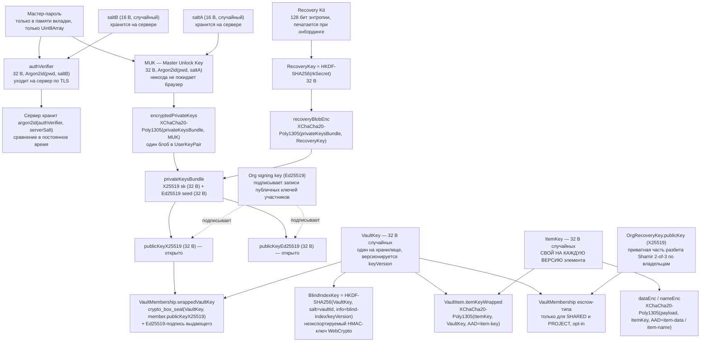

### Разбор каждого ключа

| Ключ | Что это | Где живёт | Как получается | Время жизни в памяти | Когда стирается |
|---|---|---|---|---|---|
| **Мастер-пароль** | секрет пользователя | только поле ввода на `/vault/unlock` | вводится человеком | миллисекунды: сразу после деривации | `sodium.memzero` немедленно после получения MUK и authVerifier; поле формы очищается |
| **MUK** | 256-битный ключ разворачивания | память вкладки, module-private closure | `crypto_pwhash(32, pwd, saltA, t=3, m=64MiB, Argon2id)` | до lock | при lock, авто-lock, `visibilitychange` > 5 мин, `beforeunload`, logout |
| **authVerifier** | доказательство знания пароля | память вкладки → HTTPS-запрос | `crypto_pwhash(32, pwd, saltB, t=3, m=64MiB, Argon2id)` | до отправки запроса | сразу после `fetch` |
| **privateKeysBundle** | X25519 sk + Ed25519 seed | память вкладки | AEAD-расшифровка `encryptedPrivateKeys` ключом MUK | до lock | вместе с MUK |
| **VaultKey** | симметричный ключ хранилища | память вкладки, `Map<vaultId, Uint8Array>` | `crypto_box_seal_open(wrappedVaultKey, pubX, skX)` | до lock, лениво по первому обращению к хранилищу | вместе с MUK; отдельно — при `keyVersion` mismatch |
| **BlindIndexKey** | HMAC-ключ для поиска | `CryptoKey` WebCrypto, `extractable: false` | `HKDF-SHA256(VaultKey, salt=vaultId, info)` | до lock | вместе с VaultKey; неэкспортируем by design |
| **ItemKey** | ключ одной версии элемента | память, только на время операции | `randombytes_buf(32)` при записи; `AEAD-open(itemKeyWrapped, VaultKey)` при чтении | секунды: живёт ровно на время шифрования/расшифровки одного элемента | `memzero` в `finally` того же вызова |
| **RecoveryKey** | ключ восстановления | память, только на время восстановления | `HKDF-SHA256(rkSecret, info="recovery")` | секунды | `memzero` после расшифровки bundle |
| **OrgRecoveryKey sk** | приватный ключ депонирования | **нигде целиком**; шарды Shamir у хранителей | реконструкция из ≥ threshold шардов в браузере одного хранителя | минуты, в рамках процедуры восстановления | `memzero` по завершении процедуры; событие в `AuditLog` |
| **Org signing key sk** | подпись записей публичных ключей | у владельцев организации, зашифрован их MUK | генерируется при создании организации | на время операции подписи | `memzero` сразу |

**Правила работы с ключевым материалом в JS (обязательные):**

- Любой ключ — `Uint8Array`, **никогда `string`**. Строки в JS иммутабельны, их нельзя затереть, и
  они копируются GC.
- Все ключи хранятся в module-private `WeakMap`/closure внутри `units/vault/lib/crypto`. Наружу
  отдаются только результаты операций, никогда сам материал.
- Ключи **не попадают** в zustand, TanStack Query cache, React state, `structuredClone`,
  `postMessage`, `BroadcastChannel`, `localStorage`, `sessionStorage`, IndexedDB.
- `sodium.memzero(key)` вызывается детерминированно в `finally`. Честная оговорка: JS-рантайм может
  оставить копии после GC-компакции — гарантии стирания нет, есть добросовестное усилие. Это
  зафиксировано как остаточный риск.

---

## Параметры примитивов

| Назначение | Алгоритм | Параметры | Длина | Библиотека |
|---|---|---|---|---|
| Деривация MUK из пароля | Argon2id (`crypto_pwhash`, `ALG_ARGON2ID13`) | `opslimit t = 3`, `memlimit m = 67 108 864` (64 MiB), `p = 1`, salt `saltA` 16 B | выход 32 B | `libsodium-wrappers-sumo` |
| Деривация authVerifier | Argon2id, те же параметры | salt `saltB` 16 B, независимый от `saltA` | выход 32 B | `libsodium-wrappers-sumo` |
| Хеш authVerifier на сервере | Argon2id | `t = 2`, `m = 19 MiB`, `p = 1`, серверный salt 16 B | 32 B | `argon2` (node, native) |
| Шифрование любых полей `*Enc` | XChaCha20-Poly1305-IETF (`crypto_aead_xchacha20poly1305_ietf`) | nonce 24 B из `randombytes_buf`, tag 16 B, AAD обязателен | ключ 32 B | `libsodium-wrappers-sumo` |
| Обёртка `VaultKey` на участника | X25519 sealed box (`crypto_box_seal`) — X25519 + XSalsa20-Poly1305 + ephemeral pk | эфемерная пара на каждую операцию, nonce выводится из pk (BLAKE2b) | вывод 48 + 32 = 80 B | `libsodium-wrappers-sumo` |
| Подпись выдачи доступа и записей публичных ключей | Ed25519 (`crypto_sign_detached`) | seed 32 B, детерминированная подпись | подпись 64 B | `libsodium-wrappers-sumo` |
| Blind index | HMAC-SHA-256 | ключ — неэкспортируемый `CryptoKey`; выход усечён до 16 B | 16 B хранится | WebCrypto `subtle.sign` |
| Деривация ключа индекса и служебных ключей из `VaultKey` | HKDF-SHA-256 (extract + expand) | `salt = vaultId` (16 B raw), `info` — доменная строка + `keyVersion` | 32 B | WebCrypto `subtle.deriveBits` |
| Токен защищённой ссылки | CSPRNG | 32 B → base64url (43 симв.) | 32 B | `crypto.getRandomValues` |
| Хеш токена ссылки | SHA-256 | без соли: вход имеет 256 бит энтропии, медленный хеш избыточен | 32 B | Node `crypto` |
| CSPRNG | `crypto.getRandomValues` (через `randombytes_buf`) | — | — | WebCrypto |
| Разделение секрета escrow | Shamir over GF(2^8), 2-of-3 | делится 32-байтный `EscrowUnwrapKey`, не сам ключ | 32 B + 1 B индекс на шард | выделенная реализация, см. открытые вопросы |

### Обоснование Argon2id m=64 MiB, t=3, p=1

- **p = 1 — не выбор, а ограничение.** libsodium жёстко фиксирует `lanes = 1` в `crypto_pwhash` и не
  экспортирует параллелизм. Писать `p=1` в `kdfParams` мы обязаны, но менять его нельзя, пока
  используется libsodium.
- **m = 64 MiB против OWASP-минимума 19 MiB.** Стоимость атаки на Argon2id линейна по памяти; 64 MiB
  делает GPU/ASIC-перебор в разы дороже. Порог сверху задан браузером: WASM-модуль libsodium
  выделяет этот объём разово, 64 MiB безопасны даже на мобильном Safari, 256 MiB — уже нет.
- **t = 3.** С 64 MiB даёт ориентировочно 0.5–1.2 с на десктопном WASM. Это приемлемо для операции,
  выполняемой один раз за сессию разблокировки, и неприемлемо для атакующего, перебирающего словарь.
- **Два независимых прогона — 2× стоимость.** Разблокировка стоит два Argon2id (MUK + authVerifier),
  то есть 1–2.5 с. Это осознанная цена: один прогон с последующим HKDF-разделением был бы дешевле,
  но тогда значение, уходящее на сервер, и MUK были бы производными одного и того же промежуточного
  результата, и ошибка в разделении домена мгновенно превращалась бы в утечку MUK.
- **Честная оговорка о пределе.** Два независимых вывода не защищают от офлайн-перебора
  скомпрометированным сервером: зная `authVerifier` и `saltB`, атакующий проверяет догадку о пароле
  ровно за один Argon2id, а угаданный пароль даёт MUK. Реальная защита здесь — стойкость
  мастер-пароля (проверка `zxcvbn`, минимум 12 символов и score ≥ 3, блокировка топ-100k паролей) и
  цена самого Argon2id. Убрать этот класс атак может только augmented PAKE — см. открытые вопросы.

### Обязательные проверки параметров на клиенте (защита от downgrade)

Параметры KDF приходят с сервера. Клиент **обязан** отвергнуть запрос, если:

```
kdfParams.m  < 67_108_864   → отказ (понижение стойкости)
kdfParams.m  > 1_073_741_824 → отказ (DoS: попытка исчерпать память вкладки)
kdfParams.t  < 3 или t > 10  → отказ
kdfParams.p  != 1            → отказ
kdfSalt.length != 16         → отказ
algoVersion не в множестве поддерживаемых → отказ
```

Пороги — константы в бандле, а не настройка. Дополнительно `kdfSalt`, `m`, `t`, `p`, `algoVersion`
входят в **AAD** блоба `encryptedPrivateKeys`: подмена любого из них ломает аутентификацию и
приводит к явной ошибке расшифровки. Свойство схемы: **клиента нельзя тихо понизить, его можно
только сломать явно.**

### Формат шифротекста и версионирование

Все поля `*Enc` — **самодостаточные блобы**, отдельных колонок для nonce не существует:

```
blob = algoVersion (1 B) || nonce (24 B) || ciphertext || tag (16 B)
```

Это устраняет целый класс ошибок «взяли nonce не от того поля» и снимает вопрос, какой nonce к
какому полю относится (у `VaultItem` их минимум два — для `nameEnc` и `dataEnc`).

> **Требование к `data-model.md`:** колонка `VaultItem.nonce` (и `VaultItemVersion.nonce`) —
> избыточна и подлежит удалению. Nonce живёт внутри блоба. Оставленная отдельная колонка неизбежно
> приведёт к рассинхронизации.

**AAD — обязателен для каждого AEAD-вызова.** Каноническая сериализация, фиксированный порядок,
длиной префиксованные поля:

```
AAD  = "badcrm-e2ee" || 0x00 || label || 0x00 || LP(f1) || LP(f2) || ...
LP(x)= uint32be(len(x)) || x
uuid → 16 сырых байт, целое → uint32be, строка → UTF-8
```

| label | Где применяется | Поля AAD |
|---|---|---|
| `user-keys` | `encryptedPrivateKeys`, `recoveryBlobEnc` | `userId`, `algoVersion`, `kdfSalt`, `m`, `t`, `p` |
| `item-key` | `itemKeyWrapped` | `organizationId`, `vaultId`, `itemId`, `version`, `keyVersion`, `algoVersion` |
| `item-data` | `dataEnc` | `organizationId`, `vaultId`, `itemId`, `version`, `keyVersion`, `algoVersion`, `itemType` |
| `item-name` | `nameEnc` | те же, что `item-data` |
| `folder-name` | `VaultFolder.nameEnc` | `organizationId`, `vaultId`, `folderId`, `keyVersion`, `algoVersion` |
| `tag-name` | `VaultItemTag.tagNameEnc` | `organizationId`, `vaultId`, `itemId`, `keyVersion`, `algoVersion` |
| `link-payload` | `SecureLink.payloadEnc` | `linkId` (генерируется клиентом), `kind`, `algoVersion` |

Что это закрывает: сервер не может переставить `dataEnc` между двумя элементами, подменить
`itemType` (канон перечня — `PASSWORD | NOTE | SSH_KEY | API_KEY | CARD | FILE`, приведено в
соответствие с [`../architecture/data-model.md`](../architecture/data-model.md) 2026-07-26;
**значения не переименовываются после релиза** — они входят в AAD, и переименование делает
существующие блобы нерасшифровываемыми), приклеить шифротекст чужого хранилища, выдать блоб от другой версии ключа или чужого
пользователя. Любая такая попытка даёт ошибку аутентификации, а не тихо другой открытый текст.

### `algoVersion` и миграция

`algoVersion` — целое, единое для всей крипто-схемы (не отдельное на каждый примитив). Текущее
значение — **1**: Argon2id/64MiB/3/1 + XChaCha20-Poly1305 + X25519 sealed box + Ed25519 +
HMAC-SHA-256 + HKDF-SHA-256.

Правила миграции:

1. Клиент **читает** любой поддерживаемый `algoVersion` (список — константа бандла) и **пишет**
   только текущий. Список поддерживаемых версий сокращается только мажорным релизом с явной нотой.
2. Смена параметров Argon2id — это новый `algoVersion`. Апгрейд происходит **при следующей успешной
   разблокировке**: клиент видит `algoVersion < current`, уже имеет пароль в памяти, генерирует
   новые `saltA`/`saltB`, пересчитывает MUK и authVerifier, перешифровывает `encryptedPrivateKeys`,
   отправляет всё одной транзакцией. Хранилища и элементы не затрагиваются — меняется только
   верхний уровень.
3. Смена AEAD или схемы обёртки ключей — это ротация `keyVersion` каждого хранилища (тяжёлая
   операция, раздел 5), выполняемая явно владельцем по баннеру «доступна более стойкая схема».
4. **Downgrade запрещён:** клиент отказывается записывать блоб с `algoVersion` меньше того, что уже
   лежит в записи. Сервер не может заставить клиента «вернуться» на старую схему.
5. Смешанные версии внутри одного хранилища допустимы на время миграции; `keyVersion` и
   `algoVersion` — независимые счётчики.

---

## Что хранится на сервере

### Есть на сервере

| Данные | Где | Комментарий |
|---|---|---|
| `publicKeyX25519`, `publicKeyEd25519` | `UserKeyPair` | Открыто. Подписаны org signing key |
| `encryptedPrivateKeys` | `UserKeyPair` | AEAD-блоб под MUK. Без пароля бесполезен |
| `kdfSalt` (saltA), `kdfParams`, `algoVersion` | `UserKeyPair` | Публичные параметры. Подмена ломает расшифровку |
| saltB и хеш authVerifier | `User` (расширение) | `argon2id(authVerifier, serverSalt)` — сервер не может обратить |
| `recoveryBlobEnc` | `UserKeyPair` | AEAD-блоб под RecoveryKey. Только если пользователь включил Recovery Kit |
| `wrappedVaultKey` + `grantSignature` | `VaultMembership` | Sealed box на публичный ключ участника + подпись выдающего |
| `itemKeyWrapped` | `VaultItem`, `VaultItemVersion` | ItemKey под VaultKey |
| `dataEnc`, `nameEnc` | `VaultItem`, `VaultItemVersion` | Тело и имя элемента. Nonce внутри блоба |
| `VaultFolder.nameEnc`, `VaultItemTag.tagNameEnc` | — | Имена папок и тегов тоже шифротекст |
| `blindIndexName`, `blindIndexUrl`, `blindIndexTag` | `VaultItem`, `VaultItemTag` | 16 байт HMAC. Необратимы без ключа индекса |
| Нечувствительные метаданные | везде | `id`, `organizationId`, `vaultId`, `folderId`, `itemType`, `keyVersion`, `algoVersion`, `favorite`, `createdAt`, `updatedAt`, `deletedAt`, `version`, `orderKey` |
| `VaultAccessLog` | — | Факт обращения: кто, к чему, когда, `action`, `ipHash` |
| `SecureLink.tokenHash`, `payloadEnc`, `viewCount`, `burnedAt`, `expiresAt` | — | Токен — только SHA-256; ключ расшифровки отсутствует |
| `SecureLinkGrant.sealedKey` | — | Ключ ссылки, запечатанный для конкретного получателя |
| `OrgRecoveryKey.publicKey`, `encryptedPrivateKeyShares` | — | Шарды Shamir, каждый запечатан на публичный ключ своего хранителя |

### Нет на сервере — ни при каких условиях

| Чего нет | Пояснение |
|---|---|
| Мастер-пароль | Не передаётся ни в каком виде, включая хеши, отличные от `authVerifier` |
| MUK | Не существует за пределами вкладки |
| Расшифрованный X25519/Ed25519 приватный ключ | Только в виде AEAD-блоба |
| `VaultKey` в открытом виде | Только запечатанный на публичные ключи участников |
| `ItemKey` в открытом виде | Только обёрнутый `VaultKey` |
| Ключ blind-индекса | Выводится из `VaultKey` на клиенте, существует как неэкспортируемый `CryptoKey` |
| Название элемента, папки, тега в открытом виде | Только `nameEnc` |
| Логин, пароль, URL, заметка, TOTP-секрет, приватный SSH-ключ, номер карты | Всё внутри `dataEnc` |
| Тело зашифрованного вложения | `File.isEncrypted = true`, `scanStatus = SKIPPED`, ключ файла лежит внутри `dataEnc` элемента |
| Ключ одноразовой ссылки | Живёт во фрагменте URL |
| Расшифрованное содержимое в логах, метриках, трейсах, поисковом индексе, эмбеддингах | Запрещено правилами раздела 9 и архитектурным инвариантом |
| Recovery Kit в открытом виде | Показывается один раз в браузере, на сервер не уходит |

### Утечка метаданных, которую принимаем осознанно

Сервер видит и не может не видеть:

| Метаданные | Что из них выводится | Почему принимаем |
|---|---|---|
| Количество элементов в хранилище и их размеры | Порядок величины «сколько секретов у команды»; длина `dataEnc` ≈ длина payload | Скрытие требует padding до фиксированного размера; выбранный компромисс — padding до кратного 256 байт (см. ниже) |
| Структура папок (дерево без имён) | Форма организации секретов | Дерево нужно серверу для сортировки и пагинации |
| `itemType` | Что это — пароль, SSH-ключ, карта | Нужен для иконок и фильтров без расшифровки списка; вынесение в шифротекст сделало бы список нерендерируемым до полной расшифровки |
| Времена создания/изменения, `version` | Активность по секрету, «этот пароль меняли вчера» | Нужны для сортировки, синхронизации и истории |
| Граф `VaultMembership` — кто с кем делится | Социальный граф доступа внутри организации | Это и есть модель доступа; скрыть её нельзя, не отказавшись от серверной авторизации |
| `VaultAccessLog` | Кто и когда открывал элемент | Это требование аудита, оно противоположно приватности и здесь побеждает |
| Равенство blind-индексов | «У этих двух элементов одинаковый URL» | См. раздел 6 |

**Padding.** `dataEnc` дополняется по ISO/IEC 7816-4 (`sodium.pad`) до кратного **256 байт** перед
шифрованием. Это скрывает точную длину пароля и заметки, стоит в среднем 128 байт на элемент и не
скрывает порядок величины большой заметки — что и заявлено.

---

## Жизненный цикл

Общие обозначения на диаграммах: **B** — браузер (UI), **C** — крипто-модуль
`units/vault/lib/crypto`, **A** — API-сервер, **DB** — PostgreSQL.

### 5.1 Регистрация и генерация ключей

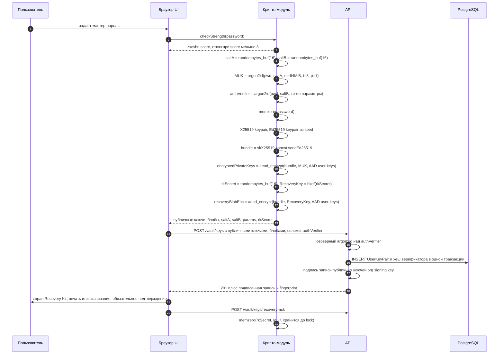

Существенное:

- Recovery Kit **обязателен**: пока пользователь не подтвердил, что сохранил его, хранилище работает
  в режиме «только чтение того, что уже есть», и баннер не убирается. Без Recovery Kit забытый
  пароль означает потерю личного хранилища навсегда, и мы не даём человеку случайно оказаться в этом
  состоянии.
- Recovery Kit: 16 случайных байт → 26 символов Crockford base32 группами по 5 + 2 символа
  контрольной суммы. Отображается один раз, не хранится, не отправляется.
- Личное хранилище (`Vault.kind = PERSONAL`) создаётся здесь же: `VaultKey = randombytes_buf(32)`,
  единственная `VaultMembership` — на самого пользователя.

### 5.2 Разблокировка (unlock)

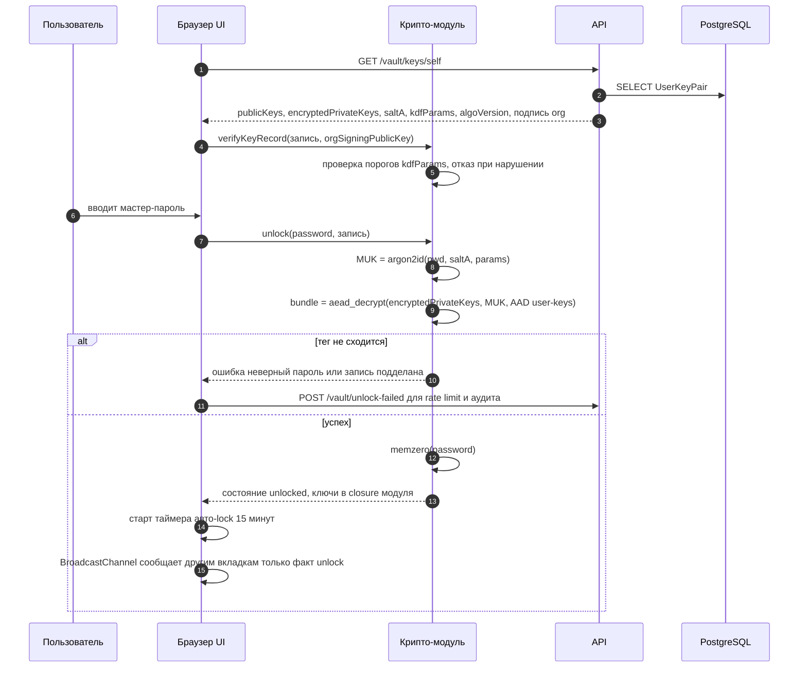

Правила состояния разблокировки:

- **MUK и приватные ключи живут только в памяти вкладки.** Ни `localStorage`, ни `sessionStorage`,
  ни IndexedDB, ни cookie, ни service worker. Обновление страницы = повторный ввод пароля. Это
  осознанная цена, отражённая в UX (отдельный маршрут `/vault/unlock` с `redirect`).
- **Авто-lock** по трём событиям: (1) бездействие 15 минут (события `mousemove`, `keydown`,
  `touchstart` сбрасывают таймер, предупреждение за 30 с); (2) вкладка в фоне дольше 5 минут
  (`visibilitychange` + отметка времени); (3) `beforeunload` / `pagehide`.
- **Блокировка экрана ОС** браузером напрямую не сообщается. Прокси-сигналы: `visibilitychange`
  и «прыжок» системного времени между тиками таймера больше 90 секунд (признак сна устройства) —
  оба ведут к немедленному lock. Это эвристика, и она описана как таковая.
- **Lock распространяется на все вкладки** через `BroadcastChannel('vault-lock')`. Через канал идёт
  только сигнал, никогда ключевой материал.
- Опция «держать разблокированным 15 минут» удлиняет таймер бездействия, но не отменяет ни один из
  трёх триггеров.

### 5.3 Создание элемента

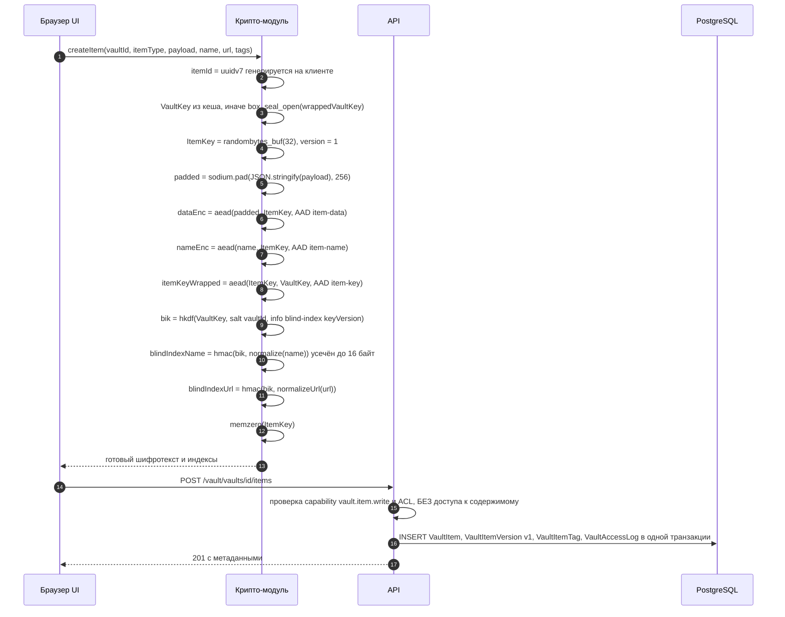

**Ключевое правило: `ItemKey` генерируется заново на каждую версию элемента**, а не один раз на
элемент. Следствия: (1) невозможно повторное использование пары ключ+nonce между версиями;
(2) участник, у которого отозвали доступ, не сможет прочитать версии, созданные после отзыва, даже
если он сохранил старые `ItemKey`; (3) стоимость — один лишний AEAD-вызов на 32 байта при записи,
то есть ничто.

### 5.4 Чтение элемента

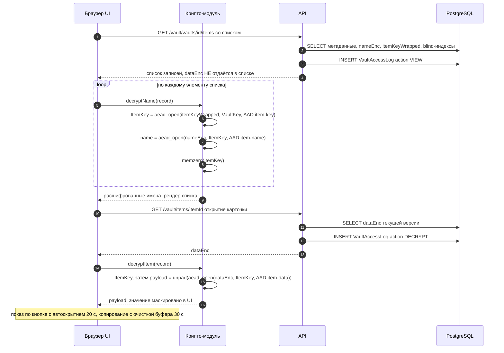

`dataEnc` не приходит в списке — это экономит трафик и, что важнее, не держит тела всех секретов в
памяти вкладки одновременно. `VaultAccessLog.action = DECRYPT` фиксируется сервером по факту выдачи
`dataEnc`; **сервер не может знать, была ли расшифровка успешной** — это честное ограничение аудита.

### 5.5 Шаринг с пользователем

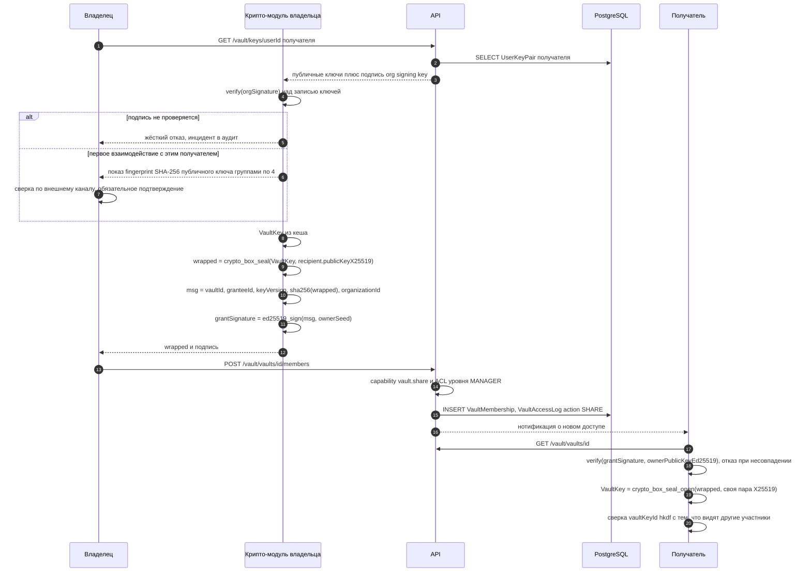

**Почему без подписи нельзя.** `crypto_box_seal` — анонимный: он даёт конфиденциальность, но не
аутентификацию отправителя. Любой, кто знает публичный ключ получателя (то есть и сервер), может
изготовить корректный `wrappedVaultKey`, содержащий **ключ, известный атакующему**, и вставить его
как membership. Получатель расшифровал бы им... ничего существующего, но начал бы шифровать **новые**
элементы ключом атакующего. Поэтому:

> **Требование к `data-model.md`:** в `VaultMembership` добавляется обязательное поле
> `grantSignature Bytes` (Ed25519, 64 B) и `grantedByKeyId`. Membership без валидной подписи
> отбрасывается клиентом и не даёт доступ.

Дополнительная защита от «расщепления ключа» (разным участникам выдали разные `VaultKey`):
`vaultKeyId = HKDF-SHA256(VaultKey, salt = vaultId, info = "badcrm/v1/vault-key-id")[0..16]`
хранится на `Vault` открыто. Участник, получивший ключ, проверяет совпадение; расхождение —
немедленная ошибка и инцидент.

### 5.6 Шаринг с командой или проектом

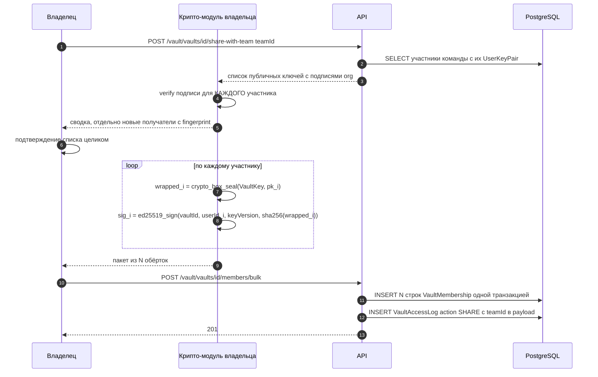

**Команда — не криптографический субъект.** У `Team` нет ключевой пары; «доступ команде» разворачивается
в N персональных membership. Следствие, которое обязано быть в UI: **добавление человека в команду не
даёт ему автоматический доступ к хранилищам этой команды** — требуется, чтобы кто-то с открытым
хранилищем выполнил довыдачу. Сервер ставит хранилищу флаг `pendingGrants > 0` и показывает баннер
владельцам. Альтернатива (ключевая пара на команду) добавляет ещё один уровень обёртки и ещё одну
процедуру ротации; на MVP не берём, зафиксировано в открытых вопросах.

### 5.7 Отзыв доступа и ротация

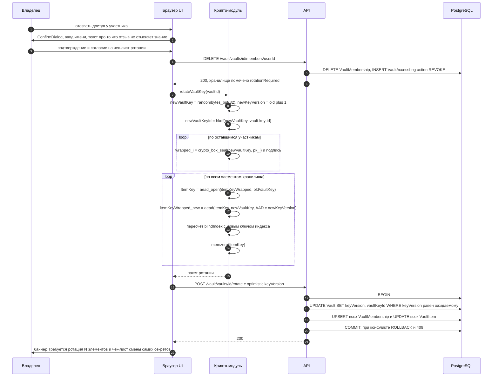

Свойства ротации:

- **Атомарность обязательна.** Полу-повёрнутое хранилище нечитаемо. Сервер применяет пакет одной
  транзакцией с оптимистической проверкой `keyVersion`; параллельная ротация из другой вкладки
  получает 409 и перезапускается.
- **Полезная нагрузка не перешифровывается.** Меняются только `itemKeyWrapped` и blind-индексы.
  Для 10 000 элементов это ~20 000 симметричных операций над 32-байтными блоками — доли секунды на
  клиенте — и один большой запрос. Тела элементов (мегабайты) не гоняются по сети.
- **Blind-индексы обязаны пересчитываться**, потому что ключ индекса выводится из `VaultKey`. Забыть
  это — значит сломать поиск после первой же ротации. Это отдельный обязательный тест.
- **Остаточный риск, который ротация не закрывает.** Бывший участник, экспортировавший `ItemKey`
  существующих версий, сохраняет возможность расшифровать **именно те версии**, если когда-нибудь
  получит шифротекст (например, из украденного бэкапа). Новые версии он не прочитает, потому что у
  них новый `ItemKey` (см. 5.3). Полная перешифровка тел (`ротация уровня 2`) доступна как отдельное
  тяжёлое действие в `DangerZone` и рекомендуется при увольнении с конфликтом.
- **Главное — UI обязан сказать прямым текстом:** «Отзыв доступа не делает секреты неизвестными для
  {имя}. Все элементы этого хранилища следует считать скомпрометированными и заменить», выдать
  чек-лист элементов с чекбоксами «сменён» и держать баннер `Требуется ротация: N` до его закрытия.
  Криптография здесь вторична по отношению к организационному действию.

### 5.8 Смена пароля

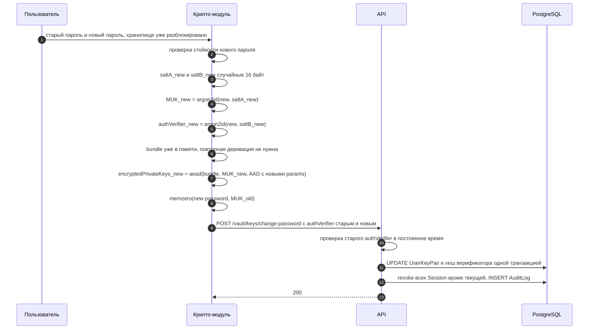

**Перешифровывается ровно один блоб.** `VaultKey`, `VaultMembership`, `ItemKey`, элементы, папки,
теги, blind-индексы, `recoveryBlobEnc` — **не трогаются**. Причина проста: пароль защищает только
приватные ключи; всё остальное висит на них, а не на пароле. Это же означает, что смена пароля
**не является реакцией на компрометацию хранилища** — если утекли секреты, нужна ротация (5.7),
а не смена пароля.

`recoveryBlobEnc` остаётся валидным, потому что зашифрован независимым `RecoveryKey`. Recovery Kit
не нужно перевыпускать при смене пароля.

### 5.9 Сброс пароля — что теряется

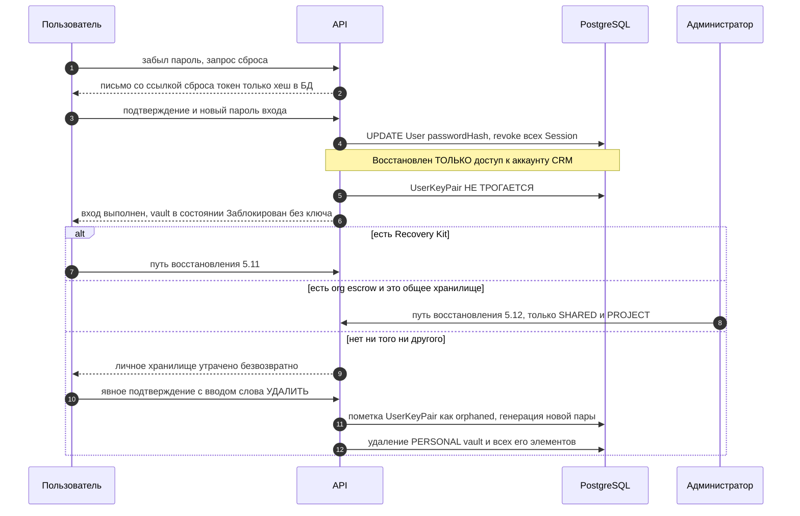

**Разделение, которое обязано быть очевидно пользователю:** сброс пароля восстанавливает доступ к
CRM — задачам, чату, документам. Он **не** восстанавливает доступ к хранилищу секретов. Это два
разных пароля по своей природе (один проверяется сервером, второй — математикой), и UI обязан
называть их по-разному: «пароль входа» и «мастер-пароль хранилища».

Общие хранилища при этом не теряются: у них есть другие участники, и достаточно, чтобы любой из них
выдал доступ на новую ключевую пару пострадавшего.

### 5.10 Офбординг сотрудника

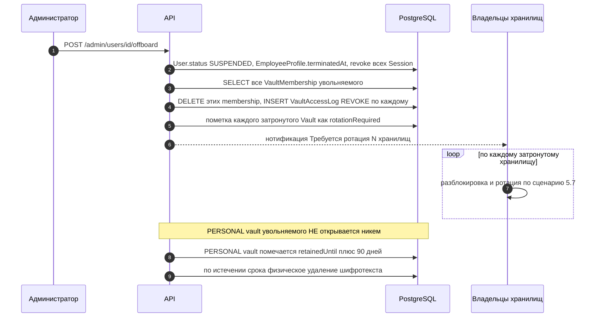

**Личное хранилище уволенного никто не читает.** Ни администратор, ни владелец инсталляции, ни
escrow. Если в личном хранилище лежали рабочие секреты — это организационный провал политики, а не
криптографии; правильный ответ — политика «рабочие секреты только в общих хранилищах», подкреплённая
баннером в личном хранилище и отчётом «элементы личных хранилищ, помеченные как рабочие» (метка
ставится самим сотрудником и, разумеется, тоже зашифрована — сервер видит только счётчик).

### 5.11 Восстановление по Recovery Kit

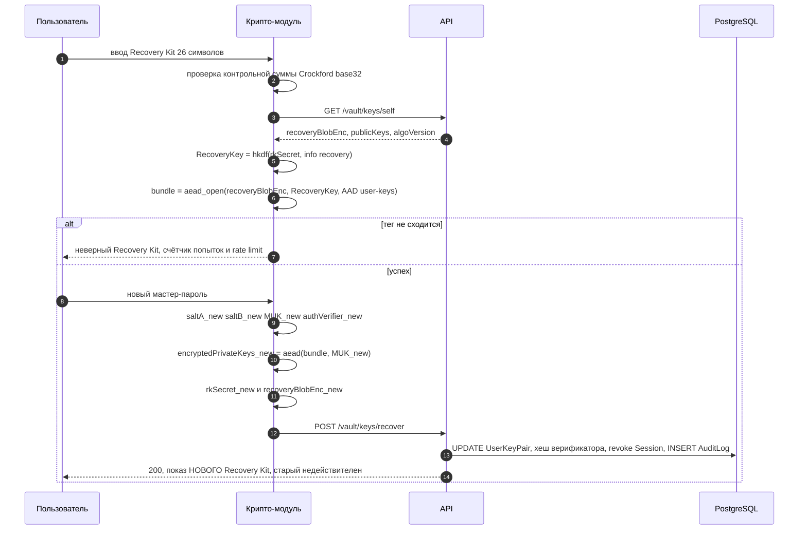

Recovery Kit — **предъявительский секрет, эквивалентный мастер-паролю**. Кто его нашёл, тот получил
хранилище. Отсюда правила UI: печать с пометкой «храните как ключ от сейфа», предупреждение «не
храните в самом Bad CRM», обязательная ротация кита после использования, событие в `AuditLog` и
нотификация владельцу организации о факте восстановления.

### 5.12 Восстановление общего хранилища через org escrow

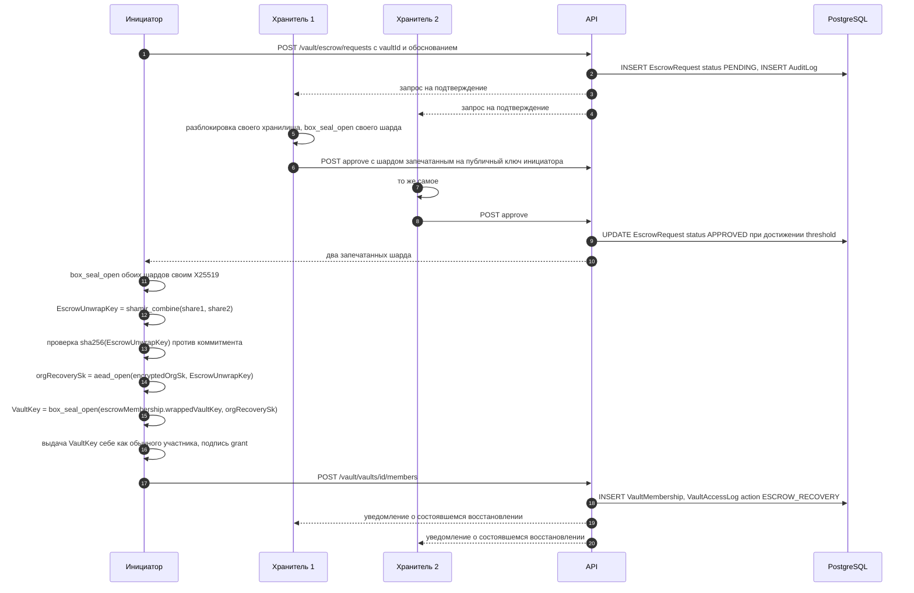

Честное описание компромисса:

- **Escrow — opt-in и только для `SHARED`/`PROJECT`.** Для `PERSONAL` создание escrow-membership
  запрещено на уровне доменного инварианта и проверяется CHECK-ограничением
  (`kind = 'PERSONAL'` ⇒ отсутствие membership с `subjectKind = ESCROW`). Это и есть техническая
  реализация обещания «администратор не читает личное».
- **Целиком приватная часть на сервере не лежит.** Сервер хранит: `OrgRecoveryKey.publicKey`,
  `encryptedOrgSk` (AEAD под `EscrowUnwrapKey`) и три шарда `EscrowUnwrapKey`, каждый **запечатанный
  на публичный ключ своего хранителя**. Чтобы получить `EscrowUnwrapKey`, нужны приватные ключи двух
  хранителей — то есть их мастер-пароли.
- **Момент централизации существует и мы его не прячем.** В браузере инициатора восстановления
  `EscrowUnwrapKey` собирается целиком. Значит, скомпрометированный браузер инициатора в момент
  процедуры компрометирует депонирование. Митигации: процедура редкая, требует двух явных
  подтверждений, порождает нотификации всем хранителям и владельцу организации, целиком видна в
  `AuditLog`, а по завершении `OrgRecoveryKey` **обязан быть ротирован** (новая пара, новые шарды).
- **Shamir не верифицируем.** Злонамеренный хранитель может отдать корректно выглядящий, но
  неправильный шард; комбинация даст мусор, AEAD не сойдётся, и мы узнаем о проблеме, но не узнаем,
  кто виноват. Поэтому рядом с шардами хранится `commitment = SHA-256(EscrowUnwrapKey)` — это даёт
  быструю проверку результата. Полноценная верифицируемая схема (Feldman VSS) — в открытых вопросах.

---

## Поиск по зашифрованным данным

**Vault никогда не попадает в Meilisearch.** Ни имена, ни метаданные, ни blind-индексы. В контексте
`vault` не существует обработчика outbox-события для индексации; отсутствие такого обработчика
проверяется архитектурным тестом. Общий поиск по продукту (`Cmd+K`) не показывает элементы
хранилища вовсе — по ним есть отдельный поиск внутри `/vault`.

### Как строится blind index

```
BlindIndexKey = HKDF-SHA256(
    ikm  = VaultKey,
    salt = vaultId (16 сырых байт),
    info = "badcrm/v1/blind-index/" || uint32be(keyVersion),
    len  = 32
)
blindIndex = HMAC-SHA256(BlindIndexKey, normalize(value))[0..16]
```

`BlindIndexKey` импортируется в WebCrypto как HMAC-`CryptoKey` с `extractable: false` — после
импорта сам ключ индекса невозможно извлечь даже из скомпрометированного JS-контекста, можно только
вычислять HMAC.

**Ключ индекса — строго per-vault и per-keyVersion.** Общий ключ на организацию позволил бы
серверу сопоставлять элементы между хранилищами («у Пети и в общем хранилище один и тот же URL») и
превратил бы ротацию одного хранилища в бессмысленную операцию.

### Нормализация — часть спецификации, а не деталь реализации

От нормализации зависит совпадение индексов, поэтому она фиксирована точно:

```
normalizeName(s) = NFKC(s) → trim → collapse внутренних пробелов в один → toLowerCase()
normalizeTag(s)  = то же самое
normalizeUrl(u)  = разобрать через URL()
                   → взять hostname
                   → NFKC, toLowerCase(), убрать завершающую точку
                   → убрать ведущий "www."
                   → punycode-форма как есть (URL() уже даёт её)
                   → отбросить схему, порт, путь, query, fragment, credentials
                   → при ошибке разбора индекс не строится (null)
```

`toLowerCase()`, а не `toLocaleLowerCase()` — локале-зависимое приведение даёт разный результат в
турецкой локали и ломает совпадение между устройствами. Изменение правил нормализации = новый
`algoVersion` и обязательная переиндексация, потому что старые индексы перестанут совпадать.

### Что можно и чего нельзя найти

| Можно | Нельзя |
|---|---|
| Точное совпадение имени элемента | Подстроку, префикс, «похоже на» |
| Точное совпадение домена URL (`github.com`) | URL с другим путём как отдельное совпадение |
| Точное совпадение тега | Полнотекст по заметке или паролю |
| Комбинацию «этот домен И этот тег» (пересечение на сервере) | Сортировку по имени на сервере |

Практический режим работы поиска в UI, соответствующий этому: пользователь вводит запрос →
клиент **параллельно** (а) вычисляет blind-индексы и просит сервер отдать точные совпадения и
(б) фильтрует по подстроке уже расшифрованный в памяти список текущего хранилища. Первый путь
находит элемент в хранилище, которое сейчас не открыто; второй даёт привычный «поиск по мере ввода».
Поисковая строка **не пишется в URL и не уходит на сервер в открытом виде** — это требование UX-документа.

### Утечка через частотный анализ — и почему мы её принимаем

Одинаковые значения дают одинаковые индексы. Сервер, наблюдая распределение, видит: «в этой
организации 14 элементов с одинаковым blind-индексом URL» и может, зная типичную популярность
сервисов, с некоторой вероятностью предположить, что это `github.com`. Он **не может** проверить
догадку (нет ключа), но может ранжировать гипотезы.

Почему принимаем: альтернативы — выкачивать всё хранилище на клиент при каждом поиске (неприемлемо
при тысячах элементов и на мобильном) либо строить searchable encryption с ORAM-подобными
свойствами (несопоставимая сложность и стоимость для self-host CRM). Усечение индекса до 16 байт
здесь не помогает — коллизий всё равно почти не будет.

Смягчение, которое мы делаем: индексируются **только** имя, домен URL и теги. Пароль, заметка,
логин, TOTP-секрет, приватный ключ не индексируются никогда — по ним поиск невозможен by design.
Дальнейшее смягчение (агрессивное усечение индекса до 3–4 байт с намеренными коллизиями и
доотбором на клиенте) — в открытых вопросах.

---

## Защищённые ссылки

Два режима с принципиально разной криптографией. Общее: токен — 32 случайных байта в base64url,
в БД лежит только `SHA-256(token)`, эндпоинт разрешения ссылки имеет rate limit по IP и по
префиксу токена, токен вырезается из логов reverse-proxy маскирующим middleware.

### 7.1 ONE_TIME — одноразовая записка (privnote)

Форма ссылки:

```
https://crm.example.com/l/<token-43-символа>#v1.<base64url(32 байта ключа)>
```

Фрагмент URL (всё после `#`) **не отправляется браузером в HTTP-запросе** — ни в строке запроса, ни
в заголовке `Referer`. Сервер физически не получает ключ и не может расшифровать `payloadEnc`, даже
имея полный дамп БД.

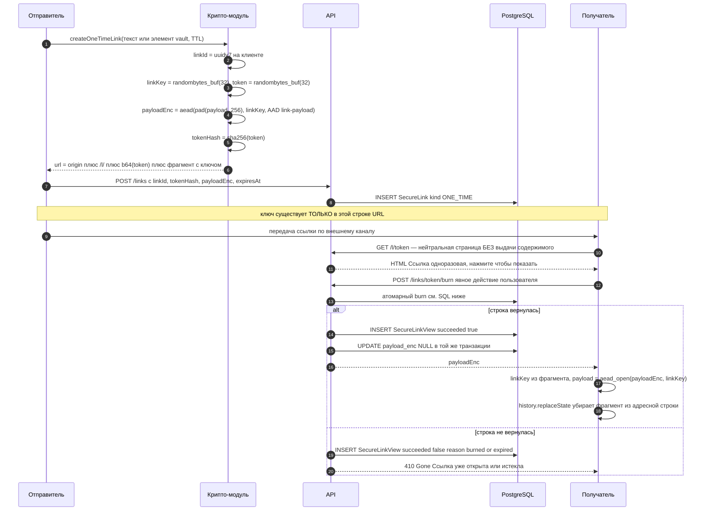

**Атомарное сжигание.** Единственно допустимая форма — один `UPDATE` с предикатом по тому же полю,
которое он меняет:

```sql
-- Шаг 1: атомарный захват. Возвращает 1 строку максимум одному конкурентному запросу.
UPDATE secure_links
   SET burned_at  = now(),
       view_count = view_count + 1
 WHERE token_hash = $1
   AND kind       = 'ONE_TIME'
   AND burned_at IS NULL
   AND (expires_at IS NULL OR expires_at > now())
RETURNING id, organization_id, payload_enc;

-- Шаг 2 (та же транзакция): журнал и физическое стирание тела.
INSERT INTO secure_link_views (organization_id, link_id, ip_hash, user_agent, succeeded, viewed_at)
VALUES ($2, $3, $4, $5, true, now());

UPDATE secure_links
   SET payload_enc = NULL
 WHERE id = $3;
```

Почему именно так:

- **Отдельной колонки `payload_nonce` нет и не должно быть.** `payload_enc` — самодостаточный
  шифроблоб: nonce, версия алгоритма и тег лежат внутри него, ровно как у `VaultItem.dataEnc`
  (см. раздел про формат блоба). Ранняя редакция этого SQL упоминала `payload_nonce`, что
  противоречило собственному правилу документа. *Канон — nonce внутри блоба, отдельных колонок
  `nonce`/`payloadNonce` нет ни у одной таблицы; приведено в соответствие с
  [`../architecture/data-model.md`](../architecture/data-model.md) 2026-07-26.* Практическое
  следствие видно прямо здесь: стирается **одно** поле, поэтому не существует промежуточного
  состояния «тело стёрли, nonce остался», в котором строка выглядит частично живой.
- `SELECT` + проверка + `UPDATE` — **гонка**: два параллельных открытия проходят оба. Проверка и
  изменение обязаны быть одним оператором.
- `RETURNING` в PostgreSQL 16 возвращает **новые** значения строки, поэтому `payload_enc` нельзя
  обнулять в том же операторе — иначе вернётся `NULL`. Обнуление — вторым оператором той же
  транзакции. (В PostgreSQL 18 появился `RETURNING OLD.*`, что позволит слить это в один оператор;
  до перехода на 18 держим два.)
- Оба оператора в одной транзакции нельзя объединить в data-modifying CTE: два `UPDATE` одной и той
  же строки в одном операторе в PostgreSQL дают непредсказуемый результат и явно не поддерживаются.
- **Гонка при параллельном открытии решается блокировкой строки.** Первая транзакция берёт row lock;
  вторая ждёт, после коммита первой под `READ COMMITTED` выполняет EPQ-перепроверку предиката на
  новой версии строки, видит `burned_at IS NOT NULL` и возвращает 0 строк. Это работает именно
  потому, что предикат стоит на изменяемой колонке — если бы условие «сгорела» проверялось где-то
  ещё, перепроверка бы не сработала.
- **Burn-before-deliver, а не deliver-then-burn.** Если ответ не дойдёт до получателя (обрыв сети),
  содержимое потеряно. Это осознанный выбор: обратный порядок допускает двойное чтение при разрыве,
  что для одноразовой записки хуже. Пользователь предупреждён текстом на странице.
- **Честная оговорка о физическом стирании.** `UPDATE ... SET payload_enc = NULL` создаёт новую
  версию строки; старая живёт в heap до `VACUUM`, а также присутствует в WAL и в уже снятых
  бэкапах. Криптографически это неважно (ключа нет ни там, ни там), но заявлять «данные стёрты
  немедленно и физически» мы не имеем права.

**Превью-боты мессенджеров — обязательная митигация.** Telegram, Slack, WhatsApp, Discord и
корпоративные антивирусные прокси открывают присланные ссылки, чтобы построить превью. При наивной
реализации (`GET` сжигает) записка сгорает до того, как её увидит человек. Меры, все обязательные:

1. **`GET /l/:token` не сжигает и не отдаёт содержимое.** Он возвращает нейтральную страницу с
   кнопкой «Показать содержимое». Сжигает только `POST /links/:token/burn`.
2. Заголовки страницы: `X-Robots-Tag: noindex, nofollow`, `Cache-Control: no-store`,
   `Referrer-Policy: no-referrer`. Никаких OpenGraph/Twitter-card метатегов — превью должно быть
   пустым намеренно.
3. Страница показывает предупреждение: «Содержимое будет уничтожено сразу после показа. Убедитесь,
   что вы готовы его сохранить».
4. `POST` требует заголовок `X-Requested-With` и одноразовый CSRF-nonce, выданный `GET`-страницей —
   отсекает наивные HEAD/GET-краулеры, которые «дожимают» ссылки.

### 7.2 RESTRICTED — доступ только выбранным пользователям

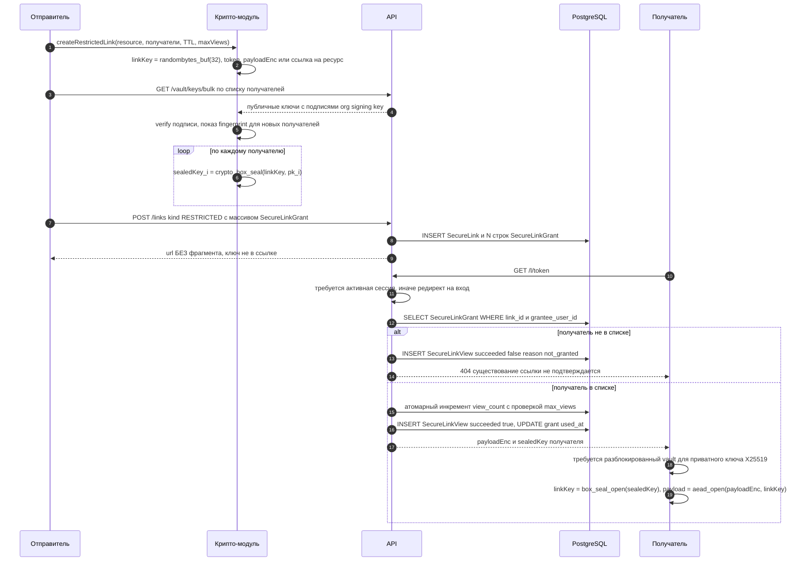

Отличия от `ONE_TIME`, существенные для реализации:

- **Ключ не в URL.** Ссылку можно спокойно переслать в чат — без сессии и без записи в
  `SecureLinkGrant` она бесполезна. Это делает `RESTRICTED` правильным режимом по умолчанию для
  внутреннего обмена.
- **Требуется разблокированное хранилище** у получателя: `linkKey` распечатывается его приватным
  X25519-ключом. UI обязан вести на `/vault/unlock` с `redirect` обратно на ссылку.
- **Аудит просмотров полноценный:** `SecureLinkView` пишет и успешные, и неуспешные попытки с
  `failureReason`; владелец видит таблицу «кто открыл и когда» на карточке ссылки.
- **Внешний получатель без аккаунта.** Sealed box невозможен — нет публичного ключа. Единственный
  допустимый вариант: `linkKey` оборачивается ключом из парольной фразы
  (`Argon2id(passphrase, saltC, те же параметры)`), фраза передаётся получателю **по другому каналу**.
  UI обязан это явно называть и генерировать фразу сам (не давать выбрать «123456»). Ссылка + фраза
  в одном мессенджере = отсутствие защиты, и текст интерфейса говорит об этом прямо.
- Ограничения `expiresAt`, `maxViews`, `allowedIpCidrs`, `requiresAuth` — серверные и **не являются
  криптографическими**. Они уменьшают окно, но не заменяют шифрование; в документации для
  пользователя это разделено.

---

## Интеграция с остальной системой

### Multi-tenancy и RLS

RLS работает **поверх шифротекста** и решает ортогональную задачу. Строки vault-таблиц несут
`organizationId` и подчиняются общей политике `current_setting('app.organization_id')`. Порядок
барьеров: RLS отсекает чужого арендатора → policy-слой проверяет `capability` и ACL → криптография
решает, сможет ли субъект вообще что-то прочитать. Пробой любого одного барьера не даёт доступа к
содержимому: даже полное отключение RLS и ACL оставляет атакующего с байтами без ключей.

Анонимный резолвер `secure_link_resolve` (`SECURITY DEFINER`) — единственная точка, где сервер
работает без tenant-контекста; он получает только `tokenHash`, выставляет контекст по найденной
ссылке и ничего другого не умеет. Детали — в `data-model.md`, раздел «Мульти-тенантность и RLS»,
путь 2.

### Модель прав

Разделение ответственности точное:

| Слой | На что отвечает | Чего не может |
|---|---|---|
| `capability` (`vault.item.write`, `vault.share`, `vault.manage`) | Может ли роль в принципе выполнять операцию | Дать доступ к содержимому |
| `ResourceAcl` / `VaultMembership.accessLevel` | Может ли субъект **получить** `wrappedVaultKey` и вызывать API хранилища | Расшифровать без приватного ключа субъекта |
| Криптография | Может ли субъект прочитать | Запретить чтение тому, кто уже получил ключ |

Формулировка, которая должна быть в голове у каждого разработчика: **ACL управляет тем, кто может
получить обёрнутый ключ, а не тем, кто может расшифровать.** Отсюда следует, что удаление
`VaultMembership` — это административный отзыв, а не криптографический; криптографический отзыв —
только ротация (5.7). И отсюда же следует, что администратор, обладающий `vault.manage`, может
удалить хранилище или отобрать доступ, но не может прочитать содержимое: `vault.manage` не является
и не может являться источником ключевого материала.

### Аудит

`VaultAccessLog` — append-only, под RLS, часть данных арендатора. Пишет **факт** доступа:
`vaultId`, `itemId`, `userId`, `action`, `ipHash`, `userAgent`, `occurredAt`. Никогда — содержимое,
имена элементов, blind-индексы поискового запроса.

Ограничения аудита, которые надо понимать:

- Действия `DECRYPT`, `COPY`, `EXPORT` — **самодекларация клиента**. Сервер видит выдачу `dataEnc`
  и может считать это `DECRYPT`, но `COPY` он проверить не может. Злонамеренный клиент не сообщит о
  копировании. Аудит здесь — инструмент для честных пользователей и расследований, а не барьер.
- Журнал доступа сам является метаданными: он раскрывает, кто чем интересуется. Доступ к нему —
  отдельное право `vault:view_access_log` (каноническое имя из каталога, см.
  [`permission-model.md`](./permission-model.md) §3.9; прежнее написание `vault.audit.read` в этом
  документе отменено, *приведено в соответствие 2026-07-26*).

### Бэкапы

**Предупреждение владельцу инсталляции — обязательный текст в runbook и в UI админки:**

> Бэкап PostgreSQL содержит всё хранилище секретов в зашифрованном виде и **бесполезен без
> мастер-паролей пользователей**. Восстановление из бэкапа не восстанавливает доступ. Если все
> пользователи забыли мастер-пароли и не имеют Recovery Kit, данные утрачены навсегда, и никакой
> бэкап это не исправит.

Практические следствия: (1) `pgdata` бэкапить обязательно — без него теряется и шифротекст;
(2) восстановление на другой хост не требует переноса каких-либо ключей, потому что их там нет;
(3) частичное восстановление «вернуть одно хранилище на вчера» ломает `keyVersion`-консистентность,
если между этими моментами была ротация — процедура отката хранилища описана в runbook отдельно и
требует ротации после.

### AI-ассистент

**Секреты никогда не попадают в контекст ассистента.** Технически:

1. Контекст `ai` не имеет порта к контексту `vault` — вызов физически невозможен без изменения
   архитектуры, и это проверяется архитектурным тестом (запрет импорта `vault` из `application/ai/**`).
2. Для vault-сущностей не создаются `EmbeddingChunk` — обработчик outbox для этого контекста
   отсутствует.
3. RAG-ретривер фильтрует по `entityType`, и `VAULT_ITEM` не входит в множество допустимых типов
   (allow-list, не deny-list).
4. Клиентское правило: компоненты `units/vault/ui/**` не имеют доступа к хуку отправки сообщения
   ассистенту; попытка передать расшифрованное значение в AI-чат невозможна без импорта через
   границу слоёв, который запрещён линтером.
5. Пользователь может вручную скопировать секрет и вставить его в AI-чат. Этого мы не предотвращаем;
   в подсказке рядом с полем ввода ассистента стоит предупреждение о том, что диалог уходит внешнему
   провайдеру.

---

## Правила для разработчиков

Нарушение любого пункта — блокирующий дефект. Список — часть чек-листа ревью, а не рекомендация.

### Запрещено

1. **Логировать что-либо расшифрованное.** Ни `console.log`, ни `pino`, ни Sentry, ни
   `performance.mark` с именем элемента. Логируются только идентификаторы и размеры в байтах.
2. **Класть расшифрованные данные или ключи в состояние, переживающее вкладку:** `localStorage`,
   `sessionStorage`, IndexedDB, cookie, service worker cache, `history.state`, URL (включая
   фрагмент — исключение только для `ONE_TIME`-ссылки, где это и есть механизм).
3. **Класть ключевой материал в zustand, TanStack Query cache или React state.** В кеше Query
   допустимо держать шифротекст и результат расшифровки **имени** для рендера списка; тело секрета
   в кеш не попадает никогда — оно запрашивается по требованию и живёт в локальном состоянии
   карточки, которое умирает вместе с ней.
4. **Использовать `string` для ключей и паролей.** Только `Uint8Array`.
5. **Использовать счётчик или детерминированный nonce.** Только `randombytes_buf(24)` на каждую
   операцию. Запрет проверяется тестом и grep-правилом на `nonce` в коде модуля.
6. **Вызывать AEAD без AAD.** Обёртки модуля не принимают вызов без явного контекста — сигнатура
   функции требует объект контекста, и `undefined` не проходит типизацию.
7. **Отправлять любое поле формы vault в аналитику, телеметрию, Sentry breadcrumbs, RUM.** Для
   маршрутов `/vault/**` и `/l/**` телеметрия отключается целиком, а не выборочно.
8. **Использовать `dangerouslySetInnerHTML`, `eval`, `new Function`, `innerHTML`** где-либо в
   `units/vault/**` и на странице защищённой ссылки. Только `textContent` и React-рендеринг.
9. **Добавлять зависимости в крипто-модуль.** Разрешён ровно один импорт —
   `libsodium-wrappers-sumo` — плюс WebCrypto из глобального объекта.
10. **Реализовывать «своё» шифрование, свой Base64 для ключей, свою константу-времени сравнение.**
    Всё — из libsodium (`sodium.compare`, `sodium.to_base64` с `URLSAFE_NO_PADDING`).
11. **Автозаполнение и подсказки браузера** на полях мастер-пароля и секретов:
    `autocomplete="off"`, `autocorrect="off"`, `autocapitalize="off"`, `spellcheck="false"`,
    `data-1p-ignore`, `data-lpignore="true"`.

### Обязательно

12. **CSP на всём приложении, ужесточённая на `/vault/**` и `/l/**`:**
    `default-src 'self'; script-src 'self' 'nonce-<per-request>'; style-src 'self' 'nonce-…';
    connect-src 'self'; img-src 'self' data:; object-src 'none'; base-uri 'none';
    frame-ancestors 'none'; form-action 'self'; require-trusted-types-for 'script'`.
    Плюс `Referrer-Policy: no-referrer`, `X-Content-Type-Options: nosniff`,
    `Cross-Origin-Opener-Policy: same-origin`, `Cross-Origin-Embedder-Policy: require-corp`.
    Отчёты CSP собираются и алертятся — нарушение на vault-маршруте это инцидент.
13. **Trusted Types** с единственной политикой, не допускающей произвольный HTML.
14. **Очистка буфера обмена** через 30 с с проверкой, что содержимое всё ещё наше (иначе не затираем
    чужое копирование), стабильный `id` тоста, честная подсказка о том, что при закрытии вкладки
    очистка не гарантируется. Реализация — общий `CopyToClipboard` в режиме `sensitive`.
15. **`memzero` в `finally`** для каждого промежуточного ключа. Отсутствие `finally` вокруг работы с
    `ItemKey` — автоматический отказ на ревью.
16. **Ревью агентом `e2ee-crypto-reviewer` на каждое касание `units/vault/lib/crypto/**` и серверного
    контекста `vault`.** Агент проверяет по чек-листу: nonce, AAD, aead vs plain, downgrade,
    отсутствие сети в модуле, отсутствие логирования, соответствие этому документу. Без его вердикта
    PASS изменения не проходят commit-гейт. Агента необходимо создать до начала EPIC-033.
17. **Property-тесты round-trip** (fast-check): для произвольных payload любой длины 0…1 MiB
    `decrypt(encrypt(x)) === x`; при изменении **любого** байта шифротекста, nonce, AAD или ключа
    расшифровка бросает исключение и **не возвращает частичный результат**.
18. **Тест на неповторяемость nonce:** 100 000 последовательных шифрований — множество nonce имеет
    мощность 100 000. Дополнительно — статический тест, что ни в одном месте модуля nonce не
    приходит извне как параметр.
19. **Тесты на негатив:** подмена `itemId` в AAD, подмена `keyVersion`, перестановка `dataEnc`
    между двумя элементами, подстановка `wrappedVaultKey` без валидной подписи, `kdfParams` ниже
    порога, `algoVersion` из будущего — каждый случай даёт явную ошибку, а не тихую деградацию.
20. **Тест инварианта модели:** для `Vault.kind = PERSONAL` невозможно создать escrow-membership —
    и на уровне доменного use-case, и на уровне CHECK-ограничения БД.
21. **Векторы KAT** (known-answer tests) для Argon2id, XChaCha20-Poly1305, HKDF, HMAC — из
    официальных тестовых наборов, чтобы обновление libsodium не сломало совместимость молча.
22. **Ленивая загрузка крипто-модуля** отдельным чанком, только после успешной аутентификации, и
    архитектурный тест «в чанке нет импортов сетевого слоя».

---

## Модель угроз vault

| Угроза | Кто | Митигация | Остаточный риск |
|---|---|---|---|
| Подмена публичного ключа получателя при шаринге (MITM) | Скомпрометированный сервер, злонамеренный владелец инсталляции | (а) запись публичных ключей подписана org signing key, клиент проверяет; (б) fingerprint получателя показывается и требует подтверждения при первом шаринге; (в) смена `publicKey` рассылает уведомление всем, кто делился с этим человеком; (г) `grantSignature` не даёт серверу подсунуть свой `VaultKey`; (д) `vaultKeyId` ловит расщепление ключа | **Не устраняется полностью.** Org signing key принимается по TOFU при первом входе; сервер, скомпрометированный до этого момента, подменяет и его. Полное решение требует внешнего канала сверки fingerprint — принят как остаточный риск, зафиксирован в UI («сверьте отпечаток лично») |
| **XSS в приложении — главная угроза** | Любой, кто нашёл инъекцию в задачах, чате, документах, KB | Строгая CSP без `unsafe-inline` с nonce; Trusted Types; запрет `innerHTML`/`dangerouslySetInnerHTML` в vault; санитизация rich-text на границе; изоляция крипто-модуля; авто-lock; отсутствие ключей в persistent storage; CSP-репорты как инцидент | XSS на **разблокированной** вкладке даёт доступ к DOM и к вызовам крипто-модуля — то есть к содержимому открытого хранилища. Не даёт MUK (он в closure), но этого достаточно. Снижается коротким окном unlock и отсутствием ключей вне памяти |
| Злонамеренный сервер отдаёт модифицированный JS | Владелец инсталляции, атакующий с доступом к раздаче статики | Воспроизводимые сборки с опубликованными хешами, SRI, отсутствие внешних CDN, AGPL, `connect-src 'self'`, desktop-клиент в backlog | **Фундаментально не решается в вебе.** Целевая атака на конкретного пользователя не обнаруживается им самим. Принято и явно описано в разделе 1 |
| Кража Recovery Kit | Тот, кто получил физический доступ к распечатке или к файлу | Обязательное предупреждение «храните как ключ от сейфа», запрет хранения кита внутри Bad CRM, обязательная ротация после использования, нотификация владельцу организации и запись в `AuditLog` | Кит — предъявительский секрет, эквивалентный паролю. Кража = полная компрометация личного хранилища. Второй фактор для восстановления — в открытых вопросах |
| Слабый мастер-пароль | Сам пользователь | `zxcvbn` score ≥ 3 и минимум 12 символов при установке, блокировка топ-100k, Argon2id 64 MiB/t=3 удорожает перебор, rate limit на попытки unlock (серверный по `authVerifier` и клиентский с экспоненциальной задержкой) | Офлайн-перебор возможен для того, кто получил `authVerifier` или `encryptedPrivateKeys` (то есть для сервера). Слабый пароль ломается. Убирается только переходом на PAKE или на аппаратный фактор |
| Утечка метаданных | Сервер, владелец инсталляции, атакующий с дампом БД | Padding до 256 байт, blind-индексы вместо plaintext, отсутствие vault в поиске и эмбеддингах, ограничение доступа к `VaultAccessLog` отдельным правом | Количество элементов, структура папок, `itemType`, времена изменений, граф шаринга и равенство blind-индексов **видны**. Принято осознанно (раздел 4) |
| Знание секрета после отзыва доступа | Бывший участник, бывший сотрудник | Ротация `VaultKey` + новый `ItemKey` на каждую новую версию; чек-лист смены секретов в UI; баннер `Требуется ротация: N`; `ротация уровня 2` с полной перешифровкой | **Криптография здесь бессильна по определению.** Человек помнит пароль, который видел. Единственное настоящее решение — сменить сам секрет; продукт обязан к этому подталкивать, а не создавать иллюзию |
| Компрометация устройства пользователя | Троян, кейлоггер, вредоносное расширение браузера, физический доступ к разблокированному экрану | Авто-lock по бездействию, фону и признаку сна устройства; автоскрытие показанного значения через 20 с; очистка буфера через 30 с; отсутствие ключей на диске | **Не митигируется.** Атакующий на устройстве видит всё, что видит пользователь, и может дождаться разблокировки. Снижается только окном доступности |
| Rollback: сервер отдаёт старую валидную версию элемента | Скомпрометированный сервер | AAD содержит `version` и `keyVersion`, поэтому подделка невозможна; клиент показывает историю версий и время изменения | Сервер может **честно** отдать более старый шифротекст как текущий — клиент не имеет независимого якоря актуальности. Обнаруживается только человеком по истории. Решение (подписанный монотонный манифест хранилища) — в открытых вопросах |
| DoS через параметры KDF | Скомпрометированный сервер | Верхний порог `m ≤ 1 GiB`, `t ≤ 10` на клиенте; отказ вместо попытки выполнить | Сервер может отказать в обслуживании и без этого; вектор закрыт в части «повесить вкладку пользователя» |
| Перебор токена защищённой ссылки | Аноним из интернета | Токен 256 бит из CSPRNG; rate limit по IP и по префиксу токена на резолвере; журналирование неуспешных попыток; одинаковый ответ 404 для «нет такой» и «не ваша» | Пренебрежимо мал при корректном CSPRNG. Основной риск — утечка самой ссылки через мессенджер или историю браузера |
| Превью-бот сжигает одноразовую ссылку | Мессенджеры, антивирусные прокси, корпоративные шлюзы | `GET` не сжигает, сжигает только `POST` по явному клику; отсутствие OG-метатегов; `noindex`; CSRF-nonce | Бот, эмулирующий клик, теоретически возможен; для него ссылка всё равно бесполезна (ключ во фрагменте), но записка сгорит. Пользователь предупреждён |
| Злонамеренный хранитель escrow | Один из хранителей org escrow | Threshold 2-of-3, коммитмент `SHA-256(EscrowUnwrapKey)` для проверки результата, нотификация всем хранителям и владельцу, обязательная ротация `OrgRecoveryKey` после использования | Два сговорившихся хранителя получают все общие хранилища организации — это и есть смысл схемы. Личные хранилища недоступны им в принципе. Атрибуция плохого шарда невозможна без VSS |

---

## План реализации

**До первой строчки кода обязаны быть выполнены два условия:**

1. Этот документ принят и зафиксирован как ADR-0009 (`../architecture/adr/0009-e2ee-vault-key-hierarchy.md`
   ссылается сюда как на нормативную часть).
2. Пройдено **внешнее криптографическое ревью** схемы независимым специалистом. Пункты, которые
   обязаны попасть на ревью, перечислены в конце документа. Реализация до получения заключения не
   начинается — цена ошибки в этом модуле выше стоимости задержки.

Дополнительно до старта: создан агент `e2ee-crypto-reviewer` и внесены изменения в
`data-model.md` (`VaultMembership.grantSignature` и `grantedByKeyId`; удаление колонок `nonce`;
инвариант «PERSONAL не имеет escrow-membership»; колонка `UserKeyPair.orgEscrowBlobEnc` **удалена
2026-07-26** — депонирование работает на уровне ключа хранилища (`Vault`), **депонирование MUK
запрещено** инвариантом «админ не читает личные хранилища» и не должно появиться в схеме даже как
неиспользуемый слот).

| Эпик | Содержание | Готово, когда |
|---|---|---|
| **EPIC-033 — крипто-фундамент** | Модуль `units/vault/lib/crypto` целиком: Argon2id, AEAD с AAD, sealed box, Ed25519, HKDF, HMAC, канонический AAD-энкодер, формат блоба, пороги параметров, `memzero`-дисциплина. Серверная часть: `UserKeyPair`, `authVerifier`, регистрация, unlock, смена пароля, Recovery Kit. Полный набор KAT- и property-тестов, тесты на негатив | Круг «регистрация → unlock → смена пароля → восстановление по киту» проходит e2e, все тесты раздела 9 зелёные, `e2ee-crypto-reviewer` даёт PASS |
| **EPIC-034 — элементы и хранилища** | `Vault`, `VaultFolder`, `VaultItem`, `VaultItemVersion`, `VaultItemTag`, blind-индексы, нормализация, padding, история версий, `VaultAccessLog`, экраны списка и карточки, генератор паролей, `CopyToClipboard` в режиме `sensitive`, авто-lock | Личное хранилище полностью функционально; поиск по blind-индексу работает; ни одно поле с plaintext не появилось в схеме (автотест на список колонок группы 7) |
| **EPIC-035 — шаринг и отзыв** | `VaultMembership` с подписью выдачи, fingerprint-подтверждение, шаринг с пользователем и с командой, `vaultKeyId`, ротация с атомарным применением, чек-лист ротации, офбординг, org escrow с Shamir и `EscrowRequest` | Ротация 10 000 элементов проходит атомарно за приемлемое время; отозванный участник не читает новые версии (тест); escrow-восстановление общего хранилища работает и логируется; PERSONAL-инвариант проверен тестом |
| **EPIC-036 — защищённые ссылки** | `SecureLink` обоих режимов, атомарный burn, двухшаговое подтверждение, анти-превью-меры, `SecureLinkGrant` с sealed key, `SecureLinkView`, страница `/l/:token` с ужесточённой CSP, rate limit резолвера | Тест конкурентности: 50 параллельных burn одной ссылки дают ровно один успех; ключ не появляется ни в одном серверном логе (тест на маскирование); превью-бот не сжигает ссылку |

Порядок строгий: 034 зависит от 033, 035 — от 034, 036 — от 033 и 034. Внутри каждого эпика —
обычный TDD-цикл и полный commit-гейт; для vault дополнительно обязателен `e2ee-crypto-reviewer`.

---

## Открытые вопросы

**Закрыто 2026-07-26 — выбор крипто-библиотеки (`libsodium-wrappers-sumo` против WebCrypto +
`@noble/curves`/`@noble/ciphers` + WASM-Argon2id).** Решение принято в пользу
`libsodium-wrappers-sumo`: целостность одной аудированной библиотеки с полным набором нужных
примитивов (Argon2id `crypto_pwhash`, XChaCha20-Poly1305-IETF, `crypto_box_seal`, Ed25519) важнее
~200 KB перевеса над бюджетом ленивого чанка. Крипто-чанк `units/vault/lib/crypto` грузится лениво,
один раз, после разблокировки vault — на первую загрузку приложения перевес не влияет — и измеряется
отдельной строкой `size-limit` с собственным порогом как осознанное исключение из бюджета бандла
(см. [`../architecture/stack.md`](../architecture/stack.md) и
[`../architecture/ux-architecture.md`](../architecture/ux-architecture.md)). Вопрос закрыт и не
переоткрывается «заодно» с другими правками.

Остальные вопросы требуют решения **до M7** (веха «Vault» в
[`../product/roadmap.md`](../product/roadmap.md)).

1. **WebAuthn PRF как второй фактор разблокировки.** Расширение `prf` даёт стабильный секрет от
   аппаратного ключа. Комбинация `MUK = Argon2id(password) XOR HKDF(prfOutput)` делает офлайн-перебор
   бесполезным без физического ключа. Вопросы: поддержка браузерами на момент M7, поведение при
   утере ключа (нужен второй зарегистрированный ключ или Recovery Kit как обход, что возвращает
   слабое звено), UX регистрации второго ключа.
2. **WebAuthn PRF вместо мастер-пароля целиком.** Радикальнее: пароля нет, `MUK` выводится только из
   PRF. Убирает весь класс атак на слабый пароль, но делает потерю всех ключей фатальной и требует
   обязательных двух устройств. Требует отдельного решения по восстановлению.
3. **Augmented PAKE (OPAQUE) вместо `authVerifier`.** Убирает офлайн-перебор пароля
   скомпрометированным сервером — сервер не получает ничего, что позволяет проверить догадку. Цена:
   зрелых аудированных JS/WASM-реализаций мало, добавляется сложный серверный протокол,
   несовместимо с текущей схемой сброса. Оценить трудоёмкость и риск.
4. **Desktop-клиент** (Tauri) как единственный способ закрыть «злонамеренный сервер отдаёт JS».
   Вопрос — объём работы, подпись и обновление бинарей, и не создаёт ли он ложного ощущения
   безопасности, если пользователи всё равно останутся в вебе.
5. **Реализация Shamir.** Собственная над GF(2^8) (маленькая, аудируемая, но не константного времени
   из-за таблиц log/exp) против внешней зависимости в крипто-модуле, что нарушает правило «ноль
   зависимостей». Плюс вопрос перехода на верифицируемую схему (Feldman VSS) для атрибуции плохого
   шарда.
6. **Ротация `algoVersion` в живой инсталляции.** Нужен ли принудительный апгрейд по сроку, что
   делать с пользователями, не заходившими год, и как выглядит отчёт админа «N пользователей на
   устаревшей схеме» без раскрытия чего-либо лишнего.
7. **Подписанный монотонный манифест хранилища** против rollback-атаки: владелец подписывает
   `(vaultId, keyVersion, sha256 списка «itemId → version»)`, клиенты проверяют монотонность.
   Стоимость — подпись при каждой записи и конфликты при параллельной работе. Нужно ли на M7.
8. **Ключевая пара на команду** вместо N персональных membership. Снимает проблему «добавили в
   команду, а доступа нет», добавляет ещё один уровень обёртки и ещё одну процедуру ротации при
   каждом изменении состава команды.
9. **Агрессивное усечение blind-индекса** (3–4 байта с намеренными коллизиями и доотбором на
   клиенте) против частотного анализа. Нужно измерить, при каком размере хранилища доотбор перестаёт
   быть незаметным.
10. **Постквантовая перспектива.** X25519 sealed box уязвим к «собрать сейчас, расшифровать потом».
    Гибрид X25519 + ML-KEM-768 для обёртки `VaultKey` — оценить, есть ли аудированная WASM-реализация
    и приемлем ли рост размера обёртки.
11. **Групповая ротация при массовом офбординге.** Если увольняется человек, состоявший в 40
    хранилищах, ротацию должны выполнить владельцы каждого — нужен ли механизм делегирования и как
    он не превращается в escrow чёрным ходом.
