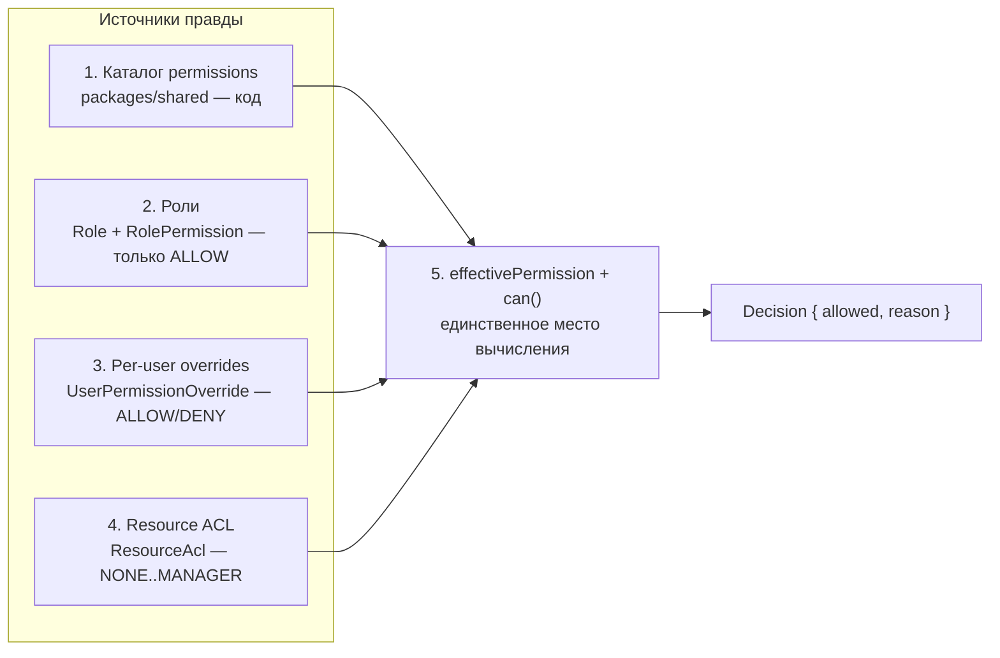
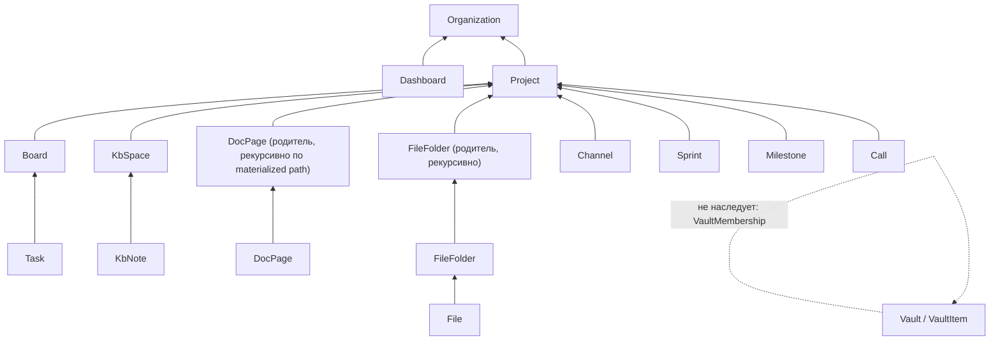

# Bad CRM — модель прав и доступов

Спецификация авторизации: что человек может делать в организации (capability) и к каким конкретным
объектам он допущен (resource ACL). Документ — источник правды для реализации; из него пишутся
`packages/shared/src/permissions/permissions.catalog.ts`, policy-функции в `domain/*/access/` и
матрица системных ролей в сиде.

Границы документа:

- **Здесь** — авторизация внутри одного арендатора: каталог прав, роли, персональные исключения,
  ACL на ресурс, алгоритм разрешения, кеш, тесты, аудит.
- **Не здесь** — аутентификация (пароли, TOTP, сессии, refresh-ротация) — см.
  [`stack.md`](../architecture/stack.md), раздел «Безопасность в коде»; изоляция арендаторов —
  см. `rls-design.md` и [`data-model.md`](../architecture/data-model.md), раздел
  «Мульти-тенантность и RLS».

Связанные документы: [`data-model.md`](../architecture/data-model.md) (группа «Права и доступ»),
[`overview.md`](../architecture/overview.md) (сквозной механизм «б»),
[`stack.md`](../architecture/stack.md) (гексагональные слои),
[`ux-architecture.md`](../architecture/ux-architecture.md) (раздел «Права в интерфейсе»).

---

## Требование из ТЗ и как оно решается

Пункт 3 ТЗ: **«управление ролями и доступами, в том числе кастомно по каждому юзеру»**
(см. [`prd.md`](../product/prd.md), таблица скоупа, строка 3).

В требовании спрятаны четыре разных запроса, которые обычно смешивают в один и получают
нечитаемую систему:

| Запрос заказчика | Что он значит технически | Слой модели |
|---|---|---|
| «Хочу роли: админ, менеджер, разработчик» | именованный набор действий, назначаемый людям пачкой | 2. Роли |
| «Хочу кастомно по каждому юзеру» | точечное исключение для одного человека, без клонирования роли | 3. Per-user overrides |
| «Этот проект/документ/хранилище видят только эти» | доступ к конкретному объекту и его поддереву | 4. Resource-scoped ACL |
| «Право существует, только если оно что-то делает» | закрытый каталог, заданный кодом | 1. Каталог permissions |

Плюс пятый, неявный, но обязательный: **решение принимается в одном месте и объяснимо**
(риск R-15 в PRD: «модель прав ломается под кастомными override»).

### Пять слоёв — карта



Слои 1–3 отвечают на вопрос **«что этот человек в принципе умеет в организации»** (capability),
слой 4 — на вопрос **«к какому объекту он допущен»** (resource). Итог — **конъюнкция**:
`task:update` без уровня `EDITOR` на доске не работает, и уровень `EDITOR` без права `task:update`
не работает тоже.

### Почему именно так, а не иначе

| Отвергнутая альтернатива | Почему нет |
|---|---|
| Только роли (чистый RBAC) | «кастомно по каждому юзеру» превращается в роль на человека: через полгода 40 ролей с именами вида `manager_without_finance_2`, матрица нечитаема |
| DENY на уровне роли | при двух ролях у человека возникает вопрос «какая главнее»; любой ответ (приоритет, порядок назначения) неинтуитивен и ломается при добавлении третьей роли |
| Только ACL (как в файловой системе) | нет ответа на вопрос «может ли этот человек в принципе выставлять счета»; каждое новое действие требует раскладки по всем объектам |
| ABAC / внешний policy-engine (OPA, Cedar) | внешний DSL и рантайм ради модели, которая помещается в 200 строк чистого TypeScript; отладка и тесты усложняются, self-host обрастает ещё одним сервисом |
| Авторизация в SQL (RLS-политики с ACL) | нетестируемо юнит-тестами, невозможно объяснить причину отказа, убивает планы запросов (см. §11) |

---

## Пять слоёв модели

### Слой 1 — каталог permissions

**Файл:** `packages/shared/src/permissions/permissions.catalog.ts`. Единственный источник истины.
Сервер и клиент импортируют один и тот же тип — рассинхронизация невозможна физически.

```ts
// packages/shared/src/permissions/access-level.ts
export const ACCESS_LEVELS = ['NONE', 'VIEWER', 'COMMENTER', 'EDITOR', 'MANAGER'] as const;
export type AccessLevel = (typeof ACCESS_LEVELS)[number];

/** Упорядоченность — единственное место, где закреплён порядок шкалы. */
export const ACCESS_LEVEL_RANK: Readonly<Record<AccessLevel, number>> = {
  NONE: 0, VIEWER: 1, COMMENTER: 2, EDITOR: 3, MANAGER: 4,
};

export const atLeast = (actual: AccessLevel, required: AccessLevel): boolean =>
  ACCESS_LEVEL_RANK[actual] >= ACCESS_LEVEL_RANK[required];
```

```ts
// packages/shared/src/permissions/permissions.catalog.ts
export const PERMISSIONS = [
  'organization:read',
  'organization:update',
  // …полный список — §3
  'task:read',
  'task:update',
  'audit:export',
] as const;

export type PermissionKey = (typeof PERMISSIONS)[number];

export const PERMISSION_DOMAINS = [
  'organization', 'iam', 'project', 'task', 'knowledge', 'file', 'vault',
  'secure-link', 'time', 'communication', 'analytics', 'integration', 'ai',
  'delivery', 'platform',
] as const;
export type PermissionDomain = (typeof PERMISSION_DOMAINS)[number];

export interface PermissionMeta {
  /** Часть ключа до двоеточия. */
  readonly resource: string;
  /** Часть ключа после двоеточия. */
  readonly action: string;
  readonly domain: PermissionDomain;
  /** null — право не привязано к конкретному объекту (организационный скоуп). */
  readonly requiredLevel: AccessLevel | null;
  /** Требует подтверждения в UI, отдельного аудита и внимания на ревью. */
  readonly dangerous: boolean;
  /** Ключ i18n, а не готовая строка: описание переводится. */
  readonly descriptionKey: string;
  /** Проставляется, когда ключ выведен из употребления. Строка остаётся ради читаемости дампов. */
  readonly deprecated?: { readonly since: string; readonly replacedBy?: PermissionKey };
}

export const PERMISSION_META: Readonly<Record<PermissionKey, PermissionMeta>> = { /* … */ };

export const PERMISSION_SET: ReadonlySet<PermissionKey> = new Set(PERMISSIONS);

export const isPermissionKey = (value: string): value is PermissionKey =>
  PERMISSION_SET.has(value as PermissionKey);

export const requiredLevel = (key: PermissionKey): AccessLevel | null =>
  PERMISSION_META[key].requiredLevel;
```

**Формат ключа — `<resource>:<action>`**, обе части в `snake_case`, ASCII, без пробелов.
Регулярка для CI: `^[a-z][a-z0-9_]*:[a-z][a-z0-9_]*$`. Двоеточие — единственный разделитель:
`vault_item:decrypt`, а не `vault.item.decrypt`, иначе неоднозначно, где кончается ресурс.

Правила каталога:

1. **Право существует, только если есть use-case, который его проверяет.** Обратное правило тоже
   работает: маршрут без объявленного права не проходит CI (§9в).
2. **Ключи не переиспользуются.** Удалённый ключ никогда не возвращается с другим смыслом — иначе
   исторические `RolePermission` и записи `AuditLog` начинают означать не то, что означали.
3. **`requiredLevel` живёт только в коде**, в БД не дублируется: это свойство логики, а не данных,
   и меняется вместе с реализацией use-case.

**Синхронизация с таблицей `Permission`.** Сид (`prisma/seed/permissions.seed.ts`) выполняется в
той же транзакции, что и миграция при деплое:

```ts
for (const key of PERMISSIONS) {
  const meta = PERMISSION_META[key];
  await tx.permission.upsert({
    where: { key },
    create: { key, resource: meta.resource, action: meta.action,
              category: meta.domain, isDangerous: meta.dangerous, deprecatedAt: null },
    update: { resource: meta.resource, action: meta.action,
              category: meta.domain, isDangerous: meta.dangerous, deprecatedAt: null },
  });
}
// ключ пропал из кода → помечаем deprecated, НЕ удаляем
await tx.permission.updateMany({
  where: { key: { notIn: [...PERMISSIONS] }, deprecatedAt: null },
  data: { deprecatedAt: new Date() },
});
```

Почему `deprecated`, а не `DELETE`: строки `RolePermission` ссылаются на `Permission.key` по FK;
физическое удаление либо каскадом снесёт назначения (тихая потеря прав у людей), либо уронит
миграцию на проде. Плюс дампы и `AuditLog` должны оставаться читаемыми через год.

Поведение с deprecated-ключом:

- при вычислении эффективных прав **игнорируется** (ключа нет в `PERMISSION_SET`);
- в админ-UI матрица показывает его серым с плашкой «выведено из употребления»;
- ночной джоб считает `RolePermission`/`UserPermissionOverride` на deprecated-ключи и отдаёт
  метрикой: ненулевое значение дольше двух релизов означает, что забыли чистку.

**Уточнение к data-model.md:** таблице `Permission` нужна колонка `deprecatedAt DateTime?`
(в текущей редакции её нет — см. таблицу расхождений в §12).

### Слой 2 — роли

**Системные роли** (`Role.isSystem = true`) создаются сидом в каждой организации:
`owner`, `admin`, `manager`, `lead`, `developer`, `viewer`, `guest`. Их состав прав задаётся кодом
и **не редактируется из UI** — иначе матрица §4 перестаёт быть спецификацией, а обновление
продукта либо затирает правки тенанта, либо не применяется вовсе.

**Кастомные роли** (`isSystem = false`) организация собирает из каталога: любой набор существующих
ключей. Изобрести новый ключ нельзя — вешать его не на что.

```ts
export const SYSTEM_ROLE_KEYS = [
  'owner', 'admin', 'manager', 'lead', 'developer', 'viewer', 'guest',
] as const;
export type SystemRoleKey = (typeof SYSTEM_ROLE_KEYS)[number];

/** Матрица §4 в машинном виде: сид и permission-matrix-тест читают отсюда. */
export const SYSTEM_ROLE_PERMISSIONS: Readonly<
  Record<SystemRoleKey, readonly PermissionKey[]>
> = { /* … */ };
```

Структура таблиц (по [`data-model.md`](../architecture/data-model.md), группа 2):

| Таблица | Ключевые поля | Инварианты |
|---|---|---|
| `Role` | `organizationId`, `key`, `name`, `description`, `isSystem`, `isDefault`, `priority` | `uq_roles_org_key(organization_id, key)`; ровно одна `isDefault` роль на организацию (частичный уникальный индекс) |
| `RolePermission` | `roleId`, `permissionKey` → `Permission.key` | **только ALLOW**; `uq_role_permissions(role_id, permission_key)`; для `isSystem`-ролей строки пишет только сид |
| `UserRole` | `userId`, `roleId`, `grantedById`, `grantedAt`, `expiresAt?` | `uq_user_roles(user_id, role_id)`; истёкшее назначение прав не даёт |

**`RolePermission` содержит только ALLOW.** Отрицание на уровне роли делает систему нечитаемой:
человек с ролями `manager` (ALLOW `invoice:issue`) и `lead` (DENY `invoice:issue`) порождает вопрос
«какая роль главнее», на который нет неспорного ответа. Ловушка обходится по построению: несколько
ролей — это **объединение** разрешений, а отрицание существует только на слое 3, где оно
персонально и обязано иметь причину.

**`Role.priority`** используется **только для сортировки в UI** (порядок колонок матрицы, порядок
в списках) и не участвует в разрешении доступа. Зафиксировано явно, чтобы через год никто не
«починил» им конфликт ролей.

**Про owner.** `isOwner` — это `Organization.ownerId === userId`, и **указатель здесь авторитет, а
не кеш** (`effective-permissions-reader.adapter.ts`). Первоначальная редакция этого абзаца объявляла
источником истины активное назначение системной роли `owner`, а `ownerId` называла
денормализацией «для дешёвой проверки»; реализация вышла обратной, и права в этом споре у неё:
`organizations.owner_id` объявлен `NOT NULL` с внешним ключом, то есть ровно один владелец
гарантирован схемой в каждый момент времени, тогда как строку в `user_roles` не защищает ничто —
её может не быть, и она может оказаться не одна.

Строка роли `owner` выдаётся **вместе** с указателем и существует ради двух вещей: чтобы владелец
попадал в списки держателей роли и чтобы `SYSTEM_ROLE_PERMISSIONS.owner` давал ему набор прав. Обе
записи двигаются в одной транзакции — иначе они разъезжаются, и «владелец» начинает означать разное
в зависимости от того, кто спрашивает.

Из этого следует, что инвариант «минимум один владелец» **не проверяется запросом** — он
обеспечен конструкцией: колонка не бывает пустой. Проверяется другое — что новый владелец существует
в этом тенанте и активен, и что указатель переставляется той же транзакцией, что и роли
(`organization:transfer_ownership`).

### Слой 3 — per-user overrides

Точечное исключение для одного человека **поверх ролей**. Именно этот слой закрывает формулировку
ТЗ «кастомно по каждому юзеру», не порождая роль ради одного отличия.

```prisma
model UserPermissionOverride {
  id             String         @id @default(uuid())
  organizationId String
  userId         String
  permissionKey  String         // → Permission.key
  effect         OverrideEffect // ALLOW | DENY
  reason         String         // обязателен: CHECK (length(btrim(reason)) >= 10)
  grantedById    String
  grantedAt      DateTime       @default(now())
  expiresAt      DateTime?
  @@unique([userId, permissionKey], map: "uq_user_permission_overrides")
  @@index([expiresAt], map: "idx_upo_expires")   // частичный: WHERE expires_at IS NOT NULL
}
```

Правила слоя:

- **`reason` обязателен и содержателен** (CHECK на длину ≥ 10 символов). Без причины через полгода
  никто не помнит, почему у человека отобрано право, и оверрайды становятся вечными. Причина видна
  в UI рядом с исключением и попадает в `AuditLog`.
- **`expiresAt` настоятельно рекомендован** для `ALLOW` (временное расширение) и опционален для
  `DENY`. UI по умолчанию подставляет +30 дней для ALLOW и требует явно снять галочку «бессрочно».
- **DENY побеждает всё**, кроме owner (слой 5).
- **DENY на владельца запрещён на уровне записи** — валидация в use-case плюс триггер-страховка
  (§5, краевой случай 2).
- Один ключ — одна строка на человека (`uq(userId, permissionKey)`): «два разных мнения об одном
  праве» невозможны по схеме, а не по договорённости.

Джоб-чистильщик раз в час удаляет истёкшие строки и инкрементит `permissionsVersion` затронутых
пользователей. До того как джоб отработал, истёкший оверрайд **уже не действует**: фильтр по
`expiresAt` стоит в самом запросе (§5, краевой случай 1).

### Слой 4 — resource-scoped ACL

```prisma
model ResourceAcl {
  id             String          @id @default(uuid())
  organizationId String
  resourceType   AclResourceType
  resourceId     String
  subjectType    AclSubjectType  // USER | ROLE | TEAM
  subjectId      String
  accessLevel    AccessLevel     // NONE | VIEWER | COMMENTER | EDITOR | MANAGER
  grantedById    String
  grantedAt      DateTime        @default(now())
  expiresAt      DateTime?
  @@unique([resourceType, resourceId, subjectType, subjectId], map: "uq_resource_acl")
  @@index([organizationId, subjectType, subjectId, resourceType], map: "idx_resource_acl_subject")
  @@index([organizationId, resourceType, resourceId], map: "idx_resource_acl_resource")
}

enum AclResourceType {
  ORGANIZATION PROJECT BOARD TASK DOC_PAGE KB_SPACE KB_NOTE
  FILE_FOLDER FILE CHANNEL VAULT DASHBOARD
}
enum AclSubjectType { USER ROLE TEAM }
```

**Шкала упорядочена:** `NONE < VIEWER < COMMENTER < EDITOR < MANAGER`. Смысл уровней:

| Уровень | Что значит | Типичные действия |
|---|---|---|
| `NONE` | явный запрет на этом узле и ниже | — |
| `VIEWER` | чтение | открыть задачу, скачать файл, посмотреть историю |
| `COMMENTER` | чтение + обсуждение | комментарий, реакция, упоминание, поручение |
| `EDITOR` | изменение содержимого | правка задачи/документа, загрузка файла, перенос по доске |
| `MANAGER` | управление объектом | настройки, участники, выдача доступа, удаление, архивация |

**Цепочки наследования** (полностью — в §6):

```
Task      → Board             → Project → Organization
Board     → Project           → Organization
KbNote    → KbSpace           → Project → Organization
DocPage   → DocPage(parent…)  → Project → Organization
File      → FileFolder(parent…) → Project → Organization
Channel   → Project           → Organization
Dashboard → Organization
Vault     → особый случай (см. §6)
```

**Правило разрешения конфликта — «ближайшая явная запись побеждает»:**

1. Идём от самого ресурса вверх по цепочке предков.
2. На каждом узле собираем записи, где субъект совпадает с актором (`USER = userId`,
   `ROLE ∈ roleIds`, `TEAM ∈ teamIds`) и `expiresAt` не истёк.
3. **Первый узел, где такие записи есть, определяет ответ; обход останавливается.** Если среди
   записей узла есть `NONE` — результат `NONE` (явный запрет сильнее любого гранта на том же узле).
   Иначе — максимум уровней.
4. Если ни на одном узле записей нет — применяется **неявный уровень** (`implicitLevel`, §5).

Почему «ближайшая явная запись», а не «максимум по всей цепочке»: иначе невозможно закрыть один
документ внутри проекта, к которому у команды есть доступ, — а это самый частый реальный запрос.
Почему `NONE` действует только на своём узле: запрет на предке уже останавливает обход, до более
высоких узлов дело не доходит.

### Слой 5 — итоговое решение

```
effectivePermission(user, key):
  if user.isOwner            -> ALLOW      // owner неотзываем, DENY на owner запрещён на записи
  if override(key) == DENY   -> DENY       // явный запрет побеждает всё
  if override(key) == ALLOW  -> ALLOW
  if any role grants key     -> ALLOW
  else                       -> DENY       // fail-closed by default

can(user, key, resource?):
  effectivePermission(user, key) == ALLOW
  AND (resource == null OR resolveAcl(user, resource) >= requiredLevel(key))
```

Реализация — чистая функция в `packages/shared` (её же импортирует клиент для подсказок UI) и
тонкая обёртка в `domain`, добавляющая `DenyReason`:

```ts
// packages/shared/src/permissions/can.ts
export interface CapabilityView {
  readonly isOwner: boolean;
  readonly permissions: ReadonlySet<PermissionKey>;   // роли + ALLOW-оверрайды, уже свёрнуто
  readonly denied: ReadonlySet<PermissionKey>;        // DENY-оверрайды
}

export function effectivePermission(view: CapabilityView, key: PermissionKey): boolean {
  if (view.isOwner) return true;
  if (view.denied.has(key)) return false;
  return view.permissions.has(key);
}

export function can(view: CapabilityView, key: string, aclLevel?: AccessLevel): boolean {
  if (!isPermissionKey(key)) return false;            // неизвестный ключ → deny
  if (!effectivePermission(view, key)) return false;
  const need = requiredLevel(key);
  if (need === null) return true;                     // право без ресурсного контекста
  if (aclLevel === undefined) return false;           // ресурс требуется, но не передан
  return atLeast(aclLevel, need);
}
```

**Fail-closed правила (нормативные):**

| Ситуация | Поведение | Почему |
|---|---|---|
| Ключ отсутствует в каталоге | `deny` + `logger.error({ key })` + метрика `permission_unknown_key_total` | опечатка в проверке не должна открывать доступ; молчаливый deny скрыл бы баг |
| `accessReader` вернул `null` (нет объекта, удалён, чужой тенант) | **HTTP 404**, `reason = resource_not_found` | 403 подтверждает существование объекта; см. `ux-architecture.md`, «403 vs 404» |
| Ошибка резолва ACL (БД недоступна, таймаут) | `deny`, `reason = acl_resolution_failed`, HTTP 503 | «не смогли проверить» ≠ «разрешено» |
| Есть уровень ACL, но нет capability (или наоборот) | `deny` | конъюнкция, а не дизъюнкция |
| `DENY`-оверрайд на владельца | запрещён валидацией записи; найденная в БД строка игнорируется + алерт | иначе организацию можно заблокировать целиком |
| Актор не аутентифицирован | `deny`, `reason = not_authenticated`, HTTP 401 | — |
| Vault заблокирован (нет расшифрованного ключа в сессии) | `deny`, `reason = vault_locked`, HTTP 423 | право есть, ключа нет — сервер и не может помочь |

---

## Полный каталог permissions

Закрытый перечень прав. Колонка **«ACL»** — минимальный уровень `resolveAcl(actor, resource)`,
требуемый вдобавок к capability; `—` означает, что право не привязано к конкретному объекту
(организационный скоуп). Колонка **«Опасное»** — `Permission.isDangerous`: такие права требуют
подтверждения в UI, отдельной записи в `AuditLog` с повышенной `severity`, не входят в шаблон
кастомной роли «по умолчанию» и подсвечиваются в матрице ролей.

Домены соответствуют ограниченным контекстам из [`overview.md`](../architecture/overview.md).

### 3.1 Организация и команды

| Ключ | Ресурс | Действие | ACL | Опасное | Домен |
|---|---|---|---|---|---|
| `organization:read` | organization | read | — | нет | organization |
| `organization:update` | organization | update | MANAGER | нет | organization |
| `organization:manage_branding` | organization | manage_branding | MANAGER | нет | organization |
| `organization:manage_locale` | organization | manage_locale | MANAGER | нет | organization |
| `organization:manage_security_policy` | organization | manage_security_policy | MANAGER | **да** | organization |
| `organization:manage_signing_key` | organization | manage_signing_key | MANAGER | **да** | organization |
| `organization:manage_storage` | organization | manage_storage | MANAGER | **да** | organization |
| `organization:view_usage` | organization | view_usage | — | нет | organization |
| `organization:export_data` | organization | export_data | MANAGER | **да** | organization |
| `organization:transfer_ownership` | organization | transfer_ownership | — | **да** | organization |
| `organization:delete` | organization | delete | MANAGER | **да** | organization |
| `team:read` | team | read | — | нет | organization |
| `team:create` | team | create | — | нет | organization |
| `team:update` | team | update | — | нет | organization |
| `team:delete` | team | delete | — | нет | organization |
| `team:manage_members` | team | manage_members | — | нет | organization |
| `mail:read_own` | mail | read_own | — | нет | organization |
| `mail:manage_domain` | mail | manage_domain | — | **да** | organization |
| `mail:create_account` | mail | create_account | — | **да** | organization |
| `mail:update_account` | mail | update_account | — | нет | organization |
| `mail:delete_account` | mail | delete_account | — | **да** | organization |
| `mail:manage_alias` | mail | manage_alias | — | нет | organization |
| `mail:view_any_account` | mail | view_any_account | — | **да** | organization |

### 3.2 Пользователи, сотрудники, приглашения

| Ключ | Ресурс | Действие | ACL | Опасное | Домен |
|---|---|---|---|---|---|
| `user:read` | user | read | — | нет | iam |
| `user:invite` | user | invite | — | нет | iam |
| `user:update` | user | update | — | нет | iam |
| `user:suspend` | user | suspend | — | **да** | iam |
| `user:reactivate` | user | reactivate | — | нет | iam |
| `user:delete` | user | delete | — | **да** | iam |
| `user:reset_password` | user | reset_password | — | **да** | iam |
| `user:reset_mfa` | user | reset_mfa | — | **да** | iam |
| `user:force_logout` | user | force_logout | — | нет | iam |
| `user:read_sessions` | user | read_sessions | — | нет | iam |
| `user:impersonate` | user | impersonate | — | **да** | iam |
| `invitation:read` | invitation | read | — | нет | iam |
| `invitation:create` | invitation | create | — | нет | iam |
| `invitation:resend` | invitation | resend | — | нет | iam |
| `invitation:revoke` | invitation | revoke | — | нет | iam |
| `employee:read` | employee | read | — | нет | iam |
| `employee:update` | employee | update | — | нет | iam |
| `employee:view_org_chart` | employee | view_org_chart | — | нет | iam |
| `employee:view_capacity` | employee | view_capacity | — | нет | iam |
| `employee:manage_employment` | employee | manage_employment | — | **да** | iam |
| `employee:view_personal_data` | employee | view_personal_data | — | **да** | iam |
| `employee:view_cost_rate` | employee | view_cost_rate | — | **да** | iam |
| `employee:manage_cost_rate` | employee | manage_cost_rate | — | **да** | iam |
| `employee:view_drilldown` | employee | view_drilldown | — | **да** | iam |

### 3.3 Роли, права, ACL

| Ключ | Ресурс | Действие | ACL | Опасное | Домен |
|---|---|---|---|---|---|
| `role:read` | role | read | — | нет | iam |
| `role:create` | role | create | — | нет | iam |
| `role:update` | role | update | — | **да** | iam |
| `role:delete` | role | delete | — | **да** | iam |
| `role:assign` | role | assign | — | **да** | iam |
| `role:revoke` | role | revoke | — | **да** | iam |
| `permission:read` | permission | read | — | нет | iam |
| `permission:override_read` | permission | override_read | — | нет | iam |
| `permission:override` | permission | override | — | **да** | iam |
| `permission:explain` | permission | explain | — | нет | iam |
| `acl:read` | acl | read | VIEWER | нет | iam |
| `acl:grant` | acl | grant | MANAGER | **да** | iam |
| `acl:revoke` | acl | revoke | MANAGER | **да** | iam |

### 3.4 Проекты

| Ключ | Ресурс | Действие | ACL | Опасное | Домен |
|---|---|---|---|---|---|
| `project:read` | project | read | VIEWER | нет | project |
| `project:create` | project | create | — | нет | project |
| `project:update` | project | update | EDITOR | нет | project |
| `project:archive` | project | archive | MANAGER | нет | project |
| `project:delete` | project | delete | MANAGER | **да** | project |
| `project:manage_members` | project | manage_members | MANAGER | нет | project |
| `project:manage_settings` | project | manage_settings | MANAGER | нет | project |
| `project:manage_visibility` | project | manage_visibility | MANAGER | **да** | project |
| `project:manage_labels` | project | manage_labels | EDITOR | нет | project |
| `project:view_budget` | project | view_budget | VIEWER | нет | project |
| `project:manage_budget` | project | manage_budget | MANAGER | нет | project |
| `project:view_financials` | project | view_financials | VIEWER | **да** | project |

### 3.5 Доски, задачи, спринты, комментарии

| Ключ | Ресурс | Действие | ACL | Опасное | Домен |
|---|---|---|---|---|---|
| `board:read` | board | read | VIEWER | нет | task |
| `board:create` | board | create | EDITOR | нет | task |
| `board:update` | board | update | EDITOR | нет | task |
| `board:delete` | board | delete | MANAGER | нет | task |
| `board:manage_columns` | board | manage_columns | EDITOR | нет | task |
| `board:override_wip_limit` | board | override_wip_limit | EDITOR | нет | task |
| `task:read` | task | read | VIEWER | нет | task |
| `task:create` | task | create | EDITOR | нет | task |
| `task:update` | task | update | EDITOR | нет | task |
| `task:move` | task | move | EDITOR | нет | task |
| `task:assign` | task | assign | EDITOR | нет | task |
| `task:estimate` | task | estimate | EDITOR | нет | task |
| `task:link` | task | link | EDITOR | нет | task |
| `task:manage_labels` | task | manage_labels | EDITOR | нет | task |
| `task:manage_sprint` | task | manage_sprint | EDITOR | нет | task |
| `task:watch` | task | watch | VIEWER | нет | task |
| `task:delete` | task | delete | EDITOR | нет | task |
| `task:restore` | task | restore | EDITOR | нет | task |
| `task:bulk_edit` | task | bulk_edit | EDITOR | **да** | task |
| `task:export` | task | export | VIEWER | нет | task |
| `sprint:read` | sprint | read | VIEWER | нет | task |
| `sprint:create` | sprint | create | EDITOR | нет | task |
| `sprint:update` | sprint | update | EDITOR | нет | task |
| `sprint:start` | sprint | start | EDITOR | нет | task |
| `sprint:complete` | sprint | complete | EDITOR | нет | task |
| `sprint:delete` | sprint | delete | MANAGER | нет | task |
| `comment:read` | comment | read | VIEWER | нет | task |
| `comment:create` | comment | create | COMMENTER | нет | task |
| `comment:update_own` | comment | update_own | COMMENTER | нет | task |
| `comment:update_any` | comment | update_any | EDITOR | **да** | task |
| `comment:delete_own` | comment | delete_own | COMMENTER | нет | task |
| `comment:delete_any` | comment | delete_any | EDITOR | **да** | task |
| `comment:resolve` | comment | resolve | COMMENTER | нет | task |

### 3.6 Документы (Notion-like)

| Ключ | Ресурс | Действие | ACL | Опасное | Домен |
|---|---|---|---|---|---|
| `doc:read` | doc | read | VIEWER | нет | knowledge |
| `doc:create` | doc | create | EDITOR | нет | knowledge |
| `doc:update` | doc | update | EDITOR | нет | knowledge |
| `doc:move` | doc | move | EDITOR | нет | knowledge |
| `doc:delete` | doc | delete | EDITOR | нет | knowledge |
| `doc:publish` | doc | publish | EDITOR | нет | knowledge |
| `doc:view_history` | doc | view_history | VIEWER | нет | knowledge |
| `doc:restore_version` | doc | restore_version | EDITOR | нет | knowledge |
| `doc:export` | doc | export | VIEWER | нет | knowledge |
| `doc:import` | doc | import | EDITOR | нет | knowledge |
| `doc:share` | doc | share | MANAGER | **да** | knowledge |
| `doc:manage_acl` | doc | manage_acl | MANAGER | **да** | knowledge |

### 3.7 База знаний (Obsidian-like)

| Ключ | Ресурс | Действие | ACL | Опасное | Домен |
|---|---|---|---|---|---|
| `kb_space:read` | kb_space | read | VIEWER | нет | knowledge |
| `kb_space:create` | kb_space | create | — | нет | knowledge |
| `kb_space:update` | kb_space | update | MANAGER | нет | knowledge |
| `kb_space:delete` | kb_space | delete | MANAGER | **да** | knowledge |
| `kb_space:manage_acl` | kb_space | manage_acl | MANAGER | **да** | knowledge |
| `kb_space:sync_git` | kb_space | sync_git | MANAGER | **да** | knowledge |
| `kb_space:import` | kb_space | import | MANAGER | **да** | knowledge |
| `kb_space:export` | kb_space | export | VIEWER | нет | knowledge |
| `kb_note:read` | kb_note | read | VIEWER | нет | knowledge |
| `kb_note:create` | kb_note | create | EDITOR | нет | knowledge |
| `kb_note:update` | kb_note | update | EDITOR | нет | knowledge |
| `kb_note:delete` | kb_note | delete | EDITOR | нет | knowledge |
| `kb_note:manage_tags` | kb_note | manage_tags | EDITOR | нет | knowledge |
| `kb_note:view_graph` | kb_note | view_graph | VIEWER | нет | knowledge |

### 3.8 Файлы

| Ключ | Ресурс | Действие | ACL | Опасное | Домен |
|---|---|---|---|---|---|
| `file:read` | file | read | VIEWER | нет | file |
| `file:download` | file | download | VIEWER | нет | file |
| `file:upload` | file | upload | EDITOR | нет | file |
| `file:update` | file | update | EDITOR | нет | file |
| `file:delete` | file | delete | EDITOR | нет | file |
| `file:restore` | file | restore | EDITOR | нет | file |
| `file:manage_versions` | file | manage_versions | EDITOR | нет | file |
| `file:manage_folders` | file | manage_folders | EDITOR | нет | file |
| `file:manage_acl` | file | manage_acl | MANAGER | **да** | file |
| `file:view_quarantined` | file | view_quarantined | MANAGER | **да** | file |
| `file:download_quarantined` | file | download_quarantined | MANAGER | **да** | file |
| `file:manage_retention` | file | manage_retention | — | **да** | file |
| `file:view_quota` | file | view_quota | — | нет | file |

### 3.9 Vault (E2EE)

Capability из этой таблицы — **необходимое, но не достаточное** условие. Расшифровать элемент
физически может только тот, у кого есть `VaultMembership.wrappedVaultKey`; сервер ключа не имеет и
выдать доступ «по праву» не способен. Права здесь управляют тем, кто **вправе просить** операцию и
кто видит метаданные.

| Ключ | Ресурс | Действие | ACL | Опасное | Домен |
|---|---|---|---|---|---|
| `vault:read` | vault | read | VIEWER | нет | vault |
| `vault:create` | vault | create | — | нет | vault |
| `vault:update` | vault | update | MANAGER | нет | vault |
| `vault:delete` | vault | delete | MANAGER | **да** | vault |
| `vault:view_members` | vault | view_members | VIEWER | нет | vault |
| `vault:share` | vault | share | MANAGER | **да** | vault |
| `vault:revoke_access` | vault | revoke_access | MANAGER | **да** | vault |
| `vault:rotate_keys` | vault | rotate_keys | MANAGER | **да** | vault |
| `vault:rotate_payload` | vault | rotate_payload | MANAGER | нет | vault |
| `vault:view_access_log` | vault | view_access_log | MANAGER | нет | vault |
| `vault:manage_org_escrow` | vault | manage_org_escrow | — | **да** | vault |
| `vault:use_org_escrow` | vault | use_org_escrow | — | **да** | vault |
| `vault_item:read` | vault_item | read | VIEWER | нет | vault |
| `vault_item:create` | vault_item | create | EDITOR | нет | vault |
| `vault_item:update` | vault_item | update | EDITOR | нет | vault |
| `vault_item:delete` | vault_item | delete | EDITOR | нет | vault |
| `vault_item:decrypt` | vault_item | decrypt | VIEWER | **да** | vault |
| `vault_item:export` | vault_item | export | MANAGER | **да** | vault |
| `vault_item:view_history` | vault_item | view_history | EDITOR | нет | vault |

### 3.10 Защищённые ссылки

| Ключ | Ресурс | Действие | ACL | Опасное | Домен |
|---|---|---|---|---|---|
| `secure_link:read` | secure_link | read | — | нет | secure-link |
| `secure_link:read_any` | secure_link | read_any | — | **да** | secure-link |
| `secure_link:create` | secure_link | create | — | нет | secure-link |
| `secure_link:attach_resource` | secure_link | attach_resource | VIEWER | **да** | secure-link |
| `secure_link:revoke` | secure_link | revoke | — | нет | secure-link |
| `secure_link:view_access_log` | secure_link | view_access_log | — | нет | secure-link |
| `secure_link:manage_policy` | secure_link | manage_policy | — | **да** | secure-link |

### 3.11 Тайм-трекинг и табели

| Ключ | Ресурс | Действие | ACL | Опасное | Домен |
|---|---|---|---|---|---|
| `time:track` | time | track | — | нет | time |
| `time:manage_activities` | time | manage_activities | — | нет | time |
| `time:reverse_entry` | time | reverse_entry | — | **да** | time |
| `time:read_own` | time | read_own | — | нет | time |
| `time:read_team` | time | read_team | VIEWER | нет | time |
| `time:read_all` | time | read_all | — | **да** | time |
| `time:create_own` | time | create_own | — | нет | time |
| `time:update_own` | time | update_own | — | нет | time |
| `time:delete_own` | time | delete_own | — | нет | time |
| `time:update_any` | time | update_any | EDITOR | **да** | time |
| `time:delete_any` | time | delete_any | EDITOR | **да** | time |
| `time:override` | time | override | — | **да** | time |
| `time:manage_policy` | time | manage_policy | — | **да** | time |
| `time:view_cost` | time | view_cost | — | **да** | time |
| `time:view_bill_rate` | time | view_bill_rate | — | нет | time |
| `time:manage_bill_rate` | time | manage_bill_rate | — | **да** | time |
| `time:export` | time | export | VIEWER | нет | time |
| `timesheet:read_own` | timesheet | read_own | — | нет | time |
| `timesheet:read_team` | timesheet | read_team | VIEWER | нет | time |
| `timesheet:read_all` | timesheet | read_all | — | **да** | time |
| `timesheet:submit` | timesheet | submit | — | нет | time |
| `timesheet:approve` | timesheet | approve | — | нет | time |
| `timesheet:reject` | timesheet | reject | — | нет | time |
| `timesheet:reopen` | timesheet | reopen | — | **да** | time |
| `timesheet:unlock_period` | timesheet | unlock_period | — | **да** | time |

### 3.12 Чат

| Ключ | Ресурс | Действие | ACL | Опасное | Домен |
|---|---|---|---|---|---|
| `channel:read` | channel | read | VIEWER | нет | communication |
| `channel:read_any` | channel | read_any | — | **да** | communication |
| `channel:create` | channel | create | — | нет | communication |
| `channel:update` | channel | update | EDITOR | нет | communication |
| `channel:join_public` | channel | join_public | — | нет | communication |
| `channel:manage_members` | channel | manage_members | MANAGER | нет | communication |
| `channel:archive` | channel | archive | MANAGER | нет | communication |
| `channel:delete` | channel | delete | MANAGER | **да** | communication |
| `channel:export` | channel | export | MANAGER | **да** | communication |
| `message:create` | message | create | COMMENTER | нет | communication |
| `message:update_own` | message | update_own | COMMENTER | нет | communication |
| `message:delete_own` | message | delete_own | COMMENTER | нет | communication |
| `message:delete_any` | message | delete_any | EDITOR | **да** | communication |
| `message:pin` | message | pin | EDITOR | нет | communication |
| `message:mention_channel` | message | mention_channel | COMMENTER | нет | communication |
| `message:react` | message | react | COMMENTER | нет | communication |
| `message:search` | message | search | VIEWER | нет | communication |

### 3.13 Дашборды и отчёты

| Ключ | Ресурс | Действие | ACL | Опасное | Домен |
|---|---|---|---|---|---|
| `dashboard:read` | dashboard | read | VIEWER | нет | analytics |
| `dashboard:create` | dashboard | create | — | нет | analytics |
| `dashboard:update` | dashboard | update | EDITOR | нет | analytics |
| `dashboard:delete` | dashboard | delete | MANAGER | нет | analytics |
| `dashboard:share` | dashboard | share | MANAGER | нет | analytics |
| `report:read` | report | read | — | нет | analytics |
| `report:read_team` | report | read_team | — | нет | analytics |
| `report:read_org` | report | read_org | — | нет | analytics |
| `report:read_people` | report | read_people | — | **да** | analytics |
| `report:view_cost` | report | view_cost | — | **да** | analytics |
| `report:view_margin` | report | view_margin | — | **да** | analytics |
| `report:export` | report | export | — | **да** | analytics |

### 3.14 GitHub и интеграции

| Ключ | Ресурс | Действие | ACL | Опасное | Домен |
|---|---|---|---|---|---|
| `integration:read` | integration | read | — | нет | integration |
| `integration:connect` | integration | connect | — | **да** | integration |
| `integration:disconnect` | integration | disconnect | — | **да** | integration |
| `integration:manage_secrets` | integration | manage_secrets | — | **да** | integration |
| `repo_link:read` | repo_link | read | VIEWER | нет | integration |
| `repo_link:create` | repo_link | create | MANAGER | нет | integration |
| `repo_link:delete` | repo_link | delete | MANAGER | нет | integration |
| `ci:read` | ci | read | VIEWER | нет | integration |
| `ci:rerun` | ci | rerun | EDITOR | **да** | integration |
| `ci:cancel` | ci | cancel | EDITOR | нет | integration |
| `deployment:read` | deployment | read | VIEWER | нет | integration |
| `deployment:trigger` | deployment | trigger | EDITOR | **да** | integration |
| `webhook:view_deliveries` | webhook | view_deliveries | — | нет | integration |
| `webhook:replay` | webhook | replay | — | **да** | integration |

### 3.15 AI

| Ключ | Ресурс | Действие | ACL | Опасное | Домен |
|---|---|---|---|---|---|
| `ai:use` | ai | use | — | нет | ai |
| `ai:use_project_context` | ai | use_project_context | VIEWER | нет | ai |
| `ai:read_own_threads` | ai | read_own_threads | — | нет | ai |
| `ai:read_any_thread` | ai | read_any_thread | — | **да** | ai |
| `ai:delete_thread` | ai | delete_thread | — | нет | ai |
| `ai:run_tools` | ai | run_tools | — | нет | ai |
| `ai:view_usage` | ai | view_usage | — | нет | ai |
| `ai:manage_budget` | ai | manage_budget | — | **да** | ai |
| `ai:manage_tool_policy` | ai | manage_tool_policy | — | **да** | ai |
| `ai:configure_providers` | ai | configure_providers | — | **да** | ai |
| `ai:reindex_embeddings` | ai | reindex_embeddings | — | **да** | ai |

### 3.16 Клиенты, контракты, счета, ритм проекта

| Ключ | Ресурс | Действие | ACL | Опасное | Домен |
|---|---|---|---|---|---|
| `delivery:access` | delivery | access | — | нет | delivery |
| `client:read` | client | read | — | нет | delivery |
| `client:create` | client | create | — | нет | delivery |
| `client:update` | client | update | — | нет | delivery |
| `client:delete` | client | delete | — | **да** | delivery |
| `client:manage_contacts` | client | manage_contacts | — | нет | delivery |
| `contract:read` | contract | read | — | нет | delivery |
| `contract:create` | contract | create | — | нет | delivery |
| `contract:update` | contract | update | — | нет | delivery |
| `contract:change_status` | contract | change_status | — | нет | delivery |
| `contract:terminate` | contract | terminate | — | **да** | delivery |
| `contract:view_rates` | contract | view_rates | — | **да** | delivery |
| `contract:manage_rates` | contract | manage_rates | — | **да** | delivery |
| `contract:view_nda` | contract | view_nda | — | **да** | delivery |
| `invoice:read` | invoice | read | — | нет | delivery |
| `invoice:create` | invoice | create | — | нет | delivery |
| `invoice:update` | invoice | update | — | нет | delivery |
| `invoice:issue` | invoice | issue | — | **да** | delivery |
| `invoice:send` | invoice | send | — | **да** | delivery |
| `invoice:void` | invoice | void | — | **да** | delivery |
| `invoice:export` | invoice | export | — | **да** | delivery |
| `payment:read` | payment | read | — | нет | delivery |
| `payment:record` | payment | record | — | нет | delivery |
| `payment:delete` | payment | delete | — | **да** | delivery |
| `milestone:read` | milestone | read | VIEWER | нет | delivery |
| `milestone:create` | milestone | create | EDITOR | нет | delivery |
| `milestone:update` | milestone | update | EDITOR | нет | delivery |
| `milestone:accept` | milestone | accept | MANAGER | **да** | delivery |
| `call:read` | call | read | VIEWER | нет | delivery |
| `call:create` | call | create | EDITOR | нет | delivery |
| `call:update` | call | update | EDITOR | нет | delivery |
| `call:delete` | call | delete | EDITOR | нет | delivery |
| `call:manage_participants` | call | manage_participants | EDITOR | нет | delivery |
| `call:view_recording` | call | view_recording | VIEWER | **да** | delivery |
| `call:manage_summary` | call | manage_summary | EDITOR | нет | delivery |
| `call:export` | call | export | VIEWER | нет | delivery |
| `action_item:read` | action_item | read | VIEWER | нет | delivery |
| `action_item:create` | action_item | create | COMMENTER | нет | delivery |
| `action_item:update` | action_item | update | EDITOR | нет | delivery |
| `action_item:complete` | action_item | complete | COMMENTER | нет | delivery |
| `risk:read` | risk | read | VIEWER | нет | delivery |
| `risk:create` | risk | create | EDITOR | нет | delivery |
| `risk:update` | risk | update | EDITOR | нет | delivery |
| `risk:close` | risk | close | MANAGER | нет | delivery |
| `stakeholder:read` | stakeholder | read | VIEWER | нет | delivery |
| `stakeholder:manage` | stakeholder | manage | EDITOR | нет | delivery |

### 3.17 Аудит

| Ключ | Ресурс | Действие | ACL | Опасное | Домен |
|---|---|---|---|---|---|
| `audit:read` | audit | read | — | нет | platform |
| `audit:read_security` | audit | read_security | — | **да** | platform |
| `audit:export` | audit | export | — | **да** | platform |
| `audit:manage_retention` | audit | manage_retention | — | **да** | platform |

### 3.18 Настройки инсталляции, онбординг, служебное

| Ключ | Ресурс | Действие | ACL | Опасное | Домен |
|---|---|---|---|---|---|
| `settings:read` | settings | read | — | нет | platform |
| `settings:update` | settings | update | — | нет | platform |
| `settings:manage_email` | settings | manage_email | — | нет | platform |
| `settings:manage_storage_backend` | settings | manage_storage_backend | — | **да** | platform |
| `settings:manage_backup` | settings | manage_backup | — | **да** | platform |
| `settings:run_backup` | settings | run_backup | — | нет | platform |
| `settings:restore_backup` | settings | restore_backup | — | **да** | platform |
| `settings:view_system_health` | settings | view_system_health | — | нет | platform |
| `settings:manage_feature_flags` | settings | manage_feature_flags | — | нет | platform |
| `api_token:read_own` | api_token | read_own | — | нет | platform |
| `api_token:create_own` | api_token | create_own | — | нет | platform |
| `api_token:revoke_own` | api_token | revoke_own | — | нет | platform |
| `api_token:read_any` | api_token | read_any | — | **да** | platform |
| `api_token:revoke_any` | api_token | revoke_any | — | **да** | platform |
| `mcp:connect` | mcp | connect | — | нет | platform |
| `mcp:use_write_tools` | mcp | use_write_tools | — | нет | platform |
| `mcp:manage_clients` | mcp | manage_clients | — | **да** | platform |
| `mcp:manage_tool_policy` | mcp | manage_tool_policy | — | **да** | platform |
| `mcp:read_any_session` | mcp | read_any_session | — | **да** | platform |
| `mcp:revoke_any_session` | mcp | revoke_any_session | — | **да** | platform |
| `notification:read_own` | notification | read_own | — | нет | platform |
| `notification:manage_preferences_own` | notification | manage_preferences_own | — | нет | platform |
| `notification:manage_templates` | notification | manage_templates | — | нет | platform |
| `onboarding:read` | onboarding | read | — | нет | platform |
| `onboarding:manage` | onboarding | manage | — | нет | platform |
| `material:read` | material | read | — | нет | platform |
| `material:create` | material | create | — | нет | platform |
| `material:update` | material | update | — | нет | platform |
| `material:delete` | material | delete | — | нет | platform |
| `search:reindex` | search | reindex | — | **да** | platform |
| `job:read` | job | read | — | нет | platform |
| `job:retry` | job | retry | — | **да** | platform |

**Итого: 331 ключ, из них 110 отмечены `isDangerous`.** Числа зафиксированы тестом
`permissions.catalog.spec.ts` (снапшот длины массива) — не чтобы охранять константу, а чтобы
добавление права было заметно в диффе PR и требовало осознанного ревью.

*Каталог дополнен 7 ключами 2026-08-05 при проектировании корпоративной почты*
([ADR-0025](../architecture/adr/0025-corporate-mail-stalwart.md),
[EPIC-049](../../epics/epic-049-corporate-mail/epic.md)) — `mail:read_own`, `mail:manage_domain`
(**опасное**), `mail:create_account` (**опасное**), `mail:update_account`, `mail:delete_account`
(**опасное**), `mail:manage_alias`, `mail:view_any_account` (**опасное**).

Домен — `organization`: ящик выдаёт организация, ровно как роль. Права **читать содержимое** ящика
в каталоге нет ни одного, и это не пробел — см. §3.20.

*Каталог дополнен 6 ключами 2026-08-05 при проектировании канала MCP* ([ADR-0024](../architecture/adr/0024-mcp-server.md),
[EPIC-048](../../epics/epic-048-mcp-server/epic.md)) — `mcp:connect`, `mcp:use_write_tools`,
`mcp:manage_clients` (**опасное**), `mcp:manage_tool_policy` (**опасное**), `mcp:read_any_session`
(**опасное**), `mcp:revoke_any_session` (**опасное**).

Домен — `platform`, как у `api_token:*`: это права на **канал доступа**, а не на данные. Данные
по-прежнему закрыты своими правами, и здесь принципиальное разграничение: право `mcp:connect` **не
даёт доступа ни к чему**. Каждый MCP-инструмент объявляет собственное право домена (`task:read`,
`time:create_own`, …), и итоговое решение — конъюнкция: `mcp:connect` ∧ право инструмента ∧ ACL
ресурса. Ключ `mcp:use_write_tools` отделён от `mcp:connect` по той же логике, по какой `ai:run_tools`
отделён от `ai:use`: роль, которой агент нужен для чтения, не обязана получать возможность записи
через тот же канал.

*Каталог дополнен 14 ключами 2026-07-26 по итогам декомпозиции на эпики* — каждый закрывал
конкретную дыру, где use-case уже существовал, а права под него не было:
`doc:import` (EPIC-022, импорт документов был выразим только как `doc:create`),
`notification:read_own` и `notification:manage_preferences_own` (EPIC-028: лента уведомлений и её
настройки не были прикрыты вообще — единственным ключом ресурса был административный
`notification:manage_templates`),
`message:mention_channel` (EPIC-026/027: `@channel` — это рассылка всем участникам, отличная по
последствиям от упоминания одного человека, и она должна отключаться отдельно),
`time:manage_activities` (EPIC-029: `ActivityOverride` — настройка справочника видов трудозатрат
на организацию, попадала под `time:manage_policy` только по смежности),
`time:reverse_entry` (**опасное**, EPIC-030: сторно меняет уже подтверждённые и, возможно,
выставленные в счёт цифры — это отдельное полномочие, а не частный случай `time:update_any`,
которое над `APPROVED`-записью вообще не действует),
`organization:manage_signing_key` (**опасное**, EPIC-033/035: подмена org signing key ломает
доверие ко всем публичным ключам участников vault — по последствиям это ближе к
`organization:transfer_ownership`, чем к настройкам),
`vault:rotate_payload` (EPIC-035: перешифровка содержимого при неизменном составе участников —
рутинная гигиена, в отличие от `vault:rotate_keys`, которая аннулирует выданные доступы; отдельный
неопасный ключ позволяет разрешить первое, не разрешая второе),
`material:read/create/update/delete` (EPIC-040: вкладка «Материалы» жила на правах `onboarding:*`,
хотя `MaterialArticle` — самостоятельная сущность со своим жизненным циклом),
`call:export` (EPIC-044),
`employee:view_drilldown` (**опасное**, EPIC-032: детализация по сотруднику — активность, динамика,
вклад по периодам — это профилирование человека, и оно не должно доставаться вместе с
`employee:read`).

Прав на рассылку отчётов по расписанию, исходящие вебхуки и биллинг/лицензирование самого продукта
в каталоге нет сознательно: эти возможности отнесены в Won't-список 1.0
(см. [`prd.md` → Скоуп (MoSCoW) → Won't have (в 1.0)](../product/prd.md#wont-have-в-10--сознательно-вне-скоупа)).

### 3.20 Осознанные отсутствия

Места, где права **нет намеренно**. Раздел существует, чтобы следующий читатель не принял решение за
упущение и не «дозаполнил» каталог, сломав работающую механику.

| Чего нет | Почему это решение, а не пробел |
|---|---|
| **Capability для анонимного резолвера `/l/:token`** | Публичная страница защищённой ссылки открывается человеком **без сессии** — субъекта, которому можно проверить право, физически не существует. Авторизация здесь — сам факт владения токеном плюс ограничения самой ссылки (`expiresAt`, `maxViews`, `passwordHash`, `allowedEmails`, `allowedIpCidrs`, `requiresAuth`). Добавить сюда capability означало бы либо потребовать логин (то есть отменить фичу), либо завести фиктивную анонимную роль — а роль с любым правом, доступная всему интернету, это худшее, что можно сделать с моделью прав. Контроль вместо права: rate limit резолвера, `SecureLinkView` на каждую попытку (успешную и нет), ужесточённая CSP на странице. Право нужно **на выпуск** ссылки (`secure_link:create`, `secure_link:attach_resource`) — и оно есть. |
| **Права на операции пользователя над собственной ключевой парой** | Создание `UserKeyPair`, разблокировка vault, смена мастер-пароля, генерация и подтверждение Recovery Kit, ротация собственных ключей — это действия над **своим** секретом, которые проверяются владением паролем, а не полномочием. Проверять их capability бессмысленно в обе стороны: отобрать право не помешает человеку расшифровать то, что он уже умеет расшифровывать (ключ у него, сервер тут ни при чём), а выдать его никому не даст доступа к чужому. Ключ `vault:create` регулирует появление **хранилищ**, а не наличие у человека ключевой пары. |
| **Отдельного права на поиск** | Поиск — это `read` с фильтрацией по ACL, а не самостоятельное действие: результат выдачи определяется правами на сами сущности (`task:read`, `doc:read`, `kb_note:read`, `file:read`, `channel:read`, `project:read`). Это прямое следствие правила «действия `list` не существует» (§3.19): право «искать», выданное отдельно от `read`, немедленно превращается в утечку заголовков и сниппетов. Существующий `message:search` — не исключение, а ограничение сверху: он **сужает** доступ к историческому поиску по каналам для тех, у кого есть `channel:read`. Административная переиндексация — это уже другое действие и у неё право есть (`search:reindex`, dangerous). |
| **Прав на операции пользователя над собственной сессией и паролем** | Вход, обновление токена, выход, список **своих** сессий, отзыв **своей** сессии, смена и сброс своего пароля — действия человека над собой. Проверять их capability бессмысленно так же, как в строке про ключевую пару: отобрать право не отнимет у человека возможность выйти, а выдать — не даст доступа к чужой сессии, потому что решает не полномочие, а владение. Права администратора над **чужими** сессиями (`user:read_sessions`, `user:force_logout`) — другая операция, они в §3 есть и приходят с [EPIC-012](../../epics/epic-012-employee-management/epic.md). Отсутствие права здесь **не означает отсутствие проверки**: маршрут записывается третьей формой реестра — `SelfServiceRoute` с обязательным `ownershipCheckedIn`, называющим место, где сверяется владение. Аутентификация с такого маршрута не снимается; снимается только проверка каталога. Форма заведена в EPIC-006, потому что `public: true` на маршруте, требующем сессии, — это ложь, которая проходит все тесты, а второй вариант («изобрести право по месту») запрещён инвариантом №2. |
| **Прав на операции пользователя над собственными MCP-сессиями и токенами агента** *(2026-08-05)* | Посмотреть список своих подключённых агентов, отозвать своё согласие, удалить свой токен — это действия человека над собой, ровно как со своей сессией строкой выше: отобрать право не помешает отозвать, выдать — не даст доступа к чужому. Маршруты записываются третьей формой реестра (`SelfServiceRoute` с `ownershipCheckedIn`), аутентификация с них не снимается. Права администратора над **чужими** сессиями агентов — другая операция, и они в §3.18 есть: `mcp:read_any_session`, `mcp:revoke_any_session` (оба **опасные**). Выдача согласия при этом правом **не** является: она требует `mcp:connect` — потому что подключение внешнего агента к своей учётной записи организация должна уметь запретить целиком, и это решение о канале, а не о собственных данных. |
| **Права читать содержимое почтового ящика** *(2026-08-05)* | Такого права нет ни у кого, включая владельца инсталляции, и это то же решение, что с vault: доступ к письмам даёт пароль сотрудника, а не полномочие. Администратор управляет **учётной записью** — создаёт, приостанавливает, настраивает пересылку и экспорт при офбординге (`mail:create_account`, `mail:delete_account`, оба опасные и оба в аудите), но не открывает чужую переписку. Ввести здесь capability значило бы построить путь чтения, которого сегодня нет ни в интерфейсе, ни в API; оператор хоста и так может дотянуться до тома Stalwart — это остаточный риск `RR-02` (злонамеренный владелец инсталляции), а не разрешение в модели прав. |
| **Ключей `realtime:*`** | Подписка на WebSocket-канал не является самостоятельным полномочием: она авторизуется правом на **сам ресурс**, события которого транслируются, и той же функцией видимости, что и обычное чтение (подписка на канал — `channel:read` плюс членство, на доску — `board:read` плюс ACL). Отдельное `realtime:subscribe` создало бы второй, параллельный путь авторизации к тем же данным — то есть ровно ту конструкцию, из-за которой утечки происходят через вторичные пути (`T-CHAT-02`, `T-PROJ-01` в [`threat-model.md`](threat-model.md)). Правило жёсткое: **если данные нельзя прочитать запросом, на них нельзя подписаться**, и проверяет это одна и та же policy-функция. |

### 3.19 Правила именования действий (чтобы каталог не разъехался)

| Действие | Смысл | Не путать с |
|---|---|---|
| `read` | прочитать объект или список | `view_*` — чтение отдельного **чувствительного поля** |
| `create` / `update` / `delete` | CRUD над объектом целиком | `manage_*` — управление под-коллекцией (участники, колонки, теги) |
| `*_own` / `*_any` | над своим объектом / над чужим | `*_any` почти всегда `dangerous` |
| `view_*` | доступ к чувствительному полю (`view_cost_rate`, `view_nda`, `view_recording`) | `read` — доступ к объекту |
| `manage_*` | настройка под-сущности или политики | `update` |
| `export` | массовая выгрузка | `read`: выгрузка почти всегда `dangerous` и всегда логируется |
| `override` / `unlock` / `reopen` | обход нормального процесса | всегда `dangerous` |

Действие `list` не существует: список — это `read` с фильтрацией по ACL, а не отдельное право.
Иначе появляется соблазн дать `list` без `read` и получить утечку заголовков.

---

## Системные роли

Роль — **стартовая точка**, а не смирительная рубашка: отличия конкретного человека выражаются
оверрайдом (слой 3) или ACL (слой 4), а не новой ролью.

| Роль | Кто это | Смысл набора прав |
|---|---|---|
| `owner` | основатель, технический директор, владелец инсталляции | все права без исключения; единственный, кто передаёт владение, удаляет организацию, управляет escrow-ключом vault и меняет ретеншн аудита. Права неотзываемы (§5). Минимум один в организации |
| `admin` | системный администратор / IT-операции | управление инсталляцией и людьми: пользователи, роли, интеграции, бэкапы, аудит, AI-провайдеры. **Не** видит себестоимость, ставки, маржу и содержимое vault — разделение обязанностей: тот, кто раздаёт доступы, не должен одновременно видеть деньги |
| `manager` | руководитель проекта / delivery-менеджер (персона P2 в PRD) | всё про доставку и деньги: проекты, клиенты, контракты, счета, бюджеты, приёмка вех, утверждение табелей, отчёты с себестоимостью и маржой. Не управляет инсталляцией |
| `lead` | тимлид, техлид | ведёт свои проекты: доски, спринты, задачи, документы, CI, доступы к проектным ресурсам, утверждение времени команды. Финансы — только ставки биллинга (без себестоимости) |
| `developer` | исполнитель (персона P3) | работа с содержимым: задачи, комментарии, документы, KB, файлы, чат, свой тайм-трекинг, CI своих репозиториев, AI-ассистент |
| `viewer` | наблюдатель внутри организации (стейкхолдер, аналитик, аудитор процесса) | только чтение доступного плюс личное: свой тайм-трекинг, личное хранилище, личные токены |
| `guest` | внешний: контакт клиента, подрядчик | ничего по умолчанию; видит **только** то, что выдано явным `ResourceAcl`. Набор capability минимален и рассчитан на «прочитать задачу/документ, оставить комментарий, скачать файл, посмотреть веху» |

Роль `guest` — единственная, для которой отсутствие ACL означает пустой интерфейс: неявный уровень
доступа для неё всегда `NONE` (§5, `implicitLevel`).

Обозначения: **✅** — право входит в роль, **·** — не входит. `owner` в таблицах не показан
отдельными галочками там, где он тривиально имеет всё: у него **все 331 ключ**, и это проверяется
тестом `SYSTEM_ROLE_PERMISSIONS.owner.length === PERMISSIONS.length`.

### 4.1 Организация, команды, пользователи

| Permission | owner | admin | manager | lead | developer | viewer | guest |
|---|---|---|---|---|---|---|---|
| `organization:read`, `team:read` | ✅ | ✅ | ✅ | ✅ | ✅ | ✅ | · |
| `organization:update`, `:manage_branding`, `:manage_locale`, `:view_usage` | ✅ | ✅ | · | · | · | · | · |
| `organization:manage_security_policy`, `:manage_storage`, `:export_data` | ✅ | ✅ | · | · | · | · | · |
| `organization:transfer_ownership`, `organization:delete`, `organization:manage_signing_key` | ✅ | · | · | · | · | · | · |
| `team:create`, `:update`, `:delete`, `:manage_members` | ✅ | ✅ | ✅ | · | · | · | · |
| `user:read`, `employee:read`, `employee:view_org_chart` | ✅ | ✅ | ✅ | ✅ | ✅ | ✅ | · |
| `user:invite`, `invitation:read`, `:create`, `:resend`, `:revoke` | ✅ | ✅ | ✅ | · | · | · | · |
| `user:update`, `:suspend`, `:reactivate`, `:delete`, `:reset_password`, `:reset_mfa`, `:force_logout`, `:read_sessions` | ✅ | ✅ | · | · | · | · | · |
| `user:impersonate` | ✅ | · | · | · | · | · | · |
| `employee:view_capacity` | ✅ | ✅ | ✅ | ✅ | · | · | · |
| `employee:update`, `employee:manage_employment`, `employee:view_personal_data` | ✅ | ✅ | · | · | · | · | · |
| `employee:view_cost_rate` | ✅ | · | ✅ | · | · | · | · |
| `employee:manage_cost_rate` | ✅ | · | · | · | · | · | · |
| `employee:view_drilldown` | ✅ | ✅ | ✅ | · | · | · | · |

### 4.2 Роли, права, ACL

| Permission | owner | admin | manager | lead | developer | viewer | guest |
|---|---|---|---|---|---|---|---|
| `role:read`, `permission:read`, `permission:explain` | ✅ | ✅ | ✅ | · | · | · | · |
| `role:create`, `:update`, `:delete`, `:assign`, `:revoke` | ✅ | ✅ | · | · | · | · | · |
| `permission:override`, `permission:override_read` | ✅ | ✅ | · | · | · | · | · |
| `acl:read` | ✅ | ✅ | ✅ | ✅ | ✅ | ✅ | · |
| `acl:grant`, `acl:revoke` | ✅ | ✅ | ✅ | ✅ | · | · | · |

### 4.3 Проекты, доски, задачи

| Permission | owner | admin | manager | lead | developer | viewer | guest |
|---|---|---|---|---|---|---|---|
| `project:read`, `board:read`, `task:read`, `comment:read` | ✅ | ✅ | ✅ | ✅ | ✅ | ✅ | ✅ |
| `sprint:read`, `task:watch`, `task:export` | ✅ | ✅ | ✅ | ✅ | ✅ | ✅ | · |
| `project:create` | ✅ | ✅ | ✅ | · | · | · | · |
| `project:update`, `project:manage_labels`, `project:manage_members` | ✅ | ✅ | ✅ | ✅ | · | · | · |
| `project:archive`, `project:manage_settings`, `project:manage_visibility` | ✅ | ✅ | ✅ | · | · | · | · |
| `project:delete` | ✅ | ✅ | · | · | · | · | · |
| `project:view_budget` | ✅ | ✅ | ✅ | ✅ | · | · | · |
| `project:manage_budget`, `project:view_financials` | ✅ | · | ✅ | · | · | · | · |
| `board:create`, `:update`, `:manage_columns`, `:override_wip_limit` | ✅ | ✅ | ✅ | ✅ | · | · | · |
| `board:delete`, `sprint:delete` | ✅ | ✅ | ✅ | · | · | · | · |
| `task:create`, `:update`, `:move`, `:assign`, `:estimate`, `:link`, `:manage_labels`, `:manage_sprint`, `:delete`, `:restore` | ✅ | ✅ | ✅ | ✅ | ✅ | · | · |
| `task:bulk_edit` | ✅ | ✅ | ✅ | ✅ | · | · | · |
| `sprint:create`, `:update`, `:start`, `:complete` | ✅ | ✅ | ✅ | ✅ | · | · | · |
| `comment:create`, `:update_own`, `:delete_own` | ✅ | ✅ | ✅ | ✅ | ✅ | · | ✅ |
| `comment:resolve` | ✅ | ✅ | ✅ | ✅ | ✅ | · | · |
| `comment:update_any`, `comment:delete_any` | ✅ | ✅ | ✅ | ✅ | · | · | · |

### 4.4 Документы, база знаний, файлы

| Permission | owner | admin | manager | lead | developer | viewer | guest |
|---|---|---|---|---|---|---|---|
| `doc:read`, `file:read`, `file:download` | ✅ | ✅ | ✅ | ✅ | ✅ | ✅ | ✅ |
| `doc:view_history`, `doc:export`, `kb_space:read`, `kb_space:export`, `kb_note:read`, `kb_note:view_graph` | ✅ | ✅ | ✅ | ✅ | ✅ | ✅ | · |
| `doc:create`, `:update`, `:move`, `:delete`, `:publish`, `:restore_version`, `:import` | ✅ | ✅ | ✅ | ✅ | ✅ | · | · |
| `doc:share`, `doc:manage_acl`, `kb_space:manage_acl`, `file:manage_acl` | ✅ | ✅ | ✅ | ✅ | · | · | · |
| `kb_space:create`, `kb_space:update` | ✅ | ✅ | ✅ | ✅ | · | · | · |
| `kb_space:sync_git`, `kb_space:import` | ✅ | ✅ | · | ✅ | · | · | · |
| `kb_space:delete` | ✅ | ✅ | · | · | · | · | · |
| `kb_note:create`, `:update`, `:delete`, `:manage_tags` | ✅ | ✅ | ✅ | ✅ | ✅ | · | · |
| `file:upload`, `:update`, `:delete`, `:restore`, `:manage_versions`, `:manage_folders` | ✅ | ✅ | ✅ | ✅ | ✅ | · | · |
| `file:view_quota` | ✅ | ✅ | ✅ | · | · | · | · |
| `file:view_quarantined`, `file:download_quarantined`, `file:manage_retention` | ✅ | ✅ | · | · | · | · | · |

### 4.5 Vault и защищённые ссылки

| Permission | owner | admin | manager | lead | developer | viewer | guest |
|---|---|---|---|---|---|---|---|
| `vault:create`, `vault:read`, `vault:view_members` | ✅ | ✅ | ✅ | ✅ | ✅ | ✅ | · |
| `vault_item:read`, `:create`, `:update`, `:delete`, `:decrypt`, `:view_history` | ✅ | ✅ | ✅ | ✅ | ✅ | ✅ | · |
| `vault:rotate_payload` | ✅ | ✅ | ✅ | ✅ | ✅ | ✅ | · |
| `vault:update`, `:share`, `:revoke_access`, `:rotate_keys`, `:view_access_log` | ✅ | ✅ | ✅ | ✅ | · | · | · |
| `vault:delete` | ✅ | ✅ | ✅ | · | · | · | · |
| `vault_item:export` | ✅ | · | ✅ | · | · | · | · |
| `vault:use_org_escrow` | ✅ | ✅ | · | · | · | · | · |
| `vault:manage_org_escrow` | ✅ | · | · | · | · | · | · |
| `secure_link:read`, `:create`, `:revoke`, `:view_access_log`, `:attach_resource` | ✅ | ✅ | ✅ | ✅ | ✅ | · | · |
| `secure_link:read_any`, `secure_link:manage_policy` | ✅ | ✅ | · | · | · | · | · |

`viewer` держит полный набор прав по vault не для чужих хранилищ, а для **личного**: доступ к чужому
элементу всё равно требует `VaultMembership` и уровня ACL, которых у наблюдателя нет.

### 4.6 Тайм-трекинг и табели

| Permission | owner | admin | manager | lead | developer | viewer | guest |
|---|---|---|---|---|---|---|---|
| `time:track`, `:read_own`, `:create_own`, `:update_own`, `:delete_own`, `timesheet:read_own`, `timesheet:submit` | ✅ | ✅ | ✅ | ✅ | ✅ | ✅ | · |
| `time:read_team`, `timesheet:read_team`, `time:export` | ✅ | ✅ | ✅ | ✅ | · | · | · |
| `time:read_all`, `timesheet:read_all`, `time:manage_policy` | ✅ | ✅ | ✅ | · | · | · | · |
| `timesheet:approve`, `timesheet:reject` | ✅ | · | ✅ | ✅ | · | · | · |
| `time:update_any`, `time:delete_any` | ✅ | · | ✅ | ✅ | · | · | · |
| `time:view_bill_rate` | ✅ | · | ✅ | ✅ | · | · | · |
| `time:override`, `timesheet:reopen`, `timesheet:unlock_period`, `time:view_cost`, `time:manage_bill_rate` | ✅ | · | ✅ | · | · | · | · |
| `time:reverse_entry` | ✅ | · | ✅ | ✅ | · | · | · |
| `time:manage_activities` | ✅ | ✅ | ✅ | · | · | · | · |

`admin` намеренно не утверждает табели и не правит чужое время: это операция про деньги, а не про
инсталляцию.

### 4.7 Чат

| Permission | owner | admin | manager | lead | developer | viewer | guest |
|---|---|---|---|---|---|---|---|
| `channel:read`, `message:create`, `:update_own`, `:delete_own`, `:react` | ✅ | ✅ | ✅ | ✅ | ✅ | ✅ | ✅ |
| `channel:join_public`, `message:search` | ✅ | ✅ | ✅ | ✅ | ✅ | ✅ | · |
| `channel:create`, `message:pin` | ✅ | ✅ | ✅ | ✅ | ✅ | · | · |
| `message:mention_channel` | ✅ | ✅ | ✅ | ✅ | ✅ | · | · |
| `channel:update`, `:manage_members`, `:archive`, `message:delete_any` | ✅ | ✅ | ✅ | ✅ | · | · | · |
| `channel:delete`, `channel:export` | ✅ | ✅ | · | · | · | · | · |
| `channel:read_any` | ✅ | · | · | · | · | · | · |

### 4.8 Дашборды, отчёты, интеграции, AI

| Permission | owner | admin | manager | lead | developer | viewer | guest |
|---|---|---|---|---|---|---|---|
| `dashboard:read`, `report:read` | ✅ | ✅ | ✅ | ✅ | ✅ | ✅ | · |
| `dashboard:create`, `:update`, `:delete` | ✅ | ✅ | ✅ | ✅ | ✅ | · | · |
| `dashboard:share`, `report:read_team` | ✅ | ✅ | ✅ | ✅ | · | · | · |
| `report:read_org`, `report:export` | ✅ | ✅ | ✅ | · | · | · | · |
| `report:read_people`, `report:view_cost`, `report:view_margin` | ✅ | · | ✅ | · | · | · | · |
| `repo_link:read`, `ci:read`, `deployment:read` | ✅ | ✅ | ✅ | ✅ | ✅ | ✅ | · |
| `integration:read`, `webhook:view_deliveries` | ✅ | ✅ | ✅ | ✅ | ✅ | · | · |
| `repo_link:create`, `repo_link:delete` | ✅ | ✅ | ✅ | ✅ | · | · | · |
| `ci:rerun`, `ci:cancel` | ✅ | ✅ | · | ✅ | ✅ | · | · |
| `deployment:trigger` | ✅ | ✅ | · | ✅ | · | · | · |
| `integration:connect`, `:disconnect`, `:manage_secrets`, `webhook:replay` | ✅ | ✅ | · | · | · | · | · |
| `ai:use`, `ai:read_own_threads`, `ai:delete_thread` | ✅ | ✅ | ✅ | ✅ | ✅ | ✅ | · |
| `ai:use_project_context`, `ai:run_tools` | ✅ | ✅ | ✅ | ✅ | ✅ | · | · |
| `ai:view_usage` | ✅ | ✅ | ✅ | · | · | · | · |
| `ai:configure_providers`, `:manage_budget`, `:manage_tool_policy`, `:reindex_embeddings` | ✅ | ✅ | · | · | · | · | · |
| `ai:read_any_thread` | ✅ | · | · | · | · | · | · |

### 4.9 Клиенты, контракты, счета, ритм проекта

| Permission | owner | admin | manager | lead | developer | viewer | guest |
|---|---|---|---|---|---|---|---|
| `milestone:read`, `call:read`, `action_item:read` | ✅ | · | ✅ | ✅ | ✅ | ✅ | ✅ |
| `risk:read`, `stakeholder:read` | ✅ | · | ✅ | ✅ | ✅ | ✅ | · |
| `delivery:access`, `client:read`, `contract:read` | ✅ | · | ✅ | ✅ | · | · | · |
| `client:create`, `:update`, `:manage_contacts`, `contract:create`, `:update`, `:change_status` | ✅ | · | ✅ | · | · | · | · |
| `client:delete`, `contract:terminate`, `contract:manage_rates` | ✅ | · | · | · | · | · | · |
| `contract:view_rates`, `contract:view_nda` | ✅ | · | ✅ | · | · | · | · |
| `invoice:read`, `payment:read`, `invoice:create`, `:update`, `:issue`, `:send`, `:export`, `payment:record` | ✅ | · | ✅ | · | · | · | · |
| `invoice:void`, `payment:delete` | ✅ | · | · | · | · | · | · |
| `milestone:create`, `:update`, `call:create`, `:update`, `:delete`, `:manage_participants`, `:manage_summary`, `:view_recording`, `:export`, `risk:create`, `:update`, `action_item:update` | ✅ | · | ✅ | ✅ | · | · | · |
| `action_item:create`, `action_item:complete` | ✅ | · | ✅ | ✅ | ✅ | · | · |
| `milestone:accept`, `risk:close`, `stakeholder:manage` | ✅ | · | ✅ | · | · | · | · |

### 4.10 Аудит и платформа

| Permission | owner | admin | manager | lead | developer | viewer | guest |
|---|---|---|---|---|---|---|---|
| `api_token:read_own`, `:create_own`, `:revoke_own`, `onboarding:read`, `material:read` | ✅ | ✅ | ✅ | ✅ | ✅ | ✅ | · |
| `notification:read_own`, `notification:manage_preferences_own` | ✅ | ✅ | ✅ | ✅ | ✅ | ✅ | ✅ |
| `onboarding:manage`, `material:create`, `material:update`, `material:delete` | ✅ | ✅ | ✅ | · | · | · | · |
| `audit:read`, `audit:read_security`, `audit:export` | ✅ | ✅ | · | · | · | · | · |
| `audit:manage_retention` | ✅ | · | · | · | · | · | · |
| `settings:read`, `:update`, `:manage_email`, `:manage_feature_flags`, `:view_system_health`, `:run_backup` | ✅ | ✅ | · | · | · | · | · |
| `settings:manage_storage_backend`, `:manage_backup`, `:restore_backup` | ✅ | ✅ | · | · | · | · | · |
| `api_token:read_any`, `:revoke_any`, `notification:manage_templates`, `search:reindex`, `job:read`, `job:retry` | ✅ | ✅ | · | · | · | · | · |
| `mail:read_own` | ✅ | ✅ | ✅ | ✅ | ✅ | ✅ | · |
| `mail:update_account`, `mail:manage_alias` | ✅ | ✅ | · | · | · | · | · |
| `mail:manage_domain`, `:create_account`, `:delete_account`, `:view_any_account` | ✅ | ✅ | · | · | · | · | · |
| `mcp:connect` | ✅ | ✅ | ✅ | ✅ | ✅ | ✅ | · |
| `mcp:use_write_tools` | ✅ | ✅ | ✅ | ✅ | ✅ | · | · |
| `mcp:manage_clients`, `:manage_tool_policy`, `:read_any_session`, `:revoke_any_session` | ✅ | ✅ | · | · | · | · | · |

### 4.11 Что нельзя сделать с системными ролями

- **Изменить состав прав из UI.** Матрица выше — код (`SYSTEM_ROLE_PERMISSIONS`); в интерфейсе
  системные роли открываются в режиме чтения с замком. Нужно иначе — кастомная роль или оверрайд.
- **Удалить или переименовать `key`.** `Role.key` системной роли — идентификатор в коде и в
  снапшот-тесте (§9б).
- **Снять последнего владельца.** `revoke-role` считает `ownersAfter` внутри транзакции и отвечает
  `DomainError('last_owner_required')`; тот же код отдаёт офбординг владельца, у которого владение не
  передано. `transfer-ownership` этой проверки **не делает и не должна**: она не снимает владельца, а
  переставляет `organizations.owner_id` на проверенного активного получателя в той же транзакции, что
  и роли, — колонка `NOT NULL` не бывает пустой (§2, «Про owner»).
- **Снять с себя право `role:update`.** UI блокирует ячейку (см. `ux-architecture.md`,
  «Управление ролями и правами»), сервер дополнительно отклоняет операцию, если она лишает актора
  `role:update`, — иначе организация запирается без администратора.

---

## Алгоритм разрешения

### Полный псевдокод

```
# ── Шаг 0. Actor собирается один раз на запрос (§8) ────────────────────────────
Actor {
  userId, organizationId,
  roleIds[], roleKeys[], teamIds[],
  permissions: Set<PermissionKey>,   # роли ∪ ALLOW-оверрайды (непросроченные)
  denied:      Set<PermissionKey>,   # DENY-оверрайды (непросроченные)
  isOwner: bool,                     # активное назначение системной роли owner
  permissionsVersion: int
}

# ── Шаг 1. Capability ─────────────────────────────────────────────────────────
effectivePermission(actor, key):
  if not isPermissionKey(key):        return DENY(unknown_permission)   # + error-лог
  if actor.isOwner:                   return ALLOW
  if key in actor.denied:             return DENY(denied_by_override)
  if key in actor.permissions:        return ALLOW                      # роль или ALLOW-override
  return DENY(permission_not_granted)                                   # fail-closed

# ── Шаг 2. Resource ACL ───────────────────────────────────────────────────────
resolveAcl(actor, ref):                       # ref = { type, id }
  if actor.isOwner and ref.type != VAULT:  return MANAGER   # владелец обходит ACL, кроме E2EE
  if ref.type == VAULT or ref.type == VAULT_ITEM:
      return vaultMembershipLevel(actor, ref) # авторитет — VaultMembership, не ResourceAcl

  for node in ancestorChain(ref):             # сам ресурс → … → ORGANIZATION
      entries = aclEntriesFor(actor, node)    # USER=self ∪ ROLE∈roleIds ∪ TEAM∈teamIds,
                                              # непросроченные (expiresAt is null or > now)
      if entries is not empty:
          if any(e.accessLevel == NONE for e in entries): return NONE   # явный запрет
          return max(e.accessLevel for e in entries)                    # ближайший узел решает
  return implicitLevel(actor, ref)            # ни одной явной записи по цепочке

# ── Шаг 3. Конъюнкция ─────────────────────────────────────────────────────────
can(actor, key, ref = null):
  cap = effectivePermission(actor, key)
  if cap != ALLOW:                    return cap                     # reason уже есть
  need = requiredLevel(key)
  if need == null:                    return ALLOW                   # org-scoped право
  if ref == null:                     return DENY(resource_required)
  level = resolveAcl(actor, ref)                                     # ошибка → DENY(acl_resolution_failed)
  if level == NONE:                   return DENY(acl_explicit_none)
  if not atLeast(level, need):        return DENY(insufficient_acl_level)
  return ALLOW
```

**Про `isOwner` и ACL.** Владелец обходит ACL (`resolveAcl → MANAGER`) — иначе фраза «owner
неотзываем» ложна: достаточно поставить `NONE` на корневой проект, и владелец потеряет доступ.
Единственное исключение — **vault**: там доступ определяется наличием `wrappedVaultKey`, и никакое
право не заменяет ключ. Владелец получает содержимое чужого хранилища только через
`vault:use_org_escrow` (шарды Шамира, порог хранителей, запись в `VaultAccessLog` и `AuditLog`).

### `implicitLevel` — уровень, когда ни одной записи ACL нет

| Ресурс | Условие | Неявный уровень |
|---|---|---|
| `ORGANIZATION` | актор — активный член организации (не guest) | `VIEWER` |
| `ORGANIZATION` | роль `guest` | `NONE` |
| `PROJECT` (любой) | `ProjectMember.projectRole = LEAD` | `MANAGER` |
| `PROJECT` | `projectRole = MEMBER` | `EDITOR` |
| `PROJECT` | `projectRole = REVIEWER` | `COMMENTER` |
| `PROJECT` | `projectRole = OBSERVER` | `VIEWER` |
| `PROJECT` `visibility = PUBLIC_ORG` | не участник, но член организации | `VIEWER` |
| `PROJECT` `visibility = PRIVATE` | не участник | `NONE` (→ 404) |
| `CHANNEL` `kind = PUBLIC` | член организации | `COMMENTER` |
| `CHANNEL` `kind = PRIVATE\|DM\|GROUP_DM` | `ChannelMember.role = ADMIN` | `MANAGER` |
| `CHANNEL` `kind = PRIVATE\|DM\|GROUP_DM` | `ChannelMember` (MEMBER) | `COMMENTER` |
| `CHANNEL` приватный | не участник | `NONE` (→ 404) |
| Личный ресурс (`File.scope = PERSONAL`, `Vault.kind = PERSONAL`, черновик `DocPage` без проекта) | актор — владелец | `MANAGER` |
| Личный ресурс | не владелец | `NONE` |
| Любой ресурс | роль `guest` | `NONE` |

Неявный уровень — **не «разрешено всем»**, а формализация членства: `ProjectMember` и
`ChannelMember` уже являются формой доступа, дублировать их строками `ResourceAcl` было бы
избыточно и рассинхронизировалось бы при выходе человека из проекта.

### Таблица истинности

Столбцы: **Роль** — даёт ли хоть одна роль этот ключ; **Override** — запись
`UserPermissionOverride` (действующая); **ACL** — результат `resolveAcl` относительно
`requiredLevel(key)`.

| # | Роль | Override | ACL | Результат | `DenyReason` |
|---|---|---|---|---|---|
| 1 | нет | нет | ≥ требуемого | **DENY** | `permission_not_granted` |
| 2 | да | нет | ≥ требуемого | **ALLOW** | — |
| 3 | да | `DENY` | ≥ требуемого | **DENY** | `denied_by_override` |
| 4 | нет | `ALLOW` | ≥ требуемого | **ALLOW** | — |
| 5 | да | `ALLOW` | ≥ требуемого | **ALLOW** | — |
| 6 | да | нет | < требуемого | **DENY** | `insufficient_acl_level` |
| 7 | да | нет | `NONE` (явный) | **DENY** | `acl_explicit_none` |
| 8 | нет | `ALLOW` | < требуемого | **DENY** | `insufficient_acl_level` |
| 9 | да | `DENY` | `NONE` | **DENY** | `denied_by_override` (capability проверяется первой) |
| 10 | да | `ALLOW` (истёк) | ≥ требуемого | как строка 2 | — |
| 11 | нет | `ALLOW` (истёк) | ≥ требуемого | **DENY** | `permission_not_granted` |
| 12 | любое | любое | ресурс не найден | **DENY → HTTP 404** | `resource_not_found` |
| 13 | любое | любое | ошибка резолва | **DENY → HTTP 503** | `acl_resolution_failed` |
| 14 | owner | `DENY` (аномалия в БД) | любой | **ALLOW** + алерт | — |
| 15 | да | нет | право без ресурса (`requiredLevel = null`) | **ALLOW** | — |
| 16 | да | нет | требуется ресурс, но не передан | **DENY** | `resource_required` |

Порядок проверок фиксирован: **capability → ресурс**. Причина не косметическая: сначала
проверяется то, что не требует обращения к БД, и отказ «нет права» не порождает запрос к ACL —
это и дешевле, и не даёт по времени ответа отличить «нет права» от «нет объекта».

```ts
// packages/shared/src/permissions/deny-reason.ts
export const DENY_REASONS = [
  'not_authenticated', 'unknown_permission', 'permission_not_granted',
  'denied_by_override', 'resource_required', 'resource_not_found',
  'acl_explicit_none', 'insufficient_acl_level', 'acl_resolution_failed',
  'tenant_mismatch', 'vault_locked', 'period_locked', 'last_owner_required',
  'self_lockout', 'self_assignment_forbidden', 'system_role_immutable', 'owner_immutable',
  'invitation_already_accepted', 'manager_cycle_detected', 'employment_period_inverted',
  'invalid_recipient', 'not_the_owner',
] as const;
export type DenyReason = (typeof DENY_REASONS)[number];
```

`DenyReason` — не украшение: он попадает в `AuditLog`, в `problem+json` и в UI («не хватает права X»
против «нет доступа к этому объекту»). Отказ без причины отлаживается только чтением кода.

`owner_immutable` добавлена 2026-08-05 при реализации STORY-011-05: DENY-оверрайд на владельца
отвергается и use-case'ом, и триггером `ck_upo_not_owner`, а истории нужна была причина, которую
можно показать и отфильтровать. Это конфликт состояния (409), а не отказ в праве: администратор
имеет право писать оверрайды, но эта строка сделала бы организацию неадминистрируемой.

`invitation_already_accepted` добавлена 2026-08-07 при реализации STORY-012-01. Принятое приглашение
перестало быть приглашением и стало человеком: переотправка выписала бы токен на уже существующий
аккаунт, а отзыв намекал бы, что доступ так забирается — забирается он деактивацией, это другая
операция с другим следом в журнале. Конфликт состояния (409), а не отказ в праве: право у
администратора есть, изменилось состояние объекта. Отдельная причина, а не «не найдено», потому что
строка существует и вызывающий вправе её видеть.

`manager_cycle_detected` добавлена 2026-08-07 при реализации STORY-012-03. Запрос корректен и оба
человека существуют — неверна **форма, в которой останется организация**: предложенный руководитель
уже подчиняется редактируемому, напрямую или через цепочку. Оргструктура — дерево, и всё, что её
читает («кто мой руководитель», «покажи ветку», маршрут согласования табеля), идёт вверх в
предположении, что подъём заканчивается; один замкнутый цикл делает все эти обходы бесконечными.
Поэтому **422**, а не 409: конфликта с чужой записью нет, исправляется другим значением в том же
поле. Проверка — обход вверх по ссылкам, прочитанным **в той же транзакции**, что и запись: ответ,
полученный до транзакции, отвечает про схему, которую кто-то мог уже изменить.

`employment_period_inverted` добавлена 2026-08-07 при реализации STORY-012-04 — точнее, при разборе
пропуска в STORY-012-03. Дата увольнения раньше даты найма: запрос корректен, и неверна, как и
выше, **форма записи**, а не право на неё. У таблицы четыре CHECK-а, три из них были продублированы
в приложении, а этот — нет, и нарушение доходило до общего обработчика как нераспознанный `23514`,
то есть **500 `internal_error`** на обычной опечатке в форме. Отсюда правило, которое стоит читать
шире одного поля: **каждый CHECK, достижимый из публичного API, обязан иметь имя в этом списке** —
иначе база отвечает вместо приложения, и отвечает кодом, которого нет в каталоге.

Проверка идёт по **слитой** паре (что запись будет содержать после правки), а не по телу запроса:
PATCH может нести только дату увольнения, тогда как дата найма лежит в строке месяцами, и сравнение
тела с самим собой такой случай пропускает. Граница совпадает с базой намеренно: CHECK написан
`terminated_at >= hired_at`, приложение отвергает строго `<` — однодневный договор законен в обоих
местах, и разойдись они, продакшен отвечал бы 500 на совершенно обычной записи.

`invalid_recipient` добавлена 2026-08-08 при реализации STORY-012-06: организацию передают тому, кто
ею уже владеет. **422**, как и две выше, — запрос корректен, оба участника существуют, неверно
значение в поле, и никакое состояние системы его верным не сделает.

Рядом с ней стоит `recipient_not_active` (**409**, не deny-reason, а `ConflictError`), и разница
между ними — это разница между «неверное значение» и «неверное состояние». Получатель, у которого
аккаунт деактивирован, назван корректно; у отказа есть следующий шаг — вернуть его и повторить. Свести
оба к одному коду значило бы отправить администратора чинить то, что не сломано.

`not_the_owner` добавлена 2026-08-08 при разборе того же STORY-012-06: таблица §4.1 показывает
`organization:transfer_ownership` только у системной роли `owner`, но капабилити **не единственный
слой** — per-user ALLOW-оверрайд (слой 3) или кастомная роль (слой 2) способны выдать её кому-то ещё,
и «делегировать передачу владения на время отпуска» не ошибка конфигурации, а рабочий сценарий.
Ранняя редакция `TransferOwnershipUseCase` на этом основании считала, что раз капабилити прошла,
значит вызывающий и есть владелец, и подставляла в `fromUserId` **актёра**, а не
`organizations.owner_id` — делегат мог передать чужую организацию. `not_the_owner` — **403**, не
`invalid_recipient` и не `organization_forbidden`: право на попытку есть (иначе гвард отказал бы
раньше), не хватает единственного факта, который эта операция обязана проверить сама — что вызывающий
и есть строка, которую он собирается переписать. `organizations.owner_id` **читается** внутри
транзакции до политики, а сама проверка — первая строка `assertTransferable`, раньше обоих отказов
получателя: делегат не может передать организацию никому, включая себя и настоящего владельца, и
ответ должен называть именно это, а не одну из ошибок получателя.

`self_assignment_forbidden` добавлена 2026-08-05 при реализации STORY-011-04: правило «нельзя
назначить роль себе» (митигация `T-IAM-09`) — отдельный отказ, а не разновидность `self_lockout`.
Причины разные и по смыслу, и по тому, что делать дальше: `self_lockout` — «операция отобрала бы
доступ у вас самих», `self_assignment_forbidden` — «повышать себя нельзя, пусть это сделает
кто-то другой». Слить их означало бы показать администратору предложение, которое ему не поможет.

**Как именно причина попадает в `problem+json`.** Отдельным полем `reason` — расширением документа
RFC 9457 (спецификация их прямо разрешает), а не через `type`-URI. Раньше здесь было написано
«`type`-URI ошибки»; это расходилось с уже реализованным контрактом и было исправлено в пользу кода
2026-08-05. Причина: `type` в этом проекте выводится из `code`, а `code` — закрытый каталог, по
которому клиент выбирает i18n-сообщение (`docs/api/openapi.yaml`, `ErrorCode`). Пятнадцать причин
отказа не образуют пятнадцать кодов: `permission_not_granted` и `insufficient_acl_level` — это один
и тот же `role_forbidden` с точки зрения того, что клиент показывает и как переводит. Сделать `type`
зависимым от причины означало бы, что `type` и `code` в одном документе опознают разные вещи, — а
поле `reason` даёт машинную различимость там, где она нужна (объяснение отказа, фильтр по журналу),
не трогая контракт перевода.

### Краевые случаи

**1. Истёкший override.** `UserPermissionOverride.expiresAt < now()` — строка ещё в БД (джоб не
отработал), но в выборку не попадает: фильтр `(expiresAt IS NULL OR expiresAt > now())` стоит в
запросе сборки Actor. Итог: человек падает обратно на права ролей. Опасная ловушка — кеш: Actor,
собранный до истечения, живёт в Redis; поэтому TTL кеша (60 c, §8) **не больше** гранулярности,
с которой мы обещаем отзыв по времени, а при выдаче временного ALLOW use-case ставит отложенную
задачу инвалидации на момент `expiresAt`.

**2. DENY у owner.** Запрещено на записи: use-case `create-permission-override` отклоняет с
`last_owner_required`/`owner_immutable`, плюс страховка в БД — триггер `ck_upo_not_owner`,
отклоняющий вставку `effect = DENY` для пользователя с активной ролью `owner`. Если строка всё же
появилась (ручной SQL, восстановление из старого дампа) — рантайм её **игнорирует** (шаг 1
проверяет `isOwner` первым), пишет `logger.error` и метрику `permission_owner_deny_found_total`,
по которой настроен алерт. Причина такой избыточности: организация, где владелец потерял право
`role:assign`, не чинится изнутри продукта вообще.

**3. ACL на предке и потомке одновременно.** Проект: `TEAM=backend → EDITOR`. Документ внутри:
`USER=ivan → VIEWER`. Иван — в команде backend. Обход останавливается на самом документе, ответ —
`VIEWER`. Правка запрещена, чтение разрешено. Обратный порядок (`VIEWER` на проекте, `EDITOR` на
документе) даёт `EDITOR` на этом документе и `VIEWER` на остальных — именно то, что ожидает человек,
выдающий точечный доступ.

**4. Пользователь в двух ролях.** `developer` (даёт `task:update`) + `viewer` (не даёт). Роли —
объединение: `task:update` разрешён. Ни `Role.priority`, ни порядок в `UserRole` на это не влияют.
Если нужно отнять — оверрайд `DENY` с причиной, а не третья роль.

**5. Роль удалена или назначение истекло.** `UserRole.expiresAt < now()` либо `Role` удалена: строки
не попадают в сборку Actor (`JOIN` с фильтром), права исчезают немедленно после инвалидации кеша.
Удаление роли — use-case, который в одной транзакции удаляет `RolePermission`, `UserRole` и
инкрементит `permissionsVersion` **всем** её носителям (`UPDATE users SET permissions_version =
permissions_version + 1 WHERE id IN (…)`). Удалить системную роль нельзя (`system_role_immutable`).

**6. `NONE` на потомке при `EDITOR` на предке.** Проект `EDITOR` для команды, конкретное
KB-пространство — `NONE` для `USER=ivan`. Обход останавливается на пространстве: `NONE` → `DENY`,
и в HTTP это **404**, а не 403 (§5, fail-closed): существование закрытого пространства не
подтверждаем. Все заметки внутри наследуют тот же `NONE`, потому что до `KbSpace` обход доходит
раньше, чем до проекта.

**7. Ресурс без единой записи ACL.** Самый частый случай (99 % объектов). Работает
`implicitLevel`: задача в публичном проекте, где человек — `MEMBER`, даёт `EDITOR`; та же задача для
не-участника даёт `VIEWER` (читать можно, менять нельзя); в приватном проекте — `NONE` → 404.
Отсутствие ACL **никогда** не означает «разрешено всем».

**8. `guest` в приватном проекте.** Capability у guest есть (`task:read`), неявный уровень для
guest — всегда `NONE`. Пока ему не выдали `ResourceAcl(TASK|PROJECT, …, USER=guest, VIEWER)`, любой
запрос заканчивается 404. Именно поэтому у guest бессмысленно отбирать права оверрайдами — его
ограничивает не capability, а ACL.

**9. Иерархия сломана: у ресурса нет родителя.** `Task.boardColumnId` указывает на удалённую доску,
`DocPage.parentPageId` — на удалённую страницу. `ancestorChain` возвращает `null` вместо цепочки →
`accessReader` отдаёт `null` → **404** и `logger.warn` с `resourceId`: это баг целостности, его
ловит ночной integrity-джоб (см. `data-model.md`, «Полиморфные связи»), а не тихое «разрешить».

**10. Права изменились между проверкой и выполнением.** Actor собран в начале запроса; в середине
транзакции админ отобрал право. Мы **не** перечитываем права внутри запроса: цена — окно в
единицы секунд, выгода — детерминированное поведение и отсутствие «полутранзакций», где половина
операции прошла со старыми правами. Для длительных операций (массовый экспорт, bulk-edit) правило
иное: use-case перепроверяет `permissionsVersion` перед каждым чанком и прерывается с
`permissions_changed`.

**11. Пользователь снимает право сам с себя.** `role:update`, лишающий актора `role:update`, или
оверрайд `DENY permission:override` на себя — отклоняются с `self_lockout`. Без этого правила
организация запирается одним неверным кликом, а починка требует доступа к БД.

**12. Два гранта на одном узле: `TEAM → EDITOR` и `USER → VIEWER`.** На одном узле берётся
**максимум** — `EDITOR`. Чтобы понизить конкретного человека, нужен `NONE` (полный запрет) либо
понижение на более близком узле. Это осознанное ограничение шкалы: «уменьшить, но не до нуля» на
одном уровне не выражается, и попытка добавить такую семантику вернёт нас к неразрешимым
конфликтам, от которых мы ушли в слое 2.

---

## Наследование ACL

### Цепочки



| Ресурс | Цепочка предков | Чем определяется родитель |
|---|---|---|
| `Task` | Board → Project → Organization | `Task.boardColumnId → BoardColumn.boardId → Board.projectId` |
| `Board` | Project → Organization | `Board.projectId` |
| `Sprint`, `Milestone`, `Call`, `ProjectRisk` | Project → Organization | `*.projectId` |
| `KbNote` | KbSpace → Project → Organization | `KbNote.spaceId`, `KbSpace.projectId?` |
| `DocPage` | DocPage(родители) → Project → Organization | `DocPage.path` (materialized path) — вся цепочка одним разбором строки |
| `File` | FileFolder(родители) → Project → Organization | `File.folderId`, `FileFolder.path`; при `folderId = null` — сразу `scope`/`scopeId` |
| `Channel` | Project → Organization | `Channel.projectId?`; для `DM`/`GROUP_DM` цепочки нет — только членство |
| `Comment`, `Attachment`, `ActivityEvent` | цепочка **родительской сущности** | `entityType` + `entityId`: комментарий к задаче наследует ACL задачи |
| `Dashboard` | Organization | — |
| `Vault`, `VaultItem` | **не наследует** | `VaultMembership` (§4.5): без ключа доступ невозможен физически |

Комментарии, вложения и события не имеют собственного ACL **по построению**: собственный ACL на
комментарий означал бы, что можно видеть задачу, но не её обсуждение (или наоборот), — состояние,
которое невозможно объяснить пользователю и нечем отрисовать.

### Правило разрешения конфликтов (нормативно)

1. **Ближайшая явная запись побеждает.** Обход снизу вверх останавливается на первом узле, где есть
   запись для этого субъекта.
2. **На одном узле: `NONE` побеждает всё, иначе — максимум уровней** по всем совпавшим субъектам
   (`USER`, `ROLE`, `TEAM`).
3. **Просроченные записи не учитываются** (`expiresAt <= now()`), как будто их нет.
4. **Нет ни одной записи по всей цепочке** → `implicitLevel` (§5).
5. **Владелец** получает `MANAGER` без обхода — кроме vault.
6. **Цепочка оборвалась** (родитель удалён) → `null` → 404, а не «разрешить по организации».

### Как это выполняется в БД

`ancestorChain` не делает N запросов. Для двух самых глубоких деревьев (`DocPage`, `FileFolder`)
цепочка уже лежит в `path` (materialized path из `data-model.md`), поэтому список предков получается
разбором строки на клиенте БД, а сам ACL читается **одним** запросом:

```sql
-- resolve-acl.query.sql (упрощённо): один round-trip, порядок задаётся глубиной
WITH chain(depth, resource_type, resource_id) AS (VALUES
  (0, 'DOC_PAGE', $docId), (1, 'DOC_PAGE', $parentId), (2, 'PROJECT', $projectId),
  (3, 'ORGANIZATION', $organizationId)
)
SELECT c.depth,
       bool_or(a.access_level = 'NONE')                       AS has_none,
       max(array_position(ARRAY['NONE','VIEWER','COMMENTER','EDITOR','MANAGER'],
                          a.access_level::text))              AS max_rank
FROM chain c
JOIN resource_acl a
  ON a.resource_type = c.resource_type::"AclResourceType"
 AND a.resource_id   = c.resource_id
 AND (a.expires_at IS NULL OR a.expires_at > now())
 AND ( (a.subject_type = 'USER' AND a.subject_id = $userId)
    OR (a.subject_type = 'ROLE' AND a.subject_id = ANY($roleIds))
    OR (a.subject_type = 'TEAM' AND a.subject_id = ANY($teamIds)) )
GROUP BY c.depth
ORDER BY c.depth
LIMIT 1;                      -- ближайший узел с записями
```

Индекс `idx_resource_acl_resource (organization_id, resource_type, resource_id)` покрывает join;
`LIMIT 1` после `ORDER BY depth` реализует правило «ближайший побеждает» на стороне БД.

**Списки — отдельная задача.** Проверять `can()` построчно для 200 задач нельзя (200 резолвов ACL).
Для списков `*.query.ts` строит **множество доступных родителей один раз**
(`SELECT resource_id FROM resource_acl WHERE subject… AND resource_type = 'PROJECT'` плюс
`ProjectMember`), передаёт его в `WHERE project_id = ANY($accessible)` и отдельно вычитает
поддеревья с `NONE`. Это единственное место, где решение о доступе «просачивается» в SQL, и оно
осознанное: правило то же самое, но применено к множеству. Согласованность с policy проверяется
интеграционным тестом «список = фильтр по can() построчно» на небольшом наборе данных.

---

## Реализация по слоям

Раскладка следует гексагональной архитектуре из [`stack.md`](../architecture/stack.md): решение
принимает `domain`, данные для решения приносит порт `application`, транспорт только переводит
результат в HTTP.

| Слой | Файл | Ответственность | Чего здесь нет |
|---|---|---|---|
| `packages/shared` | `permissions/permissions.catalog.ts`, `can.ts`, `access-level.ts` | каталог, типы, чистый `can()` | I/O, знание о БД |
| `domain` | `domain/<context>/access/*.policy.ts` | правила: `canUpdateTask(actor, scope): Decision` | запросы, Prisma, HTTP |
| `application` | `application/<context>/ports/*-access-reader.port.ts` | интерфейс «принеси scope» | реализация |
| `application` | `application/<context>/use-cases/*.use-case.ts` | прочитать scope → policy → выполнить | сами правила |
| `application` | `application/access/services/effective-permissions.service.ts` | сборка `Actor`, кеш | правила |
| `infrastructure` | `persistence/prisma/*-access-reader.adapter.ts`, `redis/permission-cache.adapter.ts` | SQL, Redis | решения о доступе |
| `presentation` | `middleware/require-permission.middleware.ts` | fail-fast по capability | ACL (не знает `resourceId`) |
| `client` | `units/auth/service/hooks/use-can.hook.ts`, `shared/ui/can.component.tsx` | видимость элементов | безопасность |

### (а) Domain — чистые policy-функции

```ts
// packages/server/src/domain/task/access/task-access.policy.ts
import { can, type PermissionKey } from '@bad-crm/shared';
import type { Actor } from '@/domain/access/actor.types';
import type { Decision } from '@/domain/access/decision.types';
import { allow, deny } from '@/domain/access/decision';

export interface TaskScope {
  readonly taskId: TaskId;
  readonly projectId: ProjectId;
  readonly boardId: BoardId;
  readonly organizationId: OrganizationId;
  readonly aclLevel: AccessLevel;      // уже разрешён по цепочке (§6)
  readonly assigneeIds: readonly UserId[];
  readonly createdById: UserId;
  readonly isDeleted: boolean;
}

export function canUpdateTask(actor: Actor, scope: TaskScope): Decision {
  if (scope.organizationId !== actor.organizationId) return deny('tenant_mismatch');
  if (scope.isDeleted) return deny('resource_not_found');
  return can(actor, 'task:update', scope.aclLevel)
    ? allow()
    : deny(explainDenial(actor, 'task:update', scope.aclLevel));
}

/** Комментировать может и тот, у кого нет права править. */
export function canCommentOnTask(actor: Actor, scope: TaskScope): Decision { /* … */ }

/** Своё удаляем по comment:delete_own, чужое — по comment:delete_any. */
export function canDeleteComment(actor: Actor, scope: CommentScope): Decision {
  const key: PermissionKey =
    scope.authorId === actor.userId ? 'comment:delete_own' : 'comment:delete_any';
  return can(actor, key, scope.aclLevel) ? allow() : deny(explainDenial(actor, key, scope.aclLevel));
}
```

```ts
// domain/access/decision.types.ts — форма { allowed, reason } в типобезопасном виде
export type Decision =
  | { readonly allowed: true;  readonly reason: null }
  | { readonly allowed: false; readonly reason: DenyReason };

export const allow = (): Decision => ({ allowed: true, reason: null });
export const deny  = (reason: DenyReason): Decision => ({ allowed: false, reason });

// `resource` обязателен: 403 и 404 в этом проекте кодируются per-resource
// (`role_forbidden`, `role_not_found`), общего кода `forbidden` не существует.
export function assertAllowed(
  d: Decision,
  resource: ErrorResource,
): asserts d is { allowed: true; reason: null } {
  if (!d.allowed) throw accessErrorFor(d.reason, resource); // → 401/403/404/409/423/503
}
```

Никакого I/O, никакого `Date.now()`, никаких запросов — поэтому **покрытие 100 % табличными
тестами** (§9а) достижимо и дёшево. `explainDenial` возвращает конкретную причину, а не общий
`forbidden`: без неё 403 неотличимы друг от друга и в поддержке, и в аудите.

### (б) Application — порт доступа

```ts
// application/task/ports/task-access-reader.port.ts
export interface TaskAccessReaderPort {
  /** Полный scope для policy: null означает «нет объекта» → 404, а не 403. */
  taskScope(taskId: TaskId): Promise<TaskScope | null>;
  /** Для вложенных сущностей: комментарий, вложение, worklog. */
  resolveProjectId(resource: TaskScopedResource, id: string): Promise<string | null>;
}

export type TaskScopedResource = 'TASK' | 'COMMENT' | 'ATTACHMENT' | 'TIME_ENTRY' | 'BOARD';
```

Два правила, которые делают схему рабочей:

1. **Репозиторий никогда не решает про доступ.** `TaskRepositoryPort.findById` возвращает агрегат
   без оглядки на права; фильтрация по правам в SQL репозитория размазала бы правило по десяткам
   запросов (см. `stack.md`, «domain»).
2. **Access-reader не возвращает сущность.** Он отдаёт только то, что нужно policy: идентификаторы,
   уровень ACL, флаги. Иначе он превращается во второй репозиторий и начинает жить своей жизнью.

### (в) Application — use-case

```ts
// application/task/use-cases/update-task.use-case.ts
export class UpdateTaskUseCase {
  constructor(
    private readonly tasks: TaskRepositoryPort,
    private readonly access: TaskAccessReaderPort,
    private readonly actors: EffectivePermissionsPort,
    private readonly outbox: OutboxPort,
    private readonly clock: ClockPort,
    private readonly uow: UnitOfWorkPort,
  ) {}

  async execute(input: UpdateTaskInput): Promise<TaskDto> {
    return this.uow.withTransaction(async () => {
      const actor = await this.actors.forUser(input.userId, input.organizationId);

      const scope = await this.access.taskScope(input.taskId);
      if (scope === null) throw new NotFoundError('resource_not_found');   // 404, не 403

      assertAllowed(canUpdateTask(actor, scope));                          // ← авторитет здесь

      const task = await this.tasks.findById(input.taskId);
      task!.applyChanges(input.changes, this.clock.now());
      await this.tasks.save(task!);
      await this.outbox.publish(taskUpdated(task!, actor.userId));
      return toDto(task!);
    });
  }
}
```

Порядок «сначала `taskScope`, потом `findById`» неслучаен: если объекта нет или он чужой, мы
отвечаем 404, ни разу не прочитав его содержимое.

### (г) EffectivePermissionsService — сборка Actor

```ts
// application/access/services/effective-permissions.service.ts
export class EffectivePermissionsService implements EffectivePermissionsPort {
  constructor(
    private readonly reader: PermissionReaderPort,   // SQL: роли, оверрайды, команды, версия
    private readonly cache: PermissionCachePort,     // Redis
    private readonly logger: LoggerPort,
  ) {}

  async forUser(userId: UserId, organizationId: OrganizationId): Promise<Actor> {
    const version = await this.reader.permissionsVersion(userId);   // дешёвое чтение одной колонки
    const key = `perm:${userId}:${version}`;

    const cached = await this.cache.get(key);
    if (cached) return hydrate(cached);

    const raw = await this.reader.load(userId, organizationId);     // 1 запрос, см. ниже
    const actor = buildActor(raw);
    if (actor.permissionsVersion === version) {                     // версия не сдвинулась во время сборки
      await this.cache.set(key, dehydrate(actor), { ttlSeconds: 60 });
    }
    return actor;
  }
}
```

`PermissionReaderPort.load` — **один** запрос с тремя `LEFT JOIN LATERAL` (роли → права, оверрайды,
членство в командах), покрытый индексом `role_permissions (organization_id, role_id) INCLUDE
(permission_key)` из `data-model.md`. Собирается один раз на HTTP-запрос и кладётся в
`AsyncLocalStorage` рядом с tenant-контекстом — повторный вызов `forUser` внутри одного запроса
берёт из памяти процесса, а не из Redis.

### (д) Presentation — middleware как fail-fast

```ts
// presentation/http/middleware/require-permission.middleware.ts
export const requirePermission =
  (key: PermissionKey) =>
  async (req: Request, _res: Response, next: NextFunction): Promise<void> => {
    const actor = req.actor;                                   // положен auth-middleware
    if (!actor) return next(new UnauthorizedError('not_authenticated'));
    if (!effectivePermission(actor, key)) {
      return next(new ForbiddenError('permission_not_granted', { permission: key }));
    }
    next();                                                    // ACL проверит use-case
  };

// routes/task.routes.ts
router.patch('/tasks/:taskId', requirePermission('task:update'), taskController.update);
```

**Middleware — оптимизация, а не авторитет.** Он отсекает заведомо бесправные запросы до парсинга
тела и до похода в БД, но `resourceId` он не резолвит и цепочку ACL проверить не может. Правило,
проверяемое ревью и тестом: **каждый маршрут, изменяющий или читающий объект, обязан иметь проверку
в use-case; middleware обязателен дополнительно** (реестр §9в требует объявленный `permission`
у каждого маршрута).

### (е) Клиент — подсказка UI

```ts
// GET /api/v1/me/permissions → { permissions: PermissionKey[], roles: string[], version: number }
// ETag: "perm-{userId}-{version}", Cache-Control: private, must-revalidate

// units/auth/service/queries/me-permissions.query.ts
export const mePermissionsQuery = () => queryOptions({
  queryKey: QueryKeys.Auth.permissions(),
  queryFn: ({ signal }) => AuthApi.getMyPermissions({ signal }),
  staleTime: 5 * 60_000,
});

// units/auth/service/hooks/use-can.hook.ts
export function useCan(permission: PermissionKey, resource?: ResourceRef): boolean {
  const { data } = useSuspenseQuery(mePermissionsQuery());
  const view = useMemo(() => toCapabilityView(data), [data]);
  return can(view, permission, resource?.accessLevel);   // тот же can() из packages/shared
}
```

```tsx
// shared/ui/can.component.tsx — тонкая обёртка без логики
export function Can({ permission, resource, fallback = null, children }: CanProps) {
  return useCan(permission, resource) ? <>{children}</> : <>{fallback}</>;
}
```

- **Уровень ACL конкретного объекта клиент не вычисляет.** Сервер отдаёт его вместе с объектом
  (`{ …task, permissions: { canEdit, canDelete, canComment } }`) — так UI совпадает с решением
  сервера по построению (см. `ux-architecture.md`, «Гарды в `beforeLoad`»).
- `beforeLoad` использует тот же `can()` из контекста роутера — до рендера React.
- **Клиентская проверка — только подсказка UI и не является механизмом безопасности.** Любой
  пользователь может обойти её, вызвав API напрямую; авторитетное решение принимает use-case на
  каждый запрос. Расхождение «UI показал — сервер отказал» логируется как продуктовый дефект.

---

## Кеширование и инвалидация

### Что кешируется

| Что | Где | Ключ | TTL | Инвалидация |
|---|---|---|---|---|
| `Actor` (capability) | Redis | `perm:{userId}:{permissionsVersion}` | 60 c | сменой версии (ключ становится недостижимым) |
| `Actor` | память процесса (`AsyncLocalStorage`) | — | время запроса | конец запроса |
| `permissionsVersion` | чтение из БД на каждый запрос | — | — | — |
| Уровень ACL ресурса | **не кешируется** между запросами | — | — | мемоизация в пределах одного запроса |
| Каталог permissions | статический импорт | — | вечно | релиз |

**`permissionsVersion` читается всегда** — это `SELECT permissions_version FROM users WHERE id = $1`
по первичному ключу, единицы микросекунд и index-only scan. Именно поэтому TTL не выполняет роль
инвалидации: он существует только как страховка от «зависших» ключей и от разъезда данных при
восстановлении Redis из снапшота.

**Уровень ACL не кешируется между запросами намеренно.** Он зависит от пары
(субъект × ресурс × цепочка предков): ключей получилось бы больше, чем самих строк, а инвалидация
при переносе документа в другую ветку требовала бы обхода поддерева. Стоимость резолва — один
индексный запрос (§6), это дешевле, чем корректно инвалидируемый кеш.

### Что инкрементит `permissionsVersion`

Всегда **в той же транзакции**, что и само изменение:

| Событие | Кому инкрементим |
|---|---|
| `UserRole` создан / удалён / истёк | этому пользователю |
| `RolePermission` изменён | всем носителям роли (`UPDATE … WHERE id IN (SELECT user_id FROM user_roles WHERE role_id = $1)`) |
| `Role` удалена | всем бывшим носителям |
| `UserPermissionOverride` создан / изменён / удалён / истёк | этому пользователю |
| `ResourceAcl` создан / изменён / удалён | субъекту (`USER`), всем носителям роли (`ROLE`), всем членам команды (`TEAM`) |
| `TeamMember` добавлен / удалён | этому пользователю |
| `ProjectMember` добавлен / удалён / `leftAt` | этому пользователю |
| `User.status → SUSPENDED`, `deletedAt` | этому пользователю (плюс отзыв сессий) |
| Передача владения | обоим участникам |

Массовый инкремент — один `UPDATE` по индексу, без цикла в приложении: цикл в JS дал бы N
транзакций и окно, в котором часть людей уже с новыми правами, а часть ещё со старыми.

### Гонки и как их избегаем

1. **Чтение версии → сборка → запись в кеш.** Между чтением и записью права могли измениться, и
   мы записали бы устаревший Actor под новым ключом. Защита: версия перечитывается в конце сборки
   и, если сдвинулась, результат **не кладётся** в кеш (код §7г) — следующий запрос соберёт заново.
2. **Кеш-штамп (stampede).** Сброс версии у популярной роли обнуляет ключи сразу многим. Сборка
   идёт под коротким Redis-локом `perm:lock:{userId}` (`SET NX PX 3000`); не получивший лок ждёт
   до 200 мс и, если не дождался, собирает сам (лучше лишний запрос, чем ожидание).
3. **Read-your-writes.** Админ поменял свои права и сразу открыл страницу: инкремент и изменение в
   одной транзакции, версия читается из БД (не из кеша), поэтому новый ключ гарантированно
   промахивается и права перечитываются. Гонка невозможна по построению.
4. **Access-token с устаревшей версией.** В токене лежит `permissionsVersion` на момент выдачи
   (см. `data-model.md`). Middleware сравнивает её с БД: при расхождении токен не отвергается, а
   права **перечитываются** (и клиенту отдаётся заголовок `X-Permissions-Stale: 1`, по которому он
   инвалидирует `me/permissions`). Отвергать токен нельзя — иначе любое изменение прав разлогинивает
   человека посреди работы.
5. **Redis недоступен.** `PermissionCachePort` при ошибке логирует и возвращает `miss` — система
   работает медленнее, но корректно. Кеш **никогда** не является источником решения о доступе:
   недоступность кеша не превращается ни в deny-всем, ни в allow-всем.
6. **Отрицательного кеширования нет.** Мы не кешируем результат `can()` — только исходные данные
   (`Actor`). Иначе инвалидация превращается в обход всех пар (пользователь × ключ × ресурс).
7. **Истечение по времени** (`expiresAt` у оверрайда, назначения роли, ACL). Плановая задача на
   момент истечения инкрементит версию; часовой джоб-чистильщик — страховка. До срабатывания
   любого из них фильтр `expiresAt > now()` в запросе уже исключает запись, а окно ошибки
   ограничено TTL кеша (60 c).

---

## Тестируемость

### (а) Табличные тесты policy — 100 % покрытие

Policy — чистые функции, поэтому покрытие строк и ветвей 100 % обязательно (гейт `test-coverage`).
Формат — таблица случаев, а не набор `it()` с копипастой:

```ts
// domain/task/access/task-access.policy.spec.ts
const cases: ReadonlyArray<{
  name: string; actor: Partial<Actor>; scope: Partial<TaskScope>;
  expected: boolean; reason?: DenyReason;
}> = [
  { name: 'developer с EDITOR правит задачу',
    actor: { permissions: set('task:update') }, scope: { aclLevel: 'EDITOR' }, expected: true },
  { name: 'developer с VIEWER не правит',
    actor: { permissions: set('task:update') }, scope: { aclLevel: 'VIEWER' },
    expected: false, reason: 'insufficient_acl_level' },
  { name: 'DENY-override перебивает роль',
    actor: { permissions: set('task:update'), denied: set('task:update') },
    scope: { aclLevel: 'MANAGER' }, expected: false, reason: 'denied_by_override' },
  { name: 'owner правит при NONE на доске',
    actor: { isOwner: true }, scope: { aclLevel: 'NONE' }, expected: true },
  { name: 'чужой тенант — 404, а не 403',
    actor: { organizationId: orgA }, scope: { organizationId: orgB },
    expected: false, reason: 'tenant_mismatch' },
  // …все 16 строк таблицы истинности §5 + 12 краевых случаев
];

it.each(cases)('$name', ({ actor, scope, expected, reason }) => {
  const decision = canUpdateTask(makeActor(actor), makeScope(scope));
  expect(decision.allowed).toBe(expected);
  if (!expected) expect(decision.reason).toBe(reason);
});
```

Обязательный набор для каждой policy: таблица истинности §5 целиком, все краевые случаи §5,
граничные уровни ACL (ровно требуемый и на единицу ниже), просроченные гранты, удалённый ресурс.

### (б) Permission-matrix snapshot test — главный предохранитель

Интеграционный тест поднимает приложение с тестовой БД, создаёт по одному пользователю на каждую
системную роль, прогоняет **все пары (роль × endpoint)** и сверяет фактический ответ со снапшотом
в репозитории. Любое случайное расширение прав валит CI с человекочитаемым диффом.

Формат снапшота — **JSON, отсортированный детерминированно** (`method`, затем `path`), чтобы дифф
читался глазами:

```jsonc
// packages/server/test/permissions/__snapshots__/permission-matrix.json
{
  "$schema": "./permission-matrix.schema.json",
  "snapshotVersion": 1,
  "catalogSize": 318,
  "roles": ["owner", "admin", "manager", "lead", "developer", "viewer", "guest"],
  "fixture": "permission-matrix.fixture.ts@v3",   // какой набор данных использован
  "endpoints": [
    {
      "method": "PATCH",
      "path": "/api/v1/tasks/{taskId}",
      "permission": "task:update",
      "requiredLevel": "EDITOR",
      "fixtureResource": "task.publicProject.memberEditable",
      "matrix": {
        "owner":     "allow",
        "admin":     "allow",
        "manager":   "allow",
        "lead":      "allow",
        "developer": "allow",
        "viewer":    "deny:permission_not_granted",
        "guest":     "deny:resource_not_found"
      }
    },
    {
      "method": "POST",
      "path": "/api/v1/invoices/{invoiceId}/issue",
      "permission": "invoice:issue",
      "requiredLevel": null,
      "fixtureResource": "invoice.draft",
      "matrix": {
        "owner": "allow", "admin": "deny:permission_not_granted",
        "manager": "allow", "lead": "deny:permission_not_granted",
        "developer": "deny:permission_not_granted",
        "viewer": "deny:permission_not_granted", "guest": "deny:resource_not_found"
      }
    }
  ]
}
```

Значение ячейки — `allow` либо `deny:<DenyReason>`. Хранить именно причину, а не голый `deny`,
принципиально: подмена 404 на 403 (утечка существования объекта) — это регресс безопасности, и он
обязан быть виден в диффе.

Кастомный сериализатор печатает падение так:

```
permission-matrix изменилась (3 отличия):
  + viewer   PATCH /api/v1/tasks/{taskId}          deny:permission_not_granted → allow   ⚠ расширение прав
  - lead     POST  /api/v1/timesheets/{id}/approve allow → deny:permission_not_granted
  ~ guest    GET   /api/v1/docs/{docId}            deny:resource_not_found → deny:permission_not_granted  ⚠ раскрытие существования
Если изменение намеренное: pnpm test:permissions -u и приложите обоснование к PR.
```

Правила вокруг снапшота:

- Обновление снапшота (`-u`) в PR **требует отдельного ревью** — CODEOWNERS на путь
  `test/permissions/__snapshots__/**`.
- Строка со значком `⚠ расширение прав` в отчёте обязывает описать причину в теле PR (проверяется
  шаблоном PR, а не только совестью).
- Тест гоняется на **реальном HTTP-стеке** (supertest + поднятая БД), а не на policy напрямую:
  иначе он не поймает маршрут, где проверку забыли подключить.

### (в) CI-правило «нет маршрута без объявленной permission»

Маршруты объявляются через реестр, а не россыпью по файлам:

```ts
// presentation/http/routes/registry.ts
export const ROUTE_REGISTRY = [
  { method: 'PATCH', path: '/tasks/:taskId', permission: 'task:update',
    handler: taskController.update, aclCheckedIn: 'UpdateTaskUseCase' },
  { method: 'GET', path: '/health', public: true,
    publicReason: 'liveness-проба балансировщика, данных не отдаёт' },
] as const satisfies readonly RouteDeclaration[];
```

```ts
type RouteDeclaration =
  | { method: HttpMethod; path: string; permission: PermissionKey; handler: Handler;
      aclCheckedIn?: string }
  | { method: HttpMethod; path: string; public: true; publicReason: string; handler?: Handler };
```

Проверки в CI (падают сборку, а не предупреждают):

1. `satisfies` + `PermissionKey` — **опечатка в ключе не компилируется**; это проверка типов, а не
   тест.
2. Каждый зарегистрированный в Express маршрут присутствует в `ROUTE_REGISTRY`
   (сравнение `app._router.stack` с реестром — тот же приём, что в контрактном тесте OpenAPI,
   `stack.md`).
3. Каждая запись реестра либо имеет `permission`, либо `public: true` **с непустым**
   `publicReason` (публичных маршрутов — единицы: `/health`, `/ready`, `/metrics`, `/link/:token`,
   логин, приглашение, сброс пароля; их список тоже снапшотится).
4. Для маршрутов с `:id`-параметром обязателен `aclCheckedIn` — имя use-case, который проверяет
   ACL; тест `acl-coverage.spec.ts` убеждается, что такой класс существует и вызывает `assertAllowed`.
5. Каждый ключ каталога используется хотя бы в одном месте (реестр, policy или матрица ролей) —
   «мёртвое право» либо удаляется, либо получает `deprecated`.

### (г) Агент `permission-matrix-auditor`

Отдельный субагент в commit-гейте (рядом с `security-auditor`), запускается, когда дельта трогает
`permissions.catalog.ts`, `SYSTEM_ROLE_PERMISSIONS`, `ROUTE_REGISTRY`, `*.policy.ts` или снапшот.
Проверяет то, чего не видит регулярка:

1. Новый ключ добавлен в каталог, но не выдан ни одной роли и не используется ни одним маршрутом —
   мёртвое право.
2. Новый маршрут читает или меняет объект, но `requiredLevel` у его права `null` — забыли ACL.
3. Право с семантикой «чужое» (`*_any`, `*_all`, `override`, `export`, `impersonate`) не помечено
   `dangerous`.
4. Диффы снапшота, расширяющие права, без обоснования в описании PR.
5. Изменение `SYSTEM_ROLE_PERMISSIONS` без правки §4 этого документа (и наоборот) — документ и код
   обязаны сходиться.
6. Появление второй точки вычисления прав (`if (user.role === …)` в контроллере, ручной разбор
   `permissions` в клиенте мимо `can()`) — прямой риск R-15 из PRD.

Вердикт `FAIL` блокирует коммит, как и у прочих гейт-агентов.

### (д) Что ещё обязательно покрыто

- **Кросс-тенантность:** запрос актором организации A к объекту организации B → 404, а не 403
  (и не пустой массив с 200).
- **Инвалидация:** изменение роли → следующий запрос отражает новые права без перелогина
  (интеграционный тест на Redis).
- **`beforeLoad`-гарды и `useCan`** на клиенте: юнит-тесты на `can()` из `shared` (та же функция,
  что на сервере — один набор случаев прогоняется в обоих пакетах).
- **E2E** (Playwright): пользователь с ролью `viewer` не видит кнопку и получает понятный экран
  при прямом переходе по URL защищённого раздела.

---

## Аудит

### Что логируется всегда

Изменение прав — событие безопасности, поэтому пишется в `AuditLog` **в той же транзакции**, что и
само изменение (иначе при откате остаётся запись о несостоявшемся событии, а при падении после
коммита — событие теряется).

| `action` | `resourceType` | `before` / `after` | `severity` |
|---|---|---|---|
| `role.created`, `role.updated`, `role.deleted` | `ROLE` | `{ key, name, permissions[] }` — полный набор ключей до и после | `warning` |
| `role.assigned`, `role.revoked` | `USER_ROLE` | `{ userId, roleKey, expiresAt }` | `warning` |
| `permission.override.created`, `.updated`, `.deleted` | `USER_PERMISSION_OVERRIDE` | `{ userId, permissionKey, effect, reason, expiresAt }` | `warning` |
| `permission.override.expired` | `USER_PERMISSION_OVERRIDE` | `after: null`, `actorType = SYSTEM` | `info` |
| `acl.granted`, `acl.updated`, `acl.revoked` | `RESOURCE_ACL` | `{ resourceType, resourceId, subjectType, subjectId, accessLevel, expiresAt }` | `warning` |
| `organization.ownership_transferred` | `ORGANIZATION` | `{ fromUserId, toUserId }` | `critical` |
| `user.impersonation_started`, `.ended` | `USER` | `{ targetUserId, requestId }` | `critical` |
| `permission.denied.dangerous` | тип целевого ресурса | `{ permissionKey, reason, resourceId }` | `warning` |
| `permissions.recomputed` | `USER` | `{ userId, oldVersion, newVersion, trigger }` | `info` |
| `vault.escrow_used` | `VAULT` | `{ vaultId, custodianIds }` | `critical` |
| `audit.exported` | `AUDIT_LOG` | `{ filter, rowCount }` | `critical` |

Дополнительно: `VaultAccessLog` фиксирует `VIEW/DECRYPT/COPY/EXPORT/SHARE/REVOKE` независимо от
`AuditLog` — у vault отдельный журнал по требованию домена (`data-model.md`, группа 7).

### Что именно кладём в `before` / `after`

- **Наборы прав — целиком, а не дельтой.** Дельта («добавлено `invoice:issue`») бесполезна при
  расследовании: чтобы понять состояние на дату, пришлось бы проигрывать всю историю. Полный
  снимок набора ключей роли занимает считанные килобайты и отвечает на вопрос сразу.
- **`reason` оверрайда — обязательно.** Это главный артефакт для ответа «почему у него это было».
- **Никаких секретов.** Ни токенов, ни ключей, ни расшифрованного содержимого vault: в `AuditLog`
  попадают только идентификаторы и ключи прав. Проверяется тем же правилом маскирования логов,
  что и в `stack.md`.
- **`actorType = SYSTEM`** для автоматических событий (истечение, джоб, миграция) — иначе события
  выглядят как действия последнего залогиненного человека.

### Отказы

Логируются **не все** отказы: 403 на каждом клике по скрытой кнопке залил бы журнал. Пишем:

- отказ по праву с `isDangerous` — всегда;
- отказ после успешной аутентификации на изменяющем запросе (`POST/PATCH/DELETE`) — всегда;
- серии отказов (> 10 за минуту от одного актора) — одной агрегированной записью + метрика
  `permission_denied_total{reason}` и алерт: это признак либо расхождения UI с сервером, либо
  перебора.

Отказы на чтение (`GET`) в `AuditLog` не пишутся — только метрика.

### Кто может смотреть

| Что | Право |
|---|---|
| Общий журнал организации | `audit:read` |
| События безопасности (права, vault, impersonation, escrow) | `audit:read_security` (`dangerous`) |
| Выгрузка журнала | `audit:export` (`dangerous`, само действие логируется как `critical`) |
| Настройка срока хранения | `audit:manage_retention` (только `owner`) |
| «Почему у этого человека есть доступ» (explain-экран) | `permission:explain` |

**Экран объяснения** (`permission:explain`) — прямое требование риска R-15: по паре
(пользователь, право) показывает цепочку решения — какая роль дала, какой оверрайд перебил, какой
узел ACL сработал и какая запись `ResourceAcl` его создала (с `grantedById` и `reason`). Тот же
результат сервер отдаёт как `explain`-эндпоинт `GET /api/v1/permissions/explain?userId&key&resourceId`,
и он использует **тот же** код `can()`, а не свою копию — иначе объяснение начнёт расходиться
с решением.

Изменять `AuditLog` не может никто: на таблице `REVOKE UPDATE, DELETE` для роли приложения
(`data-model.md`, группа 14). Аудит, который приложение может переписать, аудитом не является.

---

## Соотношение с RLS

Две системы, две разные задачи, и их **нельзя смешивать**:

| | Row Level Security | Модель прав (этот документ) |
|---|---|---|
| Вопрос | «принадлежит ли строка моей организации?» | «имеет ли этот человек право на это действие с этим объектом?» |
| Гранулярность | арендатор | человек × действие × объект |
| Где живёт | политики PostgreSQL на каждой `[T]`-таблице | `domain/*/access/*.policy.ts` |
| Меняется | миграцией БД | релизом приложения |
| Ответ при отказе | строк нет | `Decision { allowed: false, reason }` → 403/404 с объяснением |
| Тестируется | интеграционным тестом на живой БД | юнит-тестами без БД + матрица на HTTP |
| Роль в обороне | последний рубеж, ловит баги приложения | основной механизм |

**Порядок обороны:** RLS ставит стену между организациями, policy-слой ставит двери внутри.
Обе проверки выполняются всегда; ни одна не заменяет другую.

Почему нельзя «докрутить» RLS до полной авторизации (детальный разбор — в `data-model.md`, раздел
«RLS — это изоляция арендаторов, и только»):

1. **Планы запросов.** Политика с подзапросом по `resource_acl` выполняется для **каждой строки**
   и лишает планировщик возможности использовать индексы: список задач деградирует на порядки.
2. **Невыразимость.** Правило «`comment:delete_own` для своего и `comment:delete_any` для чужого»
   или «уровень наследуется от ближайшего предка» в декларативной политике либо не выражается,
   либо превращается в рекурсивную функцию, вызываемую построчно.
3. **Нетестируемость.** Чистая функция покрывается таблицей случаев за минуты и без БД; SQL-политика
   требует поднятой базы, фикстур и всё равно не даёт покрытия ветвей.
4. **Необъяснимость отказа.** RLS отдаёт «пусто» — пользователь видит пустой экран, поддержка не
   знает, что ответить. Policy отдаёт `DenyReason`, который превращается в текст и в запись аудита.
5. **Темп изменений.** Правила доступа меняются продуктом каждый спринт; менять их в SQL-политиках
   означает миграцию БД на каждую продуктовую итерацию (и невозможность откатить приложение
   отдельно от схемы).

Что **остаётся** за RLS и не дублируется здесь: `organizationId` в каждом запросе, `USING` +
`WITH CHECK`, `FORCE ROW LEVEL SECURITY`, `SET LOCAL app.organization_id` внутри транзакции,
`SECURITY DEFINER`-функции для логина и `SecureLink`. Проверка `scope.organizationId !==
actor.organizationId` в policy — не замена RLS, а способ вернуть **404 вместо пустоты** и не
зависеть от того, дошёл ли запрос до БД.

Подробности: `rls-design.md` (планируется в этой же папке) и
[`data-model.md`](../architecture/data-model.md), раздел «Мульти-тенантность и RLS».

---

## Открытые вопросы

Осознанно отложенные решения — каждое с причиной, а не забытое.

| # | Вопрос | Текущее положение | Майлстоун |
|---|---|---|---|
| 1 | **Делегирование прав** («уезжаю в отпуск, передай мои согласования Пете») | не поддерживается; вручную — временный `ALLOW`-оверрайд с `expiresAt` | M3 — нужна сущность `Delegation(fromUserId, toUserId, scope, period)` и правило «действия делегата логируются с обоими акторами» |
| 2 | **Временный доступ по запросу** (кнопка «Запросить доступ» на 403-экране уже нарисована в UX) | экран есть, бэкенда нет | M2 — `AccessRequest` + workflow согласования; без него кнопка ведёт в никуда |
| 3 | **Группы как субъект ACL вместо команд** | субъекты — `USER`, `ROLE`, `TEAM`; команда — оргструктурная сущность, а не группа доступа | M3 — если понадобятся группы, не совпадающие с оргструктурой, добавляется `subjectType = GROUP` без ломки алгоритма |
| 4 | **ABAC-условия** (`только в рабочее время`, `только с корпоративного IP`, `только свои клиенты`) | нет; частично закрывается `implicitLevel` и `*_own`-правами | M4 — потребует предиката в `PermissionMeta` и предаёт простоту; вводить только под конкретное требование |
| 5 | **Права на уровне колонок** (кто видит `CostRate`, NDA-поля контракта) | решается парой прав `view_*` + отдельными таблицами (`User`/`EmployeeProfile`) | M4 — согласовано с открытым вопросом №7 в `data-model.md` |
| 6 | **Scope у назначения роли** («менеджер только в проекте X») | `UserRole` глобален внутри организации; ограничение даёт ACL | M3 — глоссарий уже упоминает scoped-назначение (см. расхождения ниже); решать вместе с §3 |
| 7 | **Права для API-токенов и ботов** | токен наследует все права владельца | M2 — нужен scoped-токен (подмножество прав + срок), иначе утечка токена = утечка всей учётки |
| 8 | **Импорт/экспорт конфигурации прав** между инсталляциями | нет | M4 — self-host захочет переносить набор кастомных ролей; формат должен быть версионирован вместе с каталогом |
| 9 | **Break-glass доступ** (аварийный вход при потере всех владельцев) | нет; восстановление только через доступ к БД | M3 — CLI-команда под `app_migrator` с обязательной записью в `AuditLog` и уведомлением всех админов |
| 10 | **Массовая правка ACL** (перенести 500 документов в закрытую ветку) | по одному объекту | M3 — bulk-операция с предпросмотром «кто потеряет доступ» и одной транзакцией |

### Расхождения с соседними документами

Найдены при написании этой спецификации. Здесь зафиксирована **целевая** форма. Ревизия
2026-07-26: все восемь пунктов закрыты — соседние документы приведены к целевой форме, строки
оставлены для истории, чтобы решение не всплыло во второй раз.

| # | Где | Что было | Канон | Почему | Статус |
|---|---|---|---|---|---|
| 1 | `data-model.md`, группа 2 (`Permission.key`) | пример ключа `task.delete` (точка) | `task:delete` (двоеточие) | глоссарий и `overview.md` уже используют `task:update`; формат должен быть один, иначе `isPermissionKey` разъедется с сидом | ✅ закрыто |
| 2 | `ux-architecture.md`, «Права в интерфейсе» | формат `<domain>.<action>[.<scope>]` (`task.write`, `report.read.team`), гарды `requirePermission('project.manage')` | ключи из §3: `task:update`, `report:read_team`, `project:manage_settings` | клиент импортирует `PermissionKey` из `shared` — старые строки не скомпилируются | ✅ закрыто |
| 3 | `ux-architecture.md`, экран `/admin/roles` | ячейка матрицы трёхсостоятельная: разрешено / запрещено / унаследовано | для **ролей** ячейка бинарная (входит / не входит); трёхсостоятельность существует только на экране персональных исключений | `RolePermission` содержит только ALLOW (слой 2) | ✅ закрыто |
| 4 | `data-model.md`, группа 2 (`Permission`) | нет колонки `deprecatedAt` | `deprecatedAt DateTime?` | без неё удалённый из кода ключ придётся удалять физически (слой 1) | ✅ закрыто |
| 5 | `data-model.md`, «Полиморфные связи» | `ResourceAcl.resourceType`: `PROJECT`, `BOARD`, `DOC_PAGE`, `KB_SPACE`, `VAULT`, `FILE_FOLDER` | все 12 значений: `+ ORGANIZATION`, `TASK`, `KB_NOTE`, `FILE`, `CHANNEL`, `DASHBOARD` | цепочки наследования §6 требуют этих узлов; без `ORGANIZATION` не выразить оргшироких грантов, без `TASK` — приватную задачу (EPIC-021), без `CHANNEL` — точечный доступ к каналу (EPIC-026) | ✅ закрыто |
| 6 | `glossary.md` | `RoleAssignment`, `PermissionOverride`; назначение роли «опционально ограничено проектом» | имена по data-model: `UserRole`, `UserPermissionOverride`; scope назначения — открытый вопрос №6 | глоссарий формирует ubiquitous language, имена должны совпадать с моделью | ✅ закрыто |
| 7 | `data-model.md`, группа 1 (`Organization`) | нет `ownerId` | `ownerId` — обязательный FK на `User` этой же организации | инвариант «минимум один владелец» иначе проверяется дорогим запросом на каждое снятие роли | ✅ закрыто |
| 8 | `overview.md`, контекст `identity-and-access` | сущности `Capability`, `Membership` | `Permission`, `Role`, `UserRole`, `UserPermissionOverride`, `ResourceAcl` | остаток раннего наброска; имена не совпадают с data-model | ✅ закрыто |

Дополнительно требуется от `data-model.md` и уже там зафиксировано (ревизия 2026-07-26):
индекс `idx_resource_acl_resource (organization_id, resource_type, resource_id)` — прямой запрос
«кто имеет доступ к этому объекту», который `resolveAcl` выполняет на **каждом** узле цепочки
наследования; уникальный индекс по четвёрке его не покрывает, потому что начинается с
`resource_type` без `organization_id`.

**Раздвоенная цепочка ACL у досок.** С появлением свободных (непроектных) досок
(`Board.projectId` нуллабелен, EPIC-018) цепочка наследования у доски и её задач зависит от того,
привязана ли доска к проекту: `Task → Board → Project → Organization` для проектной и
`Task → Board → Organization` для свободной. `resolveAcl` обязан выбирать ветку по
`projectId IS NULL`, а не предполагать наличие проекта — иначе свободная доска либо потеряет
оргширокие гранты, либо получит `NULL` в середине цепочки и упадёт.
