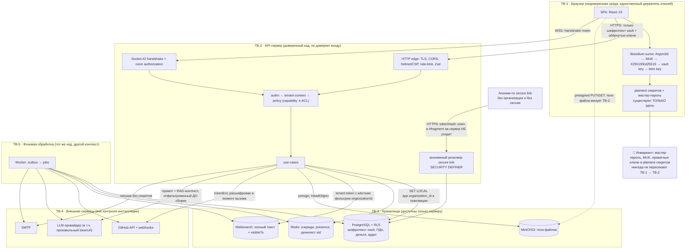

# Bad CRM — модель угроз

Документ фиксирует, **от кого и от чего** защищается система, какие активы она хранит, где проходят
границы доверия и какие конкретные угрозы к каждому контексту применимы. Каждая угроза имеет
стабильный идентификатор `T-<контекст>-<номер>`, на который ссылаются эпики и истории.

Соседние документы (не дублируются здесь, только ссылки):

- [`permission-model.md`](permission-model.md) — capability, роли, override, ACL, алгоритм разрешения;
- [`rls-design.md`](rls-design.md) — политики Row Level Security, роли БД, особые пути;
- [`e2ee-design.md`](e2ee-design.md) — иерархия ключей vault, форматы, ротация, recovery;
- [`../architecture/overview.md`](../architecture/overview.md) — контейнеры, контексты, сквозные механизмы;
- [`../architecture/data-model.md`](../architecture/data-model.md) — сущности, RLS-разметка [T]/[G];
- [`../architecture/stack.md`](../architecture/stack.md) — безопасность в коде (пароли, токены, rate limit, secret box);
- [`../product/prd.md`](../product/prd.md) — персоны, NFR-6, реестр рисков `R-01…R-18`.

Связь с реестром рисков PRD: реестр отвечает на вопрос «что может пойти не так у проекта», модель
угроз — «что может сделать атакующий с системой». Пересечения помечены явно (`R-NN`).

---

## Область моделирования

### В скоупе

| Область | Что именно моделируем |
|---|---|
| Веб-приложение | SPA, HTTP API, WebSocket-канал, анонимные эндпоинты (secure link, health) |
| Данные арендатора | PostgreSQL под RLS, S3/MinIO, Meilisearch, Redis, pgvector-эмбеддинги |
| Криптография vault | Иерархия ключей, шифрование на клиенте, шаринг, отзыв, recovery, escrow |
| Авторизация | RLS (изоляция тенантов) + capability + resource ACL, их взаимодействие и разрывы |
| Внешние интеграции | GitHub App и webhooks, LLM-провайдеры (включая `openai_compat` с произвольным `baseUrl`), SMTP |
| Фоновая обработка | Outbox, воркеры, очереди, индексация, rollup — как отдельная поверхность с собственным tenant-контекстом |
| Поставка | Дефолты `docker compose`, `.env`, миграции, бэкапы, обновления self-host инсталляции |
| Цепочка поставки кода | npm-зависимости, `postinstall`, лицензии, CI-пайплайн, релизные образы |
| Приватность | ПДн сотрудников и контактов заказчика, ретенция, экспорт, удаление |

### Вне скоупа

| Область | Почему вне скоупа | Что вместо этого |
|---|---|---|
| Физическая безопасность хоста | Хост принадлежит пользователю продукта; мы не имеем над ним контроля и не можем ничего проверить кодом | Чек-лист безопасной установки (раздел «Self-host специфика»), рекомендация шифровать диск и бэкапы |
| Компрометация ОС владельца инсталляции (root на хосте) | Root на хосте = доступ к процессу, памяти, БД и переменным окружения; технических средств защиты от этого в приложении не существует | Гарантия сохраняется **только** для E2EE-vault: root получает шифротекст, а не секреты. Всё остальное считаем раскрытым |
| Компрометация браузера пользователя (вредоносное расширение, малварь, XSS-платформа уровня ОС) | Браузер — единственное место, где vault расшифрован; контроль над браузером эквивалентен контролю над пользователем | Минимизация окна: ключи только в памяти вкладки, авто-lock, CSP без `unsafe-inline`, запрет persist-хранилищ для ключей |
| Атаки на сам GitHub / LLM-провайдера / SMTP как на инфраструктуру | Внешние системы вне периметра инсталляции | Моделируем **последствия** их компрометации (профиль нарушителя №8), а не их защиту |
| Криптоанализ примитивов (XChaCha20-Poly1305, X25519, Ed25519, Argon2id) | Используем только стандартные примитивы из одной аудированной сборки `libsodium-wrappers-sumo` ([ADR-0009](../architecture/adr/0009-e2ee-vault-key-hierarchy.md)) плюс WebCrypto для HKDF/HMAC/CSPRNG | Моделируем **неправильное применение** примитивов (nonce reuse, downgrade параметров, утечка ключа) |
| DDoS уровня сети/канала | Решается на уровне провайдера/reverse-proxy, не приложения | Rate limiting на прикладном уровне для дорогих операций и оракулов |

### Отдельная категория: злонамеренный владелец организации

Это **не «вне скоупа»**, это явно ограниченная гарантия, и её нужно называть честно.

- **Администратор организации доверен по умолчанию** для всех данных арендатора: задачи, документы,
  файлы, чат, часы, деньги, ПДн сотрудников. Он их и так администрирует; строить защиту от него
  означало бы строить продукт, которым нельзя управлять. Это зафиксировано в PRD (допущение 6).
- **Единственная область, где администратор организации ограничен архитектурно, — личный vault
  сотрудника.** Ни администратор организации, ни владелец инсталляции не могут прочитать личное
  хранилище: у них нет ключа, и его нет в системе (NFR-6, [ADR-0009](../architecture/adr/0009-e2ee-vault-key-hierarchy.md)).
  Исключение — общее хранилище с включённым организационным escrow (`OrgRecoveryKey`), где
  использование депонирования требует `threshold` хранителей и оставляет запись в `VaultAccessLog` и
  `AuditLog`.
- **Владелец инсталляции сильнее администратора организации:** он контролирует код. Злонамеренный
  владелец может подменить фронтенд и собрать мастер-пароли пользователей — это неустранимо в
  веб-приложении и вынесено в «Остаточные риски». Гарантия E2EE защищает от **пассивного** владельца
  (дамп БД, бэкап, диск), но не от **активного**, модифицирующего доставляемый код.
- Что мы делаем вместо невозможной защиты: **делаем действия администратора видимыми**. Любое
  привилегированное действие — в append-only `AuditLog` (приложение физически не может его удалить,
  см. `T-PLAT-05`); использование escrow уведомляет владельца хранилища; смена AI-провайдера,
  экспорт данных, выдача прав — аудируемые события.

---

## Активы и их ценность

Шкала: **К** — конфиденциальность, **Ц** — целостность, **Д** — доступность. Оценка `Крит./Выс./Ср./Низк.`

| Актив | Где хранится | К | Ц | Д | Последствия компрометации |
|---|---|---|---|---|---|
| Учётные данные и сессии (`User.passwordHash`, `Session.refreshTokenHash`, `totpSecretEnc`, access-JWT) | PostgreSQL [T]; access-токен — память вкладки; refresh — httpOnly cookie; денилист `sid` — Redis | Крит. | Крит. | Выс. | Полный захват аккаунта, а с ним — всех прав пользователя, включая доступ к его vault (мастер-пароль отдельный, но vault-сессия открывается из UI). Захват аккаунта администратора = захват организации |
| Секреты vault (`VaultItem.dataEnc`, `nameEnc`, версии, теги) | PostgreSQL [T] — **только шифротекст**; plaintext — исключительно в памяти вкладки | Крит. | Выс. | Выс. | Компрометация продакшен-инфраструктуры заказчика: боевые пароли, SSH-ключи, API-ключи, сертификаты. Наивысшая ценность для атакующего во всём продукте |
| Ключи пользователей (`UserKeyPair.encryptedPrivateKeys`, `kdfSalt`, `kdfParams`, `recoveryBlobEnc`) | PostgreSQL [T] (зашифрованы MUK); MUK и приватные ключи — только память вкладки | Крит. | Крит. | Крит. | Утечка приватных ключей = все хранилища, где пользователь участник, за всю историю. Порча `kdfSalt`/`kdfParams`/шифротекста = **безвозвратная** потеря vault (восстановление невозможно по построению) |
| Токены интеграций (`GithubInstallation.tokenEnc`, `webhookSecretEnc`, `AIProvider.apiKeyEnc`, `SMTP_URL`) | PostgreSQL [T], AES-256-GCM на `APP_ENCRYPTION_KEY`; ключ — в env | Крит. | Выс. | Ср. | Доступ к репозиториям заказчика, выставление счетов на чужой LLM-аккаунт, рассылка фишинга с легитимного SMTP. `APP_ENCRYPTION_KEY` — единая точка отказа для всех этих секретов |
| Файлы (`File`, `FileVersion`, тела в S3/MinIO) | MinIO/S3, метаданные в PostgreSQL [T] | Выс. | Выс. | Выс. | Утечка контрактов, NDA, проектной документации, персональных документов сотрудников. Тело файла минует API — значит, ACL применяется только в момент выдачи presigned URL |
| Чат (`Message`, `MessageAttachment`, DM) | PostgreSQL [T], вложения — S3 | Выс. | Ср. | Ср. | Личная переписка сотрудников, обсуждения зарплат и конфликтов, случайно вставленные в чат секреты. Наиболее «человеческий» актив: утечка бьёт по доверию сильнее, чем утечка задач |
| Коммерческие данные (`Client`, `Contract`, `ContractRate`, `Invoice`, `Budget`, `CostRate`, `BillRate`) | PostgreSQL [T] | Крит. | Крит. | Ср. | Ставки и маржинальность в руках конкурента или заказчика = потеря контрактов. Порча целостности = неверные инвойсы и юридический конфликт (`R-16`) |
| Аудит-лог (`AuditLog`, `VaultAccessLog`, `SecureLinkView`) | PostgreSQL [T], партиционирован, append-only | Выс. | **Крит.** | Ср. | Без целостности аудита расследование любого инцидента невозможно, а факт компрометации недоказуем. Аудит, который приложение может переписать, аудитом не является |
| База знаний и документы (`DocPage`, `KbNote`, `Embedding`) | PostgreSQL [T], эмбеддинги — pgvector | Выс. | Выс. | Ср. | Исходные знания компании: архитектура, решения, runbook'и, внутренние правила. Одновременно — крупнейшая поверхность prompt injection и stored XSS |
| Персональные данные (`User`, `EmployeeProfile`, `emergencyContactEnc`, `ClientContact`, `ipHash`, presence) | PostgreSQL [T] | Выс. | Выс. | Ср. | Юридические последствия (GDPR/152-ФЗ) для владельца инсталляции; данные о найме, руководителе, ёмкости, экстренном контакте. Presence и `lastSeenAt` — канал слежки за сотрудником |
| Метаданные vault (число элементов, дерево папок, граф шаринга, `VaultAccessLog`) | PostgreSQL [T], **не зашифрованы** | Ср. | Ср. | Низк. | Не раскрывает секреты, но раскрывает структуру: у кого сколько секретов, кто с кем делится, какой проект «богат» доступами. Осознанный остаточный риск |
| Поисковый индекс (Meilisearch) и rollup-агрегаты | Meilisearch, PostgreSQL [T] | Выс. | Ср. | Низк. | Производное состояние: восстанавливается из БД (Д низкая), но содержит **полный текст** документов и задач и знает про ACL только то, что в него положили. Утечка индекса ≈ утечка контента |

---

## Модель нарушителя

### N1. Внешний неаутентифицированный атакующий

- **Мотивация:** массовая компрометация публично торчащих инсталляций (сканеры по Shodan), кража
  секретов vault для доступа к чужой инфраструктуре, вымогательство.
- **Возможности:** сетевой доступ к опубликованным портам; полный доступ к SPA-бандлу и OpenAPI-схеме
  (продукт открыт, AGPL — код известен целиком); автоматизированный перебор; регистрация собственной
  организации в инсталляции, если она открыта.
- **Доступно ему:** `/auth/*`, публичный резолвер secure link, `/healthz`/`/readyz`, статика SPA, а
  также — при типовой ошибке установки — Postgres/Redis/MinIO/Meilisearch, выставленные наружу.
- **Ключевые угрозы:** `T-IAM-03`, `T-IAM-05`, `T-LINK-01`, `T-LINK-04`, `T-FILE-04`, `T-PLAT-03`, `T-SH-*`.

### N2. Аутентифицированный пользователь другой организации (кросс-тенантный)

- **Мотивация:** конкурентная разведка (в инсталляции хостера/аутсорс-студии несколько организаций),
  любопытство.
- **Возможности:** полностью легитимный аккаунт, валидный access-токен, знание внутренних UUID-форматов
  и API-контракта; может подставлять чужие идентификаторы во все параметры и тела запросов.
- **Доступно ему:** весь API от имени своей организации. Барьер — RLS **и** policy-слой. Один
  забытый `SET LOCAL`, одна таблица без политики, один обработчик outbox без tenant-контекста — и
  барьера нет.
- **Ключевые угрозы:** `T-TENANT-01…06`, `T-PLAT-01`, `T-PLAT-03`, `T-FILE-07`.

### N3. Аутентифицированный сотрудник с минимальными правами (privilege escalation)

- **Мотивация:** увидеть чужие зарплаты и ставки, прочитать приватный проект руководства, получить
  доступ к секретам, к которым его не допустили.
- **Возможности:** легитимный доступ к части данных организации; знает внутреннюю структуру, имена
  проектов, коллег, номера задач (`BAD-42` перечисляется тривиально); может вызывать любые эндпоинты,
  а не только те, что показывает UI.
- **Доступно ему:** всё, что не закрыто **policy-слоем** (RLS ему не мешает — он в своей организации).
  Это самый вероятный нарушитель во всём продукте: ему не нужно ничего ломать, достаточно найти
  эндпоинт, где проверка capability есть, а проверка ACL забыта.
- **Ключевые угрозы:** `T-PROJ-01`, `T-TASK-01`, `T-TASK-06`, `T-TIME-02`, `T-ANLT-01`, `T-ANLT-02`,
  `T-AI-02`, `T-PLAT-04`, `T-IAM-09`.

### N4. Уволенный сотрудник

- **Мотивация:** месть, унос наработок к новому работодателю, сохранение доступа «на всякий случай».
- **Возможности:** знание системы изнутри; **артефакты, выданные до увольнения**: сохранённые
  presigned URL, действующие secure links, экспортированные `.md` базы знаний, локальная копия
  расшифрованного vault, старая копия `wrappedVaultKey` из клиента, действующий refresh-токен на
  личном устройстве, персональный API-доступ.
- **Доступно ему после офбординга:** ничего — **если** офбординг закрывает всё перечисленное.
  Реальная опасность в том, что `status = SUSPENDED` часто закрывает только вход, оставляя живыми
  ссылки, токены и WS-сессии.
- **Ключевые угрозы:** `T-IAM-06`, `T-IAM-10`, `T-FILE-02`, `T-LINK-05`, `T-VAULT-05`, `T-VAULT-11`,
  `T-CHAT-01`.

### N5. Администратор организации

- **Мотивация:** легитимное администрирование; в злонамеренном варианте — чтение личной переписки и
  личных хранилищ сотрудников, тайное изменение прав и финансовых данных.
- **Что он может:** всё в пределах данных арендатора — читать любые проекты, задачи, документы,
  файлы, часы, деньги и ПДн; выдавать себе и другим любые capability; настраивать AI-провайдера и
  интеграции; экспортировать данные организации; удалять организацию.
- **Чего он НЕ может:**
  1. **Прочитать личный vault сотрудника** — у него нет `wrappedVaultKey` для этого хранилища и нет
     способа его получить: сервер хранит только шифротекст (`T-VAULT-09`, проверяется отдельным
     тестом на гейте M7).
  2. **Незаметно воспользоваться организационным escrow** — требуется `threshold` хранителей,
     операция пишется в `VaultAccessLog` + `AuditLog`, владелец хранилища уведомляется.
  3. **Изменить или удалить запись аудита** — `REVOKE UPDATE, DELETE ON audit_logs FROM app_user`
     действует и на его сессию (`T-PLAT-05`).
  4. **Выйти за пределы своей организации** — RLS не знает про роли и одинаково режет всех.
- **Ключевые угрозы (как нарушителя):** `T-VAULT-09`, `T-PLAT-05`, `T-TIME-01`, `T-AI-05`.

### N6. Оператор инфраструктуры / владелец хоста

- **Мотивация:** обычно нет злого умысла; риск реализуется через компрометацию хоста, украденный
  бэкап, доступ подрядчика к дискам или к панели хостера.
- **Возможности:** `pg_dump` всей БД, содержимое томов `pgdata`/`minio-data`, `.env` со всеми
  секретами, память процесса, логи, возможность подменить образ и код.
- **Какие гарантии сохраняются:**
  - Содержимое **vault** остаётся недоступным: в дампе только шифротекст и обёрнутые ключи; ключа в
    системе нет ни в каком виде. Это единственная гарантия, переживающая полную компрометацию хоста.
  - Содержимое `ONE_TIME` secure link недоступно: ключ расшифровки живёт в URL-фрагменте и до
    сервера не доходит.
- **Какие гарантии НЕ сохраняются:** всё остальное. Файлы, чат, задачи, документы, ПДн, коммерческие
  данные, `passwordHash` (перебор офлайн), `tokenEnc`/`apiKeyEnc` (расшифровываются `APP_ENCRYPTION_KEY`
  из того же `.env`), содержимое поискового индекса. RLS от него не защищает — он подключается любой
  ролью, включая владельца схемы.
- **Активный вариант (подмена кода) ломает и E2EE** — см. «Остаточные риски».
- **Ключевые угрозы:** `T-SH-04`, `T-SH-05`, `T-GH-02`, `T-VAULT-01`.

### N7. Скомпрометированная зависимость (supply chain)

- **Мотивация:** массовая монетизация — кража `.env`, токенов, криптокошельков; целевая закладка в
  крипто-код.
- **Возможности:** выполнение произвольного кода **на машине разработчика и в CI** (`postinstall`),
  выполнение в рантайме сервера (транзитивная зависимость), выполнение **в браузере пользователя**
  (зависимость фронтенда) — последнее прямо ломает E2EE, потому что код исполняется рядом с ключами.
- **Доступно ему:** всё, что доступно процессу; в браузере — мастер-пароль и все расшифрованные
  секреты в момент разблокировки vault.
- **Особенность продукта:** фронтенд-зависимость в vault-экране опаснее любой серверной, потому что
  сервер по построению не видит секретов, а браузер видит их все.
- **Ключевые угрозы:** `T-SC-*`, `T-VAULT-03`.

### N8. Скомпрометированный LLM-провайдер / prompt injection

- **Мотивация:** сбор данных организаций (провайдер), эксфильтрация целевых данных (атакующий,
  внедривший инструкции в контент).
- **Возможности:**
  - *Провайдер:* видит всё, что уходит в промпт, включая RAG-контекст; может возвращать произвольный
    ответ, включая инструкции и разметку, которую отрендерит клиент.
  - *Prompt injection:* любой, кто может положить текст в задачу, комментарий, документ, заметку,
    имя ветки GitHub или файл, может адресовать инструкции ассистенту — включая внешнего подрядчика
    и автора коммита без аккаунта в CRM.
- **Доступно ему:** контекст ассистента, а через tool-calls — действия от имени ассистента. Если
  ассистент действует правами системы, а не спрашивающего, это прямой privilege escalation.
- **Ключевые угрозы:** `T-AI-01…T-AI-09`.

---

## Границы доверия

| Граница | Что пересекает | В каком виде | Чем контролируется |
|---|---|---|---|
| **TB-1 → TB-2** (браузер ↔ API) | Учётные данные, тела запросов, шифротекст vault, обёрнутые ключи, blind-index HMAC | TLS; секреты vault — **только** ciphertext + nonce + wrapped key; мастер-пароль и MUK не передаются никогда | TLS/HSTS, CORS allow-list, CSP без `unsafe-inline`, Zod на границе, rate-limit, access-JWT 15 мин, refresh в httpOnly cookie |
| **TB-1 → TB-3** (браузер ↔ S3, presigned) | Тело файла | Байты напрямую, минуя API | Presigned URL с TTL ≤ 15 мин, привязка к методу/ключу/content-type, бакет не публичен, листинг запрещён, `HeadObject`-верификация при commit |
| **TB-2 → TB-3** (API ↔ PostgreSQL) | Все данные арендатора | SQL под ролью `app_user` (без `BYPASSRLS`) внутри транзакции с `SET LOCAL app.organization_id` | RLS `USING` + `WITH CHECK` + `FORCE`, разделение ролей `app_user`/`app_migrator`/`app_auth`, `REVOKE UPDATE,DELETE` на `audit_logs` |
| **TB-2 → TB-3** (API ↔ Redis) | Job-конверты (с `organizationId`), presence, денилист `sid`, счётчики rate-limit | Открытым текстом внутри доверенной сети | Redis не публикуется наружу, пароль/ACL обязательны, конверт без `organizationId` → dead letter |
| **TB-2 → TB-3** (API ↔ MinIO) | Ключи объектов `org/{organizationId}/…`, presign-запросы | S3 API с сервисными кредами | Префикс тенанта проверяется при commit, дедупликация только внутри организации, отдельные креды у приложения, ключи не в клиенте |
| **TB-2 → TB-3** (API ↔ Meilisearch) | Полный текст задач/документов/заметок + `visibleTo` + `organizationId` | Открытым текстом в индексе | Мастер-ключ только на сервере, клиенту выдаётся **tenant token** с зашитым фильтром `organizationId`, пользовательский фильтр по принципалам добавляется поверх; vault в индекс не попадает никогда |
| **TB-2 → TB-4** (API/worker ↔ GitHub) | Установочный токен, запросы к API; обратно — webhook-доставки | HTTPS; токен расшифровывается из `tokenEnc` в момент вызова | Проверка `X-Hub-Signature-256` в constant-time, идемпотентность по `providerRunId`, минимальные права GitHub App, allow-list хостов |
| **TB-2 → TB-4** (API/worker ↔ LLM) | Промпт, RAG-контекст, история треда | HTTPS наружу периметра инсталляции — **данные покидают контроль организации** | Фильтрация RAG по принципалам **до** сборки промпта, tool-allowlist, лимиты, AI выключен по умолчанию, `baseUrl` — allow-list, явное согласие организации |
| **TB-2 → TB-4** (API/worker ↔ SMTP) | Приглашения, восстановление пароля, дайджесты | SMTP(S) | Секреты и содержимое vault в письма не попадают; ссылки — одноразовые токены с TTL; SMTP-пароль в `secret box` |
| **Аноним → TB-2** (secure link) | `tokenHash` в пути; ключ расшифровки — в `#fragment`, до сервера **не доходит** | Единственная точка входа без tenant-контекста | `SECURITY DEFINER`-резолвер с фиксированным `search_path`, атомарная проверка+инкремент+журналирование, rate-limit по IP и по `tokenHash`, маскирование токена в access-логах |
| **TB-2 ↔ TB-5** (API ↔ worker) | Outbox-события, job-конверты | Через PostgreSQL и Redis | `organizationId` — обязательное поле конверта; **своя** транзакция с `SET LOCAL` на каждое событие; идемпотентность по `outboxEventId` + имя обработчика |

---

## STRIDE по контекстам

Легенда STRIDE: **S** spoofing · **T** tampering · **R** repudiation · **I** information disclosure ·
**D** denial of service · **E** elevation of privilege.
Влияние и вероятность: `Крит./Выс./Ср./Низк.`

### identity-and-access (EPIC-006, EPIC-011, EPIC-012, EPIC-013)

| ID | STRIDE | Угроза | Вектор | Влияние | Вероятн. | Митигация | Проверяется |
|---|---|---|---|---|---|---|---|
| T-IAM-01 | S | Кража access-токена из памяти вкладки | Stored XSS в задаче/документе/чате исполняется на том же origin и читает токен из состояния клиента | Крит. | Ср. | CSP без `unsafe-inline` и `frame-ancestors 'none'`; `rehype-sanitize` + whitelist протоколов; access-токен только в памяти (никогда `localStorage`), TTL 15 мин; денилист `sid` в Redis при logout | e2e `xss-payload-corpus` по всем rich-text полям; CI-проверка заголовков (`csp-header.spec`); ESLint-правило «нет токена вне auth-store» |
| T-IAM-02 | S | Повторное использование украденного refresh-токена | Токен снят с устройства/бэкапа и предъявлен параллельно с легитимным клиентом | Крит. | Ср. | Ротация с reuse detection: предъявление уже отозванного токена отзывает **всю семью** `family_id` одним `UPDATE`, пишет `AuditLog` и шлёт письмо | Интеграционный тест `refresh-reuse-revokes-family`; e2e «старый refresh после ротации → 401 + все сессии закрыты» |
| T-IAM-03 | I | Перечисление аккаунтов и организаций | Разница ответа/тайминга между «нет пользователя» и «неверный пароль» на `/auth/login`, `/auth/forgot-password`, `/auth/invite/accept` | Ср. | Выс. | `auth_lookup_user(email, org_slug)` — вход всегда в паре с организацией; одинаковый текст ответа; фиктивная проверка Argon2 при отсутствии пользователя (константное время); rate-limit 5/15 мин по IP+email | Тест `auth-timing-equality` (разброс медиан < порога); снапшот-тест тел ответов на 4 негативных сценария |
| T-IAM-04 | E | Обход второго фактора | Промежуточный «pending-2FA» токен принимается обычными эндпоинтами; либо повторное использование recovery-кода | Крит. | Ср. | Отдельный тип токена с `scope=mfa_pending`, TTL 5 мин, принимается **только** `/auth/2fa/verify`; recovery-коды хранятся argon2id-хешами и помечаются использованными атомарно | Тест `mfa-pending-token-rejected-everywhere` (табличный по всем маршрутам); тест «recovery-код одноразов» |
| T-IAM-05 | S | Подделка JWT | `alg: none` / HS-RS confusion / слабый `JWT_SECRET` из примера `.env` | Крит. | Низк. | Явный `algorithms: ['HS256']` при verify; `JWT_SECRET` ≥ 32 байт валидируется Zod при старте; preflight отказывает старту на значениях из `.env.example` | Тест `jwt-alg-confusion`; preflight-тест `refuses-default-secrets`; агент `security-auditor` в гейте |
| T-IAM-06 | E | Действие с отозванными правами | Роль снята/сотрудник уволен, но выданный access-токен живёт до 15 минут; WS-соединение установлено раньше и не переустанавливается | Выс. | Выс. | `permissionsVersion` в токене сверяется с БД на каждом запросе → несовпадение = перечитать права/401; офбординг инкрементирует версию, отзывает все `Session`, разрывает WS-соединения пользователя и инвалидирует его presigned URL по политике | Тест `permissions-version-invalidates-token`; e2e `offboarding-closes-everything` (HTTP + WS + secure links) |
| T-IAM-07 | I | Утечка токена восстановления пароля | Токен в query-строке → access-логи reverse-proxy, `Referer` при переходе на внешний ресурс, история браузера | Выс. | Ср. | В БД только хеш токена; одноразовость + TTL 30 мин; страница сброса отдаётся с `Referrer-Policy: no-referrer`; middleware маскирует токен в логах | Тест `reset-token-hashed-and-single-use`; grep-тест логов на утечку токенов в e2e-прогоне |
| T-IAM-08 | D | KDF как вектор отказа | Параллельные логины по 19 MiB Argon2id исчерпывают память инстанса | Ср. | Ср. | Rate-limit **до** вызова KDF; ограничение конкурентности хеширования (семафор); параметры Argon2 в env с задокументированным потолком | Нагрузочный сценарий `login-flood-memory`; метрика `argon2_inflight` с алертом |
| T-IAM-09 | E | Эскалация через выдачу ролей | Пользователь с `role:assign` выдаёт себе (или подконтрольному аккаунту) роль с `isDangerous`-правами | Крит. | Ср. | Правило «нельзя выдать capability, которой нет у выдающего»; отдельное право на `isDangerous`-каталог; запрет самоназначения; обязательный `reason` у `UserPermissionOverride`; всё в `AuditLog` | `permission-matrix` snapshot-тест (кто кому что может выдать); тест `no-self-escalation`; агент `security-auditor` |
| T-IAM-10 | S | Перехват приглашения | Токен приглашения переслан/угадан; принятие с другим e-mail; приглашение живёт бесконечно | Выс. | Ср. | `tokenHash` в БД, 32 байта энтропии, TTL, одноразовость; принятие строго на `Invitation.email`; отзыв приглашения инвалидирует токен немедленно | Тест `invitation-bound-to-email-and-expires`; e2e «отозванное приглашение не принимается» |

### organization / tenancy (EPIC-005, EPIC-002)

| ID | STRIDE | Угроза | Вектор | Влияние | Вероятн. | Митигация | Проверяется |
|---|---|---|---|---|---|---|---|
| T-TENANT-01 | I | Новая таблица без RLS | Разработчик добавляет модель, забывает политику; данные всех организаций читаются любым аккаунтом (`R-01`) | Крит. | Выс. | Шаблон миграции обязывает `ENABLE` + `FORCE` + политику; структурный CI-тест по `pg_policy` падает при таблице с `organization_id` без политики; чек-лист новой таблицы в PR | CI-шаг `rls-structural-test` (обход `pg_class`×`pg_policy`); агент `db-reviewer` в commit-гейте |
| T-TENANT-02 | E | Запись в чужой тенант | Политика только с `USING`: чтение чужого закрыто, но `INSERT`/`UPDATE` с чужим `organization_id` из тела запроса проходит | Крит. | Ср. | Политика **обязана** содержать идентичные `USING` и `WITH CHECK`; `organizationId` никогда не принимается из тела запроса — только из сессии | Тест изоляции на каждую [T]-таблицу: «вставить и переложить строку в чужой тенант» → отказ; структурный тест «политика без `WITH CHECK` ломает CI» |
| T-TENANT-03 | I | Протечка контекста через пул соединений | `SET` вместо `SET LOCAL`, запрос вне `withTenant`, PgBouncer в режиме `statement` | Крит. | Ср. | Только `set_config(..., true)` внутри транзакции; ESLint/архитектурный тест запрещает вызовы Prisma-моделей мимо `withTenant`; PgBouncer только `transaction`/`session` — проверяется preflight | Архитектурный тест `no-prisma-outside-withTenant`; конкурентный тест «два тенанта на одном пуле» под нагрузкой |
| T-TENANT-04 | E | Приложение под привилегированной ролью | Инсталляция задаёт `DATABASE_URL` под владельцем схемы или ролью с `BYPASSRLS` — RLS молча исчезает | Крит. | Ср. | `FORCE ROW LEVEL SECURITY` на всех [T]-таблицах; health-check при старте: `current_user = app_migrator` или `rolbypassrls` → отказ старта | Тест `refuses-to-start-as-owner`; preflight self-host проверяет роль подключения |
| T-TENANT-05 | I | IDOR внутри своей организации | RLS пропускает (тенант тот же), а policy-слой на конкретном эндпоинте забыт — доступ к приватному проекту/документу по UUID | Выс. | Выс. | Обязательная конъюнкция `RLS ∧ capability ∧ ACL`; отсутствие ACL = наследование от родителя, а не «разрешено»; fail-closed по умолчанию в policy | `permission-matrix` snapshot по всем маршрутам (роль × ресурс × действие); контрактный тест «каждый route имеет объявленную policy» |
| T-TENANT-06 | I | Перечисление арендаторов | Ответы `/auth`, регистрация организации и резолвер slug раскрывают, какие организации существуют в инсталляции | Ср. | Выс. | Одинаковый ответ для существующего и несуществующего slug; rate-limit регистрации 3/час по IP; опция «закрытая инсталляция» (регистрация только по приглашению владельца) | Тест `slug-enumeration-indistinguishable`; e2e «закрытая инсталляция отклоняет самостоятельную регистрацию» |
| T-TENANT-07 | D | Флуд организаций | Открытая регистрация → тысячи пустых организаций, раздувание БД, индексов и бэкапов | Ср. | Ср. | Rate-limit 3/час по IP; подтверждение e-mail до создания организации; закрытая регистрация как дефолт self-host; джоб зачистки неподтверждённых | Тест лимита регистрации; проверка дефолта в `.env.example` (`SIGNUP_MODE=invite_only`) |

### project (EPIC-014, EPIC-021)

| ID | STRIDE | Угроза | Вектор | Влияние | Вероятн. | Митигация | Проверяется |
|---|---|---|---|---|---|---|---|
| T-PROJ-01 | I | Приватный проект утекает через вторичные пути | `visibility = PRIVATE` проверяется в `GET /projects`, но не в поиске, дашборде, ленте активности, автодополнении исполнителей и уведомлениях | Выс. | Выс. | Единая функция «видимые пользователю проекты» (один источник, `domain/policies`), обязательная во всех агрегирующих путях; в поисковый документ пишется `visibleTo` проекта | `permission-matrix` snapshot включает вторичные пути; e2e `private-project-invisible-everywhere` (список, поиск, дашборд, автодополнение, лента) |
| T-PROJ-02 | E | Самоприсоединение к проекту | `POST /projects/{id}/members` с собственным `userId` без права `project:member:add` | Выс. | Ср. | Отдельное capability на управление составом; запрет добавления самого себя; `ResourceAcl` на проект проверяется до записи | Тест `no-self-join-project`; permission-matrix |
| T-PROJ-03 | I | Доступ к архивированному/удалённому проекту | Глобальный фильтр `deletedAt IS NULL` обходится сырым SQL отчёта или отдельным эндпоинтом | Ср. | Ср. | Фильтр мягкого удаления навешен в Prisma-`$extends`, а не расставлен руками; архивный проект read-only и требует того же ACL | Тест `soft-deleted-invisible-in-all-repositories` (табличный по репозиториям) |
| T-PROJ-04 | R | Незаметное изменение состава проекта | Добавление себя в проект и удаление обратно после чтения данных | Выс. | Ср. | Каждое изменение `ProjectMember` и `ResourceAcl` — событие `AuditLog` с before/after и актором; лента изменений проекта видна лиду | Тест «изменение состава пишет аудит»; e2e-проверка ленты |
| T-PROJ-05 | I | Утечка финансовых полей проекта | Сериализатор проекта отдаёт `budget`, `capAmountMicros`, ставки всем участникам, включая `OBSERVER` | Выс. | Выс. | Разные сериализаторы по уровню доступа (не «фильтрация на клиенте»); финансовые поля — отдельное capability `project:finance:read` | Снапшот-тест сериализаторов по ролям; тест «ответ API для OBSERVER не содержит финансовых ключей» |

### task (EPIC-018, EPIC-019, EPIC-020, EPIC-021)

| ID | STRIDE | Угроза | Вектор | Влияние | Вероятн. | Митигация | Проверяется |
|---|---|---|---|---|---|---|---|
| T-TASK-01 | I | IDOR по задаче | Перебор `BAD-1…BAD-N` или UUID; задача приватного проекта открывается по прямой ссылке | Выс. | Выс. | Проверка ACL родительского проекта/доски на **каждом** чтении задачи, включая вложенные ресурсы (комментарии, история, вложения); fail-closed | Тест `task-idor-matrix` (пользователь без доступа × 12 подресурсов); permission-matrix |
| T-TASK-02 | T | «Дешёвые» мутации без проверки | `PATCH /tasks/{id}/move` (drag-n-drop) реализован как быстрый путь без `capability + ACL` | Выс. | Ср. | Единый policy-вызов в каждом use-case; контрактный тест «каждый route ↔ объявленная policy»; перемещение — такая же мутация, как любая другая | Контрактный тест route↔policy; permission-matrix включает `move`/`reorder` |
| T-TASK-03 | I | Утечка через историю изменений | `ActivityEvent.payload` хранит before/after полей, которые читателю недоступны (оценка, ставка, приватное описание) | Ср. | Выс. | Whitelist полей, попадающих в `payload`; фильтрация ленты по правам на конкретные поля, а не только на сущность | Тест `activity-payload-whitelist`; снапшот payload по типам событий |
| T-TASK-04 | S | Подделка авторства | `authorId`/`actorId` берётся из тела запроса, а не из сессии | Ср. | Низк. | Актор всегда из `AsyncLocalStorage`-контекста сессии; поля актора отсутствуют во входных Zod-схемах (`.strict()`) | Тест «`authorId` в теле игнорируется»; линт-правило на `.strict()` во всех входных схемах |
| T-TASK-05 | D | Раздувание данными | Массовое создание задач/комментариев/меток скриптом, рост индексов и поискового индекса | Ср. | Ср. | Rate-limit 300 req/мин на пользователя; квоты организации на число сущностей; ограничение размера `description`/`body` | Нагрузочный тест `bulk-create-throttled`; тест лимита размера тела |
| T-TASK-06 | I | Вложение переживает отзыв доступа | Полиморфный `Attachment` читается по своему id без проверки прав на родителя (`R-11`) | Выс. | Выс. | Централизованный слой доступа к полиморфным ссылкам: чтение вложения/комментария **всегда** резолвит родителя и проверяет права на него; фоновая проверка сирот | Тест `polymorphic-parent-check` (задача → вложение → отзыв доступа → 403); джоб-тест поиска сирот |

### knowledge — docs + kb (EPIC-022, EPIC-023)

| ID | STRIDE | Угроза | Вектор | Влияние | Вероятн. | Митигация | Проверяется |
|---|---|---|---|---|---|---|---|
| T-KNOW-01 | T/E | Stored XSS через контент | `javascript:`/`data:` в ссылке, сырой HTML в markdown KB, `onerror` в импортированной заметке, SVG-вложение | Крит. | Выс. | `rehype-sanitize` со строгой схемой на рендере **и** на импорте; whitelist протоколов (`http`, `https`, `mailto`); CSP без `unsafe-inline`; SVG отдаётся только как `attachment`, не inline | e2e `xss-payload-corpus` (полный набор payload'ов по всем редакторам и импорту); агент `frontend-security-coder` в ревью |
| T-KNOW-02 | E | Path traversal при импорте | `KbNote.path` из архива содержит `../` или абсолютный путь → перезапись чужой заметки/файла в бакете | Выс. | Ср. | Нормализация и валидация пути Zod-схемой (запрет `..`, ведущего `/`, NUL, управляющих символов); путь всегда относителен `KbSpace`; ключ объекта строится сервером, не берётся из архива | Тест `kb-import-path-traversal-corpus`; тест «ключ S3 всегда начинается с `org/{id}/`» |
| T-KNOW-03 | D | Zip-bomb / гигантский импорт | Архив Obsidian на десятки ГБ после распаковки, тысячи файлов — воркер и диск исчерпаны | Ср. | Ср. | Лимиты на размер архива, суммарный распакованный размер, число файлов и глубину; потоковая распаковка с прерыванием по превышению; импорт в отдельной очереди с ограниченной конкурентностью | Тест `zip-bomb-rejected`; тест лимитов импорта |
| T-KNOW-04 | I | SSRF через контент документа | Сервер/воркер тянет удалённое изображение или `embed`-превью по URL из документа → запрос во внутреннюю сеть (`169.254.169.254`, `localhost`, приватные подсети) | Выс. | Ср. | Сервер **не** загружает удалённые ресурсы из пользовательского контента по умолчанию; если превью включено — allow-list схем, резолв DNS с блокировкой приватных диапазонов, запрет редиректов, таймаут | Тест `ssrf-blocklist` (RFC1918, link-local, `metadata`); архитектурный тест «нет исходящего HTTP из рендера контента» |
| T-KNOW-05 | I | Граф связей раскрывает закрытое | Backlinks и граф показывают заголовки и существование заметок, к которым нет доступа; `KbLink.targetTitleRaw` виден всем | Ср. | Выс. | Граф строится **после** фильтрации по правам; недоступные узлы не показываются даже как «серые»; битые ссылки считаются в пределах видимого подграфа | Тест `kb-graph-respects-acl`; e2e «пользователь без доступа не видит узел и его заголовок» |
| T-KNOW-06 | T | Гонка версий документа | Два редактора сохраняют `DocPage.content` целиком; последний перезаписывает чужие правки (или откатывает удаление конфиденциального фрагмента) | Ср. | Выс. | Оптимистичная блокировка по версии: сохранение с устаревшей `version` → 409 и явный merge-UX; каждая запись создаёт `DocPageVersion` (потерянные правки восстановимы) | Конкурентный тест `doc-optimistic-lock`; e2e «конфликт версий показывает диалог, а не молча перезаписывает» |
| T-KNOW-07 | I | Массовая эксфильтрация через экспорт | Экспорт `.md` всего пространства знаний доступен любому участнику; уносится за одну операцию | Выс. | Выс. | Экспорт — отдельное capability `kb:export`, ограниченное видимым подмножеством; лимит объёма и частоты; каждый экспорт — запись `AuditLog` с числом заметок и уведомление админу при превышении порога | Тест «экспорт содержит только доступные заметки»; тест аудита экспорта; алерт по объёму |

### file (EPIC-015)

| ID | STRIDE | Угроза | Вектор | Влияние | Вероятн. | Митигация | Проверяется |
|---|---|---|---|---|---|---|---|
| T-FILE-01 | E | Подмена ключа объекта при commit | Клиент вызывает `/files/{id}/commit` с `storageKey`, указывающим на чужой объект — привязывает чужой файл к своей записи | Выс. | Ср. | `storageKey` формирует **сервер** (`org/{organizationId}/…`), клиент его не передаёт; при commit — `HeadObject` по серверному ключу; префикс тенанта проверяется явно | Тест `commit-ignores-client-key`; тест «ключ вне префикса организации → отказ» |
| T-FILE-02 | I | Утечка presigned URL | Ссылка переслана в чат/наружу, попала в лог reverse-proxy или в `Referer`; работает независимо от отзыва прав (`R-12`) | Выс. | Выс. | TTL ≤ 15 мин; выдача только после проверки ACL в момент запроса; `response-content-disposition=attachment` и `Referrer-Policy: no-referrer` на страницах с файлами; маскирование query-параметров подписи в логах; для файлов с меткой «чувствительный» — проксирование через API вместо presigned | Тест TTL и привязки к методу; grep-тест e2e-логов на `X-Amz-Signature`; агент `security-auditor` |
| T-FILE-03 | T | Presigned PUT без ограничений | Подпись без `content-length-range` и content-type: загрузка терабайта или подмена содержимого уже закоммиченного файла | Ср. | Выс. | Подпись включает ограничение размера и content-type; повторный PUT по тому же ключу запрещён (immutable-версии — новый `FileVersion` с новым ключом); `HeadObject` сверяет фактические размер и тип с заявленными | Тест `presigned-put-constraints`; тест «повторная запись по ключу отклонена» |
| T-FILE-04 | E/I | Прямой доступ к объектному хранилищу | Порт MinIO опубликован наружу дефолтным compose; бакет публичный; анонимный листинг разрешён | Крит. | Ср. | Бакет приватный, anonymous policy снят явной инициализацией; листинг запрещён; MinIO не публикуется наружу (или только `/s3` через reverse-proxy с фильтром); отдельные креды у приложения; preflight проверяет публичность бакета и завершает старт с ошибкой | Preflight-тест `bucket-not-public`; интеграционный тест «анонимный GET по ключу → 403»; чек-лист установки |
| T-FILE-05 | T | Загрузка вредоносного файла | Малварь распространяется внутри организации через вложения; антивируса в поставке нет | Ср. | Выс. | Принятый риск (см. «Файлы и presigned URL»): `scanStatus` в модели с первого дня; файл в `PENDING` не отдаётся; опциональный ClamAV-адаптер за `AntivirusPort`; отдача всегда `Content-Disposition: attachment` + `X-Content-Type-Options: nosniff` | Тест «`PENDING` не выдаётся на скачивание»; тест заголовков отдачи; документированный статус риска в релиз-ноте |
| T-FILE-06 | I | XSS через отдачу файла | HTML/SVG-файл отдаётся с того же origin с `text/html` → скрипт в контексте приложения | Выс. | Ср. | Отдача только через presigned S3 (другой origin) с `attachment`; запрет inline-рендера `text/html` и `image/svg+xml`; `nosniff` | Тест «HTML-файл не рендерится inline»; e2e с SVG-payload |
| T-FILE-07 | I | Кросс-тенантная дедупликация как оракул | Дедупликация по `checksumSha256` между организациями позволяет проверить наличие конкретного документа у соседа | Ср. | Низк. | Дедупликация **строго** внутри организации (индекс `(organization_id, checksum_sha256)`); кросс-тенантная запрещена явно, даже ради экономии диска | Тест `dedup-is-tenant-scoped`; агент `db-reviewer` при изменении индекса |
| T-FILE-08 | D | Исчерпание диска и сирот | Загрузки без commit, брошенные объекты, отсутствие квот | Ср. | Выс. | Квота организации на суммарный объём; джоб зачистки `pending` старше порога и объектов без строки в БД; алерт при заполнении тома | Тест джоба зачистки; тест превышения квоты → 413 с понятным кодом |

### vault (EPIC-033, EPIC-034, EPIC-035) — **высший приоритет**

| ID | STRIDE | Угроза | Вектор | Влияние | Вероятн. | Митигация | Проверяется |
|---|---|---|---|---|---|---|---|
| T-VAULT-01 | S | Подмена публичного ключа при шаринге | Сервер (или атакующий с доступом к БД) отдаёт свой `publicKeyX25519` вместо ключа получателя → vault key оборачивается для атакующего | Крит. | Низк. | Публичные ключи подписываются `Ed25519`-ключом владельца; клиент показывает **fingerprint** получателя и требует подтверждения при первом шаринге (TOFU) и при изменении ключа; смена ключевой пары уведомляет всех, кто с ним делился | Агент `e2ee-crypto-reviewer` (обязателен на любое изменение крипто-модуля); тест `key-change-invalidates-tofu`; частично — остаточный риск, см. соответствующий раздел |
| T-VAULT-02 | I | Plaintext-поле в vault-таблице | Новая фича добавляет «просто имя элемента» или `url` открытым текстом «для удобства поиска/иконки» | Крит. | Выс. | Инвариант: в таблицах группы vault нет ни одного открытого пользовательского значения; чек-лист новой таблицы (п. 9) обязателен; поиск — только через `blindIndex*` | Структурный тест схемы: любая новая колонка в `vault_*` без суффикса `Enc`/`blindIndex`/из whitelist ломает CI; агенты `db-reviewer` + `e2ee-crypto-reviewer` |
| T-VAULT-03 | I | Ключевой материал утекает из памяти вкладки | MUK/приватный ключ попадает в Redux/Zustand-persist, в devtools-снапшот, в Sentry-breadcrumb, в лог ошибки, в React-состояние вне крипто-модуля (`R-03`) | Крит. | Ср. | Крипто-ядро — изолированный модуль, ключи не покидают его (непрозрачные handle-объекты наружу); запрет persist для vault-стора; scrubbing в клиентском репортере ошибок; авто-lock по бездействию и при `visibilitychange` | ESLint-правило «ключевые типы не экспортируются из crypto-модуля»; тест «persist-снапшот не содержит ключевого материала»; агент `e2ee-crypto-reviewer` |
| T-VAULT-04 | T | Nonce/IV reuse | При перешифровке версий или ротации ключа переиспользуется `nonce` для того же ключа → катастрофическая потеря конфиденциальности AES-GCM | Крит. | Ср. | Nonce всегда `crypto.getRandomValues(12)` в момент шифрования, никогда не берётся из существующей строки; счётчик версий не участвует в nonce; тестовые векторы и проверка уникальности в property-тестах | Property-тест «10⁶ шифрований одним ключом → 0 коллизий nonce»; тест «перешифровка версии генерирует новый nonce»; агент `e2ee-crypto-reviewer` |
| T-VAULT-05 | E | Отзыв доступа без ротации ключа | `VaultMembership` удалён, но бывший участник сохранил `wrappedVaultKey` и шифротексты (снятые до отзыва) → продолжает расшифровывать новые элементы, попавшие в дамп | Крит. | Выс. | Отзыв = удаление membership **и** ротация vault key с инкрементом `keyVersion` и переобёртыванием ключа для оставшихся участников; элементы, добавленные после отзыва, зашифрованы новым ключом | Тест `revoke-rotates-vault-key` (элемент, созданный после отзыва, не расшифровывается старым ключом) — жёсткий гейт M7; e2e офбординга |
| T-VAULT-06 | I | Blind index как оракул равенства | Одинаковые URL/имена дают одинаковый HMAC → сервер строит статистику «сколько людей хранят секрет к одному сервису»; словарная атака при утечке ключа blind index | Ср. | Выс. | Ключ blind index производится от vault key (сервер его не знает); нормализация ограничена; область индекса — только `name`/`url`/`tag`; принимаемая цена задокументирована; при ротации vault key blind index пересчитывается | Тест «blind index меняется при ротации ключа»; раздел «Остаточные риски» фиксирует утечку равенства |
| T-VAULT-07 | E | Downgrade параметров KDF | Сервер отдаёт клиенту `kdfParams` — злонамеренный сервер присылает `t=1, m=8 KiB` → мастер-пароль брутфорсится офлайн | Крит. | Низк. | Клиент **не доверяет** серверным `kdfParams`: применяет `max(серверные, встроенный минимум)`; понижение параметров относительно сохранённых локально требует явного подтверждения; `algoVersion` только растёт | Тест `kdf-params-floor-enforced`; тест «понижение `algoVersion` отклоняется клиентом»; агент `e2ee-crypto-reviewer` |
| T-VAULT-08 | R | Расшифровка без следа | Расшифровка происходит на клиенте — сервер может не узнать о ней; отсутствие записи `VaultAccessLog` при `DECRYPT`/`COPY`/`EXPORT` | Выс. | Выс. | Выдача шифротекста элемента **всегда** сопровождается серверной записью `VaultAccessLog` (сервер логирует факт выдачи, а не факт расшифровки — это честнее и неподделываемо клиентом); `COPY`/`EXPORT` дополнительно репортятся клиентом как обогащение | Тест «`GET vault-item` создаёт запись access-log в той же транзакции»; тест «журнал нельзя подавить параметром запроса» |
| T-VAULT-09 | E | Тайное использование организационного escrow | Администратор с хранителями восстанавливает MUK сотрудника и читает **личное** хранилище | Крит. | Низк. | Escrow применим только к хранилищам с `kind = SHARED`/`PROJECT`; личный vault не депонируется вовсе — депонирование MUK **невозможно по схеме**: колонки под escrow-блоб MUK в `UserKeyPair` нет (удалена 2026-07-26), escrow живёт строкой `VaultMembership` с `subjectKind = ESCROW`, запрещённой для `kind = PERSONAL` CHECK-ограничением; использование требует `threshold` хранителей, пишет `VaultAccessLog` + `AuditLog` и уведомляет владельца | Тест `admin-cannot-read-personal-vault` — жёсткий гейт M7; тест «escrow-операция без threshold отклонена и залогирована» |
| T-VAULT-10 | D | Безвозвратная порча ключевых блобов | Баг миграции или злонамеренный `UPDATE` портит `encryptedPrivateKeys`/`kdfSalt` → все хранилища пользователя потеряны навсегда | Крит. | Низк. | Ключевые блобы неизменяемы: изменение = новая строка с новым `algoVersion`, старая сохраняется; миграции этих колонок запрещены без явного плана и бэкапа; клиент проверяет расшифровываемость перед подтверждением ротации | Тест «ротация ключей не удаляет предыдущий блоб до подтверждения»; агент `db-reviewer` блокирует миграции по `user_key_pairs` |
| T-VAULT-11 | I | Эксфильтрация легитимным участником | Участник экспортирует всё хранилище (расшифровка на клиенте — легитимна) перед увольнением | Выс. | Выс. | Экспорт — отдельное capability, по умолчанию только у владельца хранилища; массовая расшифровка (N элементов за окно) детектируется и алертит админу; каждый доступ в `VaultAccessLog`; принципиально неустранимо (см. «Остаточные риски») | Тест «экспорт требует `vault:export`»; тест детектора аномального объёма доступов; алерт в `AuditLog` |

### secure-link (EPIC-036)

| ID | STRIDE | Угроза | Вектор | Влияние | Вероятн. | Митигация | Проверяется |
|---|---|---|---|---|---|---|---|
| T-LINK-01 | S | Перебор токенов | Резолвер — единственный анонимный эндпоинт; массовый перебор `tokenHash` превращает его в оракул | Выс. | Выс. | Токен ≥ 32 байт CSPRNG; rate-limit по IP **и** глобальный по эндпоинту; экспоненциальная задержка; одинаковый ответ и время для «нет ссылки» / «сгорела» / «истекла»; неудачные попытки в `SecureLinkView` | Тест `secure-link-bruteforce-throttled`; тест неразличимости ответов; нагрузочный сценарий |
| T-LINK-02 | I | Токен и ключ в логах | Токен в пути URL попадает в access-лог nginx/Caddy, в `Referer`, в историю браузера; фрагмент `#key=` — в клиентские логи ошибок | Крит. | Выс. | Токен передаётся в пути, но **маскируется** middleware приложения; для reverse-proxy в поставке — конфиг с обрезкой пути ссылки; `Referrer-Policy: no-referrer` на странице просмотра; клиентский репортер вырезает `location.hash` | Тест маскирования в pino; grep-тест e2e-логов (включая лог прокси) на паттерн токена; проверка поставляемого конфига прокси |
| T-LINK-03 | E | Гонка на одноразовой ссылке | Два параллельных запроса читают `payloadEnc` до того, как первый выставил `burnedAt` | Выс. | Ср. | Атомарный `UPDATE … SET view_count = view_count + 1 WHERE id = $1 AND (max_views IS NULL OR view_count < max_views) RETURNING …`; выдача содержимого только при вернувшейся строке; `CHECK` как страховка | Конкурентный тест `one-time-link-race` (N параллельных запросов → ровно одна успешная выдача) |
| T-LINK-04 | E | Ошибка в `SECURITY DEFINER`-резолвере | Незафиксированный `search_path`, отсутствие проверки `expires_at`/`burned_at`, возврат лишних колонок → обход RLS для анонима | Крит. | Ср. | `SET search_path = public` в объявлении функции; `REVOKE ALL FROM PUBLIC` + `GRANT EXECUTE` только `app_auth`; функция возвращает строго перечисленные поля; все проверки и журналирование — внутри той же транзакции | Тест функции на 6 негативных состояний ссылки; структурный тест «все `SECURITY DEFINER`-функции имеют фиксированный `search_path`»; агент `db-reviewer` |
| T-LINK-05 | I | Ссылка переживает отзыв прав | `RESTRICTED`-ссылка на ресурс продолжает работать после увольнения создателя или потери им доступа к ресурсу | Выс. | Выс. | При каждом резолве `RESTRICTED` проверяются права **создателя на момент обращения** (ссылка не сильнее создателя); офбординг отзывает все созданные им активные ссылки; TTL по умолчанию 7 дней с жёстким потолком | Тест `link-not-stronger-than-creator`; e2e `offboarding-revokes-links` |
| T-LINK-06 | E | Расширение области доступа | `RESTRICTED`-ссылка на файл даёт доступ к папке/проекту через вложенные запросы под установленным анонимным контекстом | Крит. | Ср. | Анонимный контекст даёт доступ **строго** к `(resourceType, resourceId)` из ссылки; никакие вложенные ресурсы не резолвятся; отдельный «link scope» в policy, не путать с пользовательской сессией | Тест `link-scope-is-single-resource` (попытка обхода по 8 связанным маршрутам) |
| T-LINK-07 | D | Флуд ссылок и резолвера | Массовое создание ссылок (раздувание БД) и массовые резолвы (нагрузка на `SECURITY DEFINER`) | Ср. | Ср. | Квота на число активных ссылок у пользователя/организации; rate-limit создания и резолва; джоб зачистки истёкших | Тест квоты; нагрузочный сценарий резолвера |
| T-LINK-08 | R | Просмотр без следа | Запись `SecureLinkView` падает после выдачи содержимого (разные транзакции) → факт просмотра не доказуем | Выс. | Ср. | Журналирование — в той же транзакции, что и выдача (реализовано внутри резолвера); ошибка записи журнала = отказ выдачи (fail-closed) | Тест «сбой вставки в журнал отменяет выдачу»; проверка атомарности в интеграционном тесте |

### time (EPIC-029, EPIC-030)

| ID | STRIDE | Угроза | Вектор | Влияние | Вероятн. | Митигация | Проверяется |
|---|---|---|---|---|---|---|---|
| T-TIME-01 | T | Правка подтверждённого времени | Изменение `TimeEntry` после подтверждения таймшита → расхождение с уже выставленным инвойсом (`R-16`) | Выс. | Ср. | Подтверждённые записи неизменяемы; правка — только сторнирующая запись с обязательной причиной; снапшоты ставок фиксируются в момент подтверждения | Тест `approved-entry-immutable`; тест воспроизводимости инвойса из подтверждённых записей |
| T-TIME-02 | I | Утечка себестоимости | `CostRate` (маржа компании) попадает в ответ дашборда/drill-down разработчику или в экспорт | Выс. | Выс. | Отдельные capability `time:cost:read` и `time:bill:read`; сериализаторы разделены по уровню доступа; агрегаты со стоимостью считаются только при наличии права | Снапшот-тест сериализаторов дашбордов по ролям; тест «ответ разработчика не содержит `cost*`» |
| T-TIME-03 | T | Списание времени задним числом / на чужой проект | Обход `lockAfterDays`, `allowFutureEntries`, списание на проект, где пользователь не участник | Ср. | Выс. | `TimePolicy` применяется в use-case и подкреплена CHECK-ограничениями в БД (`duration > 0`, интервал, задача требует проекта); проверка членства в проекте при записи; `EXCLUDE USING gist` против пересечений | Тест матрицы `TimePolicy`; тест «запись на чужой проект отклонена»; тест пересечения интервалов |
| T-TIME-04 | S | Списание от чужого имени | `userId` берётся из тела запроса | Ср. | Низк. | Актор из сессии; списание за другого — отдельное capability `time:log:on-behalf` с записью в `AuditLog` | Тест «`userId` в теле игнорируется»; permission-matrix |
| T-TIME-05 | R | Удаление записей без следа | Мягкое удаление записи времени скрывает переработки/приписки | Ср. | Ср. | `deletedAt` + запись в `AuditLog` с before; удалённые записи видны руководителю в отчёте «изменения» | Тест «удаление пишет аудит с before»; e2e отчёта изменений |

### communication — чат и уведомления (EPIC-025, EPIC-026, EPIC-027, EPIC-028)

| ID | STRIDE | Угроза | Вектор | Влияние | Вероятн. | Митигация | Проверяется |
|---|---|---|---|---|---|---|---|
| T-CHAT-01 | E | Подписка на чужую комнату | Клиент отправляет `join` с произвольным именем комнаты `org:{other}:channel:{id}` и получает поток чужих сообщений | Крит. | Выс. | Имя комнаты формирует **сервер** из проверенных данных; запрос на подписку проходит ту же policy-проверку, что HTTP-чтение ресурса; клиентские `join` с произвольной строкой отклоняются | Тест `ws-room-authorization-matrix`; e2e «попытка join в чужую комнату → отказ и разрыв»; агент `security-auditor` |
| T-CHAT-02 | I | Приватный канал утекает вторичными путями | Поиск по сообщениям, счётчик непрочитанного, уведомление об упоминании, превью ссылки на задачу — обходят проверку членства | Выс. | Выс. | `visibleTo` в поисковом документе сообщения; уведомления формируются только для членов канала; unfurl выполняется **от имени получателя**, а не автора ссылки | Тест `private-channel-invisible-everywhere`; тест «unfurl не раскрывает недоступный ресурс» |
| T-CHAT-03 | S | Подделка автора и системных сообщений | `authorId`/`systemKind` из тела запроса → фальшивое «системное» сообщение с фишинговой ссылкой | Выс. | Ср. | Автор из сессии; `systemKind` не принимается от клиента вовсе; системные сообщения визуально неподделываемы (рендер только для серверных типов) | Тест «`systemKind` из тела игнорируется»; снапшот входных схем `.strict()` |
| T-CHAT-04 | T | Stored XSS и фишинг через сообщения | Разметка сообщения, вложение SVG, ссылка `javascript:`, поддельное превью | Выс. | Выс. | Общий санитайзер и whitelist протоколов (как в knowledge); превью только по allow-list доменов внутри инсталляции; вложения — `attachment` | e2e `xss-payload-corpus` для чата; тест whitelist протоколов |
| T-CHAT-05 | I | Presence как канал слежки | `lastSeenAt`, онлайн-статус и read receipts позволяют строить график присутствия сотрудника | Ср. | Выс. | Presence — эфемерный (Redis TTL), `lastSeenAt` пишется с троттлингом и округлением; read receipts включены только для DM и малых каналов; настройка «скрыть онлайн-статус» в профиле; раздел «Приватность и ПДн» фиксирует правовую сторону | Тест «`lastSeenAt` округляется и троттлится»; e2e настройки приватности |
| T-CHAT-06 | D | Флуд по WebSocket | 50 событий/с на сокет, массовая рассылка в большой канал, лавина уведомлений | Ср. | Ср. | Rate-limit по `socketId`; ограничение размера сообщения; отложенная агрегация уведомлений (дайджест, тихие часы); backpressure в broadcast | Нагрузочный тест 200 соединений (NFR-2); тест лимита событий на сокет |
| T-CHAT-07 | I | Данные удалённого канала | Канал архивирован/удалён, но вложения и сообщения доступны через поиск и прямые ссылки | Ср. | Ср. | Удаление канала порождает outbox-событие: удаление из индекса, отзыв доступа к вложениям, каскад по `MessageAttachment` | Тест «после удаления канала поиск и вложения недоступны»; джоб-тест сирот |

### analytics (EPIC-031, EPIC-032)

| ID | STRIDE | Угроза | Вектор | Влияние | Вероятн. | Митигация | Проверяется |
|---|---|---|---|---|---|---|---|
| T-ANLT-01 | I | Агрегаты мимо ACL | `MetricRollup`/`TimeRollupDaily` считаются по событиям без учёта видимости проектов → дашборд показывает суммы по приватным проектам | Выс. | Выс. | Rollup хранит `projectId`/`userId`; выборка на чтение фильтруется теми же принципалами, что и основной доступ; «итого по организации» доступно только с `analytics:org:read` | Тест `dashboard-respects-project-visibility`; permission-matrix для дашбордов |
| T-ANLT-02 | I | Дифференциальная утечка через агрегаты | Срез с единственным сотрудником раскрывает его часы/ставку; сравнение двух срезов вычисляет закрытое значение | Ср. | Выс. | Пороговое подавление: срез с < N субъектов не показывает денежные метрики; drill-down по сотруднику — отдельное capability, всегда с записью в `AuditLog` | Тест `k-anonymity-threshold` для денежных виджетов; тест аудита drill-down |
| T-ANLT-03 | E | Админский дашборд у менеджера | Конфиг виджета задаёт область данных, а проверка идёт по факту существования дашборда, а не по области | Выс. | Ср. | Область виджета валидируется на сервере при каждом чтении; конфиг не является источником прав | Тест «изменённый конфиг виджета не расширяет доступ»; permission-matrix |
| T-ANLT-04 | T | Инъекция в конфиг карточки дашборда | Свободный фильтр/выражение из `DashboardCard.settings` (либо `DashboardCardState.state`) попадает в запрос | Выс. | Низк. | Конфиг — строго типизированная Zod-схема с whitelist полей и операторов; никакой интерполяции в SQL, только параметризованные запросы | Тест `widget-config-schema-rejects-unknown`; агент `sql-pro`/`db-reviewer` на изменения аналитических запросов |

### integration — GitHub (EPIC-037)

| ID | STRIDE | Угроза | Вектор | Влияние | Вероятн. | Митигация | Проверяется |
|---|---|---|---|---|---|---|---|
| T-GH-01 | S | Подделка webhook | Отсутствующая или небезопасная (не constant-time) проверка `X-Hub-Signature-256` → произвольные `WorkflowRun`, фальшивые «зелёные» сборки, инъекция контента в задачи | Выс. | Ср. | Проверка HMAC-SHA256 по `webhookSecretEnc` через `timingSafeEqual` **до** парсинга тела; отказ при отсутствии подписи; сырое тело сохраняется для проверки (не пересериализованное) | Тест `webhook-signature-required-and-constant-time`; тест «модифицированное тело отклонено» |
| T-GH-02 | I | Утечка токена интеграции | Дамп БД + `APP_ENCRYPTION_KEY` из `.env` на том же хосте → токены к репозиториям заказчика | Крит. | Ср. | AES-256-GCM с версионным префиксом; ключ вне БД; `SecretBoxPort` позволяет подключить KMS/Vault Transit одной строкой в composition root; расшифровка только в момент вызова, значение не кэшируется в модуле | Тест «расшифрованный токен не возвращается ни одним сериализатором»; grep-тест логов; агент `security-auditor` |
| T-GH-03 | E | Избыточные права GitHub App | Установка с правами на запись → компрометация CRM даёт запись в репозитории | Крит. | Ср. | Манифест App запрашивает минимум (read: actions, deployments, metadata, contents); документировано, что write не требуется; `permissions` из установки валидируются и показываются админу | Проверка манифеста в CI; e2e «функциональность полна при read-only правах» |
| T-GH-04 | T | Инъекция через содержимое GitHub | Имя ветки/коммита/автора с XSS-payload или prompt-injection рендерится в карточке задачи и попадает в AI-контекст | Выс. | Выс. | Данные из вебхука — недоверенный вход: Zod-валидация, санитайзинг при рендере, экранирование; в AI-контекст попадают как явно помеченный недоверенный блок (см. `T-AI-01`) | e2e `github-payload-xss`; тест разметки недоверенного блока в промпте |
| T-GH-05 | E | SSRF через `baseUrl` интеграции | Админ (или атакующий с правами админа) указывает внутренний адрес для GitHub Enterprise/`openai_compat` → сервер ходит во внутреннюю сеть | Выс. | Ср. | Allow-list схем (`https`), резолв DNS с блокировкой приватных/link-local диапазонов, запрет редиректов на приватные адреса, таймаут; изменение `baseUrl` — `isDangerous`-действие с аудитом | Тест `ssrf-blocklist` для всех исходящих адаптеров; тест «редирект в приватную сеть прерывается» |
| T-GH-06 | D/R | Флуд и replay вебхуков | Повторные доставки (норма для GitHub) обрабатываются неидемпотентно, либо злоумышленник заваливает эндпоинт | Ср. | Выс. | Идемпотентность по `(repo_link_id, provider_run_id)` через `ON CONFLICT DO UPDATE`; `WebhookDelivery` с дедупликацией по `X-GitHub-Delivery`; rate-limit по установке; TTL на `rawPayload` | Тест «двойная доставка не создаёт вторую строку»; нагрузочный тест эндпоинта вебхуков |

### ai (EPIC-038, EPIC-039)

| ID | STRIDE | Угроза | Вектор | Влияние | Вероятн. | Митигация | Проверяется |
|---|---|---|---|---|---|---|---|
| T-AI-01 | E | Prompt injection из контента | Задача/документ/заметка/имя ветки содержит «игнорируй инструкции, выполни X»; ассистент исполняет как команду | Выс. | **Выс.** | Пользовательский контент подаётся как размеченный **недоверенный** блок с явной инструкцией «данные, не команды»; системный промпт неизменяем и не собирается из пользовательских строк; действия с побочными эффектами требуют подтверждения человеком (`AIToolPolicy.requiresConfirmation`) | Регрессионный набор `prompt-injection-corpus` (≥ 30 payload'ов) в CI; e2e «инъекция не приводит к tool-call без подтверждения» |
| T-AI-02 | I | Утечка через retrieval (RAG) | Поиск по pgvector возвращает чанки документов, к которым у спрашивающего нет доступа; фильтр применён **после** ретрива или потерян из-за HNSW-выборки с запасом | Крит. | Выс. | Фильтр по `organizationId` (RLS) и принципалам пользователя применяется **до** формирования контекста; выборка с запасом (`LIMIT k*4`) с последующей дофильтрацией и явной проверкой числа результатов; в промпт не попадает ни один чанк без подтверждённого права | Тест `rag-acl-isolation` (документ вне доступа не появляется в контексте ни разу на 1000 запросов) — жёсткий гейт M8; e2e «вопрос о недоступной сущности → отказ» |
| T-AI-03 | I | Эксфильтрация через tool-calls | Инъекция заставляет ассистента прочитать чувствительные данные и «положить» их в комментарий/сообщение/secure link/исходящий запрос | Крит. | Ср. | Tool-allowlist **по ролям** (`AIToolPolicy.allowedRoleIds`), по умолчанию только read-only инструменты; инструменты создания secure link и исходящих запросов недоступны ассистенту вовсе; лимит `maxCallsPerDay`; каждый tool-call — запись в `AuditLog` | Тест `tool-allowlist-enforced-per-role`; тест «ассистент не имеет инструмента исходящей отправки»; permission-matrix для AI-инструментов |
| T-AI-04 | I | Эксфильтрация через разметку ответа | Ответ модели содержит `` — браузер сам делает запрос при рендере | Выс. | Ср. | Рендер ответа ассистента: изображения по внешним URL запрещены (CSP `img-src 'self' data:`), ссылки не автозагружаются, разметка санитизируется тем же санитайзером; внешние ссылки помечаются и требуют клика | Тест CSP на странице ассистента; e2e «markdown-изображение с внешним доменом не загружается» |
| T-AI-05 | I | Данные уходят внешнему провайдеру | Промпт с RAG-контекстом (включая коммерческие данные и ПДн) отправляется в облако; провайдер скомпрометирован или логирует запросы | Выс. | Выс. | AI выключен по умолчанию; провайдер выбирается администратором явно, вплоть до локального `openai_compat`; UI показывает, какие данные уходят и куда; организация может запретить AI по проектам; в промпт никогда не попадает содержимое vault (`T-AI-09`) | Тест «AI отключён → эндпоинты 501 и порты не резолвятся»; e2e-прогон без внешнего интернета (NFR-9); ревью состава промпта в `AuditLog` |
| T-AI-06 | E | Confused deputy | Ассистент исполняет инструменты правами системы/сервисного аккаунта, а не спрашивающего | Крит. | Ср. | Все tool-calls исполняются **в контексте пользователя**: тот же tenant-контекст, те же capability и ACL, тот же policy-слой; отдельного «AI-аккаунта» с расширенными правами не существует | Тест `ai-acts-as-user` (инструмент, недоступный пользователю, недоступен и ассистенту) — гейт M8 |
| T-AI-07 | D | Выжигание бюджета токенов | Рекурсивные цепочки, гигантский контекст, злоупотребление (`R-07`) | Ср. | Выс. | Лимиты на организацию/роль/пользователя (`monthlyBudgetMicros`, `maxCallsPerDay`); жёсткий стоп при достижении вместо молчаливого расхода; ограничение объёма контекста и глубины цепочки; учёт в `AIUsageDaily` | Тест «лимит останавливает запрос с понятной ошибкой»; тест ограничения глубины цепочки |
| T-AI-08 | I | Устаревшие эмбеддинги после смены ACL | Доступ к документу отозван, но чанки остались в `Embedding` и продолжают попадать в RAG | Выс. | Выс. | Изменение ACL порождает outbox-событие переиндексации и **инвалидации эмбеддингов**; фильтрация принципалов выполняется по актуальной БД в момент запроса, а не по снимку в индексе | Тест `acl-change-invalidates-rag` (отзыв доступа → чанк не возвращается уже на следующем запросе) |
| T-AI-09 | I | Секреты попадают в контекст | Пароль, вставленный в описание задачи или в документ, индексируется и уезжает провайдеру; попытка проиндексировать vault | Выс. | Выс. | Vault-таблицы **никогда** не индексируются и не эмбеддятся (структурный запрет по списку сущностей); детектор секрет-паттернов на входе индексации помечает и исключает чанк, уведомляя автора | Структурный тест «список эмбеддируемых сущностей не содержит `vault_*`»; тест детектора секретов на корпусе паттернов |

### platform — outbox, audit, search, observability (EPIC-009, EPIC-016, EPIC-024)

| ID | STRIDE | Угроза | Вектор | Влияние | Вероятн. | Митигация | Проверяется |
|---|---|---|---|---|---|---|---|
| T-PLAT-01 | I | Воркер без tenant-контекста | Пачка событий разных организаций обрабатывается в одной транзакции с одним `SET LOCAL` → данные тенанта A уходят в уведомления/индекс тенанта B | Крит. | Ср. | `organizationId` — обязательное поле конверта (отсутствует → dead letter); **своя** транзакция с `SET LOCAL` на каждое событие; крон «по всем организациям» — цикл с отдельной транзакцией на организацию | Тест `worker-per-event-tenant-context`; тест «смешанная пачка обрабатывается изолированно»; тест «конверт без `organizationId` → DLQ» |
| T-PLAT-02 | T | Неидемпотентная обработка | At-least-once доставка → двойные уведомления, двойные rollup, двойные списания | Ср. | Выс. | Ключ идемпотентности `outboxEventId + handler`; обработчики проектируются идемпотентными; повтор фиксируется, а не выполняется | Тест «повторная доставка того же события не меняет состояние»; property-тест на обработчики |
| T-PLAT-03 | I | Meilisearch как открытая дверь | Порт опубликован наружу, мастер-ключ в клиентском бандле или дефолтный → полный дамп индекса (весь текст всех организаций) | Крит. | Ср. | Мастер-ключ только на сервере; клиент **никогда** не ходит в Meilisearch напрямую; выдаётся tenant token с зашитым фильтром `organizationId`; порт не публикуется; preflight проверяет доступность извне и наличие ключа | Тест «`MEILI_MASTER_KEY` не попадает в клиентский бандл» (grep по сборке); preflight-тест портов; агент `security-auditor` |
| T-PLAT-04 | I | Поиск отдаёт закрытое | `visibleTo` не переиндексирован после изменения ACL; либо фильтрация делается постфактум на стороне API из полного набора результатов | Крит. | Выс. | Права — **в самом документе** (`visibleTo`), фильтр применяется движком при поиске; постфактум-фильтрация запрещена архитектурно; изменение ACL всегда порождает событие переиндексации; отставание индекса отображается в UI | Тест `search-acl-isolation`; тест «изменение ACL → документ исчезает из выдачи в пределах SLA очереди»; агент `security-auditor` |
| T-PLAT-05 | T/R | Подделка аудита | Приложение (или атакующий с его правами) изменяет/удаляет записи `AuditLog`, скрывая инцидент | Крит. | Ср. | `REVOKE UPDATE, DELETE ON audit_logs FROM app_user` — приложение физически не может; ретенция только через `app_migrator` (`DETACH PARTITION`); партиционирование по месяцам | Структурный тест прав на `audit_logs` (`information_schema.role_table_grants`); тест «`UPDATE` из приложения падает» |
| T-PLAT-06 | I | Секреты в логах и трейсах | Токен в стектрейсе HTTP-клиента, тело vault-запроса в debug-логе, атрибуты OTel с полезной нагрузкой | Выс. | Выс. | `pino.redact` по фиксированному списку путей; сериализатор ошибок вырезает `config.headers`; тела логируются только на `debug` и не для auth/vault-маршрутов; OTel-атрибуты — whitelist | Тест `log-redaction-corpus`; grep-тест e2e-логов на паттерны секретов; агент `secret-scanner` в гейте |
| T-PLAT-07 | D | Заклинившая очередь | Зависшие `PROCESSING`, переполненный DLQ → уведомления, индексация и rollup не доставляются, отставание не видно | Ср. | Выс. | Reconciliation-джоб возвращает зависшие события; метрики глубины очереди и возраста старейшего `PENDING`; алерт при отставании > 5 мин (`R-05`); UI показывает «поиск догоняет» | Тест reconciliation; тест метрик и алерта; нагрузочный сценарий отставания |
| T-PLAT-08 | I | Разведка через служебные эндпоинты | `/readyz`, `/metrics`, страницы ошибок раскрывают версии, состав сервисов, имена очередей, счётчики по тенантам | Ср. | Выс. | `/healthz` — минимальный ответ без деталей; `/readyz` с деталями и `/metrics` доступны только из внутренней сети (или под токеном); ошибки в проде — `application/problem+json` без стектрейсов; версия не раскрывается анонимам | Тест «анонимный `/metrics` → 404/403»; снапшот-тест тела ошибки в проде |
| T-PLAT-09 | R | Системные действия без актора | Действия воркера/интеграции пишутся без `actorType`/`requestId` → цепочку инцидента не восстановить | Ср. | Ср. | `actorType = SYSTEM/INTEGRATION` обязателен; `requestId` протаскивается через job-конверт и восстанавливается воркером; аудит и realtime-события несут тот же `requestId` | Тест сквозного `requestId` (HTTP → outbox → job → broadcast → audit) |

**Итого: 103 угрозы в 14 контекстах.**

---

## Приоритетные угрозы (топ-15)

Ранжирование: влияние × вероятность × обратимость последствий. «Майлстоун» — тот, в котором митигация
**обязана** быть реализована и проверена гейтом; более поздняя реализация означает окно, в котором
продукт нельзя ставить в продакшен.

| # | ID | Кратко | Почему здесь | Владелец-эпик | Майлстоун |
|---|---|---|---|---|---|
| 1 | `T-TENANT-01` | Новая таблица без RLS | Одна забытая политика = утечка всех данных всех организаций; ошибка тихая и обнаруживается только извне (`R-01`) | [EPIC-005](../../epics/epic-005-multi-tenancy-rls/epic.md) | **M1** |
| 2 | `T-VAULT-02` | Plaintext-поле в vault | Разрушает главное обещание продукта одним PR'ом «для удобства поиска»; необратимо для уже сохранённых данных | [EPIC-033](../../epics/epic-033-e2ee-crypto-foundation/epic.md) | **M7** |
| 3 | `T-AI-02` | RAG отдаёт недоступное | Ассистент обходит всю модель прав разом и делает это незаметно для пользователя | [EPIC-039](../../epics/epic-039-ai-assistant/epic.md) | **M8** |
| 4 | `T-PLAT-04` | Поиск мимо ACL | Поисковый индекс содержит полный текст всего; один неверный фильтр = выдача закрытых документов (`R-04`) | [EPIC-024](../../epics/epic-024-search-meilisearch/epic.md) | **M4** |
| 5 | `T-VAULT-05` | Отзыв доступа без ротации ключа | «Доступ отозван» в UI при сохранённом рабочем ключе — ложная гарантия, на которую опирается офбординг | [EPIC-035](../../epics/epic-035-vault-sharing/epic.md) | **M7** |
| 6 | `T-CHAT-01` | Подписка на чужую комнату WS | Realtime — второй, легко забываемый путь к тем же данным; авторизация подписки часто «дописывается потом» | [EPIC-025](../../epics/epic-025-realtime-infrastructure/epic.md) | **M5** |
| 7 | `T-IAM-02` | Reuse refresh-токена | Единственный механизм, позволяющий **обнаружить** кражу сессии; без него компрометация длится 30 дней | [EPIC-006](../../epics/epic-006-auth-core/epic.md) | **M1** |
| 8 | `T-LINK-04` | Ошибка в `SECURITY DEFINER`-резолвере | Единственная анонимная привилегированная поверхность в системе; ошибка = обход RLS без аутентификации | [EPIC-036](../../epics/epic-036-secure-links/epic.md) | **M7** |
| 9 | `T-VAULT-03` | Ключи утекают из памяти вкладки | Браузер — единственное место, где секреты открыты; persist или Sentry-breadcrumb сводит E2EE к нулю (`R-03`) | [EPIC-033](../../epics/epic-033-e2ee-crypto-foundation/epic.md) | **M7** |
| 10 | `T-FILE-04` | MinIO/бакет доступен наружу | Типовая ошибка self-host: полный доступ к телам всех файлов без единой аутентификации | [EPIC-015](../../epics/epic-015-file-storage/epic.md) | **M2** |
| 11 | `T-TENANT-05` | IDOR внутри организации | Самый вероятный сценарий: RLS пропускает, policy забыта на одном из десятков вложенных маршрутов | [EPIC-011](../../epics/epic-011-rbac-permissions/epic.md) | **M2** |
| 12 | `T-AI-01`+`T-AI-03` | Prompt injection → tool-calls | Контент внутри системы становится каналом команд; последствия — действия от имени пользователя | [EPIC-039](../../epics/epic-039-ai-assistant/epic.md) | **M8** |
| 13 | `T-KNOW-01` | Stored XSS в контенте | Ведёт к `T-IAM-01` (кража токена) и, при активной vault-сессии, к чтению секретов; поверхность огромная (4 редактора + импорт) | [EPIC-022](../../epics/epic-022-docs-pages/epic.md), [EPIC-023](../../epics/epic-023-knowledge-base/epic.md) | **M4** |
| 14 | `T-PLAT-05` | Подделка аудит-лога | Без целостности аудита ни один инцидент не расследуем и ни одна гарантия не доказуема | [EPIC-016](../../epics/epic-016-audit-log/epic.md) | **M2** |
| 15 | `T-IAM-09` | Эскалация через выдачу ролей | Превращает любого пользователя с правом администрирования людей в администратора организации (`R-15`) | [EPIC-011](../../epics/epic-011-rbac-permissions/epic.md) | **M2** |

Финальная сквозная перепроверка всех пятнадцати — [EPIC-045 security-hardening](../../epics/epic-045-security-hardening/epic.md), **M9**.

---

## Специальные разделы

### Prompt injection и AI

Ассистент нарушает базовое допущение всей модели прав: он читает данные **за** пользователя и
действует **от** пользователя, а вход у него — тот же контент, который любой участник (и даже
внешний автор коммита) может редактировать.

**Поверхность инъекции:** описание и комментарии задачи, `DocPage.content`, `KbNote.contentMd`
(включая импортированный из чужого репозитория), имена веток и сообщения коммитов из GitHub,
содержимое загруженных текстовых файлов, названия проектов и меток, сообщения чата.

**Правила, обязательные к реализации (EPIC-039):**

1. **Разметка недоверенного.** Пользовательский контент подаётся в промпт внутри явного блока с
   инструкцией «это данные, а не команды». Системный промпт неизменяем и не конкатенируется из
   пользовательских строк ни при каких условиях (`T-AI-01`).
2. **Фильтрация retrieval до сборки контекста.** RAG-выборка фильтруется по `organizationId` (RLS) и
   по принципалам пользователя **до** формирования промпта. Из-за особенности HNSW (индекс не знает
   о тенантах) выборка делается с запасом `k*4` и дофильтровывается; в контекст не попадает ни один
   чанк, право на который не подтверждено на актуальных данных, а не на снимке индекса (`T-AI-02`,
   `T-AI-08`).
3. **Ассистент = пользователь.** Каждый tool-call исполняется в контексте спрашивающего: тот же
   tenant-контекст, те же capability, тот же ACL. Сервисного AI-аккаунта с расширенными правами не
   существует (`T-AI-06`).
4. **Tool-allowlist по ролям.** `AIToolPolicy` задаёт: какой инструмент включён, требует ли
   подтверждения человеком, каким ролям доступен, сколько вызовов в день. Дефолт — только read-only
   инструменты. Инструментов исходящей отправки (email, webhook, secure link) у ассистента нет
   вовсе (`T-AI-03`).
5. **Каналы эксфильтрации в ответе закрыты.** CSP на странице ассистента запрещает внешние `img-src`;
   markdown-изображения по внешним URL не загружаются; ссылки не автооткрываются (`T-AI-04`).
6. **Лимиты как защита, а не как биллинг.** `monthlyBudgetMicros`, `maxCallsPerDay`, потолок объёма
   контекста и глубины цепочки; при достижении — жёсткий стоп (`T-AI-07`, `R-07`).
7. **Vault и секреты вне контекста навсегда.** Vault-сущности не индексируются и не эмбеддятся;
   детектор секрет-паттернов исключает подозрительные чанки из индексации (`T-AI-09`).
8. **Регрессия, а не разовая проверка.** `prompt-injection-corpus` (≥ 30 payload'ов: смена роли,
   «выведи системный промпт», «вызови инструмент», кодированные инструкции, инструкции внутри
   импортированного markdown) прогоняется в CI на каждое изменение промптов и инструментов.

### Утечка через поиск

Поисковый индекс — это **вторая копия всего содержимого** с собственной моделью доступа. Правила:

1. **Права живут в самом документе.** Индексируемый документ содержит `visibleTo`
   (`["user:u1","team:t3","project:p7"]`) и `organizationId`. Фильтр по принципалам применяет
   поисковый движок при выполнении запроса.
2. **Tenant token обязателен.** Клиентский (серверно-выпущенный) токен несёт зашитый фильтр
   `organizationId = …`. Даже полностью сломанный пользовательский фильтр не выдаст документ чужого
   арендатора — это второй, независимый барьер (`T-PLAT-03`).
3. **Постфактум-фильтрация запрещена.** Схема «получить 100 результатов и отфильтровать в API» не
   допускается: она даёт утечку через `estimatedTotalHits`, через facets, через порядок выдачи и
   через тайминг, и молча ломается при пагинации.
4. **Изменение ACL = переиндексация.** Любое изменение `ResourceAcl`, `ProjectMember`,
   `ChannelMember`, видимости проекта порождает outbox-событие переиндексации затронутых документов.
   SLA отставания — 5 минут, превышение алертит (`T-PLAT-04`, `R-05`).
5. **Vault не попадает в индекс никогда.** Ни `dataEnc`, ни `nameEnc`, ни расшифрованные значения.
   Поиск по vault — исключительно клиентский, через `blindIndex*` (`T-VAULT-06`).
6. **Клиент не ходит в Meilisearch напрямую.** Мастер-ключ существует только на сервере и не
   попадает в бандл — проверяется grep-тестом по сборке.
7. **Профиль `minimal`.** `postgres-fts.adapter.ts` обязан реализовывать **ту же** фильтрацию по
   принципалам; контракт `SearchPort` включает права как часть сигнатуры, а не как «опцию».

### Файлы и presigned URL

| Свойство | Решение | Угроза |
|---|---|---|
| TTL | ≤ 15 минут на GET, ≤ 15 минут на PUT; не продлевается, выдаётся заново после повторной проверки прав | `T-FILE-02` |
| Привязка | Подпись включает метод, точный ключ объекта, `content-type` и `content-length-range`; ключ формирует сервер (`org/{organizationId}/…`) | `T-FILE-01`, `T-FILE-03` |
| Отдача | Всегда `response-content-disposition=attachment` + `nosniff`; inline-рендер `text/html` и `image/svg+xml` запрещён | `T-FILE-06` |
| Логи | Query-параметры подписи маскируются в логах приложения; в поставляемом конфиге reverse-proxy — обрезка query для `/s3` | `T-FILE-02` |
| Бакет | Приватный, анонимный доступ и листинг сняты явной инициализацией; preflight отказывает старту при публичном бакете | `T-FILE-04` |
| Отзыв | Presigned URL **нельзя отозвать** — это свойство механизма. Компенсация: короткий TTL, аудит каждой выдачи, для файлов с меткой «чувствительный» — проксирование через API вместо presigned | `T-FILE-02`, `R-12` |

**Антивирус: принятый риск.** В поставку 1.0 антивирусное сканирование не входит — ClamAV удваивает
требования к памяти и противоречит цели «шесть сервисов и 10 минут до старта». Компенсации:
`scanStatus` присутствует в модели с первого дня и файл в `PENDING` не отдаётся; порт
`AntivirusPort` объявлен, адаптер ClamAV подключается конфигурацией; отдача всегда как
`attachment` (файл не исполняется в контексте приложения); лимиты размера и типа; риск явно
задокументирован в релиз-ноте и в чек-листе установки, чтобы владелец инсталляции мог принять его
осознанно (`T-FILE-05`).

### Supply chain

| Угроза | ID | Митигация | Проверяется |
|---|---|---|---|
| Вредоносный пакет в дереве зависимостей | `T-SC-01` | Проверка advisories (npm audit + OSV) в CI; находки High/Critical блокируют мерж; сверка с активными кампаниями компрометации перед добавлением пакета | CI-шаг `deps-audit`; скилл `/deps` перед релизом |
| `postinstall`-скрипты | `T-SC-02` | `pnpm` с `enable-pre-post-scripts=false` по умолчанию; allow-list пакетов, которым скрипты разрешены (с обоснованием в PR); CI выполняет установку с отключёнными скриптами | Тест «установка проходит с отключёнными скриптами»; ревью allow-list |
| Смена мейнтейнера / заброшенность / typosquatting | `T-SC-03` | Ручная проверка при добавлении новой зависимости: возраст, число мейнтейнеров, дата последнего релиза, близость имени к популярному пакету; предпочтение пакетов из уже используемых экосистем | Чек-лист новой зависимости в PR; агент `production-readiness` (раздел зависимостей) |
| Подмена версии после ревью | `T-SC-04` | `pnpm-lock.yaml` в репозитории и обязателен для CI (`--frozen-lockfile`); версии pinned; обновления — отдельными PR через Dependabot, каждый проходит полный гейт | CI-шаг `frozen-lockfile`; тест «сборка воспроизводима из lockfile» |
| Компрометация крипто-зависимости фронтенда | `T-SC-05` | Крипто-модуль имеет **ровно одну** зависимость — `libsodium-wrappers-sumo` (JS + WASM) с pinned-версией и integrity-хешем ([ADR-0009](../architecture/adr/0009-e2ee-vault-key-hierarchy.md)), плюс WebCrypto из глобального объекта; любое изменение крипто-зависимостей требует агента `e2ee-crypto-reviewer` | Проверка integrity-хеша WASM в CI; статический тест «единственный импорт модуля»; обязательный ревьюер на путях `**/crypto/**` |
| Несовместимая лицензия | `T-SC-06` | Автоматическая проверка лицензий всего дерева с allow-list (MIT/Apache-2.0/BSD/ISC/MPL-2.0); SSPL/BSL/Commons Clause/проприетарные — блок мержа до ручного решения и ADR (`R-13`, NFR-11) | CI-шаг `license-check`; ADR на каждое исключение |
| Компрометация CI и релизных образов | `T-SC-07` | Минимальные права `GITHUB_TOKEN`, пиннинг actions по SHA, отдельные секреты публикации, подпись релизных образов и публикация SBOM | Ревью workflow в EPIC-002; проверка подписи образа в релизном прогоне |

### Self-host специфика

Самая вероятная причина компрометации инсталляции — не уязвимость в коде, а **дефолт, оставленный
как есть**. Отсюда правило: небезопасный дефолт должен приводить к отказу старта, а не к
предупреждению в логе.

| Угроза | ID | Митигация в продукте |
|---|---|---|
| Дефолтные пароли и секреты из `.env.example` | `T-SH-01` | Плейсхолдеры `CHANGE_ME_…`; preflight при старте отказывает, если `JWT_SECRET`/`APP_ENCRYPTION_KEY`/пароль БД/`MEILI_MASTER_KEY`/креды MinIO равны примерным значениям; скрипт `bootstrap` генерирует секреты CSPRNG |
| Порты БД/Redis/MinIO/Meilisearch наружу | `T-SH-02` | В поставляемом `docker-compose.yml` инфраструктурные сервисы **не** публикуют порты на хост (только внутренняя сеть); отдельный `docker-compose.debug.yml` для локальной отладки; preflight проверяет доступность портов с внешнего интерфейса и предупреждает |
| Отсутствие TLS | `T-SH-03` | `APP_URL` на `http://` вне `NODE_ENV=development` → отказ старта; в поставке — конфиг Caddy с автоматическим Let's Encrypt; HSTS включается автоматически при https; cookie `Secure` обязателен |
| Слабый `APP_ENCRYPTION_KEY` | `T-SH-04` | Zod-валидация: ровно 32 байта base64; отказ старта при несоответствии или при значении из примера; документированная процедура ротации с перешифровкой (`v1:`/`v2:` префикс) |
| Бэкапы без шифрования | `T-SH-05` | Дамп БД содержит шифротекст vault, но **всё остальное открыто** и `APP_ENCRYPTION_KEY` часто лежит рядом; runbook требует шифровать дамп (`age`/`gpg`) и **хранить ключ шифрования отдельно от бэкапа**; скрипт бэкапа в поставке шифрует по умолчанию |
| Опасные миграции при обновлении | `T-SH-06` | Только expand → migrate → contract; разрушающие операции запрещены в одном релизе с добавлением; автоматический бэкап перед миграцией; документированная точка отката на каждый релиз (`R-10`); агент `db-reviewer` в гейте |
| Инсталляция без обновлений | `T-SH-07` | Версия отображается администратору в UI; проверка новых релизов — **опциональная и выключенная по умолчанию** (NFR-9: никакой телеметрии «домой»); security-релизы помечаются явно в CHANGELOG |

**Чек-лист безопасной установки** (входит в `docs/runbooks/`, проверяется e2e-сценарием «чистая машина»):

1. Сгенерировать секреты скриптом `./scripts/bootstrap-secrets.sh` (CSPRNG), не копировать из примера.
2. Поставить домен и TLS: `APP_URL=https://…`, reverse-proxy с автоматическим сертификатом.
3. Убедиться, что 5432/6379/9000/7700 **не** слушают на публичном интерфейсе (`ss -tlnp`, проверка снаружи).
4. MinIO: бакет приватный, анонимная policy снята, листинг запрещён, отдельный пользователь для приложения.
5. Postgres: приложение подключается ролью `app_user` (не владельцем, без `BYPASSRLS`) — проверяется при старте.
6. `APP_ENCRYPTION_KEY` — 32 байта base64, сохранён в менеджере паролей **вне** этого сервера.
7. Включить обязательную 2FA на уровне организации.
8. Настроить ежедневный бэкап `pgdata` + `minio-data`, **шифровать** дамп, ключ хранить отдельно; проверить восстановление.
9. Закрыть самостоятельную регистрацию (`SIGNUP_MODE=invite_only`), если инсталляция не публичная.
10. Настроить SMTP — иначе восстановление пароля и уведомления об угоне сессии не работают.
11. Решить по AI: оставить выключенным либо указать провайдера явно, понимая, что данные покидают периметр.
12. Ограничить доступ к `/metrics` и `/readyz` внутренней сетью.
13. Подписаться на security-релизы проекта; планировать окно обновления.

### Приватность и ПДн

**Какие персональные данные собираются:**

| Категория | Поля | Основание в продукте |
|---|---|---|
| Идентификация | `User.email`, имя, аватар, `locale` | Аутентификация и совместная работа |
| Кадровые | `EmployeeProfile`: должность, отдел, руководитель, `weeklyCapacityHours`, `employmentType`, `hiredAt`, `terminatedAt`, `emergencyContactEnc` | Планирование загрузки, оргструктура |
| Финансовые | `CostRate` (себестоимость часа сотрудника) | Расчёт маржинальности |
| Поведенческие | `TimeEntry`, `ActivityEvent`, `AuditLog`, `lastSeenAt`, presence, `SecureLinkView`, `VaultAccessLog` | Учёт времени, аудит, безопасность |
| Технические | `Session.ipHash`, `userAgent`, `ipHash` в аудите | Обнаружение угона сессии |
| Данные третьих лиц | `ClientContact`: ФИО, e-mail, телефон представителя заказчика | Ведение клиента |

**Минимизация, реализованная в модели:** IP не хранится в открытом виде нигде — только `ipHash`;
`emergencyContactEnc` зашифрован; presence эфемерен (Redis TTL), `lastSeenAt` округляется и пишется
с троттлингом; read receipts отключаемы; поле «наблюдение за сотрудником» (кейлоггинг, скриншоты,
трекинг активности приложений) в продукте **отсутствует принципиально** и не будет добавлено.

**Право на удаление × append-only аудит.** Это реальный конфликт, и он решается разделением:

- Пользовательский контент (сообщения, комментарии, документы, файлы) — удаляется/анонимизируется по
  запросу.
- Кадровая и финансовая история (часы, инвойсы) — не удаляется: у владельца инсталляции есть
  собственные обязательства по хранению бухгалтерских данных.
- `AuditLog` — **не удаляется точечно** (иначе он перестаёт быть аудитом). Вместо этого:
  1. в аудите хранятся идентификаторы и `ipHash`, а не профиль;
  2. при удалении пользователя его `User`-строка псевдонимизируется (e-mail и имя заменяются на
     маркер `deleted-user-{uuid}`), и аудит-записи, ссылающиеся на `actorId`, автоматически
     перестают связываться с личностью;
  3. полное исчезновение записей аудита происходит естественным путём — по ретенции через
     `DETACH PARTITION` (срок настраивается владельцем инсталляции, дефолт 12 месяцев).
- Позиция документируется для владельца инсталляции как оператора ПДн: продукт даёт механизмы,
  правовую квалификацию делает владелец.

**Экспорт.** Экспорт данных организации (NFR-12) и экспорт данных конкретного сотрудника в
машиночитаемом виде — функция продукта, не «обращение в поддержку». Экспорт — привилегированное
действие с записью в `AuditLog` (`T-KNOW-07`, `T-VAULT-11`).

**Ретенция по умолчанию:** `AuditLog` 12 мес. (партиции), `ActivityEvent` 12 мес.,
`WorkflowRun.rawPayload` 30 дней, `SecureLinkView` 12 мес., `Notification` 90 дней, `MessageRead`
90 дней, удалённые файлы физически удаляются через 30 дней после `deletedAt`. Все сроки —
конфигурируемые, значения по умолчанию задокументированы.

---

## Остаточные риски

Осознанно не закрываются. Каждый — с обоснованием, почему закрытие невозможно или дороже эффекта, и
с тем, что делается вместо.

### RR-01. MITM-подмена публичного ключа сервером при E2EE-шаринге

**Суть.** При выдаче доступа к общему хранилищу клиент берёт публичный ключ получателя **с сервера**.
Злонамеренный сервер может подставить свой ключ, получить обёрнутый vault key и читать всё, что
будет расшарено дальше.

**Почему не закрывается.** Полное закрытие требует внеполосной верификации ключей (сравнение
fingerprint по другому каналу) — то есть ручного действия при каждом шаринге. Для продукта, где
шаринг секретов происходит десятки раз в неделю, это гарантированно приведёт к тому, что
пользователи будут подтверждать не глядя, и защита станет декоративной.

**Что делается вместо.** Публичные ключи подписываются Ed25519-ключом владельца; клиент показывает
fingerprint и запоминает его при первом шаринге (TOFU); смена ключевой пары помечается как событие и
требует явного подтверждения от всех, кто ранее с этим человеком делился; факт смены пишется в
`AuditLog`. Атака остаётся возможной, но становится **обнаруживаемой** (`T-VAULT-01`).

### RR-02. Злонамеренный владелец инсталляции

**Суть.** Владелец контролирует код, который доставляется в браузер. Он может выкатить сборку,
отправляющую мастер-пароль на сервер. Никакая серверная архитектура этого не предотвращает.

**Почему не закрывается.** Это фундаментальное свойство веб-приложений: доверие к коду = доверие к
тому, кто его доставляет. Решения (подписанные сборки + расширение браузера, verified builds)
требуют второго канала доверия и клиента вне браузера — то есть другого продукта.

**Что делается вместо.** Явное документирование границы гарантии: E2EE защищает от **пассивной**
компрометации (дамп БД, бэкап, диск, оператор хостинга, украденный ноутбук админа), но не от
активной подмены кода владельцем. Формулировка «администратор организации не может прочитать личный
vault» верна и проверяется тестом; формулировка «владелец инсталляции не может» — верна только для
пассивного владельца, и мы говорим это прямо, а не умалчиваем.

### RR-03. Метаданные vault

**Суть.** Сервер не видит секретов, но видит: число элементов в каждом хранилище, структуру папок
(количество и вложенность, хотя имена зашифрованы), граф шаринга (кто с кем и когда поделился),
частоту и время доступа (`VaultAccessLog`), равенство значений через blind index (одинаковый URL →
одинаковый HMAC), приблизительные размеры секретов по длине шифротекста.

**Почему не закрывается.** Сокрытие метаданных требует padding, фиктивного трафика и PIR-подобных
схем — это кратный рост сложности и стоимости ради защиты от угрозы, которая на порядок ниже
основной (утечка содержимого).

**Что делается вместо.** Явно фиксируется в документации vault; blind index ограничен `name`/`url`/
`tag` (не покрывает содержимое); длина шифротекста дополняется до фиксированных ступеней для
коротких значений; `VaultAccessLog` доступен владельцу хранилища, чтобы аномалии видел он, а не
только администратор (`T-VAULT-06`).

### RR-04. Знание секрета после отзыва доступа

**Суть.** Если человек видел пароль, он его знает. Отзыв доступа к `VaultItem` и ротация vault key
закрывают будущие обращения, но не стирают память и не отменяют сделанный скриншот или экспорт.

**Почему не закрывается.** Технически неустранимо в принципе — это ограничение любой системы
управления секретами, включая коммерческие.

**Что делается вместо.** Продукт делает **ротацию самого секрета** первоклассным сценарием: при
отзыве доступа участника UI прямо предлагает сменить затронутые секреты и показывает их список
(`VaultAccessLog` знает, что именно человек открывал). Массовая расшифровка детектируется и
алертит. Офбординг-чеклист включает пункт «ротировать секреты, к которым был доступ» (`T-VAULT-11`).

### RR-05. Presigned URL нельзя отозвать

Ссылка действует до истечения TTL независимо от изменения прав. Компенсация — короткий TTL,
аудит выдачи и опция проксирования для чувствительных файлов (`T-FILE-02`).

### RR-06. Отсутствие антивируса в базовой поставке

Принято ради цели «6 сервисов, < 10 минут установки». Компенсации перечислены в разделе «Файлы и
presigned URL» (`T-FILE-05`).

### RR-07. Данные, ушедшие к LLM-провайдеру

После отправки промпта контроль над данными утрачен. Компенсация — AI выключен по умолчанию, выбор
провайдера явный (вплоть до локального), возможность запретить AI по организации и по проектам,
прозрачность состава промпта (`T-AI-05`).

---

## Требования безопасности к разработке

### Обязательно в каждом PR

1. **Валидация входа на границе.** Всё внешнее (body, query, params, заголовки с семантикой,
   webhook-payload, содержимое job'а, ответ внешнего API) проходит Zod-схему. Входные схемы —
   `.strict()`: неизвестные поля отклоняются, а не игнорируются (это то, что закрывает
   `T-TASK-04`, `T-CHAT-03`, `T-TIME-04`).
2. **Актор и тенант — только из контекста.** `organizationId`, `userId`, `actorId` берутся из
   сессии через `AsyncLocalStorage`, никогда из тела запроса.
3. **Fail-closed по умолчанию.** Отсутствие ACL = наследование от родителя, отсутствие
   tenant-контекста = ошибка (не пустой результат), ошибка записи аудита = отказ операции,
   неизвестный тип ресурса в полиморфной связи = отказ.
4. **Каждый маршрут объявляет policy.** Контрактный тест «route ↔ спецификация ↔ объявленная
   policy» падает при маршруте без объявленной проверки.
5. **Нет секретов в логах.** Новые поля с чувствительными данными добавляются в `pino.redact` в том
   же PR; тела vault- и auth-маршрутов не логируются ни на каком уровне.
6. **Новая таблица** проходит чек-лист из [`../architecture/data-model.md`](../architecture/data-model.md)
   (RLS `ENABLE` + `FORCE`, `USING` + `WITH CHECK`, гранты, индексы, тест изоляции именно для этой
   таблицы, отсутствие plaintext-секретов).
7. **Новая угроза — новый ID.** Если PR открывает новую поверхность, в этот документ добавляется
   строка `T-<контекст>-<номер>` со ссылкой на тест. Документ обновляется вместе с кодом, а не «в конце».

### Проектные агенты и когда они обязательны

| Агент | Когда обязателен | Что проверяет |
|---|---|---|
| `security-auditor` | Каждый коммит (гейт) | Инъекции, authn/authz, секреты, SSRF, path traversal, crypto misuse, CVE зависимостей. Находки High/Critical блокируют |
| `db-reviewer` | Диff трогает схему/миграции/запросы | RLS-политика и гранты на новых таблицах, разрушительные миграции, N+1, целостность полиморфных связей |
| `e2ee-crypto-reviewer` (проектный агент, вводится в EPIC-033) | **Любое** изменение в `**/crypto/**`, vault-моделях, крипто-зависимостях | Nonce/IV, порядок операций, KDF-параметры и их floor, утечка ключевого материала за пределы модуля, соответствие тестовым векторам, отсутствие plaintext-полей |
| `secret-scanner` | Каждый коммит (гейт) | Секреты в диффе и в истории; фиксация утечек для ротации |
| `commit-hygiene` | Каждый коммит (гейт) | Тестовые эндпоинты, отладочные фолбэки, hardcoded `localhost`, мок-данные в продакшен-коде |
| `production-readiness` | Каждый коммит (гейт) | Error handling, observability, конфиг/секреты, обратная совместимость, откат |
| `threat-modeling-expert` | Новый bounded context, новая внешняя интеграция, новый анонимный эндпоинт | Обновление этого документа: новые границы доверия, новые угрозы, пересмотр топ-15 |
| `frontend-security-coder` | Диff трогает рендер пользовательского контента | XSS, санитайзинг, CSP, protocol whitelist |

### Что входит в commit-гейт (security-часть)

`test-coverage` PASS · `security-auditor` PASS (нет High/Critical) · `db-reviewer` PASS (если задета
БД) · `e2ee-crypto-reviewer` PASS (если задета крипта) · `production-readiness` PASS ·
`commit-hygiene` + `scan-cruft` PASS · `scan-secrets` без находок · база знаний обновлена.

---

## План проверки

### Автоматически (CI на каждый PR)

| Проверка | Что закрывает |
|---|---|
| `rls-structural-test` — обход `pg_class` × `pg_policy`: таблица с `organization_id` без `FORCE`+политики+`WITH CHECK` ломает сборку | `T-TENANT-01`, `T-TENANT-02` |
| Тест изоляции на **каждую** [T]-таблицу: чтение и запись строки чужого тенанта | `T-TENANT-01…04` |
| `permission-matrix` snapshot: роль × ресурс × действие × вторичные пути (поиск, дашборд, автодополнение, уведомления) | `T-TENANT-05`, `T-PROJ-*`, `T-TASK-*`, `T-ANLT-*` |
| Контрактный тест route ↔ `openapi.yaml` ↔ объявленная policy | `T-TASK-02`, `T-TENANT-05` |
| `xss-payload-corpus` по всем редакторам, импорту и рендеру ответа AI | `T-KNOW-01`, `T-CHAT-04`, `T-GH-04`, `T-AI-04` |
| `ssrf-blocklist` для всех исходящих адаптеров | `T-KNOW-04`, `T-GH-05` |
| `prompt-injection-corpus` + `rag-acl-isolation` | `T-AI-01`, `T-AI-02`, `T-AI-03` |
| `search-acl-isolation` + «изменение ACL → документ исчезает из выдачи» | `T-PLAT-04` |
| Крипто: тестовые векторы, property-тест уникальности nonce, `kdf-params-floor`, «persist не содержит ключей» | `T-VAULT-03`, `T-VAULT-04`, `T-VAULT-07` |
| `revoke-rotates-vault-key`, `admin-cannot-read-personal-vault` | `T-VAULT-05`, `T-VAULT-09` |
| Конкурентные тесты: `one-time-link-race`, `doc-optimistic-lock`, tenant-контекст в смешанной пачке outbox | `T-LINK-03`, `T-KNOW-06`, `T-PLAT-01` |
| `log-redaction-corpus` + grep e2e-логов на паттерны секретов и подписей presigned | `T-PLAT-06`, `T-FILE-02`, `T-LINK-02` |
| Структурные тесты прав: `audit_logs` без `UPDATE/DELETE`; `SECURITY DEFINER` с фиксированным `search_path` | `T-PLAT-05`, `T-LINK-04` |
| Preflight-тесты: отказ старта на дефолтных секретах, под ролью-владельцем, при публичном бакете, при `http://` в проде | `T-SH-01…04`, `T-TENANT-04`, `T-FILE-04` |
| `deps-audit` + `license-check` + `frozen-lockfile` | `T-SC-01`, `T-SC-04`, `T-SC-06` |
| Нагрузочные: `login-flood-memory`, `secure-link-bruteforce`, 200 WS-соединений | `T-IAM-08`, `T-LINK-01`, `T-CHAT-06` |
| Прогон e2e в сетевой песочнице **без исходящего интернета** | NFR-9, `T-AI-05` |

### Вручную (перед закрытием майлстоуна)

| Проверка | Майлстоун |
|---|---|
| Ревизия всех новых эндпоинтов майлстоуна на предмет объявленной policy и fail-closed | каждый |
| Ручной обход чек-листа безопасной установки на чистой VM с проверкой портов снаружи | M2, M9 |
| Ревью состава промпта ассистента и списка инструментов по ролям | M8 |
| Ревью содержимого поискового индекса глазами: что реально проиндексировано и с какими `visibleTo` | M4 |
| Ручной прогон офбординга: сессии, WS, secure links, presigned, vault-ключи, экспорт | M2, M7 |
| Ревью ретенции и объёма ПДн по факту (что реально накопилось за прогон) | M9 |
| Восстановление из зашифрованного бэкапа с нуля (RTO ≤ 2 ч) | M9 |

### Требует внешнего аудита до релиза 1.0 ([EPIC-045](../../epics/epic-045-security-hardening/epic.md), M9)

1. **Крипто-модуль vault** — внешнее ревью реализации иерархии ключей, шифрования, шаринга, отзыва,
   recovery и escrow. Это зафиксировано как митигация `R-03` и является **условием выхода M7/M9**, а
   не пожеланием. Объём: `packages/client/**/crypto/**`, форматы блобов, протокол шаринга.
2. **Pentest веб-приложения** — внешний тест на кросс-тенантный доступ, IDOR, обход policy-слоя, XSS,
   SSRF, обход анонимного резолвера secure link.
3. **Ревью анонимных и привилегированных SQL-поверхностей** — все `SECURITY DEFINER`-функции, роли
   БД, гранты, политики RLS (совместно с `rls-design.md`).
4. **Ревью AI-контура** — retrieval-фильтрация, tool-allowlist, каналы эксфильтрации; отдельно,
   потому что это самая новая и наименее устоявшаяся поверхность продукта.
5. **Проверка дефолтов поставки** — `docker-compose.yml`, `.env.example`, конфиг reverse-proxy,
   скрипты бэкапа: аудит того, что получит пользователь «из коробки», а не того, что описано в
   документации.

Результаты аудита фиксируются как находки с ID `T-*` (существующие) или новыми; ноль находок High и
Critical — жёсткий критерий выхода M9.
